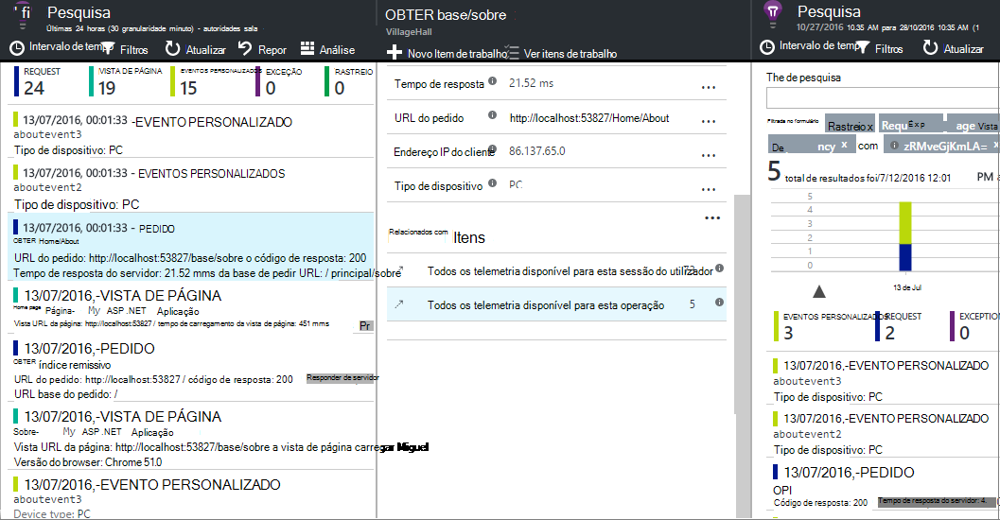

<properties 
    pageTitle="Informações de aplicações API para eventos personalizados e métricas | Microsoft Azure" 
    description="Inserir algumas linhas de código na sua aplicação de ambiente de trabalho ou de dispositivo, página web ou serviço, para controlar a utilização e diagnosticar problemas." 
    services="application-insights"
    documentationCenter="" 
    authors="alancameronwills" 
    manager="douge"/>
 
<tags 
    ms.service="application-insights" 
    ms.workload="tbd" 
    ms.tgt_pltfrm="ibiza" 
    ms.devlang="multiple" 
    ms.topic="article" 
    ms.date="10/19/2016" 
    ms.author="awills"/>

# <a name="application-insights-api-for-custom-events-and-metrics"></a>Informações de aplicações API para eventos personalizados e métricas 

*Informações de aplicação está na pré-visualização.*

Inserir algumas linhas de código na sua aplicação para ficar a saber o que os utilizadores estão a fazer com o mesmo ou para ajudar a diagnosticar os problemas. Pode enviar telemetria do aplicações de ambiente de trabalho e de dispositivo, os clientes web e servidores web. A telemetria core de [Informações de aplicação do Visual Studio](app-insights-overview.md) API permite-lhe enviar eventos personalizados e métricas o seus próprio versões de telemetria padrão. Esta API é a mesma API que é utilizada pela colecção de dados de aplicação informações padrão.

## <a name="api-summary"></a>Resumo API

A API é uniforme em todas as plataformas, para além das variações pequenas alguns.

Método | Utilizado para
---|---
[`TrackPageView`](#page-views) | Páginas, ecrãs, pás ou formulários
[`TrackEvent`](#track-event) | Ações de utilizador e outros eventos. Utilizado para controlar o comportamento do utilizador ou para monitorizar o desempenho.
[`TrackMetric`](#track-metric) | Medidas de desempenho como comprimentos fila não relacionados com a eventos específicos
[`TrackException`](#track-exception)|Exceções de registo de diagnóstico. Rastrear onde ocorrem em relação a outros eventos e examinar rastreios.
[`TrackRequest`](#track-request)| Iniciar sessão a frequência e a duração de pedidos de servidor para uma análise de desempenho.
[`TrackTrace`](#track-trace)|Mensagens de registo de diagnóstico. Também pode capturar 3 terceiros registos.
[`TrackDependency`](#track-dependency)|Iniciar sessão a duração e a frequência de chamadas para que a aplicação depende de componentes externos.

Pode [anexar propriedades e métricas](#properties) à maioria destas chamadas de telemetria. 


## <a name="prep"></a>Antes de começar

Se ainda não o tiver feito estes ainda:

* Adicione o SDK de informações da aplicação ao seu projeto:
 * [Projeto do ASP.NET][greenbrown]
 * [Projeto Java][java] 
 * [JavaScript em cada página web][client]   

* No seu código de servidor dispositivo ou web incluem:

    *C#:*`using Microsoft.ApplicationInsights;`

    *VB:*`Imports Microsoft.ApplicationInsights`

    *Java:*`import com.microsoft.applicationinsights.TelemetryClient;`

## <a name="construct-a-telemetryclient"></a>Construir uma TelemetryClient

Construir uma instância de TelemetryClient (exceto em JavaScript em páginas web):

*C#:* 

    private TelemetryClient telemetry = new TelemetryClient();

*V B:* 

    Private Dim telemetry As New TelemetryClient

*Java*

    private TelemetryClient telemetry = new TelemetryClient();

TelemetryClient é tópico seguro.

Recomendamos que utilize uma instância da `TelemetryClient` para cada módulo da sua aplicação. Por exemplo, poderá ter um `TelemetryClient` no seu serviço web para comunicar recebidas pedidos de http e outro de uma classe de software intermédio para eventos de lógica de negócio do relatório. Pode definir as propriedades tal como `TelemetryClient.Context.User.Id` para controlar os utilizadores e sessões, ou `TelemetryClient.Context.Device.Id` para identificar o computador. Esta informação é anexada às todos os eventos que foi enviados pela instância.


## <a name="track-event"></a>Registar evento

Em informações de aplicação, um *evento personalizado* é um dados aponte que pode apresentar ambos no [Explorador de métricas] [ metrics] como uma agregado contagem e também como ocorrências individuais na [Pesquisa diagnóstico][diagnostic]. (Não está relacionado com MVC ou outros framework "eventos.") 

Inserir TrackEvent chamadas no seu código para contar com que frequência utilizadores escolher uma determinada funcionalidade com que frequência são alcançar objetivos específicos, ou talvez tornar certos tipos de erro. 

Por exemplo, numa aplicação jogo, envie um evento sempre que um utilizador vence o jogo: 

*JavaScript*

    appInsights.trackEvent("WinGame");

*C#*
    
    telemetry.TrackEvent("WinGame");

*V B*


    telemetry.TrackEvent("WinGame")

*Java*

    telemetry.trackEvent("WinGame");


### <a name="view-your-events-in-the-azure-portal"></a>Ver os seus eventos no portal do Azure

Para ver uma contagem dos seus eventos, abra uma pá [Métrica Explorer](app-insights-metrics-explorer.md) , adicionar um novo gráfico e, selecione eventos.  


Para comparar as contagens das diferentes eventos, defina o tipo de gráfico para grelha e grupo por nome para o evento:


Na grelha, clique em através de um nome para o evento para ver ocorrências individuais desse evento.


Clique em qualquer ocorrência para ver mais detalhes.

Para focar-se em eventos específicos no pesquisa ou métrica Explorer, defina o filtro da pá para os nomes de evento que está interessado em:


## <a name="track-metric"></a>Controlar métrica

Utilize TrackMetric para enviar métricas de que não estejam anexadas a determinados eventos. Por exemplo, pode monitorizar um comprimento de fila em intervalos regulares. 

Métricas são apresentadas como gráficos estatísticos no Explorador do métrica, mas ao contrário de eventos, não pode procurar ocorrências individuais na pesquisa diagnóstico.

Métricas valores devem ser > = 0 para ser apresentado corretamente.


*JavaScript*

    appInsights.trackMetric("Queue", queue.Length);

*C#*

    telemetry.TrackMetric("Queue", queue.Length);

*V B*

    telemetry.TrackMetric("Queue", queue.Length)

*Java*

    telemetry.trackMetric("Queue", queue.Length);

Na verdade, pode fazê-lo num módulo fundo em:

*C#*

    private void Run() {
     var appInsights = new TelemetryClient();
     while (true) {
      Thread.Sleep(60000);
      appInsights.TrackMetric("Queue", queue.Length);
     }
    }


Para ver os resultados, abra o Explorador de métricas e adicionar um novo gráfico. Defini-lo para apresentar a sua métrica.


Existem alguns [limites no número de métricas](#limits) que pode utilizar.

## <a name="page-views"></a>Vistas de página

Num dispositivo ou página web app, telemetria de vista de página é enviada por predefinição quando cada ecrã ou da página é carregada. Mas pode alterar que para controlar as vistas de página em alturas adicionais ou diferentes. Por exemplo, numa aplicação do que apresenta separadores ou pás, poderá pretender controlar uma "página" sempre que o utilizador abre uma nova pá. 


Dados de sessão e de utilizador são enviados como propriedades juntamente com vistas de página, para que os gráficos de sessão e de utilizador reencaminhado vivos quando existe telemetria de vista de página.

#### <a name="custom-page-views"></a>Vistas de página personalizado

*JavaScript*

    appInsights.trackPageView("tab1");

*C#*

    telemetry.TrackPageView("GameReviewPage");

*V B*

    telemetry.TrackPageView("GameReviewPage")


Se tiver vários separadores dentro de páginas HTML diferentes, pode especificar o URL demasiado:

    appInsights.trackPageView("tab1", "http://fabrikam.com/page1.htm");

#### <a name="timing-page-views"></a>Vistas de página de temporização

Por predefinição, os tempos de comunicou medido "Hora de carga de vista de página" é a partir de quando o browser envia o pedido, até que seja chamado evento de carregamento de página do browser.

Em vez disso, pode:

* Defina uma duração explícita na chamada [trackPageView](https://github.com/Microsoft/ApplicationInsights-JS/blob/master/API-reference.md#trackpageview) .
 * `appInsights.trackPageView("tab1", null, null, null, durationInMilliseconds);`
* Utilizar a vista de página temporiza chamadas `startTrackPage` e `stopTrackPage`.

*JavaScript*

    // To start timing a page:
    appInsights.startTrackPage("Page1");

... 

    // To stop timing and log the page:
    appInsights.stopTrackPage("Page1", url, properties, measurements);

O nome utilizada como primeiro parâmetro associa as chamadas de início e de fim. Esta assume a predefinição o nome da página atual. 

As durações de carregamento de página resultante apresentadas no Explorador de métrica deriva encontram o intervalo entre as chamadas de início e de fim. É para o utilizador que realmente tempo de intervalo.

## <a name="track-request"></a>Pedido de faixa

Utilizado pelo servidor SDK para pedidos de HTTP de registo. 

Também pode chamar-si mesmo se pretender simular pedidos num contexto em que não tenha o módulo do serviço web em execução.

*C#*

    // At start of processing this request:

    // Operation Id and Name are attached to all telemetry and help you identify
    // telemetry associated with one request:
    telemetry.Context.Operation.Id = Guid.NewGuid().ToString();
    telemetry.Context.Operation.Name = requestName;
    
    var stopwatch = System.Diagnostics.Stopwatch.StartNew();

    // ... process the request ...

    stopwatch.Stop();
    telemetry.TrackRequest(requestName, DateTime.Now,
       stopwatch.Elapsed, 
       "200", true);  // Response code, success


## <a name="operation-context"></a>Contexto de operação

Itens de telemetria podem ser associadas em conjunto por anexar-lhes um ID de operação comuns. O pedido padrão rastreio módulo faz isto para exceções e outros eventos enviados durante o processamento de um pedido de HTTP. Em [pesquisa](app-insights-diagnostic-search.md) e [a análise](app-insights-analytics.md), pode utilizar o ID para encontrar facilmente quaisquer eventos associados ao pedido. 

A forma mais fácil para definir o ID é definir um contexto de operação utilizando este padrão:

    // Establish an operation context and associated telemetry item:
    using (var operation = telemetry.StartOperation<RequestTelemetry>("operationName"))
    {
        // Telemetry sent in here will use the same operation ID.
        ...
        telemetry.TrackEvent(...); // or other Track* calls
        ...
        // Set properties of containing telemetry item - for example:
        operation.Telemetry.ResponseCode = "200";
        
        // Optional: explicitly send telemetry item:
        telemetry.StopOperation(operation);

    } // When operation is disposed, telemetry item is sent.

Assim como definir o contexto de uma operação, `StartOperation` cria um item de telemetria do tipo que especifica e envia-quando os são vendidos a operação, ou se chamar explicitamente `StopOperation`. Se utilizar `RequestTelemetry` como o tipo de telemetria, em seguida, respetiva duração está definida para o intervalo temporizado entre início e de fim.

Não podem ser aninhados contextos de operação. Se já existe um contexto de operação, em seguida, o ID está associado a todos os itens contidos, incluindo o item criado com StartOperation.

Pesquisa, no contexto de operação é utilizado para criar a lista de itens relacionados:




## <a name="track-exception"></a>Controlar exceção

Enviar exceções para informações de aplicação: contá [-los][metrics], como uma indicação de frequência de um problema; e para [examinar ocorrências individuais][diagnostic]. Os relatórios incluem os rastreios.

*C#*

    try
    {
        ...
    }
    catch (Exception ex)
    {
       telemetry.TrackException(ex);
    }

*JavaScript*

    try
    {
       ...
    }
    catch (ex)
    {
       appInsights.trackException(ex);
    }

Os SDK capturas exceções muitos automaticamente, sempre não tem de chamar TrackException explicitamente.

* ASP.NET: [escrever código para chamar exceções](app-insights-asp-net-exceptions.md)
* J2EE: [exceções são capturadas automaticamente](app-insights-java-get-started.md#exceptions-and-request-failures)
* JavaScript: Capturadas automaticamente. Se pretende desativar coleção automática, adicione uma linha para o fragmento de código que inserir nas suas páginas web:

    ```
    ({
      instrumentationKey: "your key"
      , disableExceptionTracking: true
    })
    ```


## <a name="track-trace"></a>Controlar o rastreio 

Utilize esta opção para ajudar a diagnosticar problemas ao enviar uma 'pista de trilho' para informações de aplicação. Pode enviar blocos de dados diagnóstico e inspecioná-las na [pesquisa diagnóstico][diagnostic]. 

 

[Inicie sessão placas] [ trace] utilizar esta API para enviar registos de terceiros para o portal.


*C#*

    telemetry.TrackTrace(message, SeverityLevel.Warning, properties);


Pode procurar no conteúdo da mensagem, mas (ao contrário dos valores de propriedade) não é possível filtrar no mesmo.

O limite de tamanho `message` é muito maior que o limite de propriedades.
Uma vantagem de TrackTrace é que pode colocar dados compridos na mensagem. Por exemplo, poderia codificar existem dados de mensagem.  


Além disso, pode adicionar um nível de gravidade à mensagem. E, como outras telemetria, pode adicionar valores de propriedade que pode utilizar para o ajudar a filtrar ou procurar diferentes conjuntos de rastreios. Por exemplo:


    var telemetry = new Microsoft.ApplicationInsights.TelemetryClient();
    telemetry.TrackTrace("Slow database response",
                   SeverityLevel.Warning,
                   new Dictionary<string,string> { {"database", db.ID} });

Permitir-lhe, na [pesquisa][diagnostic], para filtrar facilmente todas as mensagens de um nível de gravidade determinado relacionados com uma determinada base de dados.

## <a name="track-dependency"></a>Dependência de faixa

Utilize esta chamada para controlar os tempos de resposta e taxas de sucesso de chamadas para um elemento de código externo. Os resultados são apresentados nos gráficos dependência no portal. 

```C#

            var success = false;
            var startTime = DateTime.UtcNow;
            var timer = System.Diagnostics.Stopwatch.StartNew();
            try
            {
                success = dependency.Call();
            }
            finally
            {
                timer.Stop();
                telemetry.TrackDependency("myDependency", "myCall", startTime, timer.Elapsed, success);
            }
```

Lembre-se de que o servidor que SDK incluir um [módulo de dependência](app-insights-dependencies.md) que detetar e controla determinada dependência a chamadas automaticamente - por exemplo para bases de dados e os REST APIs. Tem de instalar um agente no servidor para tornar o módulo trabalhar. Utilizaria esta chamada se pretender controlar as chamadas que não são capturadas pelo controlo automatizado, ou se não quiser instalar o agente.

Para desativar o módulo do controlo de dependência padrão, editar [ApplicationInsights.config](app-insights-configuration-with-applicationinsights-config.md) e eliminar a referência a `DependencyCollector.DependencyTrackingTelemetryModule`.


## <a name="flushing-data"></a>Dados de limpar

Normalmente o SDK envia dados alturas escolhidos para minimizar o impacto no utilizador. No entanto, em alguns casos, poderá pretender esvaziar a memória intermédia - por exemplo, se estiver a utilizar o SDK numa aplicação que encerra.

*C#*

    telemetry.Flush();

    // Allow some time for flushing before shutdown.
    System.Threading.Thread.Sleep(1000);

Note que a função é assíncrona para o [canal de telemetria do servidor](https://www.nuget.org/packages/Microsoft.ApplicationInsights.WindowsServer.TelemetryChannel/), mas síncrono se optar por utilizar o canal na memória ou [canal persistente](app-insights-api-filtering-sampling.md#persistence-channel).


## <a name="authenticated-users"></a>Utilizadores autenticados

Numa aplicação web, os utilizadores por predefinição são identificada por cookie. Um utilizador poderá ser contado mais de uma vez se aceder à sua aplicação a partir de um computador diferente ou o browser, ou eliminar os cookies. 

Mas se os utilizadores iniciar sessão para a sua aplicação, pode obter uma contagem mais precisa ao definir o id de utilizador autenticado no código de browser:

*JavaScript*

```JS
    // Called when my app has identified the user.
    function Authenticated(signInId) {
      var validatedId = signInId.replace(/[,;=| ]+/g, "_");
      appInsights.setAuthenticatedUserContext(validatedId);
      ...
    }
```

No web do ASP.NET aplicação MVC, por exemplo:

*Razor*

        @if (Request.IsAuthenticated)
        {
            <script>
                appInsights.setAuthenticatedUserContext("@User.Identity.Name
                   .Replace("\\", "\\\\")"
                   .replace(/[,;=| ]+/g, "_"));
            </script>
        }

Não é necessário utilizar o nome do utilizador real iniciar sessão. -Lo só tem de ser um id que seja exclusivo para esse utilizador. Não pode incluir espaços ou qualquer um dos carateres `,;=|`. 

O id de utilizador é também definir um cookie de sessão e enviado para o servidor. Se o servidor SDK estiver instalado, o id de utilizador autenticado será enviado como parte das propriedades de contexto de telemetria do cliente e servidor, para que possa filtrar e procurar no mesmo.

Se a sua aplicação agrupa contas de utilizadores, também pode passar um identificador para a conta (com as mesmas restrições de caráter).


      appInsights.setAuthenticatedUserContext(validatedId, accountId);

No [Explorador de métricas](app-insights-metrics-explorer.md), pode criar um gráfico que conta os **utilizadores autenticados** e **contas de utilizador**. 

Também pode [Procurar] [ diagnostic] para pontos de dados do cliente com nomes de utilizador específico e contas.

## <a name="properties"></a>Filtrar, procurar e segmentar os seus dados com propriedades

Pode anexar propriedades e medidas aos seus eventos (e também para métricas, página vistas, exceções e outros dados de telemetria).

**Propriedades** são valores de cadeia que pode utilizar para filtrar a telemetria nos relatórios de utilização. Por exemplo se a sua aplicação fornece várias jogos, que irá pretende anexar o nome do jogo para cada evento, para que possa ver quais os jogos são mais populares. 

Existe um limite de cerca de 1k no comprimento da cadeia. (Se pretender enviar grandes blocos de dados, utilize o parâmetro da mensagem de [TrackTrace](#track-trace).)

**Métricas** são valores numéricos que podem ser apresentados graficamente. Por exemplo, poderá pretender ver se existe um aumento gradual as pontuações de que atingir os seus jogadores. Os gráficos podem ser segmentados pelas propriedades enviadas com o evento, para que foi possível obter separada ou empilhadas gráficos para jogos diferentes.

Métricas valores devem ser > = 0 para ser apresentado corretamente.


Existem alguns [limites no número de propriedades, valores de propriedade e métricas](#limits) que pode utilizar.


*JavaScript*

    appInsights.trackEvent
      ("WinGame",
         // String properties:
         {Game: currentGame.name, Difficulty: currentGame.difficulty},
         // Numeric metrics:
         {Score: currentGame.score, Opponents: currentGame.opponentCount}
         );

    appInsights.trackPageView
        ("page name", "http://fabrikam.com/pageurl.html",
          // String properties:
         {Game: currentGame.name, Difficulty: currentGame.difficulty},
         // Numeric metrics:
         {Score: currentGame.score, Opponents: currentGame.opponentCount}
         );
          

*C#*

    // Set up some properties and metrics:
    var properties = new Dictionary <string, string> 
       {{"game", currentGame.Name}, {"difficulty", currentGame.Difficulty}};
    var metrics = new Dictionary <string, double>
       {{"Score", currentGame.Score}, {"Opponents", currentGame.OpponentCount}};

    // Send the event:
    telemetry.TrackEvent("WinGame", properties, metrics);


*V B*

    ' Set up some properties:
    Dim properties = New Dictionary (Of String, String)
    properties.Add("game", currentGame.Name)
    properties.Add("difficulty", currentGame.Difficulty)

    Dim metrics = New Dictionary (Of String, Double)
    metrics.Add("Score", currentGame.Score)
    metrics.Add("Opponents", currentGame.OpponentCount)

    ' Send the event:
    telemetry.TrackEvent("WinGame", properties, metrics)


*Java*
    
    Map<String, String> properties = new HashMap<String, String>();
    properties.put("game", currentGame.getName());
    properties.put("difficulty", currentGame.getDifficulty());
    
    Map<String, Double> metrics = new HashMap<String, Double>();
    metrics.put("Score", currentGame.getScore());
    metrics.put("Opponents", currentGame.getOpponentCount());
    
    telemetry.trackEvent("WinGame", properties, metrics);


> [AZURE.NOTE] Tomar cuidado para não iniciar sessão informação identificativa nas propriedades.

**Se tiver utilizado métricas**, abra o Explorador de métrica e selecione a métrica do grupo personalizado:


*Se o seu métrica não aparecer, ou se o título personalizados não estiver lá, feche o pá de seleção e a tentar mais tarde. Por vezes, pode demorar uma hora para métricas é necessário agregar através do pipeline de.*

**Se tiver utilizado propriedades e métricas**, segmento métrica pela propriedade:


**No diagnóstico pesquisa**, pode ver as propriedades e métricas de ocorrências individuais de um evento.


Utilize o campo de pesquisa para ver as ocorrências de evento com um valor de propriedade em particular.


[Obter mais informações sobre expressões de procura][diagnostic].

#### <a name="alternative-way-to-set-properties-and-metrics"></a>Forma alternativa para definir propriedades e métricas

Se for mais conveniente, pode recolher os parâmetros de um evento num objeto separado:

    var event = new EventTelemetry();

    event.Name = "WinGame";
    event.Metrics["processingTime"] = stopwatch.Elapsed.TotalMilliseconds;
    event.Properties["game"] = currentGame.Name;
    event.Properties["difficulty"] = currentGame.Difficulty;
    event.Metrics["Score"] = currentGame.Score;
    event.Metrics["Opponents"] = currentGame.Opponents.Length;

    telemetry.TrackEvent(event);

> [AZURE.WARNING] Não reutilizar na mesma instância do item de telemetria (`event` neste exemplo) para chamar Track*() várias vezes. Isto pode causar telemetria ser enviada com configuração incorreta.


## <a name="timed"></a>Eventos de temporização

Por vezes, pretende quanto tempo demora para executar alguns ação do gráfico. Por exemplo, poderá querer saber quanto tempo utilizadores assumir a ter em consideração escolhas num jogo. Este é um exemplo de utilizações do parâmetro medida úteis.


*C#*

    var stopwatch = System.Diagnostics.Stopwatch.StartNew();

    // ... perform the timed action ...

    stopwatch.Stop();

    var metrics = new Dictionary <string, double>
       {{"processingTime", stopwatch.Elapsed.TotalMilliseconds}};

    // Set up some properties:
    var properties = new Dictionary <string, string> 
       {{"signalSource", currentSignalSource.Name}};

    // Send the event:
    telemetry.TrackEvent("SignalProcessed", properties, metrics);


## <a name="defaults"></a>Predefinir as propriedades de telemetria personalizada

Se pretende predefinir valores de propriedade para alguns dos eventos personalizados que escreve, pode defini-las num TelemetryClient. Estão anexados às todos os itens de telemetria enviados a partir do que o cliente. 

*C#*

    using Microsoft.ApplicationInsights.DataContracts;

    var gameTelemetry = new TelemetryClient();
    gameTelemetry.Context.Properties["Game"] = currentGame.Name;
    // Now all telemetry will automatically be sent with the context property:
    gameTelemetry.TrackEvent("WinGame");
    
*V B*

    Dim gameTelemetry = New TelemetryClient()
    gameTelemetry.Context.Properties("Game") = currentGame.Name
    ' Now all telemetry will automatically be sent with the context property:
    gameTelemetry.TrackEvent("WinGame")

*Java*

    import com.microsoft.applicationinsights.TelemetryClient;
    import com.microsoft.applicationinsights.TelemetryContext;
    ...


    TelemetryClient gameTelemetry = new TelemetryClient();
    TelemetryContext context = gameTelemetry.getContext();
    context.getProperties().put("Game", currentGame.Name);
    
    gameTelemetry.TrackEvent("WinGame");


    
Chamadas de telemetria individuais podem substituir os valores predefinidos no seus dicionários de propriedade.

**Os clientes da web para JavaScript**, [utilizar inicializadores de telemetria JavaScript](#js-initializer).

**Para adicionar propriedades a todos os telemetria** incluindo os dados a partir de módulos de coleções de sites padrão, [Implementar `ITelemetryInitializer` ](app-insights-api-filtering-sampling.md#add-properties).


## <a name="sampling-filtering-and-processing-telemetry"></a>Amostragem, filtragem e processamento de telemetria 

Pode escrever código para processar seu telemetria antes de ter sido enviada a partir do SDK. O processamento inclui dados enviados a partir dos módulos de telemetria padrão como da coleção de pedido HTTP e coleção de dependência.

* [Adicionar propriedades](app-insights-api-filtering-sampling.md#add-properties) a telemetria através da implementação `ITelemetryInitializer` - por exemplo adicionar a versão números ou valores calculados a partir de outras propriedades. 
* [A filtragem](app-insights-api-filtering-sampling.md#filtering) pode modificar ou eliminar telemetria antes de ter sido enviada a partir do SDK através da implementação `ITelemetryProcesor`. Controlar o que é enviado ou retirado, mas tem de ter em conta do efeito no seu métricas. Dependendo de como eliminar os itens, podem perder a capacidade de navegar entre os itens relacionados.
* [Amostragem](app-insights-api-filtering-sampling.md#sampling) é uma solução embalada para reduzir o volume dos dados enviados da sua aplicação para o portal. Que faz-o sem afetar as métricas apresentadas e, sem afetar a sua capacidade para diagnosticar problemas através da navegação entre itens relacionados como exceções, pedidos e vistas de página.

[Saiba mais](app-insights-api-filtering-sampling.md)


## <a name="disabling-telemetry"></a>Desativar telemetria

Para **Parar de dinamicamente e começar** a coleção e transmissão de telemetria:

*C#*

```C#

    using  Microsoft.ApplicationInsights.Extensibility;

    TelemetryConfiguration.Active.DisableTelemetry = true;
```

Para **desativar selecionada colecção padrão** - por exemplo, contadores de desempenho, pedidos de HTTP ou dependências - eliminar ou comentar linhas relevantes no [ApplicationInsights.config][config]. Pode efetuar esta ação, por exemplo, se pretender enviar os seus próprios dados TrackRequest.

## <a name="debug"></a>Modo de programador

Durante a depuração, é útil para que o seu telemetria expedited através do pipeline de, para que possa ver resultados imediatamente. Rastrear que também obter mensagens adicionais que ajudá-lo algum problema com o telemetria. Mude-de produção, tal como pode abrandar a aplicação.


*C#*
    
    TelemetryConfiguration.Active.TelemetryChannel.DeveloperMode = true;

*V B*

    TelemetryConfiguration.Active.TelemetryChannel.DeveloperMode = True


## <a name="ikey"></a>Definir a chave de instrumentação para telemetria personalizada selecionada

*C#*
    
    var telemetry = new TelemetryClient();
    telemetry.InstrumentationKey = "---my key---";
    // ...


## <a name="dynamic-ikey"></a>Tecla de instrumentação dinâmicos

Para evitar mistura de telemetria do desenvolvimento, teste e produção ambientes, pode [Criar separados recursos de informações da aplicação] [ create] e altere as respetivas chaves consoante o ambiente.

Em vez de obter a chave de instrumentação a partir de ficheiro de configuração, pode defini-lo no seu código. Defina a chave num método de inicialização, tal como global.aspx.cs num serviço ASP.NET:

*C#*

    protected void Application_Start()
    {
      Microsoft.ApplicationInsights.Extensibility.
        TelemetryConfiguration.Active.InstrumentationKey = 
          // - for example -
          WebConfigurationManager.Settings["ikey"];
      ...

*JavaScript*

    appInsights.config.instrumentationKey = myKey; 


Em páginas web, poderá pretender defini-lo a partir do servidor web Estado, em vez de codificação-literalmente para o script. Por exemplo, numa página web gerado numa aplicação do ASP.NET:

*JavaScript no Razor*

    <script type="text/javascript">
    // Standard Application Insights web page script:
    var appInsights = window.appInsights || function(config){ ...
    // Modify this part:
    }({instrumentationKey:  
      // Generate from server property:
      @Microsoft.ApplicationInsights.Extensibility.
         TelemetryConfiguration.Active.InstrumentationKey"
    }) // ...


## <a name="telemetrycontext"></a>TelemetryContext

TelemetryClient tem uma propriedade de contexto, que contém um número de valores que são enviadas juntamente com todos os dados de telemetria. Normalmente estão definidos os módulos de telemetria padrão, mas também pode defini-los manualmente. Por exemplo:

    telemetry.Context.Operation.Name = "MyOperationName";

Se definir qualquer um destes valores si próprio, considere remover da linha relevante do [ApplicationInsights.config][config], para que os valores e os valores padrão não ficar confusa.

* **Componente** Identifica a aplicação e a sua versão
* **Dispositivo** Dados sobre o dispositivo no qual está a ser executado a aplicação (nas aplicações web, este é o dispositivo de servidor ou cliente a partir do qual a telemetria é enviada)
* **InstrumentationKey** Identifica o recurso de informações de aplicação no Azure onde a telemetria irá aparecer. Normalmente selecionado para cima a partir do ApplicationInsights.config
* **Localização** Identifica a localização geográfica do dispositivo.
* **Operação** No web apps, o pedido de HTTP atual. Em outros tipos de aplicação, pode definir este eventos de grupo em conjunto.
 * **ID**: um valor gerado relacionado com diferentes eventos, para que quando inspecionar um evento na pesquisa de diagnóstico, pode encontrar "itens relacionados"
 * **Nome**: um identificador, normalmente o URL do pedido de HTTP. 
 * **SyntheticSource**: Se não nulo ou vazio, esta cadeia indica que a origem do pedido de tiver sido identificada como um teste robot ou na web. Por predefinição será excluído de cálculos no Explorador de métricas.
* **Propriedades** Propriedades que são enviadas com todos os dados de telemetria. Pode ser substituído no individuais registar * chamadas.
* **Sessão** Identifica a sessão do utilizador. O Id está definido para um valor gerado, que é alterado quando o utilizador não tiver sido ativo para tempo.
* **Utilizador** Informações de utilizador. 

## <a name="limits"></a>Limites


[AZURE.INCLUDE [application-insights-limits](../../includes/application-insights-limits.md)]

*Como evitar atingir o limite de taxa de dados?*

* Utilize [amostragem](app-insights-sampling.md).

*Quanto tempo são dados mantidos?*

* Consulte o artigo [retenção de dados e privacidade][data].


## <a name="reference-docs"></a>Documentos de referência

* [Referência do ASP.NET](https://msdn.microsoft.com/library/dn817570.aspx)
* [Referência de Java](http://dl.windowsazure.com/applicationinsights/javadoc/)
* [Referência de JavaScript](https://github.com/Microsoft/ApplicationInsights-JS/blob/master/API-reference.md)
* [Android SDK](https://github.com/Microsoft/ApplicationInsights-Android)
* [iOS SDK](https://github.com/Microsoft/ApplicationInsights-iOS)


## <a name="sdk-code"></a>Código SDK

* [ASP.NET Core SDK](https://github.com/Microsoft/ApplicationInsights-dotnet)
* [ASP.NET 5](https://github.com/Microsoft/ApplicationInsights-aspnet5)
* [Pacotes do Windows Server](https://github.com/Microsoft/applicationInsights-dotnet-server)
* [Java SDK](https://github.com/Microsoft/ApplicationInsights-Java)
* [JavaScript SDK](https://github.com/Microsoft/ApplicationInsights-JS)
* [Todas as plataformas](https://github.com/Microsoft?utf8=%E2%9C%93&query=applicationInsights)

## <a name="questions"></a>Perguntas

* *O que exceções podem gerar Track_() chamadas*
    
    Nenhum. Não é necessário moldá-los experimente capturas cláusulas. Se o SDK encontrar problemas, registará mensagens que irá ver nos resultados de consola do depurar, e - se as mensagens obter através de-na pesquisa de diagnóstico.


* *Existe um REST API para obter dados a partir do portal?*

    Sim, brevemente. Entretanto, utilize [Exportar contínuo](app-insights-export-telemetry.md).

## <a name="next"></a>Próximos passos


[Eventos de pesquisa e registos][diagnostic]

[Exemplos e tutoriais](app-insights-code-samples.md)

[Resolução de problemas][qna]


<!--Link references-->

[client]: app-insights-javascript.md
[config]: app-insights-configuration-with-applicationinsights-config.md
[create]: app-insights-create-new-resource.md
[data]: app-insights-data-retention-privacy.md
[diagnostic]: app-insights-diagnostic-search.md
[exceptions]: app-insights-asp-net-exceptions.md
[greenbrown]: app-insights-asp-net.md
[java]: app-insights-java-get-started.md
[metrics]: app-insights-metrics-explorer.md
[qna]: app-insights-troubleshoot-faq.md
[trace]: app-insights-search-diagnostic-logs.md

 
