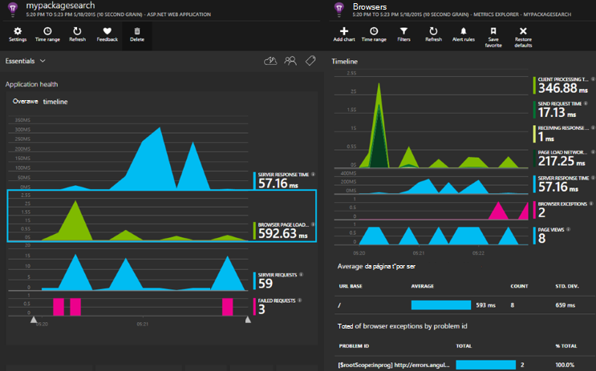

<properties 
    pageTitle="Informações de aplicação para o Core do ASP.NET" 
    description="Monitorizar aplicações web para disponibilidade, desempenho e a utilização." 
    services="application-insights" 
    documentationCenter=".net"
    authors="alancameronwills" 
    manager="douge"/>

<tags 
    ms.service="application-insights" 
    ms.workload="tbd" 
    ms.tgt_pltfrm="ibiza" 
    ms.devlang="na" 
    ms.topic="article" 
    ms.date="08/30/2016" 
    ms.author="awills"/>

# Informações de aplicação para o Core do ASP.NET

[Informações de aplicação do Visual Studio](app-insights-overview.md) permite-lhe monitorizar a sua aplicação web para disponibilidade, desempenho e a utilização. Com os comentários que obter informações sobre o desempenho e eficácia da sua aplicação no meio natural, pode disponibilizar escolhas informadas sobre a direção da estrutura de cada ciclo de vida do desenvolvimento.

Terá de uma subscrição com [Do Microsoft Azure](http://azure.com). Inicie sessão com uma conta Microsoft, o que pode ter para o Windows, XBox Live ou outros serviços na nuvem da Microsoft. A equipa pode ter uma subscrição organizacional para Azure: peça ao proprietário para o adicionar ao-lo com a sua conta Microsoft.

## Introdução

Siga o [Guia de introdução](https://github.com/Microsoft/ApplicationInsights-aspnetcore/wiki/Getting-Started).

## Utilizar as informações de aplicação

Inicie sessão no [portal do Microsoft Azure](https://portal.azure.com) e navegue para o recurso criou para monitorizar a sua aplicação.

Numa janela do browser em separado, utilize a aplicação para o tempo. Verá os dados aparecem nos gráficos de informações da aplicação. (Poderá ter de clique em Atualizar.) Haverá apenas uma pequena quantidade de dados enquanto está a desenvolver, mas estes gráficos ser verdadeiramente vivos ao publicar a sua aplicação e tiver vários utilizadores. 

Página Descrição geral do apresenta os gráficos de desempenho for maior probabilidade de estar interessado: tempo de resposta do servidor, o tempo de carregamento de página e as contagens de pedidos de falhadas. Clique em para ver mais gráficos e os dados.

Vistas no portal do abrange duas categorias principais:

* [Métricas Explorer](app-insights-metrics-explorer.md) mostra gráficos e tabelas de métricas e as contagens, como tempos de resposta, taxas de falha ou métricas criar sozinho com a [API](app-insights-api-custom-events-metrics.md). Filtrar e segmentar os dados por valores de propriedade para obter uma melhor compreensão da sua aplicação e dos seus utilizadores.
* [Explorador de procura](app-insights-diagnostic-search.md) lista eventos individuais, tal como pedidos específicos, exceções, registo rastreios ou eventos que criou-se com a [API](app-insights-api-custom-events-metrics.md). Filtrar e procurar nos eventos e navegar entre os eventos relacionados para investigar problemas.
* Permite-lhe executar consultas de SQL semelhante ao longo do seu telemetria e de [análise](app-insights-analytics.md) é uma poderosa ferramenta de análise e diagnóstico.

## Alertas

* Receber automaticamente [alertas diagnóstico pro-activos](app-insights-proactive-diagnostics.md) que indicam que sobre discordantes alterações de taxas de falha de e outras métricas.
* Configurar o [testes de disponibilidade](app-insights-monitor-web-app-availability.md) para testar o seu Web site continuamente a partir de localizações em todo o mundo e obtenha e-mails assim qualquer teste falhar.
* Configure [alertas métricas](app-insights-monitor-web-app-availability.md) saber se métricas como tempos de resposta ou taxas de exceção aceda fora dos limites aceitável.

## Obter mais telemetria

* [Adicionar telemetria às suas páginas web](app-insights-javascript.md) para monitorizar a utilização de página e o desempenho.
* [Dependências de monitor](app-insights-dependencies.md) para ver se o resto, SQL ou outros recursos externos são lento.
* [Utilizar a API](app-insights-api-custom-events-metrics.md) para enviar o seu próprio eventos e métricas para uma vista mais detalhada de desempenho e a utilização da sua aplicação.
* [Testes de disponibilidade](app-insights-monitor-web-app-availability.md) Verifique a sua aplicação constantemente a partir de todo o mundo. 

## Abrir origem

[Ler e contribuir para o código](https://github.com/Microsoft/ApplicationInsights-aspnetcore#recent-updates)

