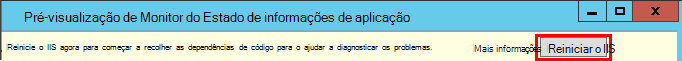

<properties 
    pageTitle="Dependência de informações da aplicação de controlo" 
    description="Analise a utilização, disponibilidade e o desempenho da aplicação web do Microsoft Azure com informações de aplicação ou no local." 
    services="application-insights" 
    documentationCenter=".net"
    authors="alancameronwills" 
    manager="douge"/>

<tags 
    ms.service="application-insights" 
    ms.workload="tbd" 
    ms.tgt_pltfrm="ibiza" 
    ms.devlang="na" 
    ms.topic="article" 
    ms.date="10/24/2016" 
    ms.author="awills"/>


# <a name="set-up-application-insights-dependency-tracking"></a>Configurar a aplicação de informações: o controlo de dependência


[AZURE.INCLUDE [app-insights-selector-get-started-dotnet](../../includes/app-insights-selector-get-started-dotnet.md)]


Uma *dependência* é um componente externo identificado pela sua aplicação. Normalmente, é um serviço denominado com HTTP, ou uma base de dados ou com um sistema de ficheiros. Em informações de aplicação do Visual Studio, pode ver facilmente quanto tempo sua aplicação aguarda dependências e com que frequência uma chamada de dependência falha.


O monitor de dependência out of box atualmente relatórios de chamadas para estes tipos de dependências de:

* ASP.NET
 * Bases de dados SQL
 * Serviços WCF que utilizam enlaces baseado em HTTP e web do ASP.NET
 * Chamadas HTTP locais ou remotos
 * Azure DocumentDb, tabela, armazenamento de BLOBs e fila de espera
* Java
 * Chamadas para uma base de dados através de um controlador [JDBC](http://docs.oracle.com/javase/7/docs/technotes/guides/jdbc/) , tal como MySQL, SQL Server, PostgreSQL ou SQLite.
* JavaScript em páginas web - a [página web SDK](app-insights-javascript.md) automaticamente os registos de chamadas de Ajax como dependências.

Pode escrever o seus próprio chamadas SDK para monitorizar a outras dependências de utilizar a [TrackDependency API](app-insights-api-custom-events-metrics.md#track-dependency).


## <a name="to-set-up-dependency-monitoring"></a>Para configurar a monitorização de dependência

Precisa de uma subscrição [Do Microsoft Azure](http://azure.com) .

### <a name="if-your-app-runs-on-your-iis-server"></a>Se a sua aplicação é executada no seu servidor IIS

Se a aplicação web é executado no .NET 4.6 ou posterior, pode quer [instalar o SDK de informações da aplicação](app-insights-asp-net.md) na sua aplicação ou instalar o Monitor de estado de informações de aplicação. Não precisa de ambos.

Caso contrário, instale o Monitor de estado de informações de aplicação no servidor:

1. No seu IIS servidor web, inicie sessão com as credenciais de administrador.
2. Transfira e execute o [installer Monitor de estado](http://go.microsoft.com/fwlink/?LinkId=506648).
4. No Assistente de instalação, inicie sessão no Microsoft Azure.

    

    *Erros de ligação? Consulte o artigo [resolução de problemas](#troubleshooting).*

5. Selecione a aplicação web instalados ou Web site ao qual pretende monitorizar e, em seguida, configure o recurso na qual pretende ver os resultados no portal do informações de aplicação.

    

    Normalmente, optar por configurar um novo recurso e o [grupo de recursos][roles].

    Caso contrário, utilize um recurso existente se já configurou o [testa web] [ availability] para o seu site ou [cliente web monitorização][client].

6. Reinicie o IIS.

    

    O serviço web será interrompido para tempo breve.

6. Repare que ApplicationInsights.config foi inserido aplicações web à qual pretende monitorizar.

    

   Também existem algumas alterações para a Web. config.

#### <a name="want-to-reconfigure-later"></a>Pretende (re) configurar mais tarde?

Depois de concluir o assistente, pode voltar a configurar o agente sempre que quiser. Também pode utilizar esta, se tiver instalado o agente mas havido alguns problemas com a configuração inicial.


### <a name="if-your-app-runs-as-an-azure-web-app"></a>Se a sua aplicação é executado como uma aplicação Web do Azure

No painel de controlo da sua aplicação Web do Azure, adicione a extensão de informações da aplicação.


### <a name="if-its-an-azure-cloud-services-project"></a>Se for um projeto de serviços na nuvem Azure

[Adicionar scripts às funções web e trabalho](app-insights-cloudservices.md#dependencies). Ou [instalar o .NET framework 4.6 ou posterior](../cloud-services/cloud-services-dotnet-install-dotnet.md).

## <a name="diagnosis"></a>Diagnosticar problemas de desempenho de dependência

Para avaliar o desempenho de pedidos de servidor, abra o pá de desempenho e desloque para baixo até olhar sobre a grelha de pedidos de:


A superior que está a demorar muito tempo. Vamos ver se podermos localizar saída onde o tempo despendido a.

Clique nessa linha para ver os eventos pedido individuais:


Clique em qualquer ocorrência de execução longa para inspecioná-lo ainda mais.

Desloque-se para baixo para as chamadas de dependência remoto relacionados com este pedido:


A maior parte do tempo de manutenção que este pedido foi gasto numa chamada para um serviço local-aspeto. 


Selecione nessa linha para obter mais informações:


Os detalhes incluem informações suficientes para diagnosticar o problema.


Caso um diferente, sem chamada dependência é longa, mas ao mudar para a vista de linha cronológica, é possível ver onde o atraso ocorreu no nosso processamento interno:


## <a name="failures"></a>Falhas

Se existirem pedidos de falhados, clique no gráfico.


Clique em através de um tipo de pedido e a instância do pedido, para localizar uma falha na chamada para uma dependência remota.


## <a name="custom-dependency-tracking"></a>Controlo de dependência personalizada

O módulo padrão do controlo de dependência Deteta automaticamente dependências externas, tais como bases de dados e os REST APIs. Mas, poderá querer alguns componentes adicionais para ser tratadas da mesma forma. 

Pode escrever código que envia informações de dependência, utilizando a mesma [TrackDependency API](app-insights-api-custom-events-metrics.md#track-dependency) que é utilizado pelo módulos padrão.

Por exemplo, se criar o seu código com uma assemblagem que não tenha escrito si mesmo, pode registar o tempo todas as chamadas para o mesmo, para saber que contribuição faz com que os tempos de resposta. Para que este dados apresentados nos gráficos de dependência no informações de aplicação, envie-a utilizando `TrackDependency`.

```C#

            var startTime = DateTime.UtcNow;
            var timer = System.Diagnostics.Stopwatch.StartNew();
            try
            {
                success = dependency.Call();
            }
            finally
            {
                timer.Stop();
                telemetry.TrackDependency("myDependency", "myCall", startTime, timer.Elapsed, success);
            }
```

Se pretender alternar desativar o módulo do controlo de dependência padrão, remova a referência a DependencyTrackingTelemetryModule no [ApplicationInsights.config](app-insights-configuration-with-applicationinsights-config.md).

## <a name="troubleshooting"></a>Resolução de problemas

*Sucesso dependência sempre sinalizador mostra true ou false.*

* Atualizar para a versão mais recente do SDK. Se a sua versão do .NET for menor que 4.6, instale o [monitor de estado](app-insights-monitor-performance-live-website-now.md).

## <a name="next-steps"></a>Próximos passos

- [Exceções](app-insights-asp-net-exceptions.md)
- [Dados de página e de utilizador][client]
- [Disponibilidade](app-insights-monitor-web-app-availability.md)


<!--Link references-->

[api]: app-insights-api-custom-events-metrics.md
[apikey]: app-insights-api-custom-events-metrics.md#ikey
[availability]: app-insights-monitor-web-app-availability.md
[azure]: ../insights-perf-analytics.md
[client]: app-insights-javascript.md
[diagnostic]: app-insights-diagnostic-search.md
[metrics]: app-insights-metrics-explorer.md
[netlogs]: app-insights-asp-net-trace-logs.md
[portal]: http://portal.azure.com/
[qna]: app-insights-troubleshoot-faq.md
[redfield]: app-insights-asp-net-dependencies.md
[roles]: app-insights-resources-roles-access-control.md

 
