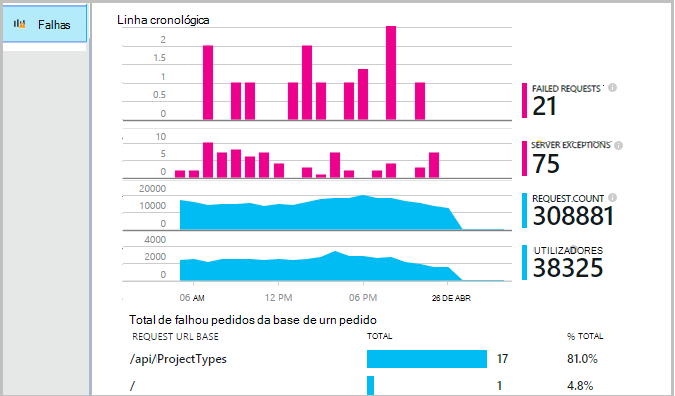

<properties 
    pageTitle="Diagnosticar falhas e exceções nas aplicações do ASP.NET com informações de aplicação" 
    description="Capture exceções a partir das aplicações do ASP.NET juntamente com telemetria do pedido." 
    services="application-insights" 
    documentationCenter=".net"
    authors="alancameronwills" 
    manager="douge"/>

<tags 
    ms.service="application-insights" 
    ms.workload="tbd" 
    ms.tgt_pltfrm="ibiza" 
    ms.devlang="na" 
    ms.topic="article" 
    ms.date="10/27/2016" 
    ms.author="awills"/>


# <a name="set-up-application-insights-diagnose-exceptions"></a>Configurar a aplicação de informações: diagnosticar exceções

[AZURE.INCLUDE [app-insights-selector-get-started-dotnet](../../includes/app-insights-selector-get-started-dotnet.md)]


Através da sua aplicação com [Informações de aplicação do Visual Studio]de monitorização[start], pode haver uma correlação pedidos falhados com exceções e outros eventos no cliente e no servidor, para que é possível diagnosticar rapidamente as causas.

Para monitorizar uma aplicação do ASP.NET, tem de [Adicionar a aplicação informações SDK] [ greenbrown] a sua aplicação ou [instalar o Monitor de estado no servidor IIS][redfield], ou, se a sua aplicação for uma aplicação Web do Azure, adicione a [Extensão de informações da aplicação](app-insights-azure-web-apps.md).

## <a name="diagnosing-exceptions-using-visual-studio"></a>Diagnosticar exceções utilizando o Visual Studio

Abra a solução de aplicação no Visual Studio para o ajudar com a depuração.

Execute a aplicação no servidor ou no seu computador de desenvolvimento utilizando F5.

Abrir a janela pesquisa de informações de aplicação no Visual Studio e defini-lo para apresentar os eventos da sua aplicação. Enquanto está a depuração, pode fazê-lo clicando no botão de informações da aplicação.


Repare que pode filtrar o relatório para mostrar apenas exceções. 

*Sem exceções a mostrar? Consulte o artigo [capturar exceções](#exceptions).*

Clique num relatório de exceção para mostrar o seu rastreio da pilha.


Clique numa referência de linha no rastreio pilha, para abrir o ficheiro relevante.  

## <a name="diagnosing-failures-using-the-azure-portal"></a>Diagnosticar falhas utilizando o portal do Azure

A descrição geral de informações da aplicação da sua aplicação, o mosaico falhas mostra-lhe gráficos de exceções e Ocorreu uma falha de pedidos HTTP, juntamente com uma lista do pedido de URLs que fazem com que as falhas mais frequentes.



Clique em através de um dos tipos de pedido de falha na lista para aceder ao ocorrências individuais de falha. A partir daí, clique em através das exceções ou quaisquer outros dados de rastreio associados:


**Em alternativa,** pode começar a partir da lista de exceções que vai encontrar mais abaixo no pá falhas. Manter clicando em até chegar eventualmente ao exceções individuais.


*Sem exceções a mostrar? Consulte o artigo [capturar exceções](#exceptions).*

A partir desse local pode observe o rastreio da pilha e propriedades detalhadas de cada exceção e localizar registo relacionados rastreio ou outros eventos.


[Obter mais informações sobre pesquisa diagnóstico][diagnostic].


## <a name="dependency-failures"></a>Falhas de dependência

Uma *dependência* é um serviço que a aplicação chama, normalmente através de uma ligação de REST API ou base de dados. [Aplicação informações de estado Monitor] [ redfield] monitoriza automaticamente uma variedade de tipos de chamada de dependência, medir a duração da chamada e sucesso ou o fracasso. 

Para obter dados de dependência, tem de [instalar o Monitor de estado] [ redfield] no servidor IIS, ou se a sua aplicação for uma aplicação Web do Azure, utilize a [Extensão de informações da aplicação](app-insights-azure-web-apps.md). 

Falhadas chamadas para dependências estão listadas na pá falhas e também pode encontrá-los em itens relacionados na detalhes do pedido e detalhes de exceção.

*Sem falhas de dependência? Que é boa ideia. Mas, para verificar que está a obter dados de dependência, abra o pá de desempenho e observe o gráfico de dependência duração.*

 

## <a name="custom-tracing-and-log-data"></a>Rastreio personalizado e os dados do registo

Para obter os dados de diagnóstico específico para a sua aplicação, pode inserir código para enviar os seus próprios dados de telemetria. Isto apresentadas na pesquisa diagnóstico juntamente com o pedido, a vista de página e outros dados recolhidas automaticamente. 

Tem várias opções:

* [TrackEvent()](app-insights-api-custom-events-metrics.md#track-event) é normalmente utilizado para monitorizar os padrões de utilização, mas os dados envia também aparecem em eventos de personalizadas na pesquisa de diagnóstico. Eventos são com nome e pode conter propriedades da cadeia e métricas numéricas no qual pode [filtrar as suas pesquisas diagnóstico][diagnostic].
* [TrackTrace()](app-insights-api-custom-events-metrics.md#track-trace) permite-lhe envia dados mais longo como informações de mensagem.
* [TrackException()](#exceptions) envia rastreios. [Mais informações sobre exceções](#exceptions).
* Se já estiver a utilizar um quadro de registo como Log4Net ou NLog, pode [capturar essas registos] [ netlogs] e vê-los na pesquisa de diagnóstico ao lado dos dados pedido e exceção.

Para ver estes eventos, abra a [pesquisa][diagnostic], abra o filtro e, em seguida, selecione o evento personalizada, rastreio ou exceção.


> [AZURE.NOTE] Se a sua aplicação gera muitas telemetria, o módulo amostragem ajustável reduzir automaticamente o volume que é enviado para o portal através do envio apenas uma fração representante de eventos. Eventos que fazem parte da mesma operação vão ser selecionados ou desmarcados como um grupo, para que pode navegar entre os eventos relacionados. [Saiba mais sobre amostragem.](app-insights-sampling.md)

### <a name="how-to-see-request-post-data"></a>Como ver dados de mensagem de pedido

Detalhes do pedido não incluam os dados enviados para a sua aplicação numa chamada de mensagem. Para que estes dados referidos:

* [Instalar o SDK] [ greenbrown] no seu projeto de aplicação.
* Inserir código na sua aplicação para chamar [Microsoft.ApplicationInsights.TrackTrace()][api]. Envie os dados de publicar o parâmetro da mensagem. Existe um limite para o tamanho permitido, pelo que deverá tentar enviar apenas os dados essenciais.
* Quando investigar um pedido de falhado, localize os rastreios associados.  


## <a name="exceptions"></a>Capturar exceções e dados de diagnóstico relacionados

Na primeira, não verá no portal do todas as exceções causam falhas na sua aplicação. Verá quaisquer exceções browser (se estiver a utilizar o [JavaScript SDK] [ client] nas suas páginas web). Mas a maior parte dos exceções de servidor são capturadas pelo IIS e tem de escrever um pouco de código para vê-los.

Pode:

* **Inicie sessão exceções explicitamente** inserir código na processadores de exceção para comunicar as exceções.
* **Capturar exceções automaticamente** ao configurar o seu quadro ASP.NET. As adições necessárias são diferentes para diferentes tipos de quadro.

## <a name="reporting-exceptions-explicitly"></a>Relatório de exceções explicitamente

A forma mais simples é inserir uma chamada para TrackException() um processador de exceção.

JavaScript

    try 
    { ...
    }
    catch (ex)
    {
      appInsights.trackException(ex, "handler loc",
        {Game: currentGame.Name, 
         State: currentGame.State.ToString()});
    }

C#

    var telemetry = new TelemetryClient();
    ...
    try 
    { ...
    }
    catch (Exception ex)
    {
       // Set up some properties:
       var properties = new Dictionary <string, string> 
         {{"Game", currentGame.Name}};

       var measurements = new Dictionary <string, double>
         {{"Users", currentGame.Users.Count}};

       // Send the exception telemetry:
       telemetry.TrackException(ex, properties, measurements);
    }

V B

    Dim telemetry = New TelemetryClient
    ...
    Try
      ...
    Catch ex as Exception
      ' Set up some properties:
      Dim properties = New Dictionary (Of String, String)
      properties.Add("Game", currentGame.Name)

      Dim measurements = New Dictionary (Of String, Double)
      measurements.Add("Users", currentGame.Users.Count)
  
      ' Send the exception telemetry:
      telemetry.TrackException(ex, properties, measurements)
    End Try

Os parâmetros de propriedades e as medidas são opcionais, mas são úteis para [filtrar e adicionar] [ diagnostic] informações adicionais. Por exemplo, se tiver uma aplicação que pode executar vários jogos, foi possível encontrar todos os relatórios de exceção relacionados com um determinado jogo. Pode adicionar o número de itens que quiser para cada dicionário.

## <a name="browser-exceptions"></a>Exceções de browser

A maior parte dos exceções de browser são reportadas.

Se a sua página web incluir ficheiros de script de redes de entrega de conteúdos ou outros domínios, certifique-se a sua marca de script tem o atributo ```crossorigin="anonymous"```, e que o servidor envia [cabeçalhos CORS](http://enable-cors.org/). Isto permitirá obter um rastreio da pilha e de detalhe para não processadas JavaScript exceções a partir destes recursos.

## <a name="web-forms"></a>Formulários da Web

Para formulários da web, o módulo HTTP poderão recolher as exceções quando não existem sem redirecionamentos configurados com CustomErrors.

Mas, se tiver redirecionamentos ativos, adicione as seguintes linhas para a função Application_Error no Global.asax.cs. (Adicionar um ficheiro de asax se ainda não tiver uma).

*C#*

    void Application_Error(object sender, EventArgs e)
    {
      if (HttpContext.Current.IsCustomErrorEnabled && Server.GetLastError  () != null)
      {
         var ai = new TelemetryClient(); // or re-use an existing instance

         ai.TrackException(Server.GetLastError());
      }
    }


## <a name="mvc"></a>MVC

Se a configuração de [CustomErrors](https://msdn.microsoft.com/library/h0hfz6fc.aspx) estiver `Off`, em seguida, exceções estará disponíveis para o [Módulo HTTP](https://msdn.microsoft.com/library/ms178468.aspx) recolher. No entanto, se for `RemoteOnly` (predefinição), ou `On`, em seguida, a exceção será desmarcada e não está disponível para informações de aplicação recolher automaticamente. Pode corrigir que substituir a [classe de System.Web.Mvc.HandleErrorAttribute](http://msdn.microsoft.com/library/system.web.mvc.handleerrorattribute.aspx)e aplicando a classe substituída conforme mostrado para as diferentes versões do MVC abaixo ([origem github](https://github.com/AppInsightsSamples/Mvc2UnhandledExceptions/blob/master/MVC2App/Controllers/AiHandleErrorAttribute.cs)):

    using System;
    using System.Web.Mvc;
    using Microsoft.ApplicationInsights;

    namespace MVC2App.Controllers
    {
      [AttributeUsage(AttributeTargets.Class | AttributeTargets.Method, Inherited = true, AllowMultiple = true)] 
      public class AiHandleErrorAttribute : HandleErrorAttribute
      {
        public override void OnException(ExceptionContext filterContext)
        {
            if (filterContext != null && filterContext.HttpContext != null && filterContext.Exception != null)
            {
                //If customError is Off, then AI HTTPModule will report the exception
                if (filterContext.HttpContext.IsCustomErrorEnabled)
                {   //or reuse instance (recommended!). see note above  
                    var ai = new TelemetryClient();
                    ai.TrackException(filterContext.Exception);
                } 
            }
            base.OnException(filterContext);
        }
      }
    }

#### <a name="mvc-2"></a>MVC 2

Substitua o atributo HandleError o novo atributo no seu controladores.

    namespace MVC2App.Controllers
    {
       [AiHandleError]
       public class HomeController : Controller
       {
    ...

[Exemplo](https://github.com/AppInsightsSamples/Mvc2UnhandledExceptions)

#### <a name="mvc-3"></a>MVC 3

Registe-se `AiHandleErrorAttribute` como um filtro global no Global.asax.cs:

    public class MyMvcApplication : System.Web.HttpApplication
    {
      public static void RegisterGlobalFilters(GlobalFilterCollection filters)
      {
         filters.Add(new AiHandleErrorAttribute());
      }
     ...

[Exemplo](https://github.com/AppInsightsSamples/Mvc3UnhandledExceptionTelemetry)


#### <a name="mvc-4-mvc5"></a>MVC 4, MVC5

Registe-se como um filtro global no FilterConfig.cs AiHandleErrorAttribute:

    public class FilterConfig
    {
      public static void RegisterGlobalFilters(GlobalFilterCollection filters)
      {
        // Default replaced with the override to track unhandled exceptions
        filters.Add(new AiHandleErrorAttribute());
      }
    }

[Exemplo](https://github.com/AppInsightsSamples/Mvc5UnhandledExceptionTelemetry)

## <a name="web-api-1x"></a>Web API 1. x


Substitui System.Web.Http.Filters.ExceptionFilterAttribute:

    using System.Web.Http.Filters;
    using Microsoft.ApplicationInsights;

    namespace WebAPI.App_Start
    {
      public class AiExceptionFilterAttribute : ExceptionFilterAttribute
      {
        public override void OnException(HttpActionExecutedContext actionExecutedContext)
        {
            if (actionExecutedContext != null && actionExecutedContext.Exception != null)
            {  //or reuse instance (recommended!). see note above 
                var ai = new TelemetryClient();
                ai.TrackException(actionExecutedContext.Exception);    
            }
            base.OnException(actionExecutedContext);
        }
      }
    }

Pode adicionar este atributo substituído a controladores específicos ou adicioná-lo para a configuração do filtro global da turma WebApiConfig: 

    using System.Web.Http;
    using WebApi1.x.App_Start;

    namespace WebApi1.x
    {
      public static class WebApiConfig
      {
        public static void Register(HttpConfiguration config)
        {
            config.Routes.MapHttpRoute(name: "DefaultApi", routeTemplate: "api/{controller}/{id}",
                defaults: new { id = RouteParameter.Optional });
            ...
            config.EnableSystemDiagnosticsTracing();

            // Capture exceptions for Application Insights:
            config.Filters.Add(new AiExceptionFilterAttribute());
        }
      }
    }

[Exemplo](https://github.com/AppInsightsSamples/WebApi_1.x_UnhandledExceptions)

Existem um número de casos os filtros de exceção não é possível processar. Por exemplo:

* Exceções iniciadas a partir do construtores controlador. 
* Exceções iniciadas a partir de processadores de mensagem. 
* Exceções iniciadas durante o encaminhamento. 
* Exceções iniciadas durante a serialização de conteúdo de resposta. 

## <a name="web-api-2x"></a>Web API 2. x

Adicione uma aplicação do IExceptionLogger:

    using System.Web.Http.ExceptionHandling;
    using Microsoft.ApplicationInsights;

    namespace ProductsAppPureWebAPI.App_Start
    {
      public class AiExceptionLogger : ExceptionLogger
      {
        public override void Log(ExceptionLoggerContext context)
        {
            if (context !=null && context.Exception != null)
            {//or reuse instance (recommended!). see note above 
                var ai = new TelemetryClient();
                ai.TrackException(context.Exception);
            }
            base.Log(context);
        }
      }
    }

Adicione esta para os serviços de WebApiConfig:

    using System.Web.Http;
    using System.Web.Http.ExceptionHandling;
    using ProductsAppPureWebAPI.App_Start;

    namespace WebApi2WithMVC
    {
      public static class WebApiConfig
      {
        public static void Register(HttpConfiguration config)
        {
            // Web API configuration and services

            // Web API routes
            config.MapHttpAttributeRoutes();

            config.Routes.MapHttpRoute(
                name: "DefaultApi",
                routeTemplate: "api/{controller}/{id}",
                defaults: new { id = RouteParameter.Optional }
            );
            config.Services.Add(typeof(IExceptionLogger), new AiExceptionLogger()); 
        }
      }
  }

[Exemplo](https://github.com/AppInsightsSamples/WebApi_2.x_UnhandledExceptions)

Como alternativas, pode:

2. Substitua o ExceptionHandler apenas uma implementação personalizada do IExceptionHandler. Esta opção é denominada apenas quando o framework é continuam a poder escolher qual mensagem de resposta para enviar (não quando a ligação é cancelada por exemplo) 
3. Filtros de exceção (tal como descrito na secção em controladores de 1. x Web API acima) - não chamados em todos os casos.


## <a name="wcf"></a>WCF

Adicione uma classe que expande o atributo e implementa IErrorHandler e IServiceBehavior.

    using System;
    using System.Collections.Generic;
    using System.Linq;
    using System.ServiceModel.Description;
    using System.ServiceModel.Dispatcher;
    using System.Web;
    using Microsoft.ApplicationInsights;

    namespace WcfService4.ErrorHandling
    {
      public class AiLogExceptionAttribute : Attribute, IErrorHandler, IServiceBehavior
      {
        public void AddBindingParameters(ServiceDescription serviceDescription,
            System.ServiceModel.ServiceHostBase serviceHostBase,
            System.Collections.ObjectModel.Collection<ServiceEndpoint> endpoints,
            System.ServiceModel.Channels.BindingParameterCollection bindingParameters)
        {
        }

        public void ApplyDispatchBehavior(ServiceDescription serviceDescription, 
            System.ServiceModel.ServiceHostBase serviceHostBase)
        {
            foreach (ChannelDispatcher disp in serviceHostBase.ChannelDispatchers)
            {
                disp.ErrorHandlers.Add(this);
            }
        }

        public void Validate(ServiceDescription serviceDescription, 
            System.ServiceModel.ServiceHostBase serviceHostBase)
        {
        }

        bool IErrorHandler.HandleError(Exception error)
        {//or reuse instance (recommended!). see note above 
            var ai = new TelemetryClient();

            ai.TrackException(error);
            return false;
        }

        void IErrorHandler.ProvideFault(Exception error, 
            System.ServiceModel.Channels.MessageVersion version, 
            ref System.ServiceModel.Channels.Message fault)
        {
        }
      }
    }

Adicione o atributo para implementações do serviço:

    namespace WcfService4
    {
        [AiLogException]
        public class Service1 : IService1 
        { 
         ...

[Exemplo](https://github.com/AppInsightsSamples/WCFUnhandledExceptions)

## <a name="exception-performance-counters"></a>Contadores de desempenho de exceção

Se tiver [instalado o Monitor de estado] [ redfield] no servidor, pode obter um gráfico da taxa de exceções, medido por .NET. Isto inclui processadas e não processadas exceções .NET.

Abra um pá métrica Explorer, adicionar um novo gráfico e selecione a **taxa de exceção**listado em contadores de desempenho. 

O .NET framework calcula a taxa, contagem do número de exceções num intervalo e dividindo pelo comprimento do intervalo. 

Tenha em atenção que irá estar diferente da contagem de 'Exceções' calculada pelo portal de informações da aplicação, contando TrackException relatórios. Os intervalos de amostragem são diferentes e o SDK não envia relatórios TrackException para todas as processados e não processados exceções.

<!--Link references-->

[api]: app-insights-api-custom-events-metrics.md
[client]: app-insights-javascript.md
[diagnostic]: app-insights-diagnostic-search.md
[greenbrown]: app-insights-asp-net.md
[netlogs]: app-insights-asp-net-trace-logs.md
[redfield]: app-insights-monitor-performance-live-website-now.md
[start]: app-insights-overview.md

 
