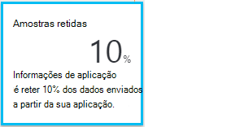

<properties 
    pageTitle="Obter mais partido da aplicação informações | Microsoft Azure" 
    description="Depois de começar a trabalhar com informações de aplicação, eis um resumo das funcionalidades que poderá explorar." 
    services="application-insights" 
    documentationCenter=".net"
    authors="alancameronwills" 
    manager="douge"/>

<tags 
    ms.service="application-insights" 
    ms.workload="tbd" 
    ms.tgt_pltfrm="ibiza" 
    ms.devlang="na" 
    ms.topic="article" 
    ms.date="10/27/2016" 
    ms.author="awills"/>

# <a name="more-telemetry-from-application-insights"></a>Mais telemetria a partir de informações de aplicação

Depois de ter [adicionado informações de aplicação para o seu código ASP.NET](app-insights-asp-net.md), existem algumas coisas que pode fazer para obter ainda mais telemetria. 

## <a name="if-your-app-runs-on-your-iis-server-"></a>Se a sua aplicação é executada no seu servidor IIS...

Se a sua aplicação está alojada em servidores do IIS no seu controlo, instale o Monitor de estado de informações de aplicação nos servidores. Se já estiver instalado, não precisa de fazer nada.

1. Em cada servidor web IIS, inicie sessão com as credenciais de administrador.
2. Transfira e execute o [installer Monitor de estado](http://go.microsoft.com/fwlink/?LinkId=506648).
3. No Assistente de instalação, inicie sessão no Microsoft Azure.

Não precisa de fazer mais alguma coisa, mas pode confirmar que monitorização está ativado para a sua aplicação.


(Também pode utilizar Monitor de estado para [Activar monitorização de tempo de execução](app-insights-monitor-performance-live-website-now.md), mesmo se não tiver instrumento as suas aplicações no Visual Studio.)

### <a name="what-do-you-get"></a>O que é recebo?

Se o Monitor de estado estiver instalado no seu máquinas de servidor, obterá algumas telemetria adicional:

* Telemetria dependência (chamadas de SQL e chamadas de resto efetuadas por sua aplicação) para as aplicações de 4,5 .NET. (Para versões posteriores do .NET, Monitor de estado não é necessário para telemetria dependência.) 
* Rastreios de exceção mostram mais detalhes.
* Contadores de desempenho. Em informações de aplicação, estes contadores aparecem no pá servidores. 


Para ver mais ou menos contadores, [Edite os gráficos](app-insights-metrics-explorer.md). Se o contador de desempenho que pretende não estiver no conjunto de disponível, pode [adicioná-lo para o conjunto de recolhidos pelo módulo contador de desempenho](app-insights-performance-counters.md).

## <a name="if-its-an-azure-web-app-"></a>Se for uma aplicação Azure web...

Se a sua aplicação é executado como uma aplicação Azure web, aceda ao painel de controlo Azure para a aplicação ou VM e abra o pá de informações da aplicação. 

### <a name="what-do-you-get"></a>O que é recebo?

* Rastreios de exceção mostram mais detalhes.
* Telemetria dependência (chamadas de SQL e chamadas de resto efetuadas por sua aplicação) para as aplicações de 4,5 .NET. (Para versões posteriores do .NET, a extensão não é necessária para telemetria dependência.) 


(Também pode utilizar este método para [Ativar o tempo de execução de monitorização de desempenho](app-insights-monitor-performance-live-website-now.md), mesmo se não tiver instrumento sua aplicação no Visual Studio.)

## <a name="client-side-monitoring"></a>Monitorização do lado do cliente

Tiver instalado o SDK que envia dados de telemetria do servidor (back-end) da sua aplicação. Agora pode adicionar monitorização do lado do cliente. Isto fornece-lhe com dados em utilizadores, sessões, vistas de página e quaisquer exceções ou falhas que ocorrem no browser. Também poderá escrever o seu próprio código para controlar como os seus utilizadores funcionam com a aplicação, para a direita para baixo para o nível detalhada de cliques e batimentos de teclas.

Adicione o fragmento de JavaScript de informações de aplicação para cada página web, para obter telemetria de browsers de cliente.

1. No Azure, abra o recurso de informações de aplicação para a sua aplicação.
2. Abra a introdução ao lado do cliente do Monitor e copie o fragmento.
3. Colá-lo para que seja apresentada na cabeça de cada página web - normalmente, que pode fazê-lo ao colar para a página de esquema do modelo global.


Repare que o código contém a chave de instrumentação que identifica o seu recurso de aplicação.

### <a name="what-do-you-get"></a>O que é recebo?

* Pode escrever JavaScript para enviar [telemetria personalizada a partir das suas páginas web](app-insights-api-custom-events-metrics.md), por exemplo controlar quando clica nos botões.
* Em [análise](app-insights-analytics.md), dados `pageViews` e os dados AJAX `dependencies`. 
* [Dados de utilização e desempenho do cliente](app-insights-javascript.md) no pá Browsers.


[Saiba mais sobre a página web de controlo.](app-insights-web-track-usage.md)


## <a name="track-application-version"></a>Versão da aplicação registar

Certifique-se `buildinfo.config` é gerado pelo processo de MSBuild. No ficheiro csproj, adicione:  

```XML

    <PropertyGroup>
      <GenerateBuildInfoConfigFile>true</GenerateBuildInfoConfigFile>    <IncludeServerNameInBuildInfo>true</IncludeServerNameInBuildInfo>
    </PropertyGroup> 
```

Quando tiver as informações de compilação, o módulo do informações de aplicação web adiciona automaticamente **a versão da aplicação** , como uma propriedade para cada item de telemetria. Que permite-lhe filtrar pela versão quando efetuar [pesquisas diagnóstico](app-insights-diagnostic-search.md) ou quando [explorar métricas](app-insights-metrics-explorer.md). 

No entanto, repare que o número de versão de compilação é gerado apenas por MS Build, não pela compilação do developer no Visual Studio.


## <a name="availability-web-tests"></a>Testes de web de disponibilidade

Envie a sua aplicação web pedidos de HTTP regulares a partir de todo o mundo. Vamos alertá-lo se a resposta estiver lenta ou não fiáveis.

O recurso de informações de aplicação para a sua aplicação, clique no mosaico de disponibilidade para adicionar, editar e ver testes web.

Pode adicionar vários testes execução do várias localizações.


[Saiba mais](app-insights-monitor-web-app-availability.md)

## <a name="custom-telemetry-and-logging"></a>Registo de telemetria personalizada e

Os pacotes de informações da aplicação que adicionou ao seu código fornecem uma API que pode ligar a partir da sua aplicação.

* [Gerar o seu próprio eventos e métricas](app-insights-api-custom-events-metrics.md), por exemplo para o número de eventos de negócio ou um desempenho monitor.
* [Captura rastreios de registo](app-insights-asp-net-trace-logs.md) do Log4Net, NLog ou System.Diagnostics.Trace.
* [Filtro, modificar, ou aumentar](app-insights-api-filtering-sampling.md) a enviados a partir da sua aplicação ao escrever processadores de telemetria de telemetria padrão. 


## <a name="powerful-analysis-and-presentation"></a>Uma análise avançada e a apresentação

Existem muitas formas de explorar os seus dados. Se já recentemente iniciado com informações de aplicação, consulte estes artigos:

||
|---|---
|[**Por exemplo, dados de pesquisa diagnóstico**](app-insights-visual-studio.md)<br/>Procurar e filtrar eventos como pedidos, exceções, chamadas de dependência, inicie sessão rastreios e vistas de página. No Visual Studio, aceda ao código rastreios.|
|[**Métricas Explorer para dados agregados**](app-insights-metrics-explorer.md)<br/>Explorar, filtrar e segmento agregado dados como as taxas de pedidos, falhas e exceções; tempos de resposta, tempos de carregamento da página.|
|[**Dashboards**](app-insights-dashboards.md#dashboards)<br/>Misturá dados a partir de vários recursos e partilhe com outras pessoas. Excelentes para aplicações com vários componentes e para apresentar contínua na sala de equipa.  |
|[**Sequência de métricas de Live**](app-insights-metrics-explorer.md#live-metrics-stream)<br/>Quando implementar uma nova compilação, veja destes indicadores de desempenho perto em tempo real para se certificar de que tudo está a funcionar como esperado.|
|[**Análise**](app-insights-analytics.md)<br/>Responda àquelas perguntas sobre o desempenho e a utilização da sua aplicação utilizando este idioma de consulta avançada.|
|[**Alertas manuais e automáticas**](app-insights-alerts.md)<br/>Alertas automáticas adaptarem para padrões normal da sua aplicação de telemetria e o acionador quando há algo fora do habitual padrão. Também pode definir alertas em particular níveis de métricas personalizados ou padrão.|

## <a name="data-management"></a>Gestão de dados

|||
|---|---|
|[**Exportar contínuo**](app-insights-export-telemetry.md)<br/>Copie todos os seus telemetria para armazenamento para que pode analisar sua própria forma.|
|**Acesso a dados API**<br/>Brevemente.|
|[**Amostragem**](app-insights-sampling.md)<br/>Reduz a velocidade de dados e ajuda-o a permanecer dentro do limite da sua comparar camada.|