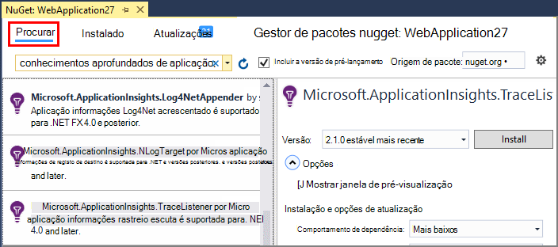
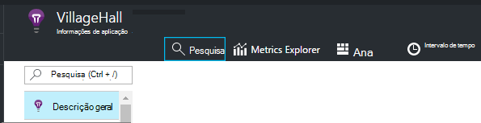
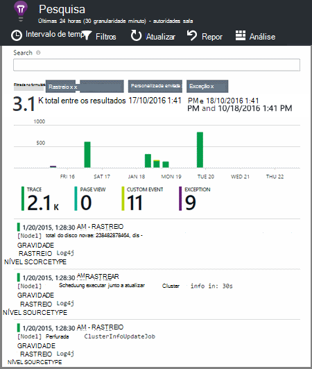

<properties 
    pageTitle="Explorar .NET rastreio registos na aplicação de informações" 
    description="Procurar registos gerados com o rastreio, NLog ou Log4Net." 
    services="application-insights" 
    documentationCenter=".net"
    authors="alancameronwills" 
    manager="douge"/>

<tags 
    ms.service="application-insights" 
    ms.workload="tbd" 
    ms.tgt_pltfrm="ibiza" 
    ms.devlang="na" 
    ms.topic="article" 
    ms.date="07/21/2016" 
    ms.author="awills"/>
 
# <a name="explore-net-trace-logs-in-application-insights"></a>Explorar .NET rastreio registos na aplicação de informações  

Se utilizar NLog, log4Net ou System.Diagnostics.Trace para rastreio diagnóstico na aplicação de ASP.NET, pode ter os registos enviados para [Informações de aplicação do Visual Studio][start], onde pode explorar e pesquisar. Os registos serão intercalados com a outras telemetria chegar a partir da sua aplicação, para que possa identificar rastreios associados a cada pedido de utilizador de manutenção e, se ligam-los às outros eventos e relatórios de exceção.


> [AZURE.NOTE] Precisa do módulo de captura registo? É uma placa de útil para festa de 3 combinações de teclas, mas se já não estiver a utilizar NLog, log4Net ou System.Diagnostics.Trace, considere apenas que entra em contacto [TrackTrace() de informações da aplicação](app-insights-api-custom-events-metrics.md#track-trace) diretamente.


## <a name="install-logging-on-your-app"></a>Instalar a aplicação de início de sessão

Instale o seu quadro de registo que selecionou no projeto. Isto deve resultar numa entrada na App ou Web. config.

Se estiver a utilizar System.Diagnostics.Trace, terá de adicionar uma entrada a Web. config:

```XML

    <configuration>
     <system.diagnostics>
       <trace autoflush="false" indentsize="4">
         <listeners>
           <add name="myListener" 
             type="System.Diagnostics.TextWriterTraceListener" 
             initializeData="TextWriterOutput.log" />
           <remove name="Default" />
         </listeners>
       </trace>
     </system.diagnostics>
   </configuration>
```

## <a name="configure-application-insights-to-collect-logs"></a>Configurar a aplicação de informações para recolher registos

**[Adicionar informações de aplicação para o projeto](app-insights-asp-net.md)** se ainda não o tiver concluído as alterações que ainda. Verá uma opção para incluir recolector de registo.

Ou **Configurar informações de aplicação** clicando com o seu projeto no Explorador de soluções. Selecione a opção a **coleção de rastreio de configurar**.

*Informações de aplicação menu ou registo Recolectores opção sem?* Experimente a [resolução de problemas](#troubleshooting).


## <a name="manual-installation"></a>Instalação manual

Utilize este método se o tipo de projecto não for suportado pelo instalador informações de aplicação (por exemplo um ambiente de trabalho projecto do Windows). 

1. Se planeia utilizar log4Net ou NLog, instale-o no seu projeto. 
2. No Explorador de solução, com o botão direito do projeto e selecione **Gerir pacotes de NuGet**.
3. Procurar "Aplicação informações"

    

4. Selecione o pacote adequado - um dos:
  + Microsoft.ApplicationInsights.TraceListener (para capturar System.Diagnostics.Trace chamadas)
  + Microsoft.ApplicationInsights.NLogTarget
  + Microsoft.ApplicationInsights.Log4NetAppender

O pacote de NuGet instala conjuntos de for necessários e também modifica Web. config ou App.

## <a name="insert-diagnostic-log-calls"></a>Insira chamadas de registo de diagnóstico

Se utiliza o System.Diagnostics.Trace, seria uma chamada normal:

    System.Diagnostics.Trace.TraceWarning("Slow response - database01");

Se preferir log4net ou NLog:

    logger.Warn("Slow response - database01");


## <a name="using-the-trace-api-directly"></a>Utilizar o rastreio API diretamente

Pode ligar o rastreio de informações da aplicação API diretamente. Os adaptadores de registo de utilizam esta API. 

Por exemplo:

    var telemetry = new Microsoft.ApplicationInsights.TelemetryClient();
    telemetry.TrackTrace("Slow response - database01");

Uma vantagem de TrackTrace é que pode colocar dados compridos na mensagem. Por exemplo, poderia codificar existem dados de mensagem. 

Além disso, pode adicionar um nível de gravidade à mensagem. E, como outras telemetria, pode adicionar valores de propriedade que pode utilizar para o ajudar a filtrar ou procurar diferentes conjuntos de rastreios. Por exemplo:


    var telemetry = new Microsoft.ApplicationInsights.TelemetryClient();
    telemetry.TrackTrace("Slow database response",
                   SeverityLevel.Warning,
                   new Dictionary<string,string> { {"database", db.ID} });

Permitir-lhe, na [pesquisa][diagnostic], para filtrar facilmente todas as mensagens de um nível de gravidade determinado relacionados com uma determinada base de dados.

## <a name="explore-your-logs"></a>Explorar os registos

Execute a aplicação, quer no modo de depuração ou implementá-los em direto.

No pá de descrição geral da sua aplicação no [portal do aplicação informações][portal], selecione [pesquisa][diagnostic].





Pode, por exemplo:

* Filtrar rastreios de registo, ou em itens com propriedades específicas
* Inspecionar um item específico detalhadamente.
* Localizar outros telemetria relativas ao pedido de utilizador do mesmo (ou seja, com a mesmo IDOperação) 
* Guardar a configuração desta página como favorito

> [AZURE.NOTE] **Amostragem.** Se a sua aplicação envia muitos dados e estiver a utilizar o SDK de informações de aplicação para o ASP.NET versão 2.0.0-beta3 ou posterior, a funcionalidade de amostragem ajustável pode funcionar e enviar apenas uma percentagem do seu telemetria. [Saiba mais sobre amostragem.](app-insights-sampling.md)

## <a name="next-steps"></a>Próximos passos

[Diagnosticar falhas e exceções no ASP.NET][exceptions]

[Obter mais informações sobre pesquisa][diagnostic].


## <a name="troubleshooting"></a>Resolução de problemas

### <a name="how-do-i-do-this-for-java"></a>Como fazer isto para Java?

Utilize os [adaptadores de registo de Java](app-insights-java-trace-logs.md).

### <a name="theres-no-application-insights-option-on-the-project-context-menu"></a>Existe uma opção de informações de aplicação no menu de contexto de projeto

* Verifique as ferramentas de informações da aplicação está instalada nesta máquina de desenvolvimento. No menu Ferramentas do Visual Studio, extensões e atualizações, procure ferramentas de informações da aplicação. Se não for no separador instalado, abra o separador Online e instalá-lo.
* Isto pode ser um tipo de projecto não são suportado através de ferramentas de informações da aplicação. Utilize [instalação manual](#manual-installation).

### <a name="no-log-adapter-option-in-the-configuration-tool"></a>Opção sem placa de registo na ferramenta de configuração

* Tem de instalar a arquitetura de registo do primeiro.
* Se estiver a utilizar System.Diagnostics.Trace, certifique-se de [configurou-o no `web.config` ](https://msdn.microsoft.com/library/system.diagnostics.eventlogtracelistener.aspx).
* Tem a versão mais recente das ferramentas de informações da aplicação? No menu de **Ferramentas** do Visual Studio, selecione **extensões e atualizações**e abrir o separador de **atualizações** . Se informações de aplicação ferramentas não estiver lá, clique em Atualizar.


### <a name="emptykey"></a>Recebo um erro "chave instrumentação não pode estar vazio"

Parece tiver instalado o pacote de Nuget de placa de registo sem instalar a aplicação de informações.

No Explorador de solução, com o botão direito `ApplicationInsights.config` e selecione **Atualizar informações de aplicação**. Irá obter uma caixa de diálogo que lhe pede para iniciar sessão no Azure e crie a um recurso de informações da aplicação, ou reutilização existente. Que deverá corrigi-lo.

### <a name="i-can-see-traces-in-diagnostic-search-but-not-the-other-events"></a>Que a possa ver rastreios na pesquisa de diagnóstico, mas não outros eventos

Por vezes, pode demorar algum tempo para todos os pedidos para obter através do pipeline e eventos.

### <a name="limits"></a>Quantidade de dados é guardado?

Até 500 eventos por segundo a partir de cada aplicação. Eventos são retidos durante sete dias.

### <a name="im-not-seeing-some-of-the-log-entries-that-i-expect"></a>Não estou a ver algumas das entradas de registo que espero

Se a sua aplicação envia muitos dados e estiver a utilizar o SDK de informações de aplicação para o ASP.NET versão 2.0.0-beta3 ou posterior, a funcionalidade de amostragem ajustável pode funcionar e enviar apenas uma percentagem do seu telemetria. [Saiba mais sobre amostragem.](app-insights-sampling.md)

## <a name="add"></a>Próximos passos

* [Configurar a disponibilidade e testes de capacidade de resposta][availability]
* [Resolução de problemas][qna]


<!--Link references-->

[availability]: app-insights-monitor-web-app-availability.md
[diagnostic]: app-insights-diagnostic-search.md
[exceptions]: app-insights-asp-net-exceptions.md
[portal]: https://portal.azure.com/
[qna]: app-insights-troubleshoot-faq.md
[start]: app-insights-overview.md

 
