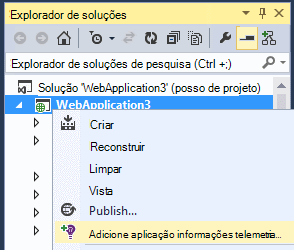
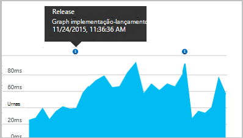

<properties 
    pageTitle="Configurar o a análise de aplicação web do ASP.NET com informações de aplicação | Microsoft Azure" 
    description="Configurar o desempenho, disponibilidade e a análise de utilização do Web site ASP.NET alojado no local ou no Azure." 
    services="application-insights" 
    documentationCenter=".net"
    authors="NumberByColors" 
    manager="douge"/>

<tags 
    ms.service="application-insights" 
    ms.workload="tbd" 
    ms.tgt_pltfrm="ibiza" 
    ms.devlang="na" 
    ms.topic="get-started-article" 
    ms.date="10/13/2016" 
    ms.author="awills"/>


# <a name="set-up-application-insights-for-aspnet"></a>Configurar o informações de aplicação para ASP.NET

[Informações de aplicação do Visual Studio](app-insights-overview.md) monitoriza a sua aplicação direto para o ajudar a [detetar e diagnosticar problemas de desempenho e exceções](app-insights-detect-triage-diagnose.md)e [Descubra como a sua aplicação é utilizada](app-insights-overview-usage.md).  Funciona para as aplicações que são alojadas nos seus servidores de IIS no local ou na nuvem VMs, bem como aplicações Azure web.


## <a name="before-you-start"></a>Antes de começar

Precisa de:

* Atualização de 2013 Studio Visual 3 ou posterior. Mais tarde, é melhor.
* Uma subscrição do [Microsoft Azure](http://azure.com). Se a sua equipa ou a organização tiver uma subscrição do Azure, o proprietário pode adicionar ao-lo, com a sua [conta Microsoft](http://live.com). 

Existem artigos alternativos para ver se estiver interessado em:

* [Instrumentalizar uma aplicação web em tempo de execução](app-insights-monitor-performance-live-website-now.md)
* [Azure serviços em nuvem](app-insights-cloudservices.md)

## <a name="ide"></a>1. a adicionar informações de aplicação SDK


### <a name="if-its-a-new-project"></a>Se for um novo projeto...

Certifique-se de que informações da aplicação está selecionada quando cria um novo projeto no Visual Studio. 


### <a name="-or-if-its-an-existing-project"></a>… ou se é um projeto existente

Com o botão direito do projecto no Explorador de soluções e selecione **Adicionar telemetria de informações de aplicação** ou **Configurar informações de aplicação**.



* Projeto de ASP.NET Core? - [Siga estas instruções para resolver algumas linhas de código](https://github.com/Microsoft/ApplicationInsights-aspnetcore/wiki/Getting-Started#add-application-insights-instrumentation-code-to-startupcs). 


## <a name="run"></a>2. a executar a sua aplicação

Executar a sua aplicação com F5 e experimentar: abrir páginas diferentes para gerar algumas telemetria.

No Visual Studio, verá uma contagem dos eventos que tenha sido iniciada. 


## <a name="3-see-your-telemetry"></a>3. ver o seu telemetria...

### <a name="-in-visual-studio"></a>… no Visual Studio

Abrir a janela de aplicação informações no Visual Studio: clique no botão de informações da aplicação ou com o botão direito do projecto no Explorador de solução:


Esta vista mostra telemetria gerada no lado do servidor da sua aplicação. Experimentar com os filtros e clique em qualquer evento para ver mais detalhes.

[Saiba mais sobre as ferramentas de informações de aplicação no Visual Studio](app-insights-visual-studio.md).

<a name="monitor"></a> 
### <a name="-in-the-portal"></a>… no portal

A menos que escolheu *Instalar SDK apenas,* também pode ver telemetria no portal informações de aplicação web. 

O portal tem mais gráficos, ferramentas analíticas e dashboards que Visual Studio. 


Abra o seu recurso de informações de aplicação no [portal do Azure](https://portal.azure.com/).


O portal abre-se numa vista de telemetria da sua aplicação:

* A primeira telemetria é apresentada no [fluxo direto de métricas](app-insights-metrics-explorer.md#live-metrics-stream).
* Individuais eventos sejam apresentados na **pesquisa** (1). Dados poderão demorar alguns minutos apareça. Clicar num evento para poder ver as respetivas propriedades. 
* Agregado métricas aparecem nos gráficos (2). Pode demorar um minuto ou dois para dados sejam apresentados aqui. Clique em qualquer gráfico para abrir uma pá com mais detalhadamente.

[Saiba mais sobre a utilização de informações de aplicação no portal do Azure](app-insights-dashboards.md).

## <a name="4-publish-your-app"></a>4. a publicar a sua aplicação

Publica a sua aplicação ao seu servidor IIS ou Azure. Assista a [sequência de métricas directo](app-insights-metrics-explorer.md#live-metrics-stream) para se certificar de que tudo está a ser executado sem problemas.

Verá o seu telemetria construir no portal do informações de aplicação, onde pode monitorizar métricas, procure a telemetria e configurar o [dashboards](app-insights-dashboards.md). Também pode utilizar a poderosa [análise idioma de consulta](app-insights-analytics.md) para analisar a utilização e o desempenho ou localizar eventos específicos. 

Também pode continuar a analisar o seu telemetria no [Visual Studio](app-insights-visual-studio.md) com ferramentas de pesquisa de diagnóstico e de [tendências](app-insights-visual-studio-trends.md).

> [AZURE.NOTE] Se a sua aplicação envia suficiente telemetria dirigir [limitação limites](app-insights-pricing.md#limits-summary), automática [amostragem](app-insights-sampling.md) muda. Amostragem reduz a quantidade de telemetria enviada a partir da sua aplicação, preservando dados correlacionados para fins de diagnóstico.


##<a name="land"></a>O que 'Adicionar informações de aplicação'?

Informações de aplicação envia telemetria da sua aplicação para o portal de informações de aplicação (que está alojado no Microsoft Azure):


Por isso, o comando fez três elementos:

1. Adicione o pacote de aplicação informações Web SDK NuGet ao seu projeto. Para visualizá-la no Visual Studio, com o botão direito do projeto e selecione gerir pacotes de NuGet.
2. Crie um recurso de informações de aplicação no [portal do Azure](https://portal.azure.com/). É onde irá ver os seus dados. Obtém a *chave de instrumentação,* que identifica o recurso.
3. Insere a chave de instrumentação no `ApplicationInsights.config`, para que o SDK possam enviar telemetria para o portal.

Se pretender, pode fazer manualmente estes passos para [ASP.NET 4](app-insights-windows-services.md) ou [ASP.NET Core](https://github.com/Microsoft/ApplicationInsights-aspnetcore/wiki/Getting-Started).

### <a name="to-upgrade-to-future-sdk-versions"></a>Atualizar para as versões futuras SDK

Para atualizar para uma [nova versão do SDK](https://github.com/Microsoft/ApplicationInsights-dotnet-server/releases), abra o Gestor de pacotes NuGet novamente e filtrar pacotes instalados. Selecione Microsoft.ApplicationInsights.Web e escolha a atualização.

Se quaisquer personalizações que efetuou para ApplicationInsights.config, guarde uma cópia do mesmo antes de atualizar e, posteriormente intercalar as alterações a nova versão.

## <a name="add-more-telemetry"></a>Adicionar mais de telemetria

### <a name="web-pages-and-single-page-apps"></a>Páginas Web e apps página única

1. [Adicionar o fragmento de JavaScript](app-insights-javascript.md) às suas páginas web para realçar os Browser e a utilização pás com dados sobre as vistas de página, tempos de carregamento, exceções do browser, desempenho de chamada de AJAX, contagens de sessão e de utilizador.
2. [Eventos personalizados código](app-insights-api-custom-events-metrics.md) para contar, hora ou medida ações do utilizador.

### <a name="dependencies-exceptions-and-performance-counters"></a>Dependências, exceções e contadores de desempenho

[Instalar o Monitor de estado](app-insights-monitor-performance-live-website-now.md) em cada um dos computadores de servidor, para obter telemetria adicional sobre a sua aplicação. Este é o que obtém:

* [Contadores de desempenho](app-insights-performance-counters.md) - 
CPU, memória, disco e outros contadores de desempenho relativas à sua aplicação. 
* [Exceções](app-insights-asp-net-exceptions.md) - telemetria mais detalhada para algumas exceções.
* [Dependências](app-insights-asp-net-dependencies.md) - chamadas para os serviços de REST API ou SQL. Descubra se respostas lentas pelos componentes externos estão a causar problemas de desempenho na sua aplicação. (Se a sua aplicação é executada no .NET 4.6, não precisa Monitor de estado para obter este telemetria.)

### <a name="diagnostic-code"></a>Código de diagnóstico

Tem um problema? Se pretender inserir código na sua aplicação para ajudar a diagnosticá-lo, tem várias opções:

* [Captura rastreios de registo](app-insights-asp-net-trace-logs.md): Se já estiver a utilizar Log4N, NLog ou System.Diagnostics.Trace para registar eventos de rastreio, em seguida, o resultado pode ser enviado para informações de aplicação para que o pode haver uma correlação-lo com pedidos, pesquisar através de-lo e analisá-los. 
* [Eventos personalizados e métricas](app-insights-api-custom-events-metrics.md): utilizar TrackEvent() e TrackMetric() num servidor ou código de página web.
* [Etiqueta de telemetria com propriedades adicionais](app-insights-api-filtering-sampling.md#add-properties)

Utilize a [pesquisa](app-insights-diagnostic-search.md) para localizar e correlacionar eventos específicos e [análises](app-insights-analytics.md) para realizar consultas mais eficientes.

## <a name="alerts"></a>Alertas

Seja o primeiro para saber se a sua aplicação tem problemas. (Não aguarde até que os utilizadores indicam-lhe!) 

* [Criar testes de web](app-insights-monitor-web-app-availability.md) para se certificar de que o seu site está visível na web.
* [Diagnósticos pro-activos](app-insights-proactive-diagnostics.md) executar automaticamente (se a sua aplicação tiver um determinado valor mínimo de tráfego). Não tem de fazer nada configurá-los. Estes indicam-lhe se a sua aplicação tem uma taxa de invulgar de pedidos de falhadas.
* [Definir alertas métricas](app-insights-alerts.md) para avisá-lo se uma métrica cruza um determinado limiar. Pode defini-los no métricas personalizadas esse código para a sua aplicação.

Por predefinição, as notificações de alerta são enviadas para o proprietário da subscrição do Azure. 


## <a name="version-and-release-tracking"></a>Versão e controlo de versão

### <a name="track-application-version"></a>Versão da aplicação registar

Certifique-se `buildinfo.config` é gerado pelo processo de MSBuild. No ficheiro csproj, adicione:  

```XML

    <PropertyGroup>
      <GenerateBuildInfoConfigFile>true</GenerateBuildInfoConfigFile>    <IncludeServerNameInBuildInfo>true</IncludeServerNameInBuildInfo>
    </PropertyGroup> 
```

Quando tiver as informações de compilação, o módulo do informações de aplicação web adiciona automaticamente **a versão da aplicação** , como uma propriedade para cada item de telemetria. Que permite-lhe filtrar pela versão quando efetuar [pesquisas diagnóstico](app-insights-diagnostic-search.md) ou quando [explorar métricas](app-insights-metrics-explorer.md). 

No entanto, repare que o número de versão de compilação é gerado apenas por MS Build, não pela compilação do developer no Visual Studio.

### <a name="release-annotations"></a>Liberte anotações

Se utilizar serviços de equipa do Visual Studio, pode [obter um marcador de anotação](app-insights-annotations.md) adicionadas aos gráficos sempre que uma nova versão.




## <a name="next-steps"></a>Próximos passos

| | 
|---|---
|**[Trabalhar com informações de aplicação no Visual Studio](app-insights-visual-studio.md)**<br/>Depuração de telemetria, diagnóstico de pesquisa, o nível de detalhe através de código.|
|**[Trabalhar com o portal de informações de aplicação](app-insights-dashboards.md)**<br/>Os dashboards, poderosas ferramentas de diagnóstico e analíticas, alertas, um mapa de dependência direto da sua aplicação e telemetria exportar. |
|**[Adicionar mais dados](app-insights-asp-net-more.md)**<br/>Monitorizar a utilização, disponibilidade, dependências, exceções. Integre rastreios a partir do registo de quadros. Escreva telemetria personalizada. | 


