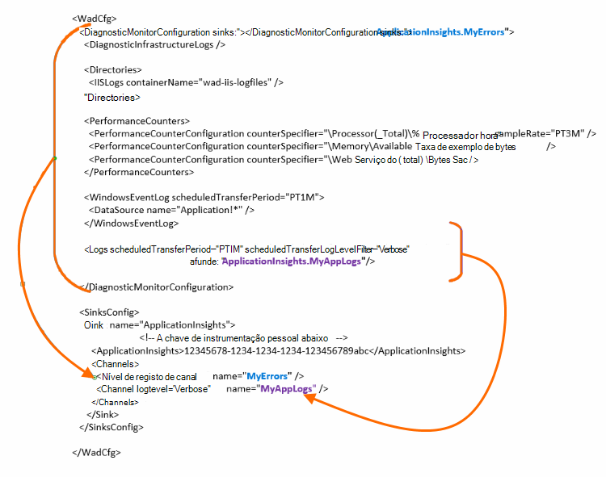

<properties
    pageTitle="Enviar registos de diagnóstico Azure para informações de aplicação"
    description="Configure os detalhes dos serviços em nuvem Azure registos de diagnóstico que são enviados para o portal de informações da aplicação."
    services="application-insights"
    documentationCenter=".net"
    authors="sbtron"
    manager="douge"/>

<tags
    ms.service="application-insights"
    ms.workload="tbd"
    ms.tgt_pltfrm="ibiza"
    ms.devlang="na"
    ms.topic="article"
    ms.date="11/17/2015"
    ms.author="awills"/>

# <a name="configure-azure-diagnostic-logging-to-application-insights"></a>Configurar registo de diagnóstico Azure para informações de aplicação

Quando configura um projeto de serviços em nuvem ou uma Máquina Virtual no Microsoft Azure, [Azure pode gerar um registo de diagnóstico](../vs-azure-tools-diagnostics-for-cloud-services-and-virtual-machines.md). Pode ter este enviados para informações de aplicação para que pode analisá-la juntamente com telemetria de diagnóstico e a utilização que foi enviada a partir da aplicação pelo SDK de informações da aplicação. O registo Azure inclui eventos na gestão da aplicação como iniciar, parar, falhas, bem como contadores de desempenho. O registo também inclui chamadas na aplicação para System.Diagnostics.Trace.

Este artigo descreve a configuração da captura diagnóstico detalhadamente.

Precisa de Azure SDK 2,8 instalado no Visual Studio.

## <a name="get-an-application-insights-resource"></a>Obter um recurso de informações de aplicação

Para a melhor experiência, [Adicionar o SDK de informações de aplicação para cada função da sua aplicação de serviços em nuvem](app-insights-cloudservices.md)ou [independentemente da sua aplicação será executado no seu VM](app-insights-overview.md). Em seguida, pode enviar os dados de diagnóstico para ser analisadas e apresentado o mesmo recurso de informações da aplicação.

Em alternativa, se não quiser utilizar o SDK - por exemplo, se a aplicação ainda estiver live – pode basta [criar um novo recurso de informações de aplicação](app-insights-create-new-resource.md) no portal do Azure. Selecione **Diagnósticos do Azure** como o tipo de aplicação.


## <a name="send-azure-diagnostics-to-application-insights"></a>Enviar Azure diagnósticos para informações de aplicação

Se for possível atualizar o seu projeto de aplicação, em seguida, no Visual Studio Selecione cada função, selecione as respetivas propriedades e na caixa de diálogo Configuração, selecione **Enviar diagnósticos para informações de aplicação**.

Se já estiver live a sua aplicação, utilize o Visual Studio Explorador de servidor ou Explorador de serviços em nuvem para abrir as propriedades da aplicação. Selecione **Enviar diagnósticos para informações de aplicação**.

Em cada caso ser-lhe-á pedido para obter as informações do recurso informações de aplicação que criou.

[Saiba mais sobre como configurar as informações de aplicação para uma aplicação de serviços em nuvem](app-insights-cloudservices.md).

## <a name="configuring-the-azure-diagnostics-adapter"></a>Configurar a placa de diagnóstico Azure

Continue a ler apenas se pretende selecionar as partes do registo que enviar informações de aplicação. Por predefinição, tudo o que é enviado, incluindo: eventos do Microsoft Azure; contadores de desempenho rastrear chamadas a partir da aplicação para System.Diagnostics.Trace.

Diagnósticos do Azure armazena os dados a tabelas de armazenamento do Windows Azure. No entanto, pode também pipe todos os ou um subconjunto de dados para informações de aplicação configurando "sumidouros" e "canais" na configuração quando utiliza a extensão do Azure diagnóstico 1.5 ou posterior.

### <a name="configure-application-insights-as-a-sink"></a>Configurar a aplicação informações como um Sink

Quando utiliza as propriedades de função para definir "Enviar dados para informações de aplicação", o SDK do Azure (2,8 ou posterior) adiciona uma `<SinksConfig>` elemento para o público [ficheiro de configuração de diagnósticos do Azure](https://msdn.microsoft.com/library/azure/dn782207.aspx) da função.

`<SinksConfig>`Define o sink adicional onde os dados de diagnóstico Azure podem ser enviados.  Um exemplo `SinksConfig` este aspeto:

```xml

    <SinksConfig>
     <Sink name="ApplicationInsights">
      <ApplicationInsights>{Insert InstrumentationKey}</ApplicationInsights>
      <Channels>
        <Channel logLevel="Error" name="MyTopDiagData"  />
        <Channel logLevel="Verbose" name="MyLogData"  />
      </Channels>
     </Sink>
    </SinksConfig>

```

O `ApplicationInsights` elemento Especifica a chave de instrumentação que identifica o recurso de informações de aplicação para o qual os dados de diagnóstico Azure serão enviados. Quando selecionar o recurso, é preenchida automaticamente com base na `APPINSIGHTS_INSTRUMENTATIONKEY` configuração do serviço. (Se quiser configurá-lo manualmente, obtenha a tecla do menu pendente Essentials do recurso.)

`Channels`Defina os dados que serão enviados para o sink. O canal funciona como um filtro. O `loglevel` atributo permite-lhe especificar o nível de registo que irá enviar o canal. Os valores disponíveis são: `{Verbose, Information, Warning, Error, Critical}`.

### <a name="send-data-to-the-sink"></a>Enviar dados para o sink

Envie dados para as informações de aplicação receber adicionando o atributo sumidouros sob o nó DiagnosticMonitorConfiguration. Adicionar o elemento sumidouros a cada nó Especifica que pretende que os dados recolhidos a partir desse nó e qualquer nó em-la para ser enviada para sink especificado.

Por exemplo, a predefinição criada pelo SDK do Azure é para todos os dados de diagnóstico Azure de enviar:

```xml

    <DiagnosticMonitorConfiguration overallQuotaInMB="4096" sinks="ApplicationInsights">
```

Mas se pretender enviar apenas os registos de erros, qualificar o nome de sink com um nome para o canal:

```xml

    <DiagnosticMonitorConfiguration overallQuotaInMB="4096" sinks="ApplicationInsights.MyTopDiagdata">
```

Repare que estamos a utilizar o nome do Sink de definido, juntamente com o nome de um canal que definido acima.

Se apenas pretender enviar registos de aplicação verboso para informações de aplicação, em seguida, adicionaria o atributo sumidouros para o `Logs` nó.

```xml

    <Logs scheduledTransferPeriod="PT1M" scheduledTransferLogLevelFilter="Verbose" sinks="ApplicationInsights.MyLogData"/>
```

Também pode incluir várias sumidouros na configuração em diferentes níveis na hierarquia. Nesse caso sink especificado no nível superior da hierarquia age como uma definição global e um especificado aos factos de elemento de elemento individual, como uma substituição para essa definição global.

Eis um exemplo do ficheiro de configuração público que envia todos os erros para informações de aplicação completo (especificado na `DiagnosticMonitorConfiguration` nó) e os registos de nível para além disso verboso para que os registos de aplicação (especificado na `Logs` nó).

```xml

    <WadCfg>
     <DiagnosticMonitorConfiguration overallQuotaInMB="4096"
       sinks="ApplicationInsights.MyTopDiagData"> <!-- All info below sent to this channel -->
      <DiagnosticInfrastructureLogs />
      <PerformanceCounters>
        <PerformanceCounterConfiguration counterSpecifier="\Processor(_Total)\% Processor Time" sampleRate="PT3M" sinks="ApplicationInsights.MyLogData/>
        <PerformanceCounterConfiguration counterSpecifier="\Memory\Available MBytes" sampleRate="PT3M" />
        <PerformanceCounterConfiguration counterSpecifier="\Web Service(_Total)\Bytes Total/Sec" sampleRate="PT3M" />
      </PerformanceCounters>
      <WindowsEventLog scheduledTransferPeriod="PT1M">
        <DataSource name="Application!*" />
      </WindowsEventLog>
      <Logs scheduledTransferPeriod="PT1M" scheduledTransferLogLevelFilter="Verbose"
            sinks="ApplicationInsights.MyLogData"/>
       <!-- This specific info sent to this channel -->
     </DiagnosticMonitorConfiguration>

     <SinksConfig>
      <Sink name="ApplicationInsights">
        <ApplicationInsights>{Insert InstrumentationKey}</ApplicationInsights>
        <Channels>
          <Channel logLevel="Error" name="MyTopDiagData"  />
          <Channel logLevel="Verbose" name="MyLogData"  />
        </Channels>
      </Sink>
     </SinksConfig>
    </WadCfg>
```



Existem algumas limitações ter em consideração com esta funcionalidade:

* Canais destinam-se apenas para funcionar com o tipo de registo e não contadores de desempenho. Se especificar um canal com um elemento de contador de desempenho será ignorada.
* O nível de registo de um canal, não pode exceder o nível de registo para o que está a ser recolhido pelo diagnósticos do Azure. Por exemplo: não é possível recolher erros de registo de aplicações no elemento de registos e tente enviar verboso registos para a sincronização de conhecimentos aprofundados de aplicação. O atributo scheduledTransferLogLevelFilter sempre tem de recolher igual ou mais registos que os registos está a tentar enviar para um sink.
* Não é possível enviar quaisquer dados blob recolhidos pela extensão do Azure diagnósticos para informações de aplicação. Por exemplo nada especificado no nó directórios. Para falha de sistema copia a informação de falha real continuarão a ser enviada para o armazenamento de blob e apenas uma notificação a indicar que a informação de falha de foi gerada será enviada para informações de aplicação.

## <a name="related-topics"></a>Tópicos relacionados

* [Monitorizar os serviços em nuvem Azure com informações de aplicação](app-insights-cloudservices.md)
* [Utilizar o PowerShell para enviar o Azure diagnósticos para informações de aplicação](app-insights-powershell-azure-diagnostics.md)
* [Ficheiro de configuração de diagnósticos do Azure](https://msdn.microsoft.com/library/azure/dn782207.aspx)
