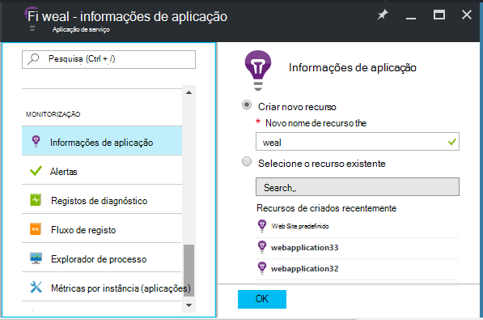
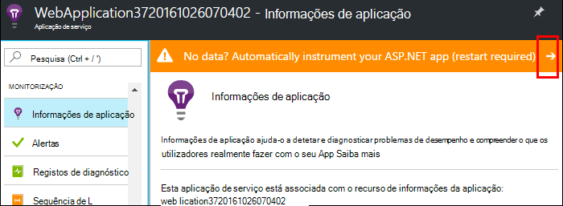
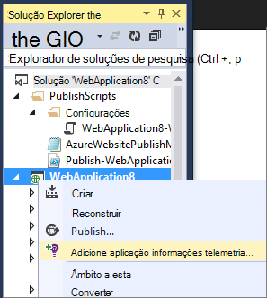
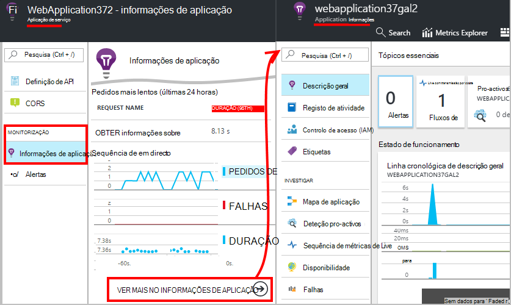
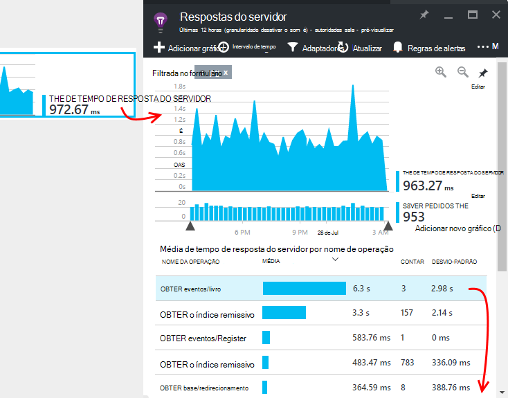
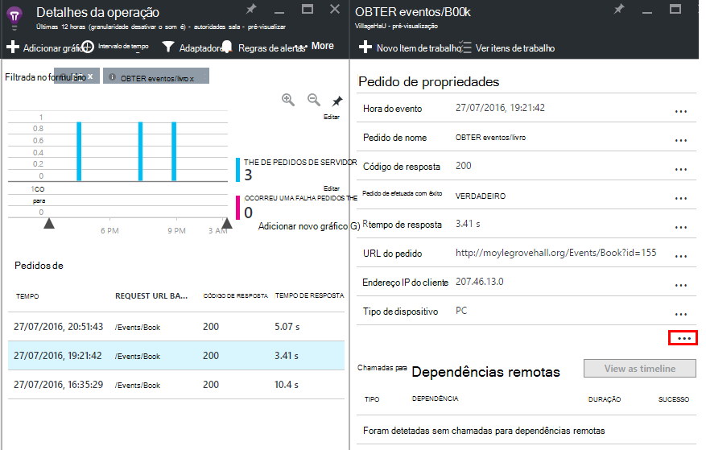

<properties
    pageTitle="Monitorizar o desempenho da aplicação Azure web | Microsoft Azure"
    description="Desempenho das aplicações de monitorização para Azure web apps. Tempo de carregamento e a resposta, informações de dependência e definir alertas sobre o desempenho do gráfico."
    services="application-insights"
    documentationCenter=".net"
    authors="alancameronwills"
    manager="douge"/>

<tags
    ms.service="azure-portal"
    ms.workload="na"
    ms.tgt_pltfrm="na"
    ms.devlang="na"
    ms.topic="article"
    ms.date="10/24/2016"
    ms.author="awills"/>

# Monitorizar o desempenho da aplicação web do Azure

No [Portal do Azure](https://portal.azure.com) pode configurar a monitorização de desempenho aplicações para as suas [aplicações Azure web](../app-service-web/app-service-web-overview.md). [Informações de aplicação do Visual Studio](app-insights-overview.md) instrumentos a sua aplicação para enviar telemetria sobre suas atividades para o serviço de informações da aplicação, onde são armazenada e analisada. Não existem, métricos gráficos e ferramentas de pesquisa podem ser utilizadas para ajudar a diagnosticar problemas, melhorar o desempenho e a utilização de avaliar.

## Tempo de execução ou Construa a hora

Pode configurar a monitorização por instrumentalizar a aplicação em qualquer uma das duas formas:

* **Tempo de execução** - pode selecionar um extensão de monitorização quando a aplicação web já está direto do desempenho. Não é necessário recriar ou voltar a instalar a aplicação. Obter um conjunto padrão de pacotes monitorizar tempos de resposta, taxas de sucesso, exceções, dependências e assim sucessivamente. 
 
* **Construir a hora** - pode instalar um pacote na sua aplicação no desenvolvimento. Esta opção é mais versátil. Para além dos mesmos pacotes padrão, pode escrever código para personalizar a telemetria ou para enviar o seu próprio telemetria. Pode iniciar sessão actividades específicas ou eventos de registo de acordo com a semântica do seu domínio de aplicação. 

## Executar instrumentação de tempo com informações de aplicação

Se já estiver a executar uma aplicação web no Azure, já obter algumas monitorização: taxas pedido e o erro. Adicionar informações de aplicação para obter mais informações, tais como os tempos de resposta, monitorização de chamadas para dependências, deteção inteligente e a análise poderosa consulta idioma. 

1. **Selecione informações de aplicação** no painel de controlo Azure para a sua aplicação web.

    

 * Selecione para criar um novo recurso, a menos que já configurou um recurso de informações de aplicação para esta aplicação outra rota.

2. **Instrument a aplicação web do** após ter sido instalada a aplicação de informações. 

    

3. **Monitorize a aplicação**.  [Expore os dados](#explore-the-data).

Mais tarde, pode criar e implementar a aplicação com informações de aplicação, se pretender.

*Como posso remover informações de aplicação, ou mudar para enviar a outro recurso?*

* No Azure, abra o pá de controlo do web app e, em ferramentas de desenvolvimento, abra **as extensões**. Elimine a extensão de informações da aplicação. Em seguida, em monitorização, selecione informações de aplicação e criar ou selecionar os recursos que pretende.

## Criar a aplicação com informações de aplicação

Informações de aplicação podem fornecer mais detalhada telemetria instalando um SDK para a sua aplicação. Em particular, pode recolher registos de rastreio, [escrever telemetria personalizada](../application-insights/app-insights-api-custom-events-metrics.md)e obter mais detalhados de exceção de relatórios.

1. **No Visual Studio** (atualização 2013 2 ou posterior), adicionar o SDK de informações da aplicação ao seu projeto.

    

    Se lhe for pedido para iniciar sessão, utilize as credenciais para a sua conta Azure.

    A operação tem dois efeitos:

 1. Cria um recurso de informações de aplicação no Azure, onde o telemetria está armazenada, analisada e apresentada.
 2. Adiciona o pacote de aplicação informações NuGet ao seu código e configura-o para enviar telemetria para o recurso Azure.

2. **Teste de telemetria** ao executar a aplicação no seu computador de desenvolvimento (F5).

3. **Publicar a aplicação** no Azure no como habitualmente. 

*Como é que mudo a enviar para um recurso de informações da aplicação diferente?*

* No Visual Studio, com o botão direito do projeto, selecione **informações de aplicação > Configurar** e escolha os recursos que pretende. Obter a opção para criar um novo recurso. Reconstruir e implementar novamente.

## Explorar os dados

1. No pá informações de aplicação do painel de controlo do web app, verá Live métricas, que mostra os pedidos e falhas dentro de uma segunda ou dois-las a ocorrer. É muito útil visualização quando estiver a voltar a publicar a aplicação - pode ver algum problema imediatamente.

2. Clique para avançar para o recurso de informações da aplicação completo.

    
    

    Também pode aceder lá, diretamente da navegação do recurso Azure.

2. Clique nas qualquer gráfico para obter mais detalhes:

    

    Pode [Personalizar pás métricas](../application-insights/app-insights-metrics-explorer.md).

3. Clique na sequência Consulte eventos individuais e respetivas propriedades:

    

    Repare que o "…" ligação para abrir a todas as propriedades.

    Pode [Personalizar as pesquisas](../application-insights/app-insights-diagnostic-search.md).

Para pesquisas mais eficientes ao longo do seu telemetria, utilize o [idioma de consulta de análise](../application-insights/app-insights-analytics-tour.md).

## Próximos passos

* [Ativar o Azure diagnósticos](app-insights-azure-diagnostics.md) sejam enviadas para informações de aplicação.
* [Métricas de estado de funcionamento do serviço de monitor](../monitoring-and-diagnostics/insights-how-to-customize-monitoring.md) para se certificar de que o seu serviço está disponível e a responder.
* [Receber notificações de alerta](../monitoring-and-diagnostics/insights-receive-alert-notifications.md) sempre que eventos operacionais ocorrem ou métricas cruzada um determinado limiar.
* Utilize [Informações de aplicação para aplicações JavaScript e páginas web](app-insights-web-track-usage.md) para obter telemetria do cliente dos browsers que visita uma página web.
* [Configurar o testes de web disponibilidade](app-insights-monitor-web-app-availability.md) para recebê-las se o seu site está indisponível.
