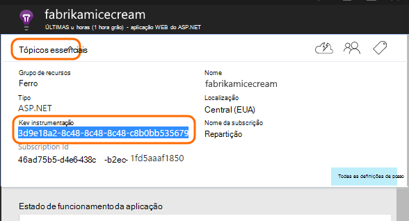

<properties
   pageTitle="Informações de aplicação para serviços em nuvem Azure"
   description="Monitorizar o seu funções web e trabalhador eficazmente com informações de aplicação"
   services="application-insights"
   documentationCenter=""
   authors="soubhagyadash"
   manager="douge"
   editor="alancameronwills"/>

<tags
   ms.service="application-insights"
   ms.devlang="na"
   ms.tgt_pltfrm="ibiza"
   ms.topic="article"
   ms.workload="tbd"
   ms.date="03/02/2016"
   ms.author="sdash"/>

# <a name="application-insights-for-azure-cloud-services"></a>Informações de aplicação para serviços em nuvem Azure


*Informações de aplicação está na pré-visualização*

[Aplicações de serviço de nuvem do Microsoft Azure](https://azure.microsoft.com/services/cloud-services/) pode ser controlado pela [Informações de aplicação do Visual Studio] [ start] para disponibilidade, desempenho, falhas e a utilização. Com os comentários que obter informações sobre o desempenho e eficácia da sua aplicação no meio natural, pode disponibilizar escolhas informadas sobre a direção da estrutura de cada ciclo de vida do desenvolvimento.


Terá de uma subscrição com [Do Microsoft Azure](http://azure.com). Inicie sessão com uma conta Microsoft, o que pode ter para o Windows, XBox Live ou outros serviços na nuvem da Microsoft. 


#### <a name="sample-application-instrumented-with-application-insights"></a>Aplicação de exemplo implementada com informações de aplicação

Veja esta [aplicação de exemplo](https://github.com/Microsoft/ApplicationInsights-Home/tree/master/Samples/AzureEmailService) na qual é adicionada aplicação informações num serviço na nuvem com duas funções de trabalho alojadas no Azure. 

O que se segue mostra-lhe como adaptar o seu próprio projecto de serviço de nuvem da mesma forma.

## <a name="create-an-application-insights-resource-for-each-role"></a>Criar um recurso de informações de aplicação para cada função

Um recurso de informações da aplicação é onde os seus dados de telemetria serão analisados e apresentados.  

1.  No [portal do Azure][portal], criar um novo recurso de informações da aplicação. Para tipo de aplicação, selecione a aplicação ASP.NET. 

    

2.  Tomar uma cópia da chave de instrumentação. Terá este brevemente para configurar o SDK.

    


Normalmente, é [melhor criar um recurso em separado para os dados de cada função de web e trabalhador](app-insights-separate-resources.md). 

Como alternativa, pode enviar dados a partir de todas as funções de apenas uma recurso, mas definir uma [propriedade predefinida] [ apidefaults] para que possa filtrar ou agrupar os resultados de cada função.

## <a name="sdk"></a>Instalar o SDK em cada projecto


1. No Visual Studio, edite os pacotes de NuGet do seu projeto de aplicação na nuvem.

    


2. Para funções da web, adicione o pacote de NuGet [Informações de aplicação para a Web](http://www.nuget.org/packages/Microsoft.ApplicationInsights.Web) . Esta versão do SDK inclui módulos Adicionar contexto do servidor como informações de função. Para funções de trabalho, utilize as [Informações de aplicação para os servidores do Windows](https://www.nuget.org/packages/Microsoft.ApplicationInsights.WindowsServer/).

    


3. Configure o SDK para enviar dados para o recurso de informações da aplicação.

    Definir a chave de instrumentação como uma definição de configuração no ficheiro `ServiceConfiguration.Cloud.cscfg`. ([Código de exemplo](https://github.com/Microsoft/ApplicationInsights-Home/blob/master/Samples/AzureEmailService/AzureEmailService/ServiceConfiguration.Cloud.cscfg)).
 
    ```XML
     <Role name="WorkerRoleA"> 
      <Setting name="APPINSIGHTS_INSTRUMENTATIONKEY" value="YOUR IKEY" /> 
     </Role>
    ```
 
    Numa função de arranque adequado, defina a chave de instrumentação da definição de configuração:

    ```C#
     TelemetryConfiguration.Active.InstrumentationKey = RoleEnvironment.GetConfigurationSettingValue("APPINSIGHTS_INSTRUMENTATIONKEY");
    ```

    Nota, o mesmo nome `APPINSIGHTS_INSTRUMENTATIONKEY` da configuração da definição será utilizada pela diagnósticos do Azure elaboração de relatórios. 


    Faça o seguinte para cada função na sua aplicação. Consulte os exemplos:
 
 * [Função Web](https://github.com/Microsoft/ApplicationInsights-Home/blob/master/Samples/AzureEmailService/MvcWebRole/Global.asax.cs#L27)
 * [Função de trabalho](https://github.com/Microsoft/ApplicationInsights-Home/blob/master/Samples/AzureEmailService/WorkerRoleA/WorkerRoleA.cs#L232)
 * [Para páginas web](https://github.com/Microsoft/ApplicationInsights-Home/blob/master/Samples/AzureEmailService/MvcWebRole/Views/Shared/_Layout.cshtml#L13)   

4. Defina o ficheiro ApplicationInsights.config sejam copiados sempre para o directório de saída. 

    (No ficheiro. config, verá as mensagens que lhe pede para colocar a chave de instrumentação aí. No entanto, para as aplicações de nuvem é melhor defini-lo a partir do ficheiro .cscfg. Este procedimento garante que a função corretamente é identificada no portal.)


#### <a name="run-and-publish-the-app"></a>Executar e publicar a aplicação

Execute a aplicação e inicie sessão no Azure. Abra os recursos de informações da aplicação que criou e verá os pontos de dados individuais a aparecer em [pesquisa](app-insights-diagnostic-search.md)e dados no [Explorador de métrica](app-insights-metrics-explorer.md)agregados. 

Adicionar mais telemetria - consulte as secções abaixo - e, em seguida, publicar a sua aplicação para obter comentários de diagnóstico e a utilização direto. 


#### <a name="no-data"></a>Sem dados?

* Abrir a [pesquisa] [ diagnostic] mosaico, para ver os eventos individuais.
* Utilize a aplicação, abrir páginas diferentes para que gera algumas telemetria.
* Aguarde alguns segundos e clique em Atualizar.
* Consulte o artigo [resolução de problemas][qna].


## <a name="more-telemetry"></a>Mais de telemetria

As secções abaixo mostram como obter telemetria adicional do aspectos diferentes da sua aplicação.


## <a name="track-requests-from-worker-roles"></a>Monitorizar pedidos de funções de trabalho

Em funções da web, o módulo pedidos recolhe automaticamente dados sobre pedidos de HTTP. Consulte o artigo [exemplo MVCWebRole](https://github.com/Microsoft/ApplicationInsights-Home/tree/master/Samples/AzureEmailService/MvcWebRole) para obter exemplos sobre como pode substituir o comportamento de coleções de sites predefinido. 

Pode capturar o desempenho de chamadas para funções de trabalho ao controlá-los da mesma forma como os pedidos de HTTP. Informações de aplicação, o tipo de telemetria pedido medidas de uma unidade de trabalho de lado do servidor com nome que pode ser temporizado e pode independentemente teve êxito ou falhar. Enquanto pedidos de HTTP são capturados automaticamente pelo SDK, pode inserir o seu próprio código para controlar os pedidos de funções de trabalho.

Consulte as duas funções de trabalho de exemplo implementadas a pedidos de relatório: [WorkerRoleA](https://github.com/Microsoft/ApplicationInsights-Home/tree/master/Samples/AzureEmailService/WorkerRoleA) e [WorkerRoleB](https://github.com/Microsoft/ApplicationInsights-Home/tree/master/Samples/AzureEmailService/WorkerRoleB)

## <a name="azure-diagnostics"></a>Diagnósticos do Azure

Dados de [Diagnósticos do Azure](../vs-azure-tools-diagnostics-for-cloud-services-and-virtual-machines.md) incluem eventos de gestão de funções, contadores de desempenho e registos da aplicação. Pode ter estes enviados para informações de aplicação para que possa ver-as juntamente com o resto do seu telemetria, tornando mais fácil diagnosticar problemas.

Diagnósticos do Azure são particularmente úteis se uma função falha inesperadamente ou não inicia.

1. Botão direito do rato a função (não o projeto!) para abrir as respetivas propriedades e selecione **Ativar diagnósticos**, **Enviar diagnósticos para informações de aplicação**.

    

    **Ou se a sua aplicação está já publicadas e em execução**, abrir Server Explorer ou na nuvem Explorer, o botão direito do rato a aplicação e selecione a opção mesmo.

3.  Selecione o mesmo recurso de informações da aplicação como o seu outras telemetria.

    Se pretender, pode definir um recurso diferente em configurações de serviços diferente (na nuvem, Local) para ajudar a manter os dados de desenvolvimento separada do dados dinâmicos.

3. Opcionalmente, [excluir alguns dos diagnósticos Azure](app-insights-azure-diagnostics.md) que pretende que seja reencaminhada para informações de aplicação. A predefinição é tudo.

### <a name="view-azure-diagnostic-events"></a>Visualizar os eventos de diagnóstico Azure

Onde localizar diagnósticos:

* Contadores de desempenho são apresentados como métricas personalizadas. 
* Registos de eventos do Windows são apresentados como rastreios e eventos personalizados.
* Registos de aplicação, ETW registos e quaisquer registos de infraestrutura de diagnóstico aparecem como rastreios.

Para ver contadores de desempenho e as contagens de eventos, abra o [Explorador de métricas](app-insights-metrics-explorer.md) e adicionar um novo gráfico:


Utilize a [pesquisa](app-insights-diagnostic-search.md) para pesquisar os vários registos de rastreio que foi enviados por diagnósticos do Azure. Por exemplo, se tiver uma exceção unhanded numa função que a função de falha de sistema e reciclagem, essas informações de causaram seria aparecer no aplicação canal do Windows registo de eventos. Pode utilizar a funcionalidade de pesquisa para analisar o erro de registo de eventos do Windows e obter o rastreio da pilha completo para a exceção, permitindo-lhe localizar a causa de raiz do problema.


## <a name="app-diagnostics"></a>Diagnósticos de aplicação

Diagnósticos do Azure incluem automaticamente entradas de registo que a sua aplicação gera utilizando System.Diagnostics.Trace. 

Mas se já estiver a utilizar os quadros Log4N ou NLog, também pode [capturar seus rastreios de registo][netlogs].

[Controlar eventos personalizados e métricas] [ api] no cliente ou servidor ou ambos, para saber mais sobre o desempenho e a utilização da aplicação.

## <a name="dependencies"></a>Dependências

Aplicação informações SDK pode comunicar chamadas de que a sua aplicação torna-se para dependências externas, tais como REST apis e os servidores de SQL. Permite-lhe se uma determinada dependência está a causar falhas ou respostas lentas.

Se a sua aplicação utiliza .NET framework 4.6 ou posterior, não precisa de fazer mais nada. 

Caso contrário, configure a função web/trabalho com o [Agente de informações da aplicação](app-insights-monitor-performance-live-website-now.md) , também conhecido como "Monitor de estado".

Para utilizar o agente de informações da aplicação com o seu funções web/trabalho:

* Adicione a pasta de [AppInsightsAgent](https://github.com/Microsoft/ApplicationInsights-Home/tree/master/Samples/AzureEmailService/WorkerRoleA/AppInsightsAgent) e os dois ficheiros para os seus projetos de funções web/trabalho. Certifique-se de que definir as respectivas propriedades de compilação para que estes estão sempre copiados para o directório de saída. Estes ficheiros instalar o agente.
* Adicione o tarefa de arranque para o ficheiro CSDEF como mostrado [aqui](https://github.com/Microsoft/ApplicationInsights-Home/tree/master/Samples/AzureEmailService/AzureEmailService/ServiceDefinition.csdef#L18).
* Nota: *Funções de trabalho* requerem três variáveis de ambiente como mostrado [aqui](https://github.com/Microsoft/ApplicationInsights-Home/tree/master/Samples/AzureEmailService/AzureEmailService/ServiceDefinition.csdef#L44). Não é necessário para funções da web.

### <a name="dependency-reports"></a>Relatórios de dependência

Eis um exemplo daquilo que vê no portal de informações da aplicação:

* Diagnósticos formatados com correlacionadas automaticamente pedidos e dependências:

    

* Desempenho da função web, com informações de dependência:

    

* Eis uma captura de ecrã nos pedidos e as informações de dependência para uma função de trabalho:

    

## <a name="exceptions"></a>Exceções

Consulte o artigo [Monitorização exceções na aplicação de informações](app-insights-asp-net-exceptions.md) para obter informações sobre como pode recolher exceções não processadas de tipos de aplicação web diferente.

A função de web exemplo tem controladores MVC5 e Web API 2. As exceções não processadas a partir do 2 são captadas com o seguinte:

* [AiHandleErrorAttribute](https://github.com/Microsoft/ApplicationInsights-Home/blob/master/Samples/AzureEmailService/MvcWebRole/Telemetry/AiHandleErrorAttribute.cs) configurar [aqui](https://github.com/Microsoft/ApplicationInsights-Home/blob/master/Samples/AzureEmailService/MvcWebRole/App_Start/FilterConfig.cs#L12) para MVC5 controladores
* [AiWebApiExceptionLogger](https://github.com/Microsoft/ApplicationInsights-Home/blob/master/Samples/AzureEmailService/MvcWebRole/Telemetry/AiWebApiExceptionLogger.cs) configurar [aqui](https://github.com/Microsoft/ApplicationInsights-Home/blob/master/Samples/AzureEmailService/MvcWebRole/App_Start/WebApiConfig.cs#L25) para os controladores da Web API 2

Para funções de trabalho, existem duas formas de controlar exceções.

* TrackException(ex)
* Se tiver adicionado o pacote de NuGet de escuta de rastreio de informações da aplicação, pode utilizar System.Diagnostics.Trace para iniciar sessão exceções. [Exemplo de código.](https://github.com/Microsoft/ApplicationInsights-Home/blob/master/Samples/AzureEmailService/WorkerRoleA/WorkerRoleA.cs#L107)

## <a name="performance-counters"></a>Contadores de desempenho

Os seguintes contadores são recolhidos por predefinição:

    * \Process(??APP_WIN32_PROC??)\% processador de tempo
    * \Memory\Available bytes
    * \.Líquido CLR Exceptions(??APP_CLR_PROC??)\# de excepções iniciadas / seg
    * \Processo (??. APP_WIN32_PROC??) \Private bytes
    * \Processo (??. APP_WIN32_PROC??) Dados \IO Bytes/seg
    * \Processor(_Total)\% processador de tempo

Além disso, a seguinte é também recolhida para funções da web:

    * \ASP.NET aplicações (??. APP_W3SVC_PROC??) \Requests/SEC    
    * \ASP.NET aplicações (??. APP_W3SVC_PROC??) Tempo de execução de \Request
    * \ASP.NET aplicações (??. APP_W3SVC_PROC??) \Requests na fila de aplicação

Pode especificar personalizado adicional ou outros contadores de desempenho windows como mostrado [aqui](https://github.com/Microsoft/ApplicationInsights-Home/blob/master/Samples/AzureEmailService/WorkerRoleA/ApplicationInsights.config#L14)

  

## <a name="correlated-telemetry-for-worker-roles"></a>Correlacionadas telemetria para funções de trabalho

É uma experiência de diagnóstico avançada, quando pode ver o que por um instrutor a um pedido de latência alta ou falha. Com funções da web, o SDK configura automaticamente correlação entre telemetria relacionada. Para funções de trabalho, pode utilizar um inicializador de telemetria personalizado para definir um atributo de contexto Operation.Id comum para todos os telemetria realizar esta. Isto irá permitir-lhe ver se o problema de latência/falha era causado devido a uma dependência ou o seu código, relance! 

Eis como:

* Defina a Id de correlação para um CallContext como mostrado [aqui](https://github.com/Microsoft/ApplicationInsights-Home/blob/master/Samples/AzureEmailService/WorkerRoleA/WorkerRoleA.cs#L36). Neste caso, estamos a utilizar o ID do pedido de como o id de correlação
* Adicione uma implementação TelemetryInitializer personalizada, que serão definidas as Operation.Id para correlationId do conjunto de acima. É mostrado aqui: [ItemCorrelationTelemetryInitializer](https://github.com/Microsoft/ApplicationInsights-Home/blob/master/Samples/AzureEmailService/WorkerRoleA/Telemetry/ItemCorrelationTelemetryInitializer.cs#L13)
* Adicione o inicializador de telemetria personalizado. Fazê-lo poderia no ficheiro ApplicationInsights.config ou no código como mostrado [aqui](https://github.com/Microsoft/ApplicationInsights-Home/blob/master/Samples/AzureEmailService/WorkerRoleA/WorkerRoleA.cs#L233)

Já está! A experiência portal já com fios para cima para o ajudar a ver todos os associado telemetria relance:


## <a name="client-telemetry"></a>Telemetria de cliente

[Adicionar o SDK JavaScript às suas páginas web] [ client] para obter baseado em browser telemetria como contagens de vista de página, tempos de carregamento da página, exceções script e para permitem-lhe escrever telemetria personalizada nos seus scripts de página.

## <a name="availability-tests"></a>Testes de disponibilidade

[Configurar o testes web] [ availability] para garantir a aplicação permanece direto e responder.


## <a name="example"></a>Exemplo

[O exemplo](https://github.com/Microsoft/ApplicationInsights-Home/tree/master/Samples/AzureEmailService) monitoriza um serviço que tem uma função de web e duas funções de trabalho.

## <a name="exception-method-not-found-on-running-in-azure-cloud-services"></a>Exceção "método não encontrado" sobre como executar no Azure serviços em nuvem

Construir para .NET 4.6? 4.6 automaticamente não é suportada nas funções de serviços em nuvem Azure. [Instalar 4.6 cada função](../cloud-services/cloud-services-dotnet-install-dotnet.md) antes de executar a sua aplicação.

## <a name="related-topics"></a>Tópicos relacionados

* [Configurar o envio de diagnósticos do Azure para informações de aplicação](app-insights-azure-diagnostics.md)
* [Utilizar o PowerShell para enviar o Azure diagnósticos para informações de aplicação](app-insights-powershell-azure-diagnostics.md)


[api]: app-insights-api-custom-events-metrics.md
[apidefaults]: app-insights-api-custom-events-metrics.md#default-properties
[apidynamicikey]: app-insights-separate-resources.md#dynamic-ikey
[availability]: app-insights-monitor-web-app-availability.md
[azure]: app-insights-azure.md
[client]: app-insights-javascript.md
[diagnostic]: app-insights-diagnostic-search.md
[netlogs]: app-insights-asp-net-trace-logs.md
[portal]: http://portal.azure.com/
[qna]: app-insights-troubleshoot-faq.md
[redfield]: app-insights-monitor-performance-live-website-now.md
[start]: app-insights-overview.md 
