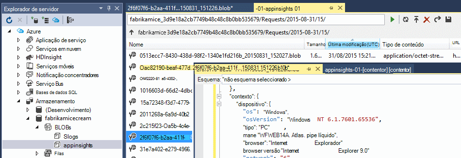

<properties 
    pageTitle="Tutorial: Exportar telemetria para base de dados SQL de informações de aplicação" 
    description="Continuamente exporte dados de informações de aplicação para utilizar a análise da cadeia SQL." 
    services="application-insights" 
    documentationCenter=""
    authors="noamben" 
    manager="douge"/>

<tags 
    ms.service="application-insights" 
    ms.workload="tbd" 
    ms.tgt_pltfrm="ibiza" 
    ms.devlang="na" 
    ms.topic="article" 
    ms.date="03/06/2015" 
    ms.author="awills"/>
 
# <a name="walkthrough-export-to-sql-from-application-insights-using-stream-analytics"></a>Tutorial: Exportar para SQL de utilizar a análise da cadeia de informações de aplicação

Este artigo mostra como mover os seus dados de telemetria de [Informações de aplicação do Visual Studio] [ start] numa base de dados Azure SQL utilizando [Exportar contínua] [ export] e [Análises de sequência Azure](https://azure.microsoft.com/services/stream-analytics/). 

Exportar contínua move-se os dados de telemetria para o armazenamento do Windows Azure no formato JSON. Vamos analisar os objetos JSON utilizando a análise da cadeia de Azure e criar linhas numa tabela de base de dados.

(Mais geralmente, a exportar contínua é a forma de fazer a sua própria análise de telemetria enviar as suas aplicações para informações de aplicação. Que poderia adaptar este exemplo de código para efetuar outras tarefas com a telemetria exportada, como agregação dos dados.)

Vamos começar com partem do princípio de que já tem a aplicação que pretende para monitorizar a.


Neste exemplo, vamos utilizar os dados da vista de página, mas o mesmo padrão facilmente pode ser prolongado para outros tipos de dados, tais como eventos personalizados e exceções. 


## <a name="add-application-insights-to-your-application"></a>Adicionar informações de aplicação à aplicação


Para começar a utilizar:

1. [Configurar o informações de aplicação para as suas páginas web](app-insights-javascript.md). 

    (Neste exemplo, vamos concentrar-no processamento de dados de vista de página a partir dos browsers de cliente, mas também é possível configurar informações de aplicação para o lado do servidor da sua aplicação [Java](app-insights-java-get-started.md) ou [ASP.NET](app-insights-asp-net.md) e pedido de um processo, dependência e outros telemetria de servidor.)


5. Publicar a sua aplicação e ver dados de telemetria aparecem no seu recurso de informações da aplicação.


## <a name="create-storage-in-azure"></a>Criar armazenamento no Azure

Exportar contínua sempre exporta dados para uma conta de armazenamento do Windows Azure, pelo que necessita de criar o armazenamento pela primeira vez.

1. Criar uma conta de armazenamento na sua subscrição no [portal do Azure][portal].

    

2. Criar um contentor

    

3. Copiar a tecla de acesso de armazenamento

    Terá de-o mais cedo para configurar o teclado para o serviço de análise da cadeia.

    

## <a name="start-continuous-export-to-azure-storage"></a>Iniciar exportação contínua ao armazenamento Azure

1. No portal do Azure, navegue para o recurso de informações da aplicação que criou para a sua aplicação.

    

2. Crie uma exportação contínua.

    


    Selecione a conta de armazenamento que criou anteriormente:

    
    
    Defina os tipos de evento que pretende ver:

    


3. Permitir que alguns dados de acumular. Sentar novamente e permitir que as pessoas que utilizam a sua aplicação para o tempo. Telemetria seja reencaminhado e verá gráficos estatísticos no [Explorador do métrica](app-insights-metrics-explorer.md) e eventos individuais na [pesquisa de diagnóstico](app-insights-diagnostic-search.md). 

    E para além disso, os dados serão exportar para o seu armazenamento. 

4. Inspecionar a exportado dados, quer no portal do - selecione **Procurar**, selecione a sua conta de armazenamento e, em seguida, **contentores** - ou no Visual Studio. No Visual Studio, selecione **Ver / na nuvem Explorer**e abra o Azure / armazenamento. (Se não tiver esta opção de menu, tem de instalar o SDK do Azure: Abra a caixa de diálogo novo projeto e abra Visual c# / na nuvem / obter Microsoft Azure SDK para .NET.)

    

    Anote a parte do nome do caminho, que deriva da tecla de nome e instrumentação de aplicação comuns. 

Os eventos são escritos blob ficheiros no formato JSON. Cada ficheiro pode conter um ou mais eventos. Por isso, podemos gostaria de ler os dados do evento e filtra os campos que queremos. Existem todos os tipos de coisas que podemos podem fazer com os dados, mas o nosso plano de hoje é utilizar a análise da cadeia para mover os dados para uma base de dados do SQL. Que irá tornar mais fácil executar muitas interessantes consultas.

## <a name="create-an-azure-sql-database"></a>Criar uma base de dados do Azure SQL

Mais uma vez começando pela sua subscrição no [Azure portal][portal], criar a base de dados (e um novo servidor, a menos que já tem um) para que irá escrever os dados.


Certifique-se de que o servidor de base de dados permite o acesso aos serviços Azure:


## <a name="create-a-table-in-azure-sql-db"></a>Criar uma tabela no Azure SQL DB

Ligar à base de dados criada na secção anterior com a ferramenta de gestão preferido. Neste tutorial, vamos utilizar [Ferramentas de gestão do SQL Server](https://msdn.microsoft.com/ms174173.aspx) (SSMS).


Criar uma nova consulta e executar o seguinte T SQL:

```SQL

CREATE TABLE [dbo].[PageViewsTable](
    [pageName] [nvarchar](max) NOT NULL,
    [viewCount] [int] NOT NULL,
    [url] [nvarchar](max) NULL,
    [urlDataPort] [int] NULL,
    [urlDataprotocol] [nvarchar](50) NULL,
    [urlDataHost] [nvarchar](50) NULL,
    [urlDataBase] [nvarchar](50) NULL,
    [urlDataHashTag] [nvarchar](max) NULL,
    [eventTime] [datetime] NOT NULL,
    [isSynthetic] [nvarchar](50) NULL,
    [deviceId] [nvarchar](50) NULL,
    [deviceType] [nvarchar](50) NULL,
    [os] [nvarchar](50) NULL,
    [osVersion] [nvarchar](50) NULL,
    [locale] [nvarchar](50) NULL,
    [userAgent] [nvarchar](max) NULL,
    [browser] [nvarchar](50) NULL,
    [browserVersion] [nvarchar](50) NULL,
    [screenResolution] [nvarchar](50) NULL,
    [sessionId] [nvarchar](max) NULL,
    [sessionIsFirst] [nvarchar](50) NULL,
    [clientIp] [nvarchar](50) NULL,
    [continent] [nvarchar](50) NULL,
    [country] [nvarchar](50) NULL,
    [province] [nvarchar](50) NULL,
    [city] [nvarchar](50) NULL
)

CREATE CLUSTERED INDEX [pvTblIdx] ON [dbo].[PageViewsTable]
(
    [eventTime] ASC
)WITH (PAD_INDEX = OFF, STATISTICS_NORECOMPUTE = OFF, SORT_IN_TEMPDB = OFF, DROP_EXISTING = OFF, ONLINE = OFF, ALLOW_ROW_LOCKS = ON, ALLOW_PAGE_LOCKS = ON)

```


Neste exemplo, estamos a utilizar dados a partir de vistas de página. Para ver os dados disponíveis, inspecionar a saída JSON e consulte o artigo [Exportar modelo de dados](app-insights-export-data-model.md).

## <a name="create-an-azure-stream-analytics-instance"></a>Criar uma instância do Azure da cadeia Analytics

A partir do [Portal do Azure clássico](https://manage.windowsazure.com/), selecione o serviço de análise da cadeia de Azure e criar uma nova tarefa de análise de sequência:


Quando a nova tarefa é criada, expanda os detalhes:


#### <a name="set-blob-location"></a>Definir a localização de BLOBs

Defini-lo para tirar a entrada a partir do seu blob contínua exportar:


Agora tem a chave primária do Access a partir da sua conta de armazenamento, que indicados anteriormente. Defina como a chave de conta de armazenamento.


#### <a name="set-path-prefix-pattern"></a>Conjunto de caminho prefixo padrão 


Certifique-se de que definir o formato de data para **AAAA-MM-DD** (com **traços**).

O caminho do prefixo padrão Especifica o modo como a análise da cadeia encontra ficheiros de entrada no armazenamento. Tem de defini-lo para corresponder ao como exportar contínua armazena os dados. Defini-lo da seguinte forma:

    webapplication27_12345678123412341234123456789abcdef0/PageViews/{date}/{time}

Neste exemplo:

* `webapplication27`é o nome do recurso informações de aplicação, **todas as em letra minúscula**. 
* `1234...`é a chave de instrumentação das informações de aplicação recursos **com traços removidos**. 
* `PageViews`é o tipo de dados que pretende analisar. Os tipos de disponíveis dependem o filtro que definir no exportar contínuo. Examine os dados exportados para ver os outros tipos de disponíveis e, consulte o artigo [Exportar modelo de dados](app-insights-export-data-model.md).
* `/{date}/{time}`um padrão é escrito literalmente.

Para obter o nome e iKey do seu recurso de informações da aplicação, abra Essentials na sua página de descrição geral ou abrir as definições.

#### <a name="finish-initial-setup"></a>Concluir a configuração inicial

Confirme o formato de serialização:


Fechar o assistente e aguarde que a configuração concluir.

>[AZURE.TIP] Utilize a função de exemplo para verificar que definiu caminho de entrada corretamente. Se falhar: verificar se existem dados no armazenamento para o intervalo de tempo de exemplo que escolheu. Editar a definição de entrada e verificar a configurar a conta de armazenamento, o prefixo do caminho e data formato corretamente.

## <a name="set-query"></a>Conjunto de consulta

Abra a secção de consulta:


Substitua a consulta predefinida com:

```SQL

    SELECT flat.ArrayValue.name as pageName
    , flat.ArrayValue.count as viewCount
    , flat.ArrayValue.url as url
    , flat.ArrayValue.urlData.port as urlDataPort
    , flat.ArrayValue.urlData.protocol as urlDataprotocol
    , flat.ArrayValue.urlData.host as urlDataHost
    , flat.ArrayValue.urlData.base as urlDataBase
    , flat.ArrayValue.urlData.hashTag as urlDataHashTag
      ,A.context.data.eventTime as eventTime
      ,A.context.data.isSynthetic as isSynthetic
      ,A.context.device.id as deviceId
      ,A.context.device.type as deviceType
      ,A.context.device.os as os
      ,A.context.device.osVersion as osVersion
      ,A.context.device.locale as locale
      ,A.context.device.userAgent as userAgent
      ,A.context.device.browser as browser
      ,A.context.device.browserVersion as browserVersion
      ,A.context.device.screenResolution.value as screenResolution
      ,A.context.session.id as sessionId
      ,A.context.session.isFirst as sessionIsFirst
      ,A.context.location.clientip as clientIp
      ,A.context.location.continent as continent
      ,A.context.location.country as country
      ,A.context.location.province as province
      ,A.context.location.city as city
    INTO
      AIOutput
    FROM AIinput A
    CROSS APPLY GetElements(A.[view]) as flat


```

Repare que as propriedades de alguns primeiros são específicas para ver dados de página. Exportações de outros tipos de telemetria terá diferentes propriedades. Consulte o artigo o [detalhadas referência do modelo de dados para os tipos de propriedade e valores.](app-insights-export-data-model.md)

## <a name="set-up-output-to-database"></a>Configurar o resultado a base de dados

Selecione SQL como o resultado.


Especifique a base de dados do SQL.


Fechar o assistente e aguarde que uma notificação a indicar que a saída tiver sido configurada.

## <a name="start-processing"></a>Iniciar processamento

Inicie a tarefa a partir da barra de ação:


Pode escolher se pretende começar a processar os dados que começam a partir de agora ou dados comece anteriores. O último é útil se tiver tido exportar contínua já em execução para tempo.


Depois de alguns minutos, regresse ao ferramentas de gestão do SQL Server e ver os dados a fluir em. Por exemplo, utilize uma consulta da seguinte forma:

    SELECT TOP 100 *
    FROM [dbo].[PageViewsTable]


## <a name="related-articles"></a>Artigos relacionados

* [Exportar para o SQL utilizando uma função de trabalho](app-insights-code-sample-export-telemetry-sql-database.md)
* [Exportar para obter utilizando a análise da cadeia](app-insights-export-power-bi.md)
* [Referência para os valores e tipos de propriedades do modelo de dados detalhados.](app-insights-export-data-model.md)
* [Exportar contínua na aplicação informações](app-insights-export-telemetry.md)
* [Informações de aplicação](https://azure.microsoft.com/services/application-insights/)

<!--Link references-->

[diagnostic]: app-insights-diagnostic-search.md
[export]: app-insights-export-telemetry.md
[metrics]: app-insights-metrics-explorer.md
[portal]: http://portal.azure.com/
[start]: app-insights-overview.md

 