<properties 
    pageTitle="Exemplo de código: analisar dados exportados de informações de aplicação" 
    description="O código de sua própria análise de telemetria na aplicação informações utilizando a funcionalidade de exportação contínuo. Guarde dados do SQL." 
    services="application-insights" 
    documentationCenter=""
    authors="mazharmicrosoft" 
    manager="douge"/>

<tags 
    ms.service="application-insights" 
    ms.workload="tbd" 
    ms.tgt_pltfrm="ibiza" 
    ms.devlang="na" 
    ms.topic="article" 
    ms.date="01/05/2016" 
    ms.author="awills"/>
 
# Exemplo de código: analisar dados exportados de informações de aplicação

Este artigo mostra como processar dados JSON exportados de informações da aplicação. Por exemplo, vamos irá escrever código para mover os seus dados de telemetria de [Informações de aplicação do Visual Studio] [ start] numa base de dados Azure SQL utilizando [Exportar contínua][export]. (É também possível alcançar este [utilizando a análise da cadeia](app-insights-code-sample-export-sql-stream-analytics.md), mas os nossos objectivo aqui é confirmar que algum código.) 

Exportar contínua move o cursor seu telemetria para o armazenamento do Windows Azure no formato JSON, por isso Pedimos irá escrever algum código para analisar os objetos JSON e criar linhas numa tabela de base de dados.

Mais geralmente, exportar contínua é a forma de fazer a sua própria análise de telemetria enviar as suas aplicações para informações de aplicação. Foi adaptar este exemplo de código para efetuar outras tarefas com a telemetria exportada.

Vamos começar com partem do princípio de que já tem a aplicação que pretende para monitorizar a.

## Adicionar informações de aplicação SDK

Para monitorizar a sua aplicação, [Adicionar um SDK de informações da aplicação] [ start] para a sua aplicação. Existem diferentes SDK e ferramentas de ajuda para diferentes plataformas, comunicação IDES: e idiomas. Pode monitorizar páginas web, Java ou ASP.NET servidores da web e dispositivos móveis dos vários tipos. Todos os dos SDK enviar telemetria para o [portal de informações da aplicação][portal], onde pode utilizar o nosso uma análise avançada e ferramentas de diagnóstico e exportar os dados para armazenamento.

Para começar a utilizar:

1. Obter uma [conta no Microsoft Azure](https://azure.microsoft.com/pricing/).
2. No [portal do Azure][portal], adicionar um novo recurso de informações de aplicação para a sua aplicação:

    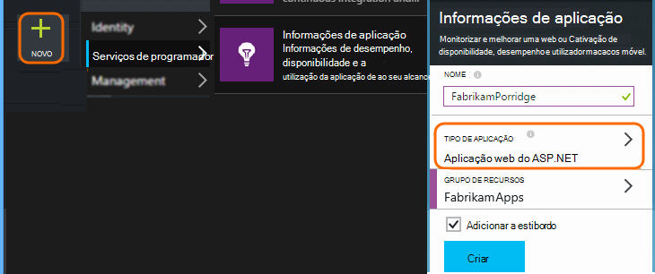

    (O tipo de aplicação e de subscrição poderão ser diferentes.)
3. Abrir o guia para saber como configurar o SDK para o seu tipo de aplicação.

    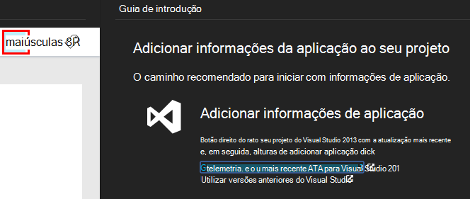

    Se o seu tipo de aplicação não estiver listado, consulte o artigo [Introdução ao] [ start] página.

4. Neste exemplo, está a ser monitorizada uma aplicação web, para que pode utilizamos as ferramentas de Azure no Visual Studio para instalar o SDK. Vamos indicar que o nome do recurso nossa aplicação informações:

    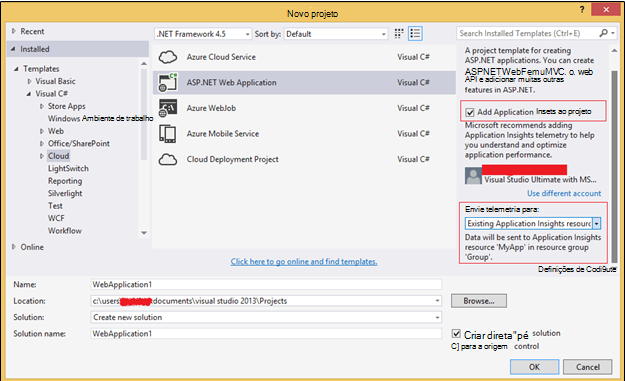

## Criar armazenamento no Azure

Dados de informações de aplicação sempre são exportados para uma conta de armazenamento do Windows Azure no formato JSON. É a partir do armazenamento que o seu código vai ler os dados.

1. Criar uma conta de armazenamento "clássico" na sua subscrição no [portal do Azure][portal].

    

2. Criar um contentor

    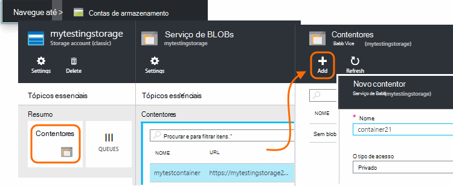

## Iniciar exportação contínua ao armazenamento Azure

1. No portal do Azure, navegue para o recurso de informações da aplicação que criou para a sua aplicação.

    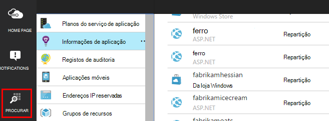

2. Crie uma exportação contínua.

    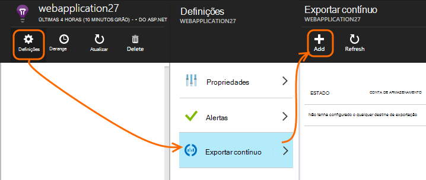

    Selecione a conta de armazenamento que criou anteriormente:

    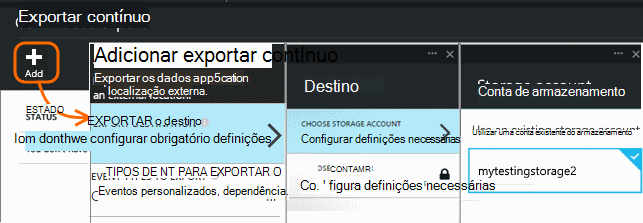
    
    Defina os tipos de evento que pretende ver:

    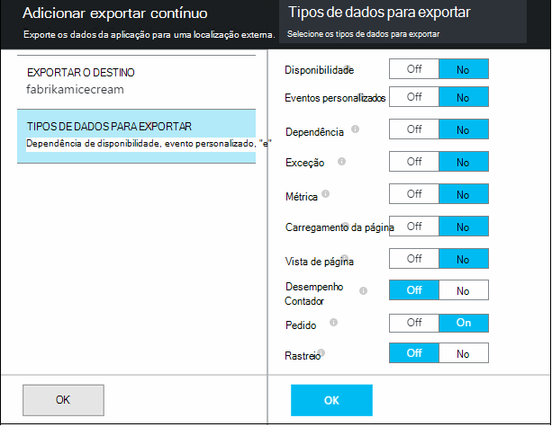

3. Permitir que alguns dados de acumular. Sentar novamente e permitir que as pessoas que utilizam a sua aplicação para o tempo. Telemetria seja reencaminhado e verá gráficos estatísticos no [Explorador do métrica](app-insights-metrics-explorer.md) e eventos individuais na [pesquisa de diagnóstico](app-insights-diagnostic-search.md). 

    E para além disso, os dados serão exportar para o seu armazenamento. 

4. Inspecionar os dados exportados. No Visual Studio, selecione **Ver / na nuvem Explorer**e abra o Azure / armazenamento. (Se não tiver esta opção de menu, tem de instalar o SDK do Azure: Abra a caixa de diálogo novo projeto e abra Visual c# / na nuvem / obter Microsoft Azure SDK para .NET.)

    

    Anote a parte do nome do caminho, que deriva da tecla de nome e instrumentação de aplicação comuns. 

Os eventos são escritos blob ficheiros no formato JSON. Cada ficheiro pode conter um ou mais eventos. Por isso, podemos gostaria de ler os dados do evento e filtra os campos que queremos. Existem todos os tipos de coisas que podemos podem fazer com os dados, mas o nosso plano de hoje é escrever algum código para mover os dados para uma base de dados do SQL. Que irá tornar mais fácil executar muitas interessantes consultas.

## Criar uma base de dados do Azure SQL

Neste exemplo, vamos irá escrever código para transmitir os dados numa base de dados.

Mais uma vez começando pela sua subscrição no [Azure portal][portal], criar a base de dados (e um novo servidor, a menos que já tem um) para que irá escrever os dados.

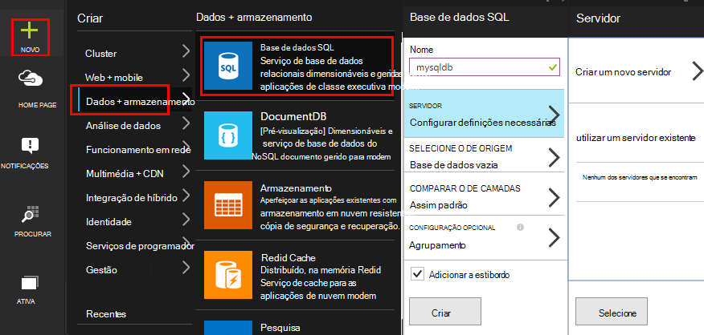

Certifique-se de que o servidor de base de dados permite o acesso aos serviços Azure:

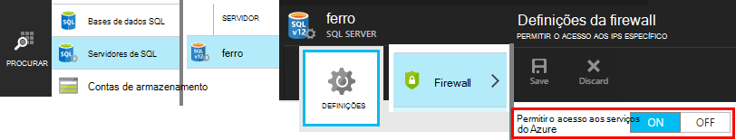

## Criar uma função de trabalho 

Agora pelo última podemos pode escrever [algum código](https://sesitai.codeplex.com/) para analisar JSON nas blobs exportados e criar os registos na base de dados. Uma vez que o arquivo de exportação e a base de dados são ambos no Azure, podemos vai executar o código de uma função de trabalho Azure.

Este código extrai automaticamente qualquer propriedades estão presentes na JSON. Para obter descrições das propriedades, consulte o artigo [Exportar modelo de dados](app-insights-export-data-model.md).

#### Criar projeto de função de trabalho

No Visual Studio, crie um novo projeto para a função de trabalho:

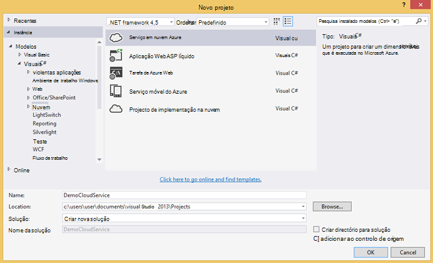

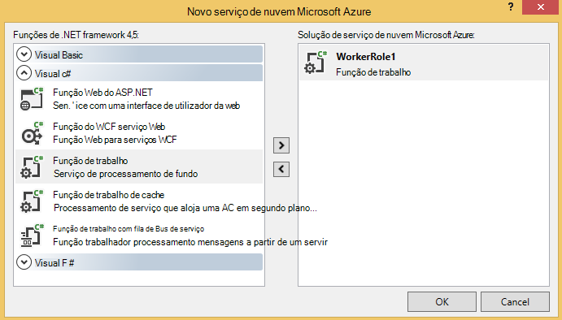

#### Ligar para a conta de armazenamento

No Azure, obtém a cadeia de ligação da sua conta de armazenamento:

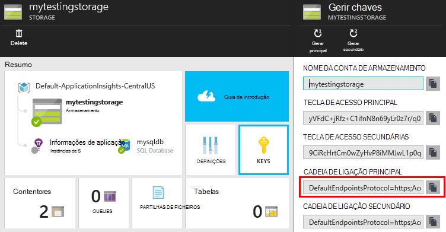

No Visual Studio, configure as definições de função de trabalho com a cadeia de ligação de conta de armazenamento:

#### Pacotes

No Explorador de solução, com o botão direito do projeto de função de trabalho e selecione gerir pacotes de NuGet.
Procurar e instalar estes pacotes: 

 * EntityFramework 6.1.2 ou mais tarde - vamos utilizar este para gerar o esquema da tabela BD no momento, com base no conteúdo de JSON no blob.
 * JsonFx - iremos utilizar este para atenuamento JSON para propriedades de classe c#.

Utilize esta ferramenta para gerar c# classe reduzir o nosso documento JSON único. Requer algumas alterações secundárias como atenuamento matrizes JSON numa única c# propriedade ativar única coluna na tabela DB (ex. urlData_port) 

 * [Gerador de classe JSON c#](http://jsonclassgenerator.codeplex.com/)

## Código 

Pode incluir este código numa `WorkerRole.cs`.

#### Importar ficheiros

    using Microsoft.WindowsAzure.Storage;

    using Microsoft.WindowsAzure.Storage.Blob;

#### Obter a cadeia de ligação de armazenamento

    private static string GetConnectionString()
    {
      return Microsoft.WindowsAzure.CloudConfigurationManager.GetSetting("StorageConnectionString");
    }

#### Executar o trabalhador a intervalos regulares

Substituir o método de executar existente e selecione o intervalo que preferir. Deverá ser pelo menos uma hora, porque a funcionalidade de exportação conclui um objeto JSON numa hora.

    public override void Run()
    {
      Trace.TraceInformation("WorkerRole1 is running");

      while (true)
      {
        Trace.WriteLine("Sleeping", "Information");

        Thread.Sleep(86400000); //86400000=24 hours //1 hour=3600000
                
        Trace.WriteLine("Awake", "Information");

        ImportBlobtoDB();
      }
    }

#### Inserir cada objeto JSON como uma linha de tabela

    public void ImportBlobtoDB()
    {
      try
      {
        CloudStorageAccount account = CloudStorageAccount.Parse(GetConnectionString());

        var blobClient = account.CreateCloudBlobClient();
        var container = blobClient.GetContainerReference(FilterContainer);

        foreach (CloudBlobDirectory directory in container.ListBlobs())//Parent directory
        {
          foreach (CloudBlobDirectory subDirectory in directory.ListBlobs())//PageViewPerformance
          {
            foreach (CloudBlobDirectory dir in subDirectory.ListBlobs())//2015-01-31
            {
              foreach (CloudBlobDirectory subdir in dir.ListBlobs())//22
              {
                foreach (IListBlobItem item in subdir.ListBlobs())//3IAwm6u3-0.blob
                {
                  itemname = item.Uri.ToString();
                  ParseEachBlob(container, item);
                  AuditBlob(container, directory, subDirectory, dir, subdir, item);
                } //item loop
              } //subdir loop
            } //dir loop
          } //subDirectory loop
        } //directory loop
      }
      catch (Exception ex)
      {
        //handle exception
      }
    }

#### Analisar cada blob

    private void ParseEachBlob(CloudBlobContainer container, IListBlobItem item)
    {
      try
      {
        var blob = container.GetBlockBlobReference(item.Parent.Prefix + item.Uri.Segments.Last());
    
        string json;
    
        using (var memoryStream = new MemoryStream())
        {
          blob.DownloadToStream(memoryStream);
          json = System.Text.Encoding.UTF8.GetString(memoryStream.ToArray());
    
          IEnumerable<string> entities = json.Split('\n').Where(s => !string.IsNullOrWhiteSpace(s));
    
          recCount = entities.Count();
          failureCount = 0; //resetting failure count
    
          foreach (var entity in entities)
          {
            var reader = new JsonFx.Json.JsonReader();
            dynamic output = reader.Read(entity);
    
            Dictionary<string, object> dict = new Dictionary<string, object>();
    
            GenerateDictionary((System.Dynamic.ExpandoObject)output, dict, "");
    
            switch (FilterType)
            {
              case "PageViewPerformance":
    
              if (dict.ContainsKey("clientPerformance"))
                {
                  GenerateDictionary(((System.Dynamic.ExpandoObject[])dict["clientPerformance"])[0], dict, "");
                }
    
              if (dict.ContainsKey("context_custom_dimensions"))
              {
                if (dict["context_custom_dimensions"].GetType() == typeof(System.Dynamic.ExpandoObject[]))
                {
                  GenerateDictionary(((System.Dynamic.ExpandoObject[])dict["context_custom_dimensions"])[0], dict, "");
                }
              }
    
            PageViewPerformance objPageViewPerformance = (PageViewPerformance)GetObject(dict);
    
            try
            {
              using (var db = new TelemetryContext())
              {
                db.PageViewPerformanceContext.Add(objPageViewPerformance);
                db.SaveChanges();
              }
            }
            catch (Exception ex)
            {
              failureCount++;
            }
            break;
    
            default:
            break;
          }
        }
      }
    }
    catch (Exception ex)
    {
      //handle exception 
    }
    }

#### Preparar um dicionário para cada documento JSON

    private void GenerateDictionary(System.Dynamic.ExpandoObject output, Dictionary<string, object> dict, string parent)
        {
            try
            {
                foreach (var v in output)
                {
                    string key = parent + v.Key;
                    object o = v.Value;

                    if (o.GetType() == typeof(System.Dynamic.ExpandoObject))
                    {
                        GenerateDictionary((System.Dynamic.ExpandoObject)o, dict, key + "_");
                    }
                    else
                    {
                        if (!dict.ContainsKey(key))
                        {
                            dict.Add(key, o);
                        }
                    }
                }
            }
            catch (Exception ex)
            {
            //handle exception 
            }
        }

#### Converter o documento JSON para c# classe telemetria propriedades do objeto

     public object GetObject(IDictionary<string, object> d)
        {
            PropertyInfo[] props = null;
            object res = null;

            try
            {
                switch (FilterType)
                {
                    case "PageViewPerformance":

                        props = typeof(PageViewPerformance).GetProperties();
                        res = Activator.CreateInstance<PageViewPerformance>();
                        break;

                    default:
                        break;
                }

                for (int i = 0; i < props.Length; i++)
                {
                    if (props[i].CanWrite && d.ContainsKey(props[i].Name))
                    {
                        props[i].SetValue(res, d[props[i].Name], null);
                    }
                }
            }
            catch (Exception ex)
            {
            //handle exception 
            }

            return res;
        }

#### Ficheiro de classe PageViewPerformance gerado reduzir o documento JSON

    public class PageViewPerformance
    {
        [DatabaseGenerated(DatabaseGeneratedOption.Identity)]
        public Guid Id { get; set; }

        public string url { get; set; }

        public int urlData_port { get; set; }

        public string urlData_protocol { get; set; }

        public string urlData_host { get; set; }

        public string urlData_base { get; set; }

        public string urlData_hashTag { get; set; }

        public double total_value { get; set; }

        public double networkConnection_value { get; set; }

        public double sendRequest_value { get; set; }

        public double receiveRequest_value { get; set; }

        public double clientProcess_value { get; set; }

        public string name { get; set; }

        public string internal_data_id { get; set; }

        public string internal_data_documentVersion { get; set; }

        public DateTime? context_data_eventTime { get; set; }

        public string context_device_id { get; set; }

        public string context_device_type { get; set; }

        public string context_device_os { get; set; }

        public string context_device_osVersion { get; set; }

        public string context_device_locale { get; set; }

        public string context_device_userAgent { get; set; }

        public string context_device_browser { get; set; }

        public string context_device_browserVersion { get; set; }

        public string context_device_screenResolution_value { get; set; }

        public string context_user_anonId { get; set; }

        public string context_user_anonAcquisitionDate { get; set; }

        public string context_user_authAcquisitionDate { get; set; }

        public string context_user_accountAcquisitionDate { get; set; }

        public string context_session_id { get; set; }

        public bool context_session_isFirst { get; set; }

        public string context_operation_id { get; set; }

        public double context_location_point_lat { get; set; }

        public double context_location_point_lon { get; set; }

        public string context_location_clientip { get; set; }

        public string context_location_continent { get; set; }

        public string context_location_country { get; set; }

        public string context_location_province { get; set; }

        public string context_location_city { get; set; }
    }

#### DBcontext para interação SQL pelo entidade Framework

    public class TelemetryContext : DbContext
    {
        public DbSet<PageViewPerformance> PageViewPerformanceContext { get; set; }
        public TelemetryContext()
            : base("name=TelemetryContext")
        {
        }
    }

Adicionar a sua cadeia de ligação DB com nome `TelemetryContext` no `app.config`.

## Esquema (informações apenas)

Este é o esquema para a tabela que será gerada para vista de página do.

> [AZURE.NOTE] Não tem de executar este script. Os atributos na JSON determinam as colunas na tabela.

    CREATE TABLE [dbo].[PageViewPerformances](
    [Id] [uniqueidentifier] NOT NULL,
    [url] [nvarchar](max) NULL,
    [urlData_port] [int] NOT NULL,
    [urlData_protocol] [nvarchar](max) NULL,
    [urlData_host] [nvarchar](max) NULL,
    [urlData_base] [nvarchar](max) NULL,
    [urlData_hashTag] [nvarchar](max) NULL,
    [total_value] [float] NOT NULL,
    [networkConnection_value] [float] NOT NULL,
    [sendRequest_value] [float] NOT NULL,
    [receiveRequest_value] [float] NOT NULL,
    [clientProcess_value] [float] NOT NULL,
    [name] [nvarchar](max) NULL,
    [User] [nvarchar](max) NULL,
    [internal_data_id] [nvarchar](max) NULL,
    [internal_data_documentVersion] [nvarchar](max) NULL,
    [context_data_eventTime] [datetime] NULL,
    [context_device_id] [nvarchar](max) NULL,
    [context_device_type] [nvarchar](max) NULL,
    [context_device_os] [nvarchar](max) NULL,
    [context_device_osVersion] [nvarchar](max) NULL,
    [context_device_locale] [nvarchar](max) NULL,
    [context_device_userAgent] [nvarchar](max) NULL,
    [context_device_browser] [nvarchar](max) NULL,
    [context_device_browserVersion] [nvarchar](max) NULL,
    [context_device_screenResolution_value] [nvarchar](max) NULL,
    [context_user_anonId] [nvarchar](max) NULL,
    [context_user_anonAcquisitionDate] [nvarchar](max) NULL,
    [context_user_authAcquisitionDate] [nvarchar](max) NULL,
    [context_user_accountAcquisitionDate] [nvarchar](max) NULL,
    [context_session_id] [nvarchar](max) NULL,
    [context_session_isFirst] [bit] NOT NULL,
    [context_operation_id] [nvarchar](max) NULL,
    [context_location_point_lat] [float] NOT NULL,
    [context_location_point_lon] [float] NOT NULL,
    [context_location_clientip] [nvarchar](max) NULL,
    [context_location_continent] [nvarchar](max) NULL,
    [context_location_country] [nvarchar](max) NULL,
    [context_location_province] [nvarchar](max) NULL,
    [context_location_city] [nvarchar](max) NULL,
    CONSTRAINT [PK_dbo.PageViewPerformances] PRIMARY KEY CLUSTERED 
    (
     [Id] ASC
    )WITH (PAD_INDEX = OFF, STATISTICS_NORECOMPUTE = OFF, IGNORE_DUP_KEY = OFF, ALLOW_ROW_LOCKS = ON, ALLOW_PAGE_LOCKS = ON) ON [PRIMARY]
    ) ON [PRIMARY] TEXTIMAGE_ON [PRIMARY]

    GO

    ALTER TABLE [dbo].[PageViewPerformances] ADD  DEFAULT (newsequentialid()) FOR [Id]
    GO

Para ver este exemplo em ação, [Transfira](https://sesitai.codeplex.com/) o código de trabalho completo, altere o `app.config` definições e publicar a função de trabalho no Azure.

## Artigos relacionados

* [Exportar para o SQL utilizando uma função de trabalho](app-insights-code-sample-export-telemetry-sql-database.md)
* [Exportar contínua na aplicação informações](app-insights-export-telemetry.md)
* [Informações de aplicação](https://azure.microsoft.com/services/application-insights/)
* [Exportar o modelo de dados](app-insights-export-data-model.md)
* [Obter mais exemplos e tutoriais](app-insights-code-samples.md)

<!--Link references-->

[diagnostic]: app-insights-diagnostic-search.md
[export]: app-insights-export-telemetry.md
[metrics]: app-insights-metrics-explorer.md
[portal]: http://portal.azure.com/
[start]: app-insights-overview.md

 
