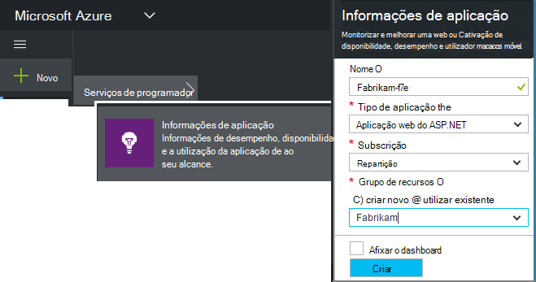
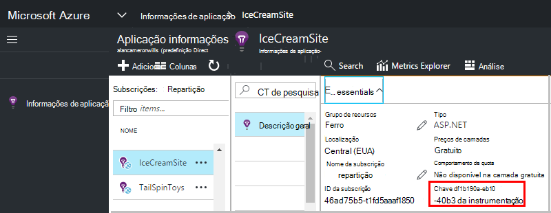

<properties 
    pageTitle="Criar um novo recurso de informações da aplicação | Microsoft Azure" 
    description="Configure o informações de aplicação de monitorização para uma nova aplicação direto. Abordagem baseada na Web." 
    services="application-insights" 
    documentationCenter=""
    authors="alancameronwills" 
    manager="douge"/>

<tags 
    ms.service="application-insights" 
    ms.workload="tbd" 
    ms.tgt_pltfrm="ibiza" 
    ms.devlang="na" 
    ms.topic="article" 
    ms.date="08/26/2016" 
    ms.author="awills"/>

# Criar um recurso de informações de aplicação

Informações de aplicação do Visual Studio apresenta dados sobre a aplicação de uma Microsoft Azure um *recurso*. Criar um novo recurso, por conseguinte, faz parte de [configuração da aplicação de informações para monitorizar a uma nova aplicação][start]. Em muitos casos, pode fazê-lo automaticamente pelo IDE e que é o caminho recomendado onde está disponível. Mas em alguns casos, criar um recurso manualmente.

Depois de ter criado o recurso, obter a sua chave de instrumentação e utilizá-la para configurar o SDK na aplicação. Isto envia de telemetria para o recurso.

## Inscrever-se para a Microsoft Azure

Se ainda não tem uma conta [Microsoft de conta, obter uma agora](http://live.com). (Se utilizar serviços como o Outlook.com, OneDrive, Windows Phone ou XBox Live, já tiver uma conta Microsoft.)

Também terá de uma subscrição do [Microsoft Azure](http://azure.com). Se a sua equipa ou a organização tiver uma subscrição do Azure, o proprietário pode adicionar ao-lo, utilizando o seu Windows Live ID.

Ou pode criar uma nova subscrição. A conta gratuita permite-lhe tente tudo no Azure. Depois de expira o período de avaliação, poderá encontrar a subscrição repartição apropriado, tal como é não cobrado gratuitamente serviços. 

Quando já tem acesso a uma subscrição, início de sessão para informações de aplicação no [http://portal.azure.com](https://portal.azure.com)e utilizar o seu ID Live para o início de sessão.

## Criar um recurso de informações de aplicação
  

No [portal.azure.com](https://portal.azure.com), adicione um recurso de informações da aplicação:

* **Tipo de aplicação** afeta que vê no pá a descrição geral e as propriedades disponíveis no [Explorador do métrica][metrics]. Se não vir o tipo de aplicação, selecione ASP.NET.
* **Grupo de recursos** é uma conveniência para gerir propriedades de como o controlo de acesso. Se já tiver criado outros recursos Azure, pode optar por colocar este novo recurso no mesmo grupo.
* **Subscrição** é a sua conta de pagamento no Azure.
* **Localização** é onde podemos manter os seus dados. Atualmente-não pode ser alterado.
* **Adicionar aos startboard** coloca um mosaico de acesso rápido para o seu recurso na sua página base Azure. Recomendado.

Quando a sua aplicação ter sido criada, é aberta uma nova pá. É onde irá ver dados de utilização e desempenho sobre a sua aplicação. 

Para obter anterior ao mesmo da próxima vez iniciar sessão no Azure, procure do mosaico de guia da sua aplicação a área de início (ecrã principal). Ou clique em Procurar para localizá-lo.

## Copiar a chave de instrumentação

A chave de instrumentação identifica o recurso que criou. Terá de-lo para dar o SDK do.

## Instalar o SDK na sua aplicação

Instale as aplicação de informações SDK na sua aplicação. Este passo fortemente depende do tipo da sua aplicação. 

Utilize a tecla instrumentação para configurar [o SDK que pretende instalar a aplicação][start].

O SDK inclui módulos padrão que enviar telemetria sem ter de escrever qualquer código. Para controlar ações do utilizador ou diagnosticar problemas relacionados com mais detalhe, [utilizar a API] [ api] para enviar o seu próprio telemetria.

## Ver dados de telemetria

Feche o pá guia de introdução para regressar ao seu pá de aplicação no portal do Azure.

Clique no mosaico de pesquisa para ver a [Pesquisa diagnóstico][diagnostic], onde os eventos primeiros irão aparecer. 

Clique em Atualizar depois de aguardar alguns segundos se está à espera de mais dados.

## Criar automaticamente um recurso

Pode escrever um [PowerShell script](app-insights-powershell-script-create-resource.md) para criar automaticamente um recurso.

## Próximos passos

* [Criar um dashboard](app-insights-dashboards.md)
* [Pesquisa de diagnóstico](app-insights-diagnostic-search.md)
* [Explorar métricas](app-insights-metrics-explorer.md)
* [Escrever a análise de consultas](app-insights-analytics.md)

<!--Link references-->

[api]: app-insights-api-custom-events-metrics.md
[diagnostic]: app-insights-diagnostic-search.md
[metrics]: app-insights-metrics-explorer.md
[start]: app-insights-overview.md

 