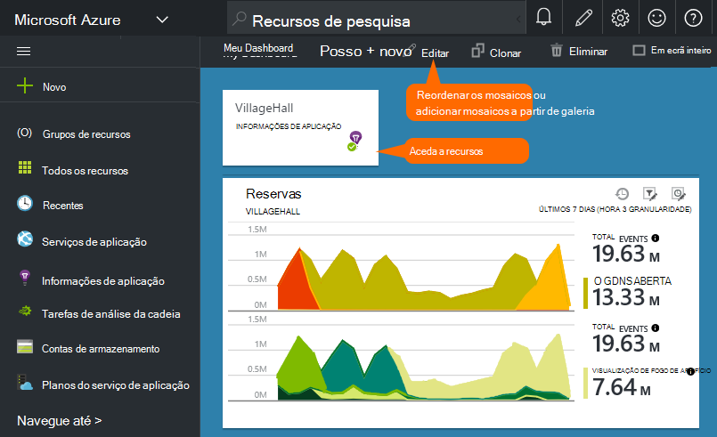

<properties
    pageTitle="Os dashboards e navegação no portal do aplicação informações | Microsoft Azure"
    description="Crie vistas dos seus gráficos APM chaves e consultas."
    services="application-insights"
    documentationCenter=""
    authors="alancameronwills"
    manager="douge"/>

<tags
    ms.service="application-insights"
    ms.workload="tbd"
    ms.tgt_pltfrm="ibiza"
    ms.devlang="multiple"
    ms.topic="article" 
    ms.date="10/18/2016"
    ms.author="awills"/>

# Navegação e Dashboards no portal do informações de aplicação

Depois de [Configurar a aplicação de informações no projeto](app-insights-overview.md), serão apresentados os dados de telemetria sobre a sua aplicação desempenho e a utilização de um recurso de aplicação informações do seu projeto no [portal do Azure](https://portal.azure.com).

## Localizar o seu telemetria

Inicie sessão no [portal do Azure](https://portal.azure.com) e navegue para o recurso de informações da aplicação que criou para a sua aplicação.

O separador descrição geral (página) para a sua aplicação apresenta um resumo de métricas de diagnóstico chave da sua aplicação e é um gateway para as outras funcionalidades do portal.

Pode personalizar qualquer um dos outros gráficos e afixá-los a um dashboard. Desta forma, pode trazer consigo em conjunto os gráficos chaves a partir de diferentes aplicações.

## Dashboards

A primeira coisa que consulte depois de iniciar sessão [portal do Microsoft Azure](https://portal.azure.com) é um dashboard. Aqui pode reunir os gráficos que são mais importantes para si através de todos os recursos Azure, incluindo telemetria a partir do [Visual Studio aplicação informações](app-insights-overview.md).
 

1. **Navegar para recursos específicos** , como a sua aplicação na aplicação de informações: utilizar a barra para a esquerda.
2. **Regresse ao dashboard do atual**ou mudar para outras vistas recentes: Utilize o menu pendente na parte superior para a esquerda.
3. **Dashboards mudar**: Utilize o menu pendente no título do dashboard
4. **Criar, editar e partilhar dashboards** na barra de ferramentas de dashboard.
5. **Editar o dashboard**: Paire o cursor sobre um mosaico e, em seguida, utilize o respetiva barra superior para mover, personalizar ou removê-la.

## Adicionar a um dashboard

Quando estiver à procura numa pá ou conjunto de gráficos que é particularmente interessante, pode afixar uma cópia do mesmo ao dashboard. Irá vê-los próxima vez que não existem devolvido.

1. Gráfico de afixar ao dashboard. Uma cópia do gráfico é apresentado no dashboard.
2. Afixar o pá toda a dashboard - é apresentado no dashboard de como um mosaico que pode clicar.
3. Clique em canto superior esquerdo para regressar ao dashboard de atual. Em seguida, pode utilizar o menu pendente para regressar à vista atual.

Repare que os gráficos estão agrupados em mosaicos: um mosaico pode conter mais do que um gráfico. Afixe o mosaico todo a dashboard.

### Afixar qualquer consulta no Analytics

Também pode [Afixar Analytics](app-insights-analytics-using.md#pin-to-dashboard) gráficos a um dashboard [partilhada](#share-dashboards-with-your-team) . Esta opção permite-lhe adicionar gráficos de qualquer consulta arbitrário juntamente com as métricas padrão. (Não existe uma taxa por esta funcionalidade).

## Ajustar um mosaico no dashboard

Assim que um mosaico estiver no dashboard, pode ajustá-lo.

1. Adicione um gráfico para o mosaico. 
2. Defina a métrica, agrupar por dimensão e estilo (tabela, gráfico) de um gráfico.
3. Arraste o diagrama para ampliar; Clique no botão Anular para repor timespan; definir propriedades de filtro para os gráficos no mosaico.
4. Definir o título de mosaico.

Os mosaicos afixados de pás explorer métrica têm mais opções de edição que os mosaicos afixados a partir de uma pá de descrição geral.

O mosaico original que afixados não é afetado pelas edições.

## Alternar entre os dashboards

Pode guardar mais do que um dashboard e alternar entre eles. Quando afixa um gráfico ou pá, são adicionados ao dashboard atual.

Por exemplo, poderá ter um dashboard para apresentar em ecrã inteiro na sala de equipa e outro para desenvolvimento geral.

No dashboard de uma pá aparece como um mosaico: clique na mesma para ir para o pá. Um gráfico replica o gráfico na sua localização original.

## Partilhar dashboards

Quando tiver criado um dashboard, pode partilhá-lo com outros utilizadores.

Saiba mais sobre [funções e controlo de acesso](app-insights-resources-roles-access-control.md).

## Navegação de aplicação

O separador descrição geral é o gateway para obter mais informações sobre a sua aplicação.

* **Qualquer gráfico ou mosaico** - clique em qualquer dispor em mosaico ou de gráfico para ver mais detalhes sobre o que é apresentado.

### Botões de pá de descrição geral

* [**Métricas Explorer**](app-insights-metrics-explorer.md) - criar o seus próprio gráficos de desempenho e a utilização.
* [**Pesquisa**](app-insights-diagnostic-search.md) - investigar instâncias específicas da eventos tal como pedidos de exceções, ou rastreios de registo.
* [**Análise**](app-insights-analytics.md) - consultas poderosas ao longo do seu telemetria.
* **Intervalo de tempo** - ajustar o intervalo apresentado por todos os gráficos na pá.
* **Eliminar** - eliminar o recurso de informações de aplicação para esta aplicação. Deve também quer remover os pacotes de informações de aplicação a partir do código de aplicação, ou edite a [chave de instrumentação](app-insights-create-new-resource.md#copy-the-instrumentation-key) na sua aplicação para direcionar telemetria para um recurso de informações da aplicação diferente.

### Separador Essentials

* [Tecla de instrumentação](app-insights-create-new-resource.md#copy-the-instrumentation-key) - identifica este recurso de aplicação. 
* Preços - tornar funcionalidades maiúsculas volume definido e disponível.

### Barra de navegação de aplicação

* **Descrição geral** - ENTER para a pá de descrição geral de aplicação.
* **Registo de atividade** - alertas e eventos administrativos Azure.
* [**Controlo de acesso**](app-insights-resources-roles-access-control.md) - fornecer acesso aos membros de equipa e outras pessoas.
* [**Etiquetas**](../resource-group-using-tags.md) - utilizar etiquetas para agrupar a sua aplicação com outras pessoas.

INVESTIGAR

* Derivado de [**mapa de aplicação**](app-insights-app-map.md) - ativo mapa que mostra os componentes da sua aplicação das informações de dependência.
* [**Diagnósticos pro-activos**](app-insights-proactive-diagnostics.md) - alertas de desempenho recentes rever.
* [**Fluxo direto**](app-insights-metrics-explorer.md#live-stream) - um conjunto de métricas de perto instantâneas, útil quando implementar uma nova compilação de fixo ou depuração.
* [**Disponibilidade / Web testes**](app-insights-monitor-web-app-availability.md) -enviar pedidos normais para a sua aplicação web à volta a world.* 
* [**Falhas de desempenho**](app-insights-web-monitor-performance.md) - exceções, taxas de falha e tempos de resposta para pedidos para a sua aplicação de e para pedidos da sua aplicação [dependências](app-insights-asp-net-dependencies.md).
* [**Desempenho**](app-insights-web-monitor-performance.md) - tempo de resposta, os tempos de resposta de dependência. 
* [Servidores](app-insights-web-monitor-performance.md) - contadores de desempenho. Disponível se [instalar o Monitor de estado](app-insights-monitor-performance-live-website-now.md).

* **Browser** - vista de página e o desempenho de AJAX. Disponível se o [instrumento as suas páginas web](app-insights-javascript.md).
* **A utilização** - vista de página, utilizador e sessão de conta. Disponível se o [instrumento as suas páginas web](app-insights-javascript.md).

CONFIGURAR

* **Introdução** - inline tutorial.
* **Propriedades** - chave instrumentação, subscrição e id do recurso.
* [Alertas](app-insights-alerts.md) - métrica configuração de alerta.
* [Exportar contínua](app-insights-export-telemetry.md) - configurar exportação de telemetria ao armazenamento Azure.
* [Testes de desempenho](app-insights-monitor-web-app-availability.md#performance-tests) - configurar uma carga síntese no seu Web site.
* [Quota de preços](app-insights-pricing.md) e [amostragem ingestão](app-insights-sampling.md).
* **Acesso à API** - criar [solte anotações](app-insights-annotations.md) e para a API de acesso de dados.
* [**Trabalhar itens**](app-insights-diagnostic-search.md#create-work-item) - ligar a uma sistema de controlo para que possa criar erros enquanto da inspeção de telemetria de trabalho.

DEFINIÇÕES

* [**Bloqueios**](..\resource-group-lock-resources.md) - bloquear recursos Azure
* [**Script de automatização**](app-insights-powershell.md) - exportar uma definição do Azure recurso para que possam utilizar como um modelo para criar novos recursos.

SUPORTE

* **Pedido de suporte** - requer uma subscrição paga. Consulte também o artigo [obter ajuda](app-insights-get-dev-support.md).

## O que se segue?

||
|---|---
|[Explorador de métricas](app-insights-metrics-explorer.md) Métricas de filtro e segmento|
|[Pesquisa diagnóstico](app-insights-diagnostic-search.md) Localizar e inspecionar eventos, eventos relacionados e criar erros |
|[Análise](app-insights-analytics.md) Linguagem de consulta avançada| 

