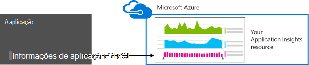
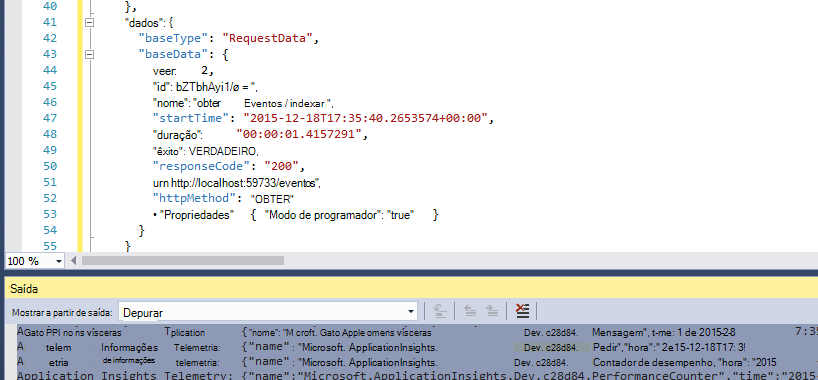
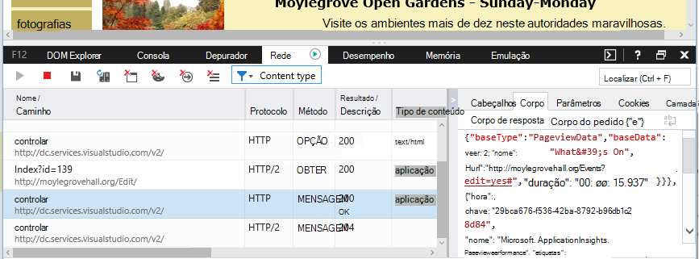

<properties 
    pageTitle="Retenção de dados e o armazenamento no informações de aplicação" 
    description="Declaração da política de retenção e privacidade" 
    services="application-insights" 
    documentationCenter=""
    authors="alancameronwills" 
    manager="douge"/>

<tags 
    ms.service="application-insights" 
    ms.workload="tbd" 
    ms.tgt_pltfrm="ibiza" 
    ms.devlang="na" 
    ms.topic="article" 
    ms.date="05/17/2016" 
    ms.author="awills"/>

# Recolha de dados, retenção e armazenamento em informações de aplicação 

*Informações de aplicação está na pré-visualização.*

Quando instala o [Visual Studio aplicação informações] [ start] SDK na sua aplicação, envia telemetria sobre a sua aplicação para a nuvem. Naturalmente, os programadores responsáveis querer saber exatamente que dados são enviados, o que acontece aos dados e como eles podem manter o controlo do mesmo. Em particular, dados confidenciais podem ser enviados, onde está armazenado e como seguro é? 

Em primeiro lugar, a resposta breve:

* Os módulos de telemetria padrão que são executadas "fora da caixa de" estão pouco enviar dados sensíveis a maiúsculas e para o serviço. A telemetria está interessada com carga, métricas de desempenho e a utilização, relatórios de exceção e outros dados de diagnóstico. Os dados de utilizador principal visíveis nos relatórios de diagnóstico são URLs; mas a aplicação em qualquer caso não deva colocar dados sensíveis a maiúsculas e em texto simples num URL.
* Pode escrever código que envia adicional telemetria personalizada para o ajudar com de diagnóstico e a utilização de monitorização. (Desta possibilidade de expansão é uma funcionalidade de informações da aplicação excelente.) Seria possível, por engano, para escrever este código para que inclui pessoais e outros dados confidenciais. Se a sua aplicação funciona com esses dados, deve ser aplicada processos de revisão segura para todos os códigos de que escreve.
* Enquanto desenvolver e testar a sua aplicação, é fácil inspecionar o que está a ser enviado pelo SDK. Os dados aparecem nas janelas de saída depuração do IDE e browser. 
* Os dados são mantidos nos servidores [Do Microsoft Azure](http://azure.com) nos EUA. (Mas a aplicação pode executar qualquer lugar.) Azure tem [forte segurança processa e cumpre uma vasta gama de padrões de conformidade](https://azure.microsoft.com/support/trust-center/). Apenas o utilizador e a equipa designada têm acesso aos seus dados. Pessoal da Microsoft pode ter acesso restrito-lhe apenas em determinadas circunstâncias limitadas com o seu conhecimento. São encriptado quando estão em trânsito, apesar de não nos servidores.

Os restantes deste artigo mais totalmente estabelece nestas respostas. Tem concebido para ser autónomo, para que pode mostrá-lo para colegas que não fazem parte da sua equipa de imediata.

## O que é a aplicação informações?

[Informações de aplicação do Visual Studio] [ start] é um serviço fornecido pela Microsoft que o ajuda a melhorar o desempenho e eficácia da sua aplicação direto. Monitoriza a sua aplicação sempre estiver em execução, durante o ensaio e depois de ter publicado ou implementado-lo. Informações de aplicação cria gráficos e tabelas que mostram-lhe, por exemplo, o que horas do dia obtém a maioria dos utilizadores, como responder a aplicação está e quão bem é servido por quaisquer serviços externos, que depende. Se existirem falhar, falhas ou problemas de desempenho, que pode pesquisar através de dados de telemetria em detalhe para diagnosticar a causa. E o serviço irá enviar-lhe mensagens de correio eletrónico se não existirem quaisquer alterações na disponibilidade e o desempenho da sua aplicação.

Para poder aceder esta funcionalidade, instale um SDK de informações da aplicação na sua aplicação, que torna-se parte do respectivo código. Quando a aplicação estiver em execução, o SDK monitoriza o funcionamento e envia telemetria para o serviço de informações da aplicação. Este é um serviço na nuvem alojado pelo [Microsoft Azure](http://azure.com). (Mas funciona a aplicação informações para todas as aplicações, não apenas os que estão alojados no Azure).

O serviço de informações da aplicação armazena e analisa de telemetria. Para ver a análise ou procurar através de telemetria armazenada, inicie sessão na sua conta Azure e abra o recurso de informações de aplicação para a sua aplicação. Também pode partilhar acesso aos dados com outros membros da sua equipa ou com subscritores do Azure especificados.

Pode ter dados exportados a partir do serviço de informações da aplicação, por exemplo para uma base de dados ou para ferramentas externas. Fornecer cada ferramenta com uma chave especial que obtêm a partir do serviço. A chave pode ser revogada se for necessário. 

SDK de informações da aplicação estão disponível para um intervalo de tipos de aplicação: alojados no seus próprio J2EE ou ASP.NET servidores ou no Azure; de serviços web os clientes - Web ou seja, o código a executar numa página web; aplicações de ambiente de trabalho e serviços; dispositivo aplicações como o Windows Phone, iOS e Android. Todos os enviarem telemetria para o mesmo serviço.

## Quais os dados recolhe?

### Como é os dados é recolhidas?

Existem três origens de dados:

* O SDK, que integrar com a sua aplicação [no desenvolvimento](app-insights-asp-net.md) ou [em tempo de execução](app-insights-monitor-performance-live-website-now.md). Existem diferentes SDK para tipos diferentes de aplicação. Também existe uma [SDK para páginas web](app-insights-javascript.md), que carrega no browser do utilizador final juntamente com a página.

 * Cada SDK tem um número de [módulos](app-insights-configuration-with-applicationinsights-config.md), que utilizar técnicas diferentes para recolher diferentes tipos de telemetria.
 * Se instalar o SDK no desenvolvimento, pode utilizar o seu API para enviar o seu próprio telemetria, para além de módulos padrão. Este telemetria personalizada pode incluir qualquer dados que pretende enviar.
* Em alguns servidores web, também existem agentes que são executadas juntamente com a aplicação e enviar telemetria sobre CPU, memória e forma de exploração de rede. Por exemplo, Azure VMs, anfitriões Docker e [J2EE servidores](app-insights-java-agent.md) podem ter esses agentes.
* [Testes de disponibilidade](app-insights-monitor-web-app-availability.md) são processos executados pela Microsoft que enviar pedidos para a sua aplicação web regulares. Os resultados são enviados para o serviço de informações da aplicação.

### Que tipos de dados são recolhidos?

As categorias principais são:

* [Telemetria de servidor web](app-insights-asp-net.md) - pedidos de HTTP.  URI, tempo despendido para processar o pedido, o código de resposta, o endereço IP do cliente. Id da sessão.
* [Páginas Web](app-insights-javascript.md) - página, o utilizador e sessão de conta. Tempos de carregamento da página. Exceções. Chamadas de AJAX.
* Desempenho contadores - memória, CPU, IO, forma de exploração de rede.
* Cliente e servidor contexto - OS, região, tipo de dispositivo, browser, resolução de ecrã.
* [Exceções](app-insights-asp-net-exceptions.md) e falhas - **pilha regista**, construa id, tipo de CPU. 
* [Dependências](app-insights-asp-net-dependencies.md) - chamadas para serviços externos, como o resto, SQL, AJAX. Cadeia de ligação ou URI, duração, sucesso, comando.
* [Testes de disponibilidade](app-insights-monitor-web-app-availability.md) - duração de teste e passos, as respostas.
* [Rastreio registos de início](app-insights-search-diagnostic-logs.md) e de [telemetria personalizada](app-insights-api-custom-events-metrics.md) - **nada código para as suas registos ou telemetria**.

[Mais detalhadamente](#data-sent-by-application-insights).

## Como posso verificar o que está a ser recolhido?

Se está a desenvolver a aplicação utilizando o Visual Studio, execute a aplicação no modo de depuração (F5). A telemetria é apresentada na janela de saída. A partir daqui, pode copiá-la e formatá-la como JSON para fácil inspeção. 

Também existe uma vista mais legível na janela de diagnóstico.

Para páginas web, abra a janela de depuração do seu browser.

### Pode escrever código para filtrar a telemetria antes de ter sido enviada?

Isto seria possível ao escrever um [processador de telemetria Plug-in](app-insights-api-filtering-sampling.md).

## Quanto tempo são os dados mantidos? 

Pontos de dados não processados (ou seja, os itens que pode inspecionar na pesquisa diagnóstico) são mantidos durante 7 dias. Se precisar de manter os dados mais longa que, pode utilizar [Exportar contínua](app-insights-export-telemetry.md) para copiá-lo a uma conta de armazenamento.

Dados agregados (ou seja, contagens, médias e outros dados estatísticos que vê no Explorador de métrica) são mantidos na grão de 1 minuto para 30 dias, e 1 hora ou 1 dia (dependendo do tipo), pelo menos, 90 dias.

## Quem pode aceder aos dados?

Os dados estão visíveis para si e, se tiver uma conta de organização, os membros da sua equipa. 

Pode ser exportado pelo utilizador e os membros da sua equipa e poderia ser copiado para outras localizações e passada para outras pessoas.

#### O que faz Microsoft com as informações na que minha aplicação envia para informações de aplicação?

A Microsoft utiliza os dados, apenas para fornecer o serviço para si.

## Onde são mantidos os dados? 

* Nos EUA. 

#### Pode-ser armazenado num local que outra, por exemplo na Europa? 

* Não momento. 

#### Isso significa que minha aplicação tem de estar alojada nos EUA?

* Não. A aplicação pode executar qualquer lugar, no seus próprio anfitriões no local ou na nuvem.

## Como seguros estão os meus dados?  

Informações de aplicação é um serviço de Azure na pré-visualização. Enquanto na pré-visualização estamos a trabalhar no sentido de proteger os seus dados pelas políticas que foram descritos no [Azure segurança, privacidade e conformidade técnico](http://go.microsoft.com/fwlink/?linkid=392408).

Os dados são armazenados nos servidores do Microsoft Azure. Para contas no Portal do Azure, as restrições de conta são descritas no [documento Azure segurança, privacidade e conformidade](http://go.microsoft.com/fwlink/?linkid=392408). Para contas no Portal de serviços de equipa Visual Studio, aplica-se o documento do [Visual Studio equipa dados a proteção dos serviços](http://download.microsoft.com/download/8/E/E/8EE6A61C-44C2-4F81-B870-A267F1DF978C/MicrosoftVisualStudioOnlineDataProtection.pdf) . 

Acesso aos seus dados pelo pessoal da Microsoft é restrito. Vamos aceder aos dados apenas com a sua permissão e se é necessário suportar a utilização de informações da aplicação. 

Dados no agregado através de aplicações dos todos os nossos clientes (como as taxas de dados e tamanho médio dos seus rastreios) são utilizados para melhorar a aplicação de informações.

#### Telemetria de outra pessoa pode interferir com os meus dados de informações da aplicação?

Foi enviam telemetria adicional à sua conta ao utilizar a chave de instrumentação, que pode ser encontrada no código das suas páginas web. Com o suficiente dados adicionais, seu métricas seriam não representar correctamente desempenho e a utilização da sua aplicação.

Se partilhar código com outros projetos, lembre-se remover a chave de instrumentação.

## Os dados são encriptados? 

Não no interior os servidores de apresentar.

Todos os dados são encriptados e move-se entre centros de dados.

#### Os dados são encriptados quando estão em trânsito da minha aplicação para os servidores de informações da aplicação?

Sim, utilizamos https para enviar dados para o portal a partir de quase todos os SDK, incluindo servidores web, dispositivos e páginas de web HTTPS. A única exceção é dados enviados a partir de páginas de web HTTP simples. 

## Informação identificativa

#### Pessoalmente identificáveis informações (PII) podem ser enviado para informações de aplicação? 

Sim, é possível. 

Como obter informações gerais:

* Telemetria mais padrão (ou seja, telemetria enviada sem que escrever qualquer código) não inclui PII explícito. No entanto, poderá ser possível identificar pessoas por inferência de uma coleção de eventos.
* Exceção e rastreio de mensagens poderiam conter PII
* Personalizado telemetria - ou seja, chamadas como TrackEvent que escrever código utilizar as API ou registo rastreios - pode conter quaisquer dados que escolher.

A tabela no final deste documento contém mais detalhadas descrições dos dados recolhidos.

#### Sou responsável por respeitar leis e regulamentos no que diz respeito PII?

Sim. É da sua responsabilidade para se certificar de que a recolha e utilização dos dados está em conformidade com leis e regulamentos e com os termos do Microsoft Online Services.

Deve informar os seus clientes corretamente acerca dos dados que da aplicação recolhe e como os dados são utilizados.

#### Os meus utilizadores desativar informações de aplicação?

Não é diretamente. Não é fornecida um parâmetro de que os utilizadores podem funcionar para desativar as informações de aplicação.

No entanto, pode implementar como uma funcionalidade na sua aplicação. Todos os dos SDK incluem uma definição de API que desativa a coleção de telemetria. 

#### Minha aplicação está a recolher inadvertidamente informações confidenciais. Informações de aplicação apagar estes dados para que não é retida?

Informações de aplicação não filtrar ou eliminar os seus dados. Deve gerir os dados corretamente e evitar enviar desses dados para informações de aplicação.

## Dados que foi enviados por informações de aplicação

Os SDK variam entre plataformas e não existem são vários componentes que pode instalar. (Referir-se a [aplicação informações - introdução ao][start].) Cada componente envia dados diferentes.

#### Classes dos dados enviados em cenários diferentes

A ação  | Classes dados recolhidas (consulte a tabela seguinte)
---|---
[Adicionar aplicação SDK de informações a um projeto de web do .NET][greenbrown] | ServerContext Inferida Contadores de desempenho Pedidos de **Exceções** Sessão utilizadores
[Instalar o Monitor de estado no IIS][redfield]|Dependências ServerContext Inferida Contadores de desempenho
[Adicionar aplicação informações SDK para uma aplicação web do Java][java]|ServerContext Inferida Pedido Sessão utilizadores
[Adicionar JavaScript SDK a página web][client]|ClientContext  Inferida Página ClientPerf AJAX
[Definir propriedades predefinidas][apiproperties]|**Propriedades** em todos os eventos padrão e personalizadas
[TrackMetric de chamada][api]|Valores numéricos **Propriedades**
[Faixa de chamada *][api]|Nome do evento **Propriedades**
[TrackException de chamada][api]|**Exceções** Informação de pilha **Propriedades**
SDK não é possível recolher dados. Por exemplo:   -Não é possível aceder contadores de desempenho  -exceção no inicializador de telemetria | Diagnósticos SDK
 

Para [SDK para outras plataformas][platforms], ver os seus documentos.

#### As classes de dados recolhidos

Dados recolhidos classe | Inclui (não uma lista exaustiva) 
---|---
**Propriedades**|**Quaisquer dados - determinados pelo seu código**
DeviceContext |ID, IP, região, modelo de dispositivo, rede, tipo de rede, nome OEM, resolução de ecrã, função instância, o nome da função, o tipo de dispositivo
ClientContext |Sistema operativo, região, idioma, rede e resolução da janela
Sessão | id de sessão
ServerContext |Nome do computador, região, SO, dispositivo, sessão de utilizador, contexto de utilizador, operação 
Inferida |localização de geo a partir do endereço IP, data/hora, o sistema operativo, browser
Métricas | Métrica nome e o valor
Eventos | Nome do evento e valor
PageViews | Nome de URL e a página ou o nome do ecrã
Desempenho do cliente | Nome de URL/página, o tempo de carregamento do browser
AJAX | Chamadas HTTP de uma página web ao servidor
Pedidos de |URL, duração, código de resposta
Dependências|Tipo (SQL, HTTP,...), a cadeia de ligação ou URI, sincronização/assíncrona, duração, sucesso, instrução SQL (com o Monitor de estado)
**Exceções** | Tipo, **mensagem**, pilhas de chamadas, número de linhas e ficheiro de origem, o id de tópico
Falha | Id do processo, o id do processo ascendente, o id do tópico de falha de sistema; correção de aplicação, o id, compilação;  tipo de exceção, endereço, motivo; símbolos oculto e registos, endereços binários de início e de fim, nome binário e caminho, tipo de cpu
Rastreio | Nível de **mensagem** e gravidade
Contadores de desempenho | Processador de tempo, memória disponível, velocidade do pedido, taxa exceção, bytes privados processo, taxa IO, duração do pedido, pedir o comprimento de fila de espera
Disponibilidade | Código de resposta de teste de Web, a duração de cada passo de teste, teste nome, data/hora, sucesso, tempo de resposta, localização de teste
Diagnósticos SDK | Mensagem de rastreio ou exceção 

Pode [Mudar desativar alguns dos dados por ApplicationInsights.config edição][config]

## Créditos

Este produto inclui dados GeoLite2 criados por MaxMind, disponível a partir do [http://www.maxmind.com](http://www.maxmind.com).

## Vídeos

#### Introdução

> [AZURE.VIDEO application-insights-introduction]

#### Introdução

> [AZURE.VIDEO getting-started-with-application-insights]

<!--Link references-->

[api]: app-insights-api-custom-events-metrics.md
[apiproperties]: app-insights-api-custom-events-metrics.md#properties
[client]: app-insights-javascript.md
[config]: app-insights-configuration-with-applicationinsights-config.md
[greenbrown]: app-insights-asp-net.md
[java]: app-insights-java-get-started.md
[platforms]: app-insights-platforms.md
[pricing]: http://azure.microsoft.com/pricing/details/application-insights/
[redfield]: app-insights-monitor-performance-live-website-now.md
[start]: app-insights-overview.md

 