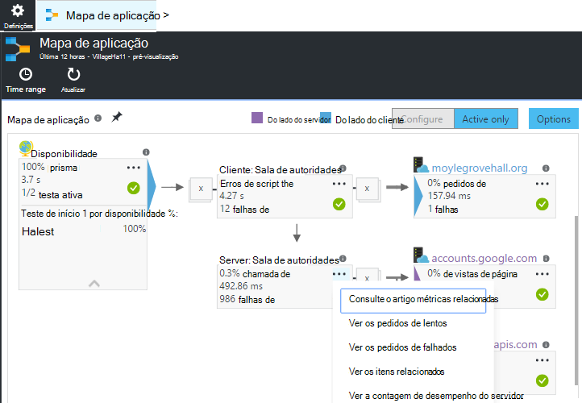
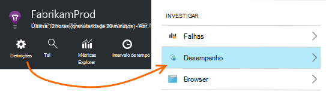
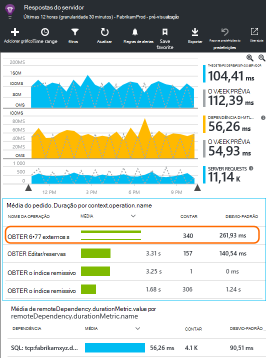
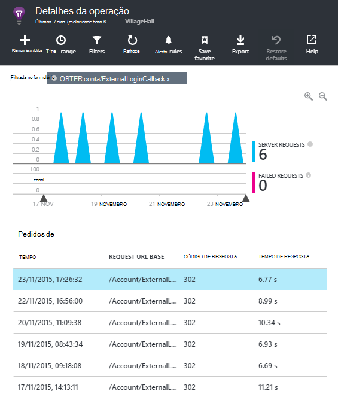
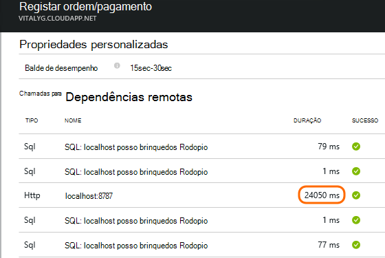
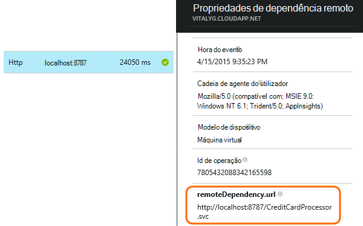
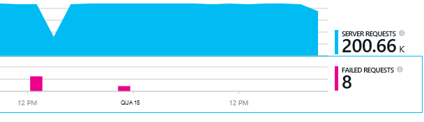
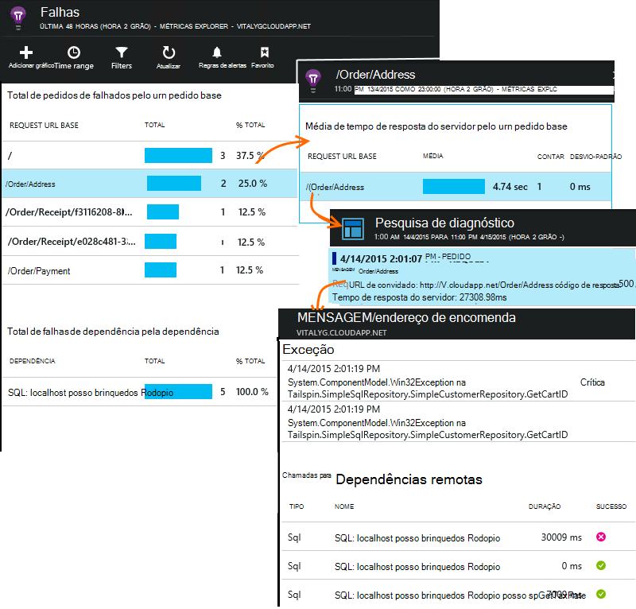

<properties 
    pageTitle="Diagnosticar problemas com as dependências de informações de aplicação" 
    description="Localizar falhas e um desempenho lento causados pela dependências" 
    services="application-insights" 
    documentationCenter=""
    authors="alancameronwills" 
    manager="douge"/>

<tags 
    ms.service="application-insights" 
    ms.workload="tbd" 
    ms.tgt_pltfrm="ibiza" 
    ms.devlang="na" 
    ms.topic="article" 
    ms.date="05/12/2016" 
    ms.author="awills"/>
 
# <a name="diagnosing-issues-with-dependencies-in-application-insights"></a>Diagnosticar problemas com as dependências de informações de aplicação


Uma *dependência* é um componente externo identificado pela sua aplicação. Normalmente, é um serviço denominado com HTTP, ou uma base de dados ou com um sistema de ficheiros. Ou na sua página web script, pode ser uma chamada de AJAX novamente para o servidor. Em informações de aplicação do Visual Studio, pode ver facilmente quanto tempo sua aplicação aguarda dependências e com que frequência uma chamada de dependência falha.

## <a name="where-you-can-use-it"></a>Onde pode utilizá-lo

Terminar a caixa de monitorização de dependência está atualmente disponível para:

* Aplicações web do ASP.NET e serviços em execução num servidor IIS ou no Azure
* [Java web apps](app-insights-java-agent.md)
* [Páginas Web](https://azure.microsoft.com/blog/ajax-collection-in-application-insights/)

Para outros tipos, tais como as aplicações do dispositivo, pode escrever o seu próprio monitor de utilizar a [TrackDependency API](app-insights-api-custom-events-metrics.md#track-dependency).

O monitor de dependência out of box atualmente relatórios de chamadas para estes tipos de dependências de:

* ASP.NET
 * Bases de dados SQL
 * Serviços WCF que utilizam enlaces baseado em HTTP e web do ASP.NET
 * Chamadas HTTP locais ou remotos
 * Azure DocumentDb, tabela, armazenamento de BLOBs e fila de espera
* Java
 * Chamadas para uma base de dados através de um controlador [JDBC](http://docs.oracle.com/javase/7/docs/technotes/guides/jdbc/) , tal como MySQL, SQL Server, PostgreSQL ou SQLite.
* Páginas Web
 * [Chamadas de AJAX](app-insights-javascript.md)

Novamente, poderia escrever o seus próprio chamadas SDK para monitorizar a outras dependências.

## <a name="to-set-up-dependency-monitoring"></a>Para configurar a monitorização de dependência

Instale o agente adequado para o servidor de anfitrião.

Plataforma | Instalar
---|---
Servidor do IIS | Quer [instalar o Monitor de estado no servidor](app-insights-monitor-performance-live-website-now.md) ou [atualizar a sua aplicação para .NET framework 4.6 ou posterior](http://go.microsoft.com/fwlink/?LinkId=528259) e instale o [SDK de informações da aplicação](app-insights-asp-net.md) na sua aplicação.
Azure Web App | [Extensão de informações da aplicação](app-insights-azure-web-apps.md)
Servidor de web Java | [Java web apps](app-insights-java-agent.md)
Páginas Web | [JavaScript monitor](app-insights-javascript.md) (Sem configuração adicional para além de monitorização da página web)
Serviço em nuvem Azure |  [Tarefa de arranque de utilização](app-insights-cloudservices.md#dependencies) ou [instalar o .NET framework 4.6 +](../cloud-services/cloud-services-dotnet-install-dotnet.md)  

O Monitor de estado para servidores do IIS não é necessário para recriar o seu projeto de origem com o SDK de informações da aplicação. 

## <a name="application-map"></a>Mapa de aplicação

Mapa de aplicação age como ajuda visual para descobrir dependências entre os componentes da sua aplicação. 



A partir de caixas de texto, pode navegar para outros gráficos e dependência relevante.

Clique na pequena [x] para fechar uma subárvore.

Afixe o mapa ao [dashboard](app-insights-dashboards.md), onde será completamente funcional.

[Saiba mais](app-insights-app-map.md).

## <a name="diagnosis"></a>Diagnosticar problemas de desempenho de dependência no servidor web

Para avaliar o desempenho de pedidos de ao seu servidor:



Desloque-se para baixo até olhar sobre a grelha de pedidos de:



A superior que está a demorar muito tempo. Vamos ver se podermos localizar saída onde o tempo despendido a.

Clique nessa linha para ver os eventos pedido individuais:




Clique em qualquer ocorrência de execução longa para inspecioná-lo ainda mais.

> [AZURE.NOTE] Desloque-se para baixo um pouco para escolher uma instância. Latência no pipeline de poderá significa que os dados para as instâncias superiores são incompletos.

Desloque-se para baixo para as chamadas de dependência remoto relacionados com este pedido:



A maior parte do tempo de manutenção que este pedido foi gasto numa chamada para um serviço local-aspeto. 

Selecione nessa linha para obter mais informações:




Os detalhes incluem informações suficientes para diagnosticar o problema.


## <a name="failures"></a>Falhas

Se existirem pedidos de falhados, clique no gráfico.



Clique em através de um tipo de pedido e a instância do pedido, para localizar uma falha na chamada para uma dependência remota.





## <a name="custom-dependency-tracking"></a>Controlo de dependência personalizada

O módulo padrão do controlo de dependência Deteta automaticamente dependências externas, tais como bases de dados e os REST APIs. Mas, poderá querer alguns componentes adicionais para ser tratadas da mesma forma. 

Pode escrever código que envia informações de dependência, utilizando a mesma [TrackDependency API](app-insights-api-custom-events-metrics.md#track-dependency) que é utilizado pelo módulos padrão.

Por exemplo, se criar o seu código com uma assemblagem que não tenha escrito si mesmo, pode registar o tempo todas as chamadas para o mesmo, para saber que contribuição faz com que os tempos de resposta. Para que este dados apresentados nos gráficos de dependência no informações de aplicação, envie-a utilizando `TrackDependency`.

```C#

            var success = false;
            var startTime = DateTime.UtcNow;
            var timer = System.Diagnostics.Stopwatch.StartNew();
            try
            {
                success = dependency.Call();
            }
            finally
            {
                timer.Stop();
                telemetry.TrackDependency("myDependency", "myCall", startTime, timer.Elapsed, success);
            }
```

Se pretender alternar desativar o módulo do controlo de dependência padrão, remova a referência a DependencyTrackingTelemetryModule no [ApplicationInsights.config](app-insights-configuration-with-applicationinsights-config.md).


## <a name="ajax"></a>AJAX

Ver [páginas Web](app-insights-javascript.md).


 