<properties
    pageTitle="Detetar, fazer uma triagem, diagnosticar"
    description="Analisar falhas e detetar e diagnosticar problemas de desempenho nas suas aplicações"
    authors="alancameronwills"
    services="application-insights"
    documentationCenter=""
    manager="douge"/>

<tags
    ms.service="application-insights"
    ms.workload="tbd"
    ms.tgt_pltfrm="ibiza"
    ms.devlang="na"
    ms.topic="article" 
    ms.date="11/06/2015"
    ms.author="awills"/>

# Detetar, fazer uma triagem e diagnosticar com informações de aplicação

*Informações de aplicação está na pré-visualização.*

Aplicação informações ajuda-o a descobre como está a executar a aplicação e a ser utilizado quando esta for direto. E se existir um problema, permite-lhe saber sobre, ajuda-o a avaliar o impacto e ajuda a determinar a causa.

Eis uma conta a partir de uma equipa que desenvolva aplicações web:

* *"Algumas dias, podemos implementado uma correcção 'secundária'. Vamos não executar uma fase de teste abrangentes, mas Infelizmente alguma alteração inesperada tem fundida com a carga útil, a causar incompatibilidade entre o frente e termina anterior. Imediatamente, exceções servidor surged, os nossos alerta chama e foram foram efetuadas conhecimento da situação. Alguns cliques fora do escritório no portal de informações da aplicação, podemos tem informações suficientes, a partir de exceção callstacks para limitar o problema. Vamos revertida imediatamente e limitado de danos. Informações de aplicação fez esta parte do devops ciclo muito simples e acionáveis."*

Vamos ver como uma equipa de desenvolvimento web típica utiliza a aplicação informações para monitorizar o desempenho. Vamos terá de seguir a equipa no banco de Fabrikam desenvolva o sistema de banca online (OBS).

A equipa trabalha um ciclo da seguinte forma:

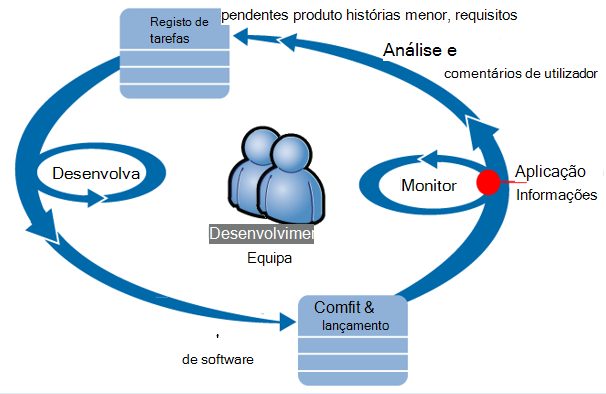

Requisitos de feed para os respetivos desenvolvimento registo de tarefas pendentes (lista de tarefas). Resumindo trabalham sprints, que muitas vezes entregar trabalho software - normalmente sob a forma de melhorias e extensões de para a aplicação existente. A aplicação em direto com frequência será atualizada com as novas funcionalidades. Enquanto a mesma estiver direto, a equipa monitoriza-lo para o desempenho e a utilização com a ajuda de informações da aplicação. Esta análise feeds novamente no respetivo registo de tarefas pendentes desenvolvimento.

A equipa utiliza as informações de aplicação para monitorizar a aplicação web ao vivo intimamente para:
* Desempenho. Pretendem compreender como os tempos de resposta variam com contagem pedido; quanto CPU, rede, disco e outros recursos estão a ser utilizados; e onde estão os congestionamentos.
* Falhas. Se existirem exceções ou falhou pedidos, ou se vai um contador de desempenho fora da sua gama à vontade com, a equipa precisa de saber rapidamente, para que podem pegar em ação.
* Utilização. Sempre que for disponibilizada uma nova funcionalidade, a equipa de querer saber em que medida é utilizada e, se os utilizadores têm quaisquer dificuldades com o mesmo.

Vamos concentrar-na parte de comentários do ciclo de:

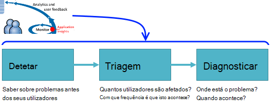

## Detetar fraca disponibilidade

Marcela Markova é um programador sénior da equipa OBS e leva-o até as oportunidades potenciais na monitorizar o desempenho do online. Posteriormente, configura várias [testes web][availability]:

* Um teste único URL para a página de destino principal para a aplicação, http://fabrikambank.com/onlinebanking/. Posteriormente, conjuntos de critérios de código de HTTP 200 e texto 'Bem-vindo'!. Se este teste falhar, há algo seriamente problema de rede ou os servidores ou talvez um problema de implementação. (Ou outra pessoa tiver sido alterado bem-vindo! mensagem na página sem permitindo que os respetivos sabem.)

* Mais aprofundado com várias passo teste, qual inicia sessão e recebe uma conta corrente listar, dar alguns detalhes chave em cada página. Este teste verifica se a ligação à base de dados contas está a funcionar. Posteriormente, utiliza um id de cliente fictícios: alguns dos mesmos são mantidas para fins de teste.

Com estes testes configurar, Marcela é certeza de que a equipa rapidamente ficará a saber sobre qualquer falha.  

Falhas aparecem como pontos a vermelho no gráfico de teste web:

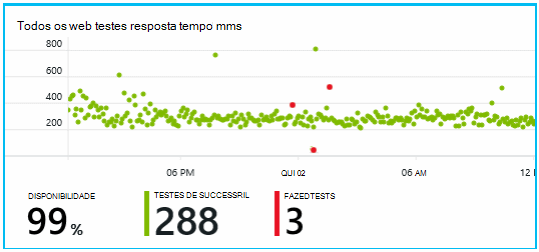

Mas ainda mais importante, um alerta sobre qualquer falha irá receber uma mensagem para a equipa de desenvolvimento. Desta forma, eles sabem acerca do mesmo antes de quase todos os clientes.

## Métricas de desempenho do monitor

Na página Descrição geral em informações de aplicação, é um gráfico que mostra uma variedade de [métricas chave][perf].

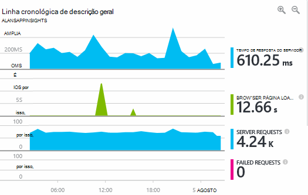

Tempo de carregamento de página do browser é derivado de telemetria enviada diretamente a partir do páginas web. Tempo de resposta do servidor, contagem de pedido de servidor e contar pedido falhado são todas medidas no servidor web e enviadas para informações de aplicação a partir daí.

Marcela é ligeiramente preocupem com no grafo de resposta do servidor, que mostra o tempo médio entre quando o servidor recebe um pedido de HTTP a partir do browser de um utilizador e, quando devolve a resposta. Não está invulgar ver uma variação neste gráfico, tal como varia de carregamento do sistema. Mas, neste caso, parece haver que uma correlação entre subidas pequenas na contagem de pedidos de e grande aumenta o tempo de resposta. Que pode indicar que o sistema está a funcionar apenas na suas limites. 

Posteriormente, abre os gráficos de servidores:

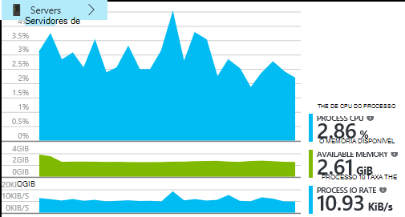

Parece haver sem sinal de limitação de recursos, talvez que isentos nos gráficos de resposta do servidor são apenas uma coincidência.

## Alertas

No entanto, posteriormente, optar por atento os tempos de resposta. Se acederem demasiado altos, pretende saber acerca do mesmo imediatamente.

Para que, posteriormente, define um [alertas][metrics], para tempos de resposta maiores do que um determinado limiar típico. Isto dá-respetivos confiança que ela vai saber acerca do mesmo se forem lentos tempos de resposta.

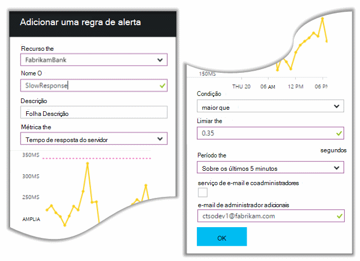

Alertas podem ser definidos numa grande variedade de outras métricas. Por exemplo, pode receber mensagens de correio eletrónico se a contagem de exceção torna-se alto ou a memória disponível vai baixa ou se existir um pico nos pedidos de cliente.

## Alertas de diagnóstico pro-activos

Dia seguinte, um alerta de e-mail chegam são enviadas a partir de informações da aplicação. Mas quando ela abre, localiza she não está o alerta de tempo de resposta que definiu. Em vez disso,-mostra-lhe tenha havido um aumento repentina sobre pedidos falhados - ou seja, pedidos que tenham sido devolvidos códigos de falha de 500 ou mais.

Pedidos de falhados são onde os utilizadores já viu um erro - normalmente seguir uma exceção iniciada no código. Talvez Verão uma mensagem a dizer "Pedimos desculpa podemos não foi possível atualizar os detalhes do seu neste momento" ou, na absoluto embarrassing piores, uma cópia de pilha no ecrã do utilizador, populacionais o servidor web.

Este alerta é uma inesperada, porque a hora da última que pessoa visualizou-lo, a contagem de pedido falhado foi encouragingly baixa. Um pequeno número de insucessos é esperado num servidor ocupado. 

Estava também um pouco de um inesperada para ela porque posteriormente, não tem de configurar este alerta. Na verdade, diagnósticos pro-activos é automaticamente incluído com informações de aplicação. Automaticamente ajustará a sua aplicação padrão de falha habitual e falhas "é utilizado para" numa página específica, ou em caso de carga elevado ou ligados a outros métricas. -Eleva o alarme apenas se existir um aumento acima o que vem esperar.

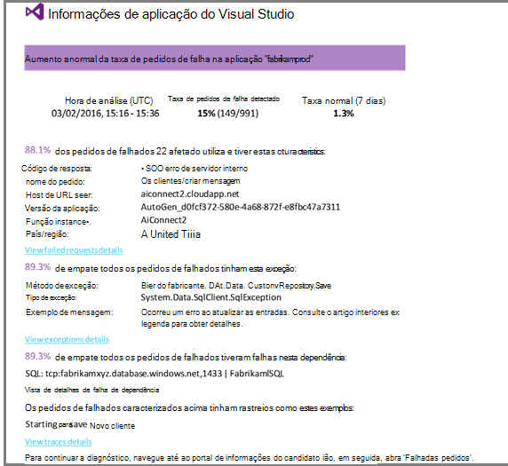

Este é um e-mail muito útil. -Não elevar apenas um alarme; que faz muitas triagem de trabalho de diagnóstico, demasiado.

Mostra como muitos clientes são afetados e que páginas web ou operações. Marcela pode decidir se precisa de obter toda a equipa a trabalhar nisto como uma desagregação fire, ou se pode ser ignorada até semana seguinte.

O e-mail também mostra que um determinado exceção ocorreu e - par mais interessantes - que a falha está associada a falhadas chamadas para uma determinada base de dados. Isto explica por que motivo a falhas apareciam inesperadamente apesar de equipa do Marcela não implementada atualizações recentemente. 

Posteriormente, o ping o coordenador da equipa da base de dados. Sim, estas publicadas um fix quente no passado meia hora; e, talvez pode ter ocorrido uma alteração de esquema secundárias...

Por isso, é o problema sobre a forma como a ser corrigido antes de a investigar registos e dentro de 15 minutos do mesmo decorrente. No entanto, Marcela clica na ligação para abrir a aplicação de informações. Abre-se diretamente para um pedido de falhado e, posteriormente, pode ver a base de dados falhou chamada na lista de chamadas de dependência associada. 

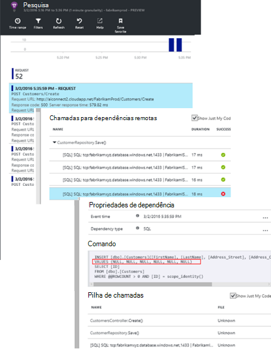

## Detetar exceções

Com um pouco da configuração, [exceções](app-insights-asp-net-exceptions.md) são reportados para informações de aplicação automaticamente. Estes podem também ser capturados explicitamente inserindo as chamadas para [TrackException()](app-insights-api-custom-events-metrics.md#track-exception) no código:  

    var telemetry = new TelemetryClient();
    ...
    try
    { ...
    }
    catch (Exception ex)
    {
       // Set up some properties:
       var properties = new Dictionary <string, string>
         {{"Game", currentGame.Name}};

       var measurements = new Dictionary <string, double>
         {{"Users", currentGame.Users.Count}};

       // Send the exception telemetry:
       telemetry.TrackException(ex, properties, measurements);
    }

A equipa de Fabrikam banco evoluiu a prática do envio sempre telemetria numa exceção, a menos que existe uma recuperação óbvia.  

De facto, é ainda mais abrangente acerca do que a sua estratégia de: enviarem telemetria em todos os casos onde está frustrado em o pretendiam efetuar, se corresponde a uma exceção no código ou não o cliente. Por exemplo, se o sistema de transferência de bancária dependências entre externos devolve uma mensagem "não é possível concluir esta transação", por alguma razão operacional (sem falha do cliente), em seguida, eles controlar esse evento.

    var successCode = AttemptTransfer(transferAmount, ...);
    if (successCode < 0)
    {
       var properties = new Dictionary <string, string>
            {{ "Code", returnCode, ... }};
       var measurements = new Dictionary <string, double>
         {{"Value", transferAmount}};
       telemetry.TrackEvent("transfer failed", properties, measurements);
    }

TrackException é utilizado para reportar exceções, uma vez que esta envie uma cópia da pilha; TrackEvent é utilizado para reportar outros eventos. Pode anexar as propriedades que podem ser úteis em diagnóstico.

Exceções e eventos sejam apresentadas na [Pesquisa diagnóstico] [ diagnostic] pá. Pode agregar nas mesmas para ver as propriedades adicionais e rastreio da pilha.

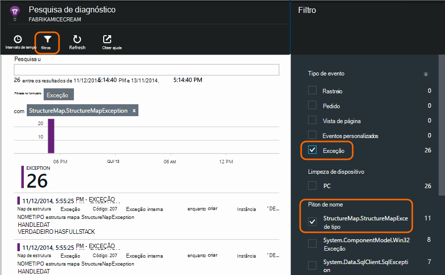

## Monitorizar a atividade de utilizador

Quando tempo de resposta é boa forma consistente e existem algumas exceções, a equipa de Dev Center poderá pensar sobre como melhorar a experiência dos utilizadores e como encorajar mais utilizadores para atingir os objetivos pretendidos.

Por exemplo, uma viagem de utilizador típico através do web site tem um 'funil' Limpar: muitos clientes observe as taxas de diferentes tipos de empréstimo; Algumas páginas preencherem o formulário de aspas; e das pessoas que obter uma citação, algumas prosseguir e tomar saída do empréstimo.

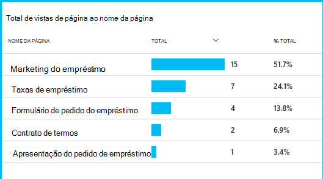

Ponderando onde os números dos clientes maiores largar, pode trabalhar o negócio saída como obter mais utilizadores através de para a parte inferior do funil. Em alguns casos poderá haver uma falha de experiência (UX) do utilizador - por exemplo, o botão 'Seguinte' é difícil localizar ou as instruções não estiverem óbvias. Mais provável, existem mais significativos empresas motivos para detalhes da lista pendente: talvez as taxas de empréstimo são demasiado elevadas.

Independentemente dos motivos, os dados ajuda a equipa a trabalhar saída o que os utilizadores estão a fazer. Mais de controlo de chamadas podem ser inseridas para trabalhar saída mais detalhadamente. TrackEvent() pode ser utilizada para contar as ações de utilizador, a partir de detalhe fino das quando clica nos botões individuais para realizações significativas como o pagamento de um empréstimo.

A equipa é introdução utilizada para ter informações sobre as atividades de utilizador. Hoje em dia, sempre que eles estruturar uma nova funcionalidade, funcionam saída como obterão comentários sobre a sua utilização. Estes estruturar o controlo de chamadas para a funcionalidade a partir do início. Utilizam o comentários para melhorar a funcionalidade de cada ciclo de desenvolvimento.

## Monitorização pro-activos  

Marcela apenas não sentar à volta de aguardar alertas. Mais cedo após cada nova implementação, posteriormente, leva-o até um olhar sobre [tempos de resposta] [ perf] -na figura geral e da tabela dos pedidos mais lentos, bem como contagens de exceção.  

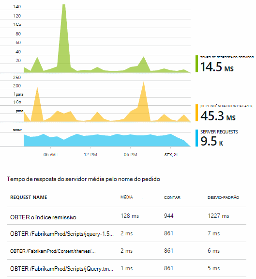

Posteriormente, pode avaliar o efeito de desempenho de cada implementação, normalmente comparar cada semana com o último. Se existir um agravamento repentina sobre, posteriormente, eleva que com os programadores relevantes.

## Triagem

Triagem - avaliar a gravidade e a extensão de um problema - é o primeiro passo após a detecção. Deverá chamamos saída a equipa à meia-noite? Ou pode ser deixada até o intervalo seguinte conveniente do registo de segurança? Existem algumas perguntas chave no triagem.

Quanto decorre? Os gráficos no pá a descrição geral dar ao algumas perspetiva para um problema. Por exemplo, a aplicação Fabrikam gerou quatro alertas de teste de web uma noite. Consultar o gráfico de manhã, a equipa poderia ver que havia facto alguns pontos a vermelho, apesar de continuar a maior parte dos testes foram verde. Explorar no gráfico de disponibilidade, foi limpar que todos estes problemas intermitentes foram a partir de um teste localização. É óbvio que as foi um problema de rede que afetam a rota de apenas uma e provavelmente seria desmarque própria.  

Por outro lado, um aumento dramático e estável no gráfico de vezes que contagens ou resposta exceção é óbvio que as é algo para se preocupe sobre.

Uma táctica triagem útil é experimente-lo manualmente. Se encontrar o mesmo problema, saberá é real.

O que fração de utilizadores são afetados? Para obter uma resposta em bruto, divida a taxa de falha à contagem de sessão.

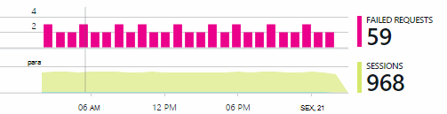

No caso de resposta lenta, compare a tabela de pedidos de mais lenta responder com a frequência de utilização de cada página.

Como importante é o cenário bloqueado? Se este for um problema funcional bloquear uma história de utilizador específico, é importante muito? Se clientes não é possível pagar a suas contas, isto é grave; Se não podem alterar as suas preferências de cor do ecrã, talvez-pode esperar. Os detalhes do evento ou exceção ou a identidade da página lenta, mostra-lhe onde os clientes estão a ter problemas.

## Diagnóstico

Diagnóstico não se adequarem igual depuração. Antes de iniciar o rastreio através do código, que deve ter uma ideia em bruto de porquê, onde e quando o problema está a ocorrer.

**Quando acontece?** A vista histórica fornecida pelos gráficos de eventos e métrica torna mais fácil se ligam efeitos às possíveis causas. Se existirem picos intermitentes na hora ou exceção as taxas de resposta, observe a contagem de pedido: se-picos ao mesmo tempo, em seguida, aspeto de um problema de recursos. É necessário atribuir mais memória ou CPU? Ou é uma dependência de que não pode gerir a carregar?

**Trata-nos?**  Se tiver uma lista pendente repentina sobre no desempenho de um tipo específico de pedido de - por exemplo quando o cliente pretender um extrato de conta -, em seguida, existe a possibilidade de poderá ser uma subsystem externo em vez da aplicação web. No Explorador de métricas de, selecione a taxa de falha de dependência e taxas de duração de dependência e comparar os respetivos históricos ao longo do passado alguns horas ou dias, com o que foi detectado um problema. Se é correlacionar que são as alterações, poderá ser uma subsystem externo a culpa.  

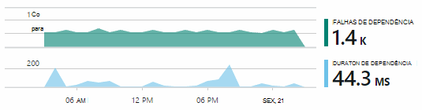

Alguns problemas de dependência lenta são geolocalização problemas. Fabrikam banco utiliza máquinas virtuais Azure e descobertas que tinha inadvertidamente encontrarem o servidor web e servidor de conta no países/regiões diferentes. Uma melhoria dramática ficou por migrar uma delas.

**O que vamos fazer?** Se o problema não parece estar numa dependência, e se não estava selecionado sempre lá, provavelmente é causado por uma alteração recente. A perspetiva histórica fornecida pelos gráficos métrica e evento torna mais fácil quaisquer alterações repentina sobre se ligam às híbridas. Que limita para baixo a pesquisa para o problema.

**O que é o problema??** Alguns problemas ocorrerem só raramente e podem ser difícil controlar testando offline. Tudo o que pode fazer é tentar capturar erro quando ocorre live. Pode inspecionar as informações de estado da pilha em relatórios de exceção. Além disso, pode escrever chamadas rastreio, com o seu registo favorito framework ou com TrackTrace() ou TrackEvent().  

Fabrikam teve um problema intermitente com as transferências de contas dependências entre, mas apenas com determinados tipos de conta. Para compreender melhor o que foi passa, são inseridas TrackTrace() chamadas no pontos-chave no código, como anexar o tipo de conta como uma propriedade a cada chamada. Que facilitou filtrar apenas os rastreios na pesquisa de diagnóstico. Também anexado valores de parâmetros como propriedades e medidas para as chamadas de rastreio.

## Trabalhar com o mesmo

Assim que tiver diagnosticar o problema, pode fazer um plano para corrigi-lo. Talvez precisa recuperar uma alteração recente ou talvez pode simplesmente prosseguir e corrigi-lo. Assim que o fix it terminar, informações de aplicação irá indicar-lhe se foi concluída com êxito.  

Equipa de desenvolvimento do banco Fabrikam demorar uma abordagem mais estruturada para medida de desempenho que utilizado para antes de poderem utilizadas informações de aplicação.

* Estes definiram destinos de desempenho em termos de medidas específicas na página de descrição geral de informações da aplicação.

* Estes estruturar medidas de desempenho para a aplicação a partir do início, tais como as métricas que medem o progresso do utilizador através de 'ampolas'.  

## Utilização

Informações de aplicação podem também ser utilizadas para saber o que fazer utilizadores com uma aplicação. Assim que estiver a executar sem problemas, a equipa gostaria de saber quais são as funcionalidades mais populares, o que os utilizadores por ou tem dificuldade com e com que frequência são voltar atrás. Que irá ajudá-los atribuir prioridades o trabalho futuro. E estes podem planear medir o êxito de cada funcionalidade como parte do ciclo de desenvolvimento. [Ler mais][usage].

## As aplicações

Assim que é como uma equipa utilização informações de aplicação não apenas para resolver problemas individuais, mas para melhorar a sua ciclo de vida do desenvolvimento. Posso Espero-lhe atribuiu algumas ideias sobre como informações de aplicação pode ajudar a melhorar o desempenho do seus próprio aplicações.

## Vídeo

[AZURE.VIDEO performance-monitoring-application-insights]

<!--Link references-->

[api]: app-insights-api-custom-events-metrics.md
[availability]: app-insights-monitor-web-app-availability.md
[diagnostic]: app-insights-diagnostic-search.md
[metrics]: app-insights-metrics-explorer.md
[perf]: app-insights-web-monitor-performance.md
[usage]: app-insights-web-track-usage.md
 
