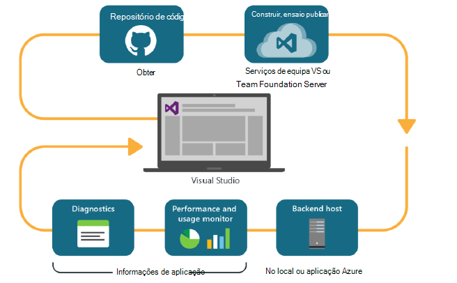
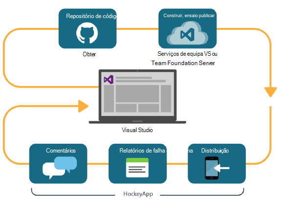

<properties
    pageTitle="Análise de programador"
    description="DevOps com Visual Studio, informações de aplicação e HockeyApp"
    authors="alancameronwills"
    services="application-insights"
    documentationCenter=""
    manager="douge"/>

<tags
    ms.service="application-insights"
    ms.workload="tbd"
    ms.tgt_pltfrm="ibiza"
    ms.devlang="na"
    ms.topic="article" 
    ms.date="05/18/2016"
    ms.author="awills"/>

# Análise de programador com informações de aplicação e HockeyApp

*Informações de aplicação está na pré-visualização.*

Vários projectos de trabalhar com um ciclo [DevOps](https://en.wikipedia.org/wiki/DevOps) rápido. Estes construir e distribuir as suas aplicações, obter comentários sobre como executa e o que os utilizadores fazer com o mesmo e, em seguida, utilizam esse dados de conhecimento para planear ainda mais ciclos de desenvolvimento. 

Para monitorizar a utilização e o desempenho, é importante ter telemetria a partir da aplicação direto e comentários de próprios utilizadores. 

Muitos sistemas foram criados de vários componentes: um serviço web, processadores back-end ou arquivos de dados e software de cliente em execução no browser do utilizador ou como uma aplicação de um telemóvel ou outro dispositivo. Tem de telemetria destes componentes diferentes para serem vistos em conjunto.

Algumas edições tem restringido a distribuição para testes designadas; Temos também organizado flighting (ensaios das novas funcionalidades com audiências restritas) e A | B testes (testa paralela da IU alternativa).

Gerir as distribuições e integração de através de vários componentes de cliente e servidor de monitorização não for uma tarefa comum. Este processo é uma parte essencial da arquitetura da aplicação: Recomendamos não é possível criar um sistema de neste tipo sem um ciclo de desenvolvimento iterativo e boa ferramentas de monitorização.

Neste artigo, abordaremos de como os aspectos monitorização do ciclo de devOps ajustam com as outras partes do processo. 

Se pretender para ver um exemplo específico, existe [um interessante caso prático da Microsoft](http://aka.ms/mydrivingdocs) , que tem vários componentes de cliente e servidor.

## Um ciclo DevOps

Ferramentas Studio e análises de programador visuais oferecem uma experiência integrada bem devOps. Por exemplo, eis um ciclo típico para uma aplicação web (que pode ser Java, Node.js ou ASP.NET):

* Um programador dá entrada para o repositório de código ou intercala ramo principal. O repositório é Git nesta ilustração, mas quatros pode dever- [Controlo de versão do Team Foundation](https://www.visualstudio.com/docs/tfvc/overview).
* As alterações acionam um teste de compilação e unidade. O serviço de compilação pode ser no [Visual Studio Team Services ou o homólogo para no local, Team Foundation Server](https://www.visualstudio.com/docs/vsts-tfs-overview). 
* Uma compilação com êxito e teste de unidade podem [acionar uma implementação automática](https://www.visualstudio.com/docs/release/author-release-definition/more-release-definition). O anfitrião da aplicação web pode ser o seu próprio servidor web ou Microsoft Azure. 
* Telemetria a partir da aplicação direto é enviada para [As informações de aplicação](app-insights-overview.md), tanto a partir do servidor e [dos browsers de cliente](app-insights-javascript.md). Aqui pode analisar o desempenho dos padrões de aplicação e a utilização. Ajuda do poderosas [Ferramentas de pesquisa](app-insights-analytics.md) que diagnosticar problemas. Certifique-se de que a saber sobre um problema assim que surja [alertas](app-insights-alerts.md) . 
* O ciclo de desenvolvimento seguinte é informado por sua análise de telemetria direto.

### Aplicações de ambiente de trabalho e de dispositivo

Para o dispositivo e aplicações de ambiente de trabalho, a parte de distribuição do ciclo de é ligeiramente diferente, porque podemos apenas não estão a carregar para os servidores de um ou dois. Em vez disso, uma compilação com êxito e teste de unidade podem [acionar a carregar para HockeyApp](https://support.hockeyapp.net/kb/third-party-bug-trackers-services-and-webhooks/how-to-use-hockeyapp-with-visual-studio-team-services-vsts-or-team-foundation-server-tfs). HockeyApp controle a distribuição para a sua equipa de utilizadores de teste (ou para o público em geral, se preferir). 

HockeyApp também recolhe informações sobre desempenho e dados de utilização, nos formulários de:

* Comentários do utilizador textuais com capturas de ecrã
* Relatórios de falha de sistema
* Telemetria personalizada codificada por si.

Mais uma vez, o ciclo de devOps está concluído medida que efetua os planos de desenvolvimento futuro tendo em conta o comentários adquirida.

## Configurar a análise de programador

Para cada componente da sua aplicação - móvel ou web ou ambiente de trabalho - os passos são basicamente os mesmos. Para muitos tipos de aplicação, o Visual Studio executa automaticamente alguns destes passos.

1. Adicione o SDK adequado para a sua aplicação. Para as aplicações do dispositivo, é HockeyApp e para os serviços web é informações de aplicação. Cada tem várias variantes para diferentes plataformas. (É também possível utilizar um dos SDK para as aplicações do ambiente de trabalho, apesar de Recomendamos HockeyApp.)
2. Registe-se a sua aplicação com o portal de informações da aplicação ou HockeyApp, consoante o SDK que utilizou. É onde irá ver a análise da sua aplicação do live. Obter uma chave de instrumentação ou ID que configurar para a sua aplicação para que o SDK sabe onde enviar o respetiva telemetria.
3. Adicione código personalizado (se desejar) registo de eventos ou métricas, para ajudá-lo com diagnóstico ou para analisar desempenho ou utilização. Há muitas monitorização integrado, pelo que não necessita de isto no seu primeiro ciclo.
3. Para as aplicações do dispositivo:
 * Carregar uma compilação de depuração para HockeyApp. A partir desse local pode distribuí-la para uma equipa de utilizadores de teste. Sempre que carregar constrói subsequentes, será notificada de equipa.
 * Quando configurar o seu contínua construir serviço, cria uma definição de lançamento que utiliza o plug-in passo para carregar para HockeyApp.

### Exportar para HockeyApp telemetria e de análise

Pode investigar HockeyApp personalizada e inicie sessão utilizando as funcionalidades de exportar contínua e de análise de informações da aplicação ao [Configurar uma bridge](app-insights-hockeyapp-bridge-app.md)de telemetria.

## Próximos passos
 
Seguem-se as instruções detalhadas para diferentes tipos de aplicação:

* [Aplicação web do ASP.NET](app-insights-asp-net.md) 
* [Java web app](app-insights-java-get-started.md)
* [NODE.js web app](https://github.com/Microsoft/ApplicationInsights-node.js)
* [aplicação do iOS](https://support.hockeyapp.net/kb/client-integration-ios-mac-os-x-tvos/hockeyapp-for-ios)
* [Aplicação do Mac OS X](https://support.hockeyapp.net/kb/client-integration-ios-mac-os-x-tvos/hockeyapp-for-mac-os-x)
* [Aplicação para Android](https://support.hockeyapp.net/kb/client-integration-android/hockeyapp-for-android-sdk)
* [Aplicação universal Windows](https://support.hockeyapp.net/kb/client-integration-windows-and-windows-phone/how-to-create-an-app-for-uwp)
* [Aplicação do Windows Phone 8 e 8.1](https://support.hockeyapp.net/kb/client-integration-windows-and-windows-phone/hockeyapp-for-windows-phone-silverlight-apps-80-and-81)
* [Apresentação do Windows Foundation aplicação](https://support.hockeyapp.net/kb/client-integration-windows-and-windows-phone/hockeyapp-for-windows-wpf-apps)

