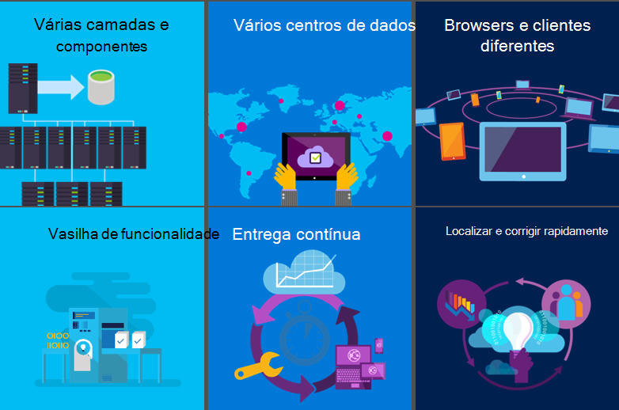
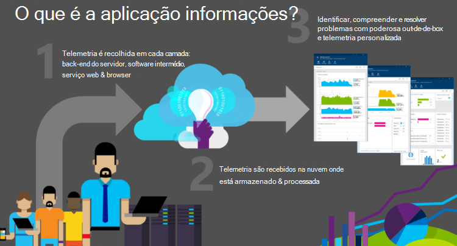
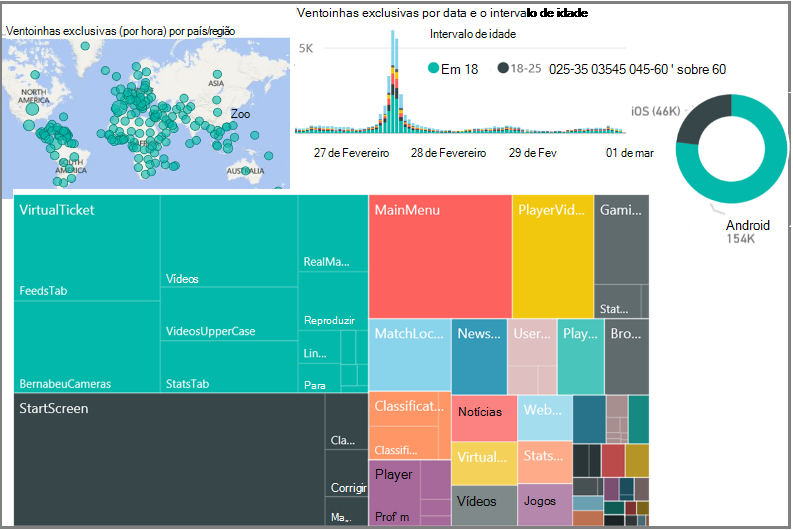
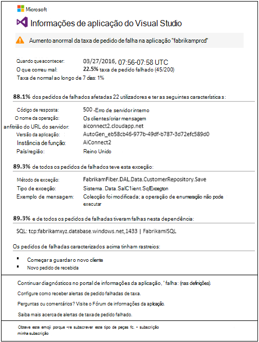
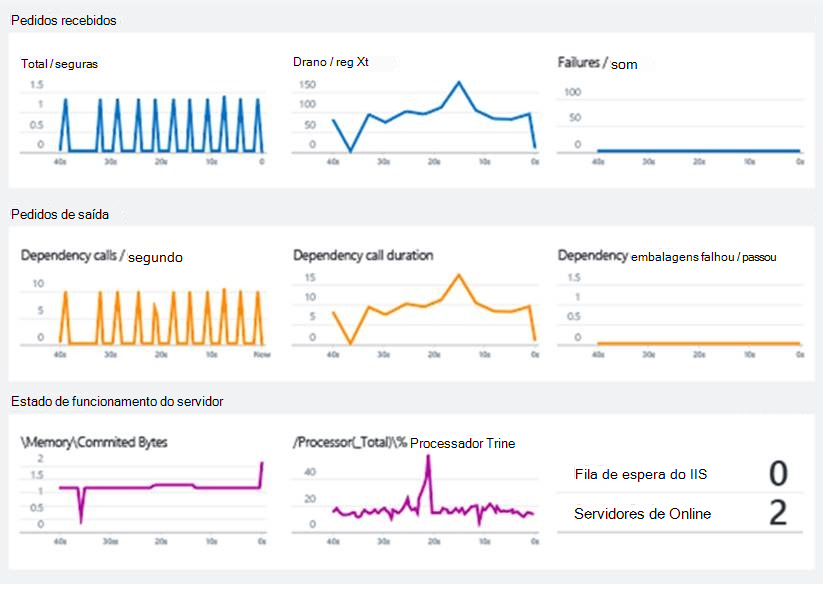
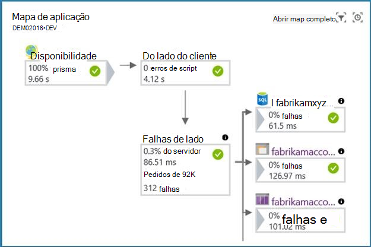
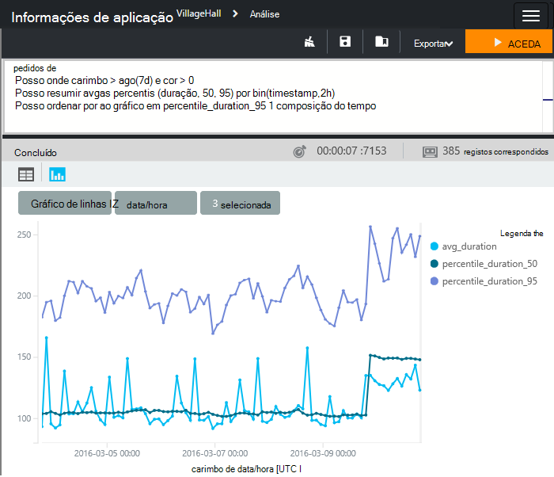
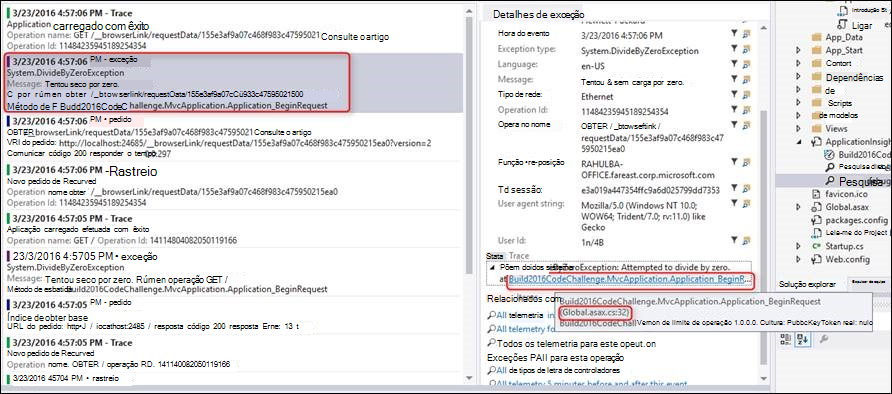
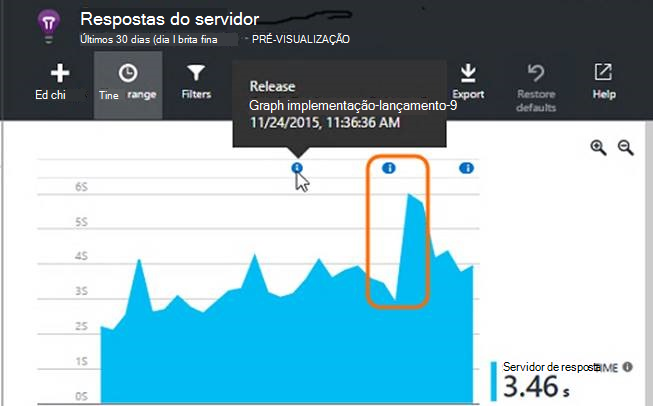

<properties
    pageTitle="Diagnósticos abrangente para aplicações web e serviços com informações de aplicação | Microsoft Azure"
    description="Enquadrar informações de aplicação no ciclo de devOps"
    services="application-insights"
    documentationCenter=""
    authors="alancameronwills"
    manager="douge"/>

<tags
    ms.service="application-insights"
    ms.workload="tbd"
    ms.tgt_pltfrm="ibiza"
    ms.devlang="multiple"
    ms.topic="article" 
    ms.date="08/26/2016"
    ms.author="awills"/>

# Diagnósticos abrangente para aplicações web e serviços com informações de aplicação

## Por que motivo preciso de informações da aplicação?

Informações de aplicação monitoriza a aplicação web em execução. Mostra-lhe sobre falhas e problemas de desempenho e ajuda-o a analisar como clientes utilizam a sua aplicação. Funciona para as aplicações em execução no muitas plataformas (ASP.NET, J2EE, Node.js,...) e estão alojado quer na nuvem ou no local. 

É essencial para monitorizar a uma aplicação moderna enquanto estiver em execução. Mais nenhumas, que pretende detetar falhas antes de fazer a maior parte dos seus clientes. Também querer detetar e corrigir problemas de desempenho que, enquanto não grave, talvez desacelerar coisas ou fazer com que algumas incómodo dos utilizadores aos seus utilizadores. E quando está a executar o sistema para sua satisfação, que pretender saber o que os utilizadores estão a fazer com o mesmo: são estão a utilizar a funcionalidade mais recente? São estes que se seguem com o mesmo?

Aplicações web moderna sejam desenvolvidas num ciclo de entrega contínua: Liberte uma nova funcionalidade ou melhoramento; observar como também funciona para os utilizadores. Planear o incremento seguinte do desenvolvimento com base no que dados de conhecimento. Uma peça de chave do ciclo desta é a fase de observação. Informações de aplicação fornece ferramentas para monitorizar a uma aplicação para o desempenho e a utilização da web.

O aspecto mais importante deste processo é de diagnóstico e diagnóstico. Se a aplicação falhar, em seguida, empresas estão a ser perdidas. A função prime de um quadro monitorização, por isso, é para detectar falhas de forma fiável, notifique imediatamente e para apresentar com as informações necessárias para diagnosticar o problema. Este é exatamente o que faz informações de aplicação.

### Onde erros provenientes?

Falhas nos sistemas de web normalmente surgirem a partir de problemas de configuração de ou incorretas interações entre os respetivos componentes muitos. A primeira tarefa quando lidar com um incidente de site direto é, por conseguinte, identificar locus do problema: quais componente ou relação é o problema?

Alguns dos casos, aqueles com cabelos cinzento, consegue lembrar-se uma ARA mais simples em que um programa de computador executou no computador. Os programadores seriam testá-la cuidadosamente antes do envio; e ter enviado-lo, teria raramente Consulte ou em consideração-lo novamente. Os utilizadores teria que colocar com os erros residuais para muitos anos. 

Estão as coisas tão muito diferentes agora. A aplicação tem um face dos dispositivos diferentes para executar e pode ser difícil garantir o mesmo comportamento exato em cada um deles. Que aloja aplicações na nuvem significa erros que podem ser fixo rapidamente, mas também significa concorrência contínua e a expetativa das novas funcionalidades em intervalos frequentes. 

Nestas condições, a única forma para manter um controlo empresa a contagem de erros é unidade automática testes. Seria impossibilita manualmente volte a testar tudo na cada entrega. Teste de unidade está agora uma parte do processo de compilação conhecida. Ajuda das ferramentas tal como na nuvem de teste Xamarin, fornecendo IU automatizada testes em várias versões de browser. Estes provas podermos Espero que pode ser mantida a taxa de erros que se encontram dentro de uma aplicação para um mínimo.

Aplicações web típica tem vários componentes direto. Para além de cliente (numa aplicação browser ou dispositivo) e o servidor web, é provável que haja ser processamento de back-end substancial. Talvez back-end é uma tubagem dos componentes ou uma coleção de quanto das partes colaborar. E muitos deles não serão o controlo - se que dependem de serviços externos.

Em configurações como estes, pode ser difícil e uneconomical testar ou prever, cada modo de falha possíveis, além no próprio sistema direto. 

### Perguntas...

Algumas perguntas mais frequentes Solicitamos-lhe quando podemos está a desenvolver um sistema de web:

* Está a minha aplicação falhar? 
* O que aconteceu exatamente? -Se tiver falhado um pedido, quiser saber como tem aí. Precisamos um rastreio de eventos...
* É suficientemente rápido a minha aplicação? Quanto tempo demora para responder a pedidos típicos?
* Pode o servidor lidar a carregar? Quando a taxa de pedidos de aumenta, o tempo de resposta mantenha a tecla estável?
* Como responder são meu dependências - API do resto, bases de dados e outros componentes que liga a minha aplicação. Em particular, se o sistema estiver lento, é meu componente ou estou a obter respostas lentas a partir de outra pessoa?
* É a minha aplicação para cima ou para baixo? Pode-visto a partir de todo o mundo? Deixar-me a saber se parar...
* O que é o problema de raiz? Foi a falha na minha componente ou uma dependência? É um problema de comunicações?
* Quantos utilizadores são afetados? Se tiver mais do que um problema para despachar, qual é o mais importantes?

## O que é a aplicação informações?

1. Informações de aplicação instrumentos a sua aplicação e envia telemetria acerca do mesmo, enquanto a aplicação estiver em execução. Ou pode criar o SDK de informações de aplicação para a aplicação ou pode aplicar instrumentação o tempo de execução. O método antigo é mais flexível, tal como pode adicionar a sua própria telemetria para os módulos normais.
2. A telemetria é enviada para o portal de informações da aplicação, onde são armazenada e processada. (Apesar de informações da aplicação está alojada no Microsoft Azure,-pode monitorizar de aplicações web - aplicações não apenas Azure.)
3. A telemetria lhe for apresentada na forma de gráficos e tabelas de eventos.

Existem dois tipos principais de telemetria: instâncias agregadas e não processadas. 

* Dados da instância incluem, por exemplo, um relatório de um pedido de que foi recebido pelo seu web app. Pode encontrar para e inspecionar os detalhes de um pedido de utilizando a ferramenta de pesquisa no portal do informações de aplicação. A instância inclui dados tal como a sua aplicação quanto tempo demorou para responder ao pedido, bem como o URL pedido, aproximação de localização do cliente e outros dados.
* Dados agregados incluem contagens de eventos por unidade de tempo, para que possa comparar a taxa de pedidos com os tempos de resposta. Também inclui médias de métricas como tempos de resposta do pedido.

As categorias de dados principais são:

* Pedidos para a sua aplicação (normalmente, os pedidos HTTP), com os dados no URL, o tempo de resposta e o sucesso ou o fracasso.
* Dependências - resto e SQL chamadas efetuadas pela aplicação, também com URI, tempos de resposta e sucesso
* Exceções, incluindo rastreios.
* Dados vista de página, que provêm de browsers dos utilizadores.
* Métricas como contadores de desempenho, bem como métricas escreve si mesmo. 
* Eventos personalizados que pode utilizar para controlar eventos de empresas
* Inicie sessão rastreios utilizados para depuração.

## Caso prático da Microsoft: Real Madrid F.C.

O serviço web do [Clube de futebol Madrid Real](http://www.realmadrid.com/) serve cerca de 450 milhões ventoinhas em todo o mundo. Ventoinhas aceder à mesma tanto através de browsers e aplicações móveis do clube. Ventoinhas podem não só bilhetes do livro, mas também aceder a informações e clips de vídeo em resultados, leitores e jogos futuros. Pode procurar com os filtros, tais como números de objetivos classificados. Também existem hiperligações para redes sociais. A experiência de utilizador é muito personalizada e destina-se como uma comunicação bidirecional participar ventoinhas.

A solução [é um sistema de serviços e aplicações no Microsoft Azure](https://www.microsoft.com/en-us/enterprise/microsoftcloud/realmadrid.aspx). Escalabilidade é um requisito de chave: tráfego é variável e pode chegar volumes muito alto durante e por volta correspondências.

Para Real Madrid, é crucial para monitorizar o desempenho do sistema. Informações de aplicação do Visual Studio fornece uma vista completa através do sistema, garantindo que um nível de serviço fiável e alto. 

O clube também obtém informações aprofundadas sobre a sua ventoinhas: onde estão (apenas 3% estão em Espanha), que juros que tenham no leitores, históricos resultados e jogos futuros e como de responder para que correspondam às outras.

A maior parte destes dados de telemetria são recolhidas automaticamente com sem código adicionado, o qual simplificado a solução e reduzidas complexidade operacional.  Para Real Madrid, informações de aplicação trata com pontos de telemetria de mil milhões de 3.8 cada mês.

Real Madrid utiliza o módulo do Power BI para ver os respetivos telemetria.

## Deteção inteligente

[Diagnósticos pro-activos](app-insights-proactive-diagnostics.md) é uma funcionalidade recente. Sem qualquer configuração especial por si, informações de aplicação detetar e automaticamente o alerta sobre subidas invulgares nas taxas de falha na sua aplicação. É inteligente o suficiente para ignorar um fundo de falhas ocasionais e também subidas simplesmente proporcionais a um aumento pedidos. Por exemplo, se existir uma falha de uma dos serviços que depende ou se criar a nova que acabou implementado não está a funcionar tão bem, em seguida, saberá acerca do mesmo assim que olha para o seu e-mail. (E existem webhooks para que pode acionar outras aplicações.)

Outro aspecto desta funcionalidade executa uma análise aprofundada diária do seu telemetria, está à procura de invulgares padrões de desempenho que sejam difíceis de descobrir. Por exemplo,-pode encontrar um desempenho lento associado numa zona geográfica específica, ou com uma versão de browser específico.

Em ambos os casos, o alerta não só mostra-lhe os sintomas seja descoberta, mas também lhe dá dados de que necessita para ajudar a diagnosticar o problema, tal como relatórios de exceção relevantes.

Cliente Samtec disse: "durante uma funcionalidade recente migração de transferência, encontrámos uma base de dados em dimensionada que tenha sido atingir os limites de recursos e a causar tempos limite. Alertas de detecção pro-activos veio através de literalmente podemos foram triaging o problema, muito perto em tempo real anunciada. Este alerta à forma com os alertas de plataforma Azure contribuiu-nos quase instantaneamente corrigir o problema. Total de tempo de inatividade < 10 minutos."

## Sequência de métricas de Live

Implementar a compilação mais recente, pode ser uma experiência empenho. Se existirem quaisquer problemas, que pretende saber sobre os mesmos de imediato, para que pode criar uma de segurança se for necessário. Sequência de métricas directo dá-lhe métricas chave com uma latência de cerca de um segundo.

## Mapa de aplicação

Mapa de aplicação de Deteta automaticamente a topologia da aplicação, lançar as informações de desempenho com o mesmo, a permitir-lhe identificar facilmente congestionamentos de desempenho e fluxos problemáticos ao longo do seu ambiente distribuído. Permite-lhe descobrir dependências de aplicação dos serviços do Azure. Pode fazer uma triagem do problema por Noções sobre se é relacionados com o código ou dependência relacionada e a partir de um único local pormenorizar diagnósticos relacionados experiência. Por exemplo, a aplicação poderá estar a falhar devido a degradação do desempenho na camada SQL. Com o mapa de aplicação, pode vê-la imediatamente e explorar a classificação de índice remissivo SQL ou uma experiência de informações de consulta.

## Análise de informações da aplicação

Com [a análise](app-insights-analytics.md), pode escrever consultas arbitrários num idioma SQL gosto eficientes.  Diagnosticar ao longo da pilha de aplicação completo torna-se mais fácil como ligar várias perspetivas e pode pedir as perguntas que se ligam o desempenho do serviço às métricas de negócio e experiência do cliente. 

Pode consultar instância de telemetria e dados não processados métricos armazenados no portal. O idioma inclui filtro, participar, agregação e outras operações. Pode calcular campos e executar análises estatísticas. Existem visualizações em tabela e gráficas.

Por exemplo, é fácil:

* Segmento de dados de desempenho do pedido da aplicação por camadas de cliente para compreender a sua experiência.
* Procurar códigos de erro específicos ou nomes de evento personalizado durante investigações site direto.
* Desagregar a utilização da aplicação de clientes específicos para compreender como funcionalidades são adquiridas e aprovadas.
* Controlar as sessões e tempos de resposta para utilizadores específicos activar o suporte e operações as equipas a fornecer suporte ao cliente instantâneas.
* Determine a funcionalidades de aplicação utilizadas com frequência para responder a perguntas de prioridade de funcionalidade.

Cliente DNN disse: "informações de aplicação forneceu-nos com a parte de em falta da equação para a ser conseguir para combinar, consulta, ordenar e filtrar dados conforme necessário. Permitir a nossa equipa utilizar os seus próprios ingenuity e experiência para localizar dados com um idioma de consulta avançada tem permitido-nos para encontrar informações e resolver problemas de podemos nem sabia tivemos. Muitas respostas interessantes originam perguntas começando *' posso wonder se... '.*"

## Integração de ferramentas do desenvolvimento 

### Configurar as informações de aplicação

O Visual Studio e Eclipse tem ferramentas para configurar os pacotes SDK corretos para o projeto que está a desenvolver. Existe um comando de menu para adicionar informações de aplicação.

Se clicar estar a utilizar um rastreio registo framework como Log4N, NLog ou System.Diagnostics.Trace, em seguida, obtém a opção para enviar os registos para informações de aplicação juntamente com outros telemetria, para que o pode facilmente se ligam os rastreios às pedidos, chamadas de dependência e exceções.

### Pesquisa de telemetria no Visual Studio

Enquanto desenvolver e depuração de uma funcionalidade, pode ver e de pesquisa de telemetria diretamente no Visual Studio, utilizando as funcionalidades de pesquisa mesmo, tal como no portal do web.

E quando as informações de aplicação inicia uma exceção, pode ver o ponto de dados no Visual Studio e ir diretamente para o código relevante.

Durante a depuração, tem a opção para manter a telemetria no computador de desenvolvimento, vendo-os no Visual Studio mas sem o enviar para o portal. Esta opção local que evite misturar depuração de telemetria de produção.

### Criar anotações

Se utilizar o Visual Studio Team Services para criar e implementar a aplicação, anotações implementação aparecem nos gráficos no portal. Se a versão mais recente tinha qualquer efeito nas métricas, que se torne óbvio.

### Itens de trabalho 

Quando um alerta é elevado, informações de aplicação pode criar automaticamente um item de trabalho no seu trabalho sistema (Visual Studio equipa serviços apenas momento) de controlo.

## Mas e quanto …?

* [Privacidade e de armazenamento](app-insights-data-retention-privacy.md) - seu telemetria são mantidas no Azure servidores seguros.
* O impacto no desempenho - é muito baixo. Telemetria é enviadas em batches.
* [Suporte](app-insights-get-dev-support.md) - pode tirar partido do programa suporte Azure. Existem fóruns cheios de vida onde pode obter respostas de nossos programadores. E em último recurso, podemos pode dar-lhe ajuda individuais.
* [Preços](app-insights-pricing.md) - podem começar a utilizar gratuitamente e que continua enquanto estiver no baixo volume.

## Próximos passos

É fácil começar com informações de aplicação. As opções principais são:

* Instrumento uma aplicação web do já em execução. Isto dá-lhe todas as de telemetria de desempenho incorporados. Está disponível para [Java](app-insights-java-live.md) e [servidores IIS](app-insights-monitor-performance-live-website-now.md)e também para [aplicações Azure web](app-insights-azure.md).
* Instrumento projeto durante o desenvolvimento. Pode fazer isto para as aplicações [ASP.NET](app-insights-asp-net.md) ou [Java](app-insights-java-get-started.md) , bem como [Node.js](app-insights-nodejs.md) e um anfitrião de [outros tipos de](app-insights-platforms.md). 
* Instrument [qualquer página web](app-insights-javascript.md) ao adicionar um fragmento de código breve.

