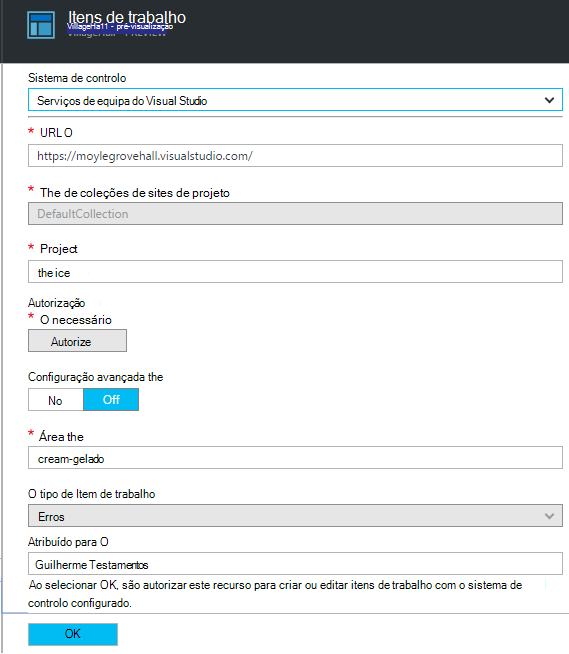

<properties 
    pageTitle="Utilizando a pesquisa diagnóstico | Microsoft Azure" 
    description="Procurar e filtrar eventos individuais, pedidos e inicie sessão rastreios." 
    services="application-insights" 
    documentationCenter=""
    authors="alancameronwills" 
    manager="douge"/>

<tags 
    ms.service="application-insights" 
    ms.workload="tbd" 
    ms.tgt_pltfrm="ibiza" 
    ms.devlang="na" 
    ms.topic="article" 
    ms.date="06/09/2016" 
    ms.author="awills"/>
 
# Utilizando a pesquisa de diagnóstico na aplicação informações

Pesquisa de diagnóstico é uma funcionalidade de [Informações da aplicação] [ start] que utiliza para localizar e explorar os itens de telemetria individuais, tais como vistas de página, exceções ou pedidos da web. E pode ver rastreios de registo e eventos que tem a seguinte.

## Onde está a ver diagnóstico pesquisa?

### No portal do Azure

Pode abrir pesquisa de diagnóstico explicitamente:

Também é aberto ao clicar em através de alguns gráficos e os itens de grelha. Neste caso, os filtros previamente estão definidos para focar o tipo de item que selecionou. 

Por exemplo, se a aplicação é um serviço web, pá a descrição geral apresenta um gráfico do volume de pedidos de. Clique na mesma e aceder a um gráfico mais detalhado, com uma lista que mostra quantas solicitações foram efetuadas para cada URL. Clique em qualquer linha e, receberá uma lista dos pedidos de individuais para esse URL:

O corpo principal da pesquisa diagnóstico é uma lista de itens de telemetria - pedidos de servidor, página vistas, eventos personalizados que tem a seguinte e assim sucessivamente. Na parte superior da lista é um resumo gráfico que mostra as contagens de eventos ao longo do tempo.

Eventos normalmente aparecem na pesquisa diagnóstico antes de serem apresentados no Explorador de métrica. Apesar da pá atualiza o próprio em intervalos, pode clicar em Atualizar se está à espera para um determinado evento.

### No Visual Studio

Abra a janela de pesquisa no Visual Studio:

A janela de pesquisa tem as mesmas funcionalidades que o web portal:

## Amostragem

Se a sua aplicação gera muitas telemetria (e estiver a utilizar o 2.0.0-beta3 de versão do ASP.NET SDK ou posterior), o módulo amostragem ajustável automaticamente irá reduzir o volume que é enviado para o portal através do envio apenas uma fração representante de eventos. No entanto, os eventos relacionados com o mesmo pedido vão ser selecionados ou desmarcados como um grupo, para que pode navegar entre os eventos relacionados. 

[Saiba mais sobre amostragem](app-insights-sampling.md).

## Inspecionar itens individuais

Selecione qualquer item de telemetria para ver os campos de chave e itens relacionados. Se pretender ver o conjunto completo de campos, clique em "…". 

Para localizar o conjunto completo de campos, utilize cadeias simples (sem caracteres universais). Lista de campos disponíveis depende do tipo de telemetria.

## Criar item de trabalho

Pode criar um erro no Visual Studio Team Services com os detalhes de qualquer item de telemetria. 

A primeira vez que efetuar esta ação, é-lhe pedido para configurar uma ligação para a sua conta de serviços de equipa e o project.

(Também pode aceder à pá a configuração a partir das definições > itens de trabalho.)

## Tipos de eventos de filtro

Abra o pá de filtro e escolha os tipos de eventos que pretende ver. (Se, mais tarde, que pretende restaurar os filtros com a qual que abriu o pá, clique em Repor.)

Os tipos de evento são:

* **Rastreio** - registos de diagnóstico, incluindo as chamadas TrackTrace, log4Net, NLog e System.Diagnostic.Trace.
* **Pedir** - pedidos de HTTP recebidos pela aplicação de servidor, incluindo páginas, scripts, imagens, ficheiros de estilo e dados. Estes eventos são utilizados para criar o pedido e a resposta gráficos de descrição geral.
* A **Vista de página** - telemetria enviada pelo cliente web, utilizada para criar relatórios de vista de página. 
* **Eventos personalizados** - se de que inseriu chamadas para TrackEvent() ordem para [monitorizar a utilização][track], pode procurar aqui.
* **Exceção** - exceções não identificadas no servidor e aqueles que inicia sessão utilizando TrackException().

## Filtrar valores de propriedade

Pode filtrar eventos nos valores das suas propriedades. As propriedades disponíveis dependem os tipos de eventos que selecionou. 

Por exemplo, escolha os pedidos com um código de resposta específico.

Escolher sem valores de uma determinada propriedade tem o mesmo efeito que escolher todos os valores; -muda desativar a filtragem dessa propriedade.

### Refinar a sua pesquisa

Repare que as contagens à direita dos valores de filtro mostram quantos ocorrências aí estão no conjunto filtrado atual. 

Neste exemplo,-tem desmarque que o `Reports/Employees` pedir resultados na maioria dos 500 erros:

Para além disso se pretender também ver outros eventos que foram acontecer durante este período de tempo, pode verificar **incluir eventos com as propriedades do indefinido**.

## Remover o tráfego de teste bot e web

Utilizar o filtro de **tráfego Real ou síntese** e marque **Real**.

Também pode filtrar pela **origem de tráfego síntese**.

## Inspecionar ocorrências individuais

Adicione esse nome pedido para o conjunto de filtro e, em seguida, pode inspecionar ocorrências individuais desse evento.

Para eventos de pedido, os detalhes mostram exceções que ocorreram o pedido foi a ser processado.

Clique numa exceção para ver os detalhes, incluindo o rastreio da pilha.

## Encontrar eventos com a mesma propriedade

Encontre todos os itens com o mesmo valor de propriedade:

## Procurar por valor métrico

Obter pedidos resposta sempre > 5s.  Horas são representadas em marcas de escala: 10 000 marcas de escala = 1ms.

## Os dados de pesquisa

Pode procurar por termos em qualquer um dos valores de propriedade. Isto é particularmente útil se tiver escrito [eventos personalizados] [ track] com valores de propriedade. 

Poderá pretender definir uma hora de intervalo, como as pesquisas ao longo de um endereço mais curto intervalo são de forma mais rápida. 

Procurar por termos, não subcadeias. Termos são cadeias de caracteres alfanuméricos, incluindo alguns pontuação tais como '.' e '_'. Por exemplo:

termos|*não* é correspondido pelos|mas estes corresponderem
---|---|---
HomeController.About|sobre casa|h\*sobre casa\*
IsLocal|local é \*local|ISL\* islocal i\*l\*
Atraso novo|w d|novo atraso n\* AND d\*

Seguem-se as expressões de pesquisa, que pode utilizar:

Consulta de exemplo | Efeito 
---|---
diminuir o|Encontrar todos os eventos no intervalo de datas cujos campos incluem o termo "lento"
base de dados?|Corresponde a database01, databaseAB,... ? Não é permitido no início de um termo de pesquisa.
base de dados * |Corresponde a base de dados, database01, databaseNNNN  * Não é permitido no início de um termo de pesquisa
Apple e banana|Localize os eventos que contêm ambos os termos. Utilizar o capital "e", não "e".
Apple banana ou banana da Apple|Localize os eventos que contêm um dos termos. Utilizar "Ou", não "ou". < /br/ > abreviada formulário.
Apple não banana Apple-banana|Localize os eventos que contêm um termo, mas não na outra. Formulário breve.
aplicação * e banana-(grape pear)|Operadores lógicos e que delimitam.
"Métrica": 0 a 500 "Métrica": 500 para * | Localize os eventos que contêm a medição dentro do intervalo do valor com nome.

## Guardar a sua pesquisa

Quando configurar todos os filtros que pretende, pode guardar a pesquisa como favorito. Se trabalhar numa conta institucional, pode escolher se pretende partilhá-lo com outros membros de equipa.

Para ver a pesquisa novamente, **Vá para o separador descrição geral** e abrir favoritos:

Se tiver guardado com intervalo de tempo relativa, a pá reaberto tem os dados mais recentes. Se tiver guardado com intervalo de tempo absoluta, verá os mesmos dados sempre.

## Enviar telemetria mais para informações de aplicação

Para além de telemetria out of box enviada por SDK de informações da aplicação, pode:

* Capturar rastreios de registo a partir do seu framework registo favorito no [.NET] [ netlogs] ou [Java][javalogs]. Isto significa que pode pesquisar através dos seus rastreios de registo e se ligam-los às vistas de página, exceções e outros eventos. 
* [Escrever código] [ track] para enviar eventos personalizados, vistas de página e exceções. 

[Saiba como enviar registos de início e de telemetria personalizada para informações de aplicação][trace].

## As perguntas e respostas

### Quantidade de dados é guardado?

Até 500 eventos por segundo a partir de cada aplicação. Eventos são retidos durante sete dias.

### Como ver dados POST nos meus pedidos de servidor?

Vamos não iniciar automaticamente os dados de mensagem, mas pode utilizar [TrackTrace ou registo de chamadas][trace]. Guardar os dados de mensagem no parâmetro da mensagem. Não é possível filtrar na mensagem da mesma forma que pode propriedades, mas o limite de tamanho é mais longo.

## Próximos passos

* [Enviar registos de início e de telemetria personalizada para informações de aplicação][trace]
* [Configurar a disponibilidade e testes de capacidade de resposta][availability]
* [Resolução de problemas][qna]

<!--Link references-->

[availability]: app-insights-monitor-web-app-availability.md
[javalogs]: app-insights-java-trace-logs.md
[netlogs]: app-insights-asp-net-trace-logs.md
[qna]: app-insights-troubleshoot-faq.md
[start]: app-insights-overview.md
[trace]: app-insights-search-diagnostic-logs.md
[track]: app-insights-api-custom-events-metrics.md

 