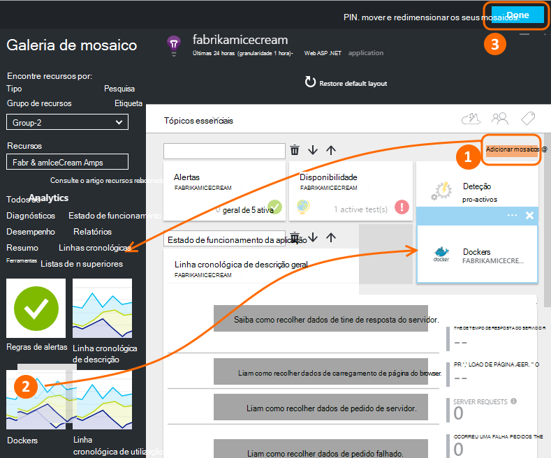
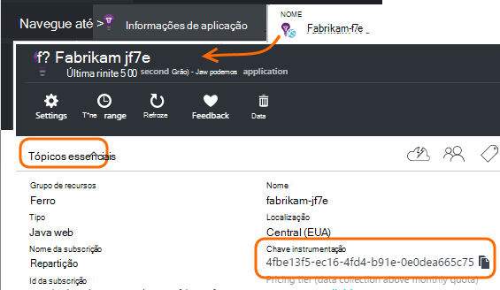
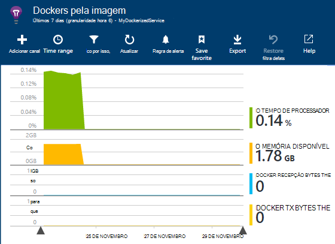
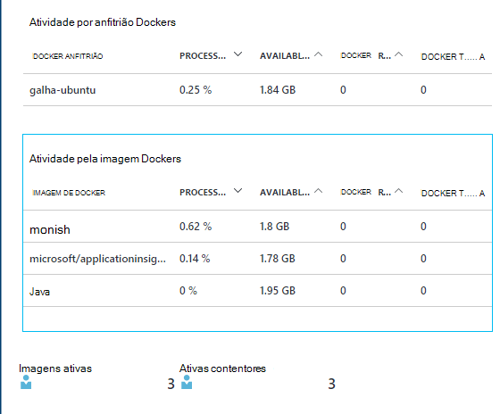
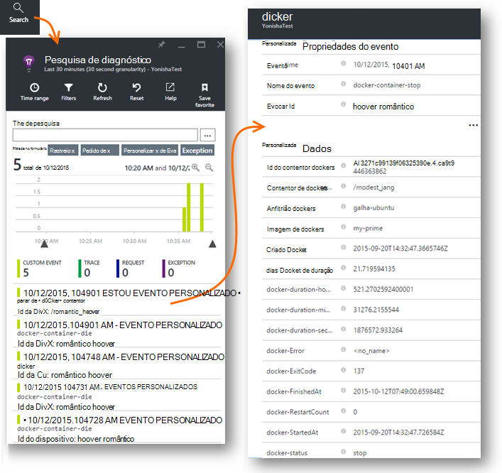
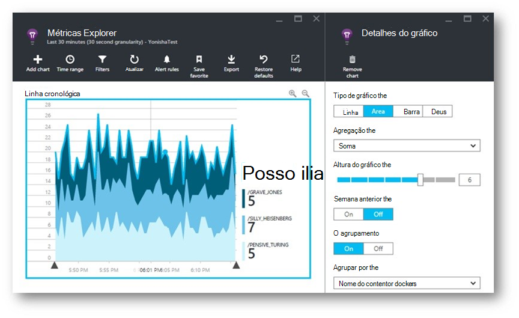
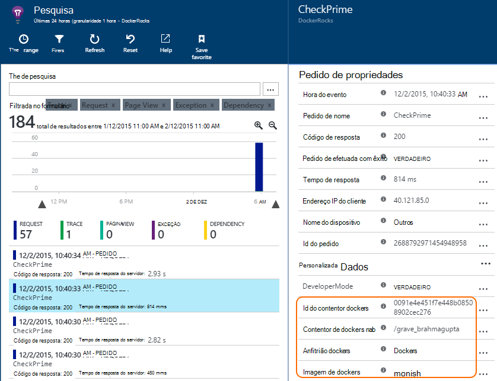
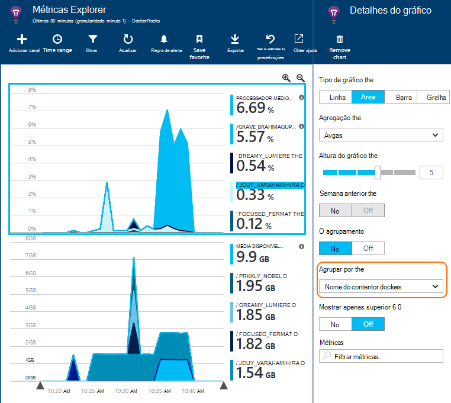

<properties 
    pageTitle="Monitorizar aplicações Docker na aplicação de informações" 
    description="Contadores de desempenho docker, eventos e exceções podem ser apresentadas num informações de aplicação, juntamente com telemetria da aplicações em contentores." 
    services="application-insights" 
    documentationCenter=""
    authors="alancameronwills" 
    manager="douge"/>

<tags 
    ms.service="application-insights" 
    ms.workload="tbd" 
    ms.tgt_pltfrm="ibiza" 
    ms.devlang="na" 
    ms.topic="article" 
    ms.date="12/01/2015" 
    ms.author="awills"/>
 
# <a name="monitor-docker-applications-in-application-insights"></a>Monitorizar aplicações Docker na aplicação de informações

Eventos de ciclo de vida e contadores de desempenho do [Docker](https://www.docker.com/) contentores podem ser colocados em gráfico na aplicação informações. Instalar a imagem de [Informações da aplicação](app-insights-overview.md) num contentor apresentado no seu anfitrião e irá apresentar contadores de desempenho para o anfitrião de e para as outras imagens.

Com Docker distribuir as aplicações em contentores lightweight completas com todas as dependências. Estes vai executar em qualquer computador anfitrião que executa um motor de Docker.

Quando executa a [imagem de informações de aplicação](https://hub.docker.com/r/microsoft/applicationinsights/) no seu anfitrião de Docker, obterá seguintes benefícios:

* Ciclo de vida telemetria sobre todos os contentores em execução no anfitrião do - iniciar, parar e assim sucessivamente.
* Contadores de desempenho para todos os contentores. CPU, memória, a utilização de rede e mais.
* Se [instalou a aplicação informações SDK](app-insights-java-live.md) nas aplicações a ser executada em contentores, todos os telemetria nessas aplicações terá propriedades adicionais que identifica o computador anfitrião e contentor. Por exemplo, se tiver instâncias de uma aplicação a ser executada em mais do que um anfitrião, facilmente poderá filtrar a telemetria aplicação ao anfitrião.


## <a name="set-up-your-application-insights-resource"></a>Configurar o seu recurso de informações de aplicação

1. Inicie sessão no [Portal do Microsoft Azure](https://azure.com) e abra o recurso de informações de aplicação para a sua aplicação; ou [crie um novo](app-insights-create-new-resource.md). 

    *Qual o recurso devo utilizar?* Se as aplicações que estiver a executar no seu anfitrião foram desenvolvidas por outra pessoa, terá de [criar um novo recurso de informações da aplicação](app-insights-create-new-resource.md). Este é onde pode ver e analisar de telemetria. (Selecione 'Outro' para o tipo de aplicação).

    Mas, se for o Programador de aplicações do, em seguida, podemos Espero [adicionado SDK de informações de aplicação](app-insights-java-live.md) para cada um deles. Se estiverem todos realmente componentes de uma aplicação empresarial único, em seguida, poderá configurar mesmas para enviar telemetria para um recurso e irá utilizar esse mesmo recurso para apresentar os dados de ciclo de vida e desempenho de Docker. 

    É um cenário de terceiro que tenha desenvolvido a maior parte das aplicações, mas estiver a utilizar recursos separados para apresentar os respetivos telemetria. Nesse caso, verá a provavelmente também pretende criar um recurso em separado para os dados de Docker. 

2.  Adicionar o mosaico Docker: escolha **Adicionar mosaico**, arraste o mosaico Docker a partir da Galeria e, em seguida, clique em **concluído**. 

    


3. Clique em pendente **Essentials** e copie a chave de instrumentação. Irá Utilize esta opção para indicar ao SDK onde enviar o respetiva telemetria.


    

Manter essa janela do browser útil, como irá regresse ao-o mais cedo para observe a sua telemetria.


## <a name="run-the-application-insights-monitor-on-your-host"></a>Executar o monitor de informações de aplicação no seu anfitrião
 
Agora que já tem um local para apresentar a telemetria, pode configurar a aplicação em contentores que irá recolher e enviá-la.

1.  Ligar ao seu sistema anfitrião Docker. 
2.  Editar a sua chave de instrumentação para este comando e, em seguida, executá-la:
 
    ```

    docker run -v /var/run/docker.sock:/docker.sock -d microsoft/applicationinsights ikey=000000-1111-2222-3333-444444444
    ```

Apenas uma imagem de informações da aplicação é necessária por anfitrião Docker. Se a aplicação for implementada em vários anfitriões de Docker, em seguida, repita o comando em cada anfitrião.

## <a name="update-your-app"></a>Atualizar a sua aplicação

Se a aplicação é implementada com a [Aplicação informações SDK para Java](app-insights-java-get-started.md), adicione a linha seguinte no ficheiro de ApplicationInsights.xml no projeto, na `<TelemetryInitializers>` elemento:

```xml

    <Add type="com.microsoft.applicationinsights.extensibility.initializer.docker.DockerContextInitializer"/> 
```

Esta ação adiciona informações de Docker como contentor e id de anfitrião para cada item de telemetria enviado a partir da sua aplicação.

## <a name="view-your-telemetry"></a>Ver o seu telemetria

Aceda novamente ao seu recurso de informações de aplicação no portal do Azure.

Clique no mosaico Docker.

Brevemente verá dados entregue a partir da aplicação Docker, especialmente se tiver outros contentores em execução no seu motor de Docker.


Aqui estão algumas das vistas que pode obter.

### <a name="perf-counters-by-host-activity-by-image"></a>Desempenho contadores ao anfitrião, atividade pela imagem








Clique em qualquer nome de anfitrião ou imagem para obter mais detalhes.


Para personalizar a vista, clique em qualquer gráfico, grelha de cabeçalho, ou utilize o gráfico de adicionar. 

[Saiba mais acerca do Explorador de métricas](app-insights-metrics-explorer.md).

### <a name="docker-container-events"></a>Eventos de contentor docker




Para investigar eventos individuais, clique em [Procurar](app-insights-diagnostic-search.md). Procurar e filtrar para encontrar os eventos pretendidos. Clicar num evento para obter mais detalhes.
 
### <a name="exceptions-by-container-name"></a>Exceções ao nome do contentor
 



### <a name="docker-context-added-to-app-telemetry"></a>Contexto de docker adicionado à telemetria de aplicação

Pedido de telemetria enviada a partir da aplicação implementada com SDK AI, enriquecidos com contexto Docker:



Processador de tempo e contadores de desempenho de memória disponível, enriquecido e agrupados por nome do contentor Docker:





## <a name="q--a"></a>As perguntas e respostas

*O que o aplicação informações também me que posso não conseguem aceder a partir do Docker?*

* Pormenor de contadores de desempenho ao contentor e imagem.
* Integre dados contentor e aplicação um dashboard.
* [Exportar telemetria](app-insights-export-telemetry.md) para análise mais aprofundada para uma base de dados, do Power BI ou outros dashboard.

*Como posso obter telemetria a partir da aplicação propriamente dito?*

* Instale as aplicação de informações SDK na aplicação. Saiba como para: [Java web apps](app-insights-java-get-started.md), [Windows web apps](app-insights-asp-net.md).
