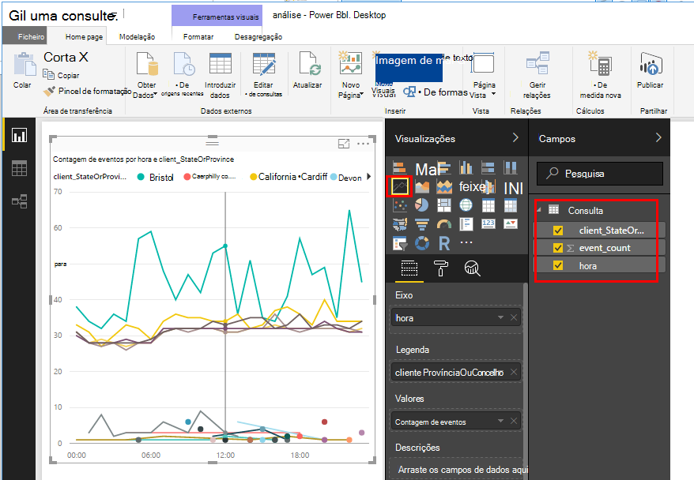

<properties 
    pageTitle="Exportar para o Power BI a partir da aplicação informações | Microsoft Azure" 
    description="Análise de consultas pode ser apresentada no Power BI." 
    services="application-insights" 
    documentationCenter=""
    authors="noamben" 
    manager="douge"/>

<tags 
    ms.service="application-insights" 
    ms.workload="tbd" 
    ms.tgt_pltfrm="ibiza" 
    ms.devlang="na" 
    ms.topic="article" 
    ms.date="10/18/2016" 
    ms.author="awills"/>

# Feed do Power BI a partir de informações de aplicação

[Power BI](http://www.powerbi.com/) é um conjunto de ferramentas de análise de empresas que o ajudam a analisar dados e partilhar reflexões. Rich dashboards estão disponíveis em todos os dispositivos. Pode combinar dados a partir de muitas origens, incluindo consultas de análise a partir do [Visual Studio aplicação informações](app-insights-overview.md).

Existem três métodos recomendados de exportação de dados de informações da aplicação Power BI. Pode utilizá-los separadamente ou em conjunto.

* [**Placa de power BI**](#power-pi-adapter) - configurar um dashboard de telemetria completo da sua aplicação. O conjunto de gráficos é predefinido, mas pode adicionar o seus próprio consultas de quaisquer outras origens.
* [**Exportar análise consultas**](#export-analytics-queries) - escrever qualquer uma consulta que pretende utilizar a análise e exportá-lo para o Power BI. Pode colocar esta consulta num dashboard juntamente com quaisquer outros dados.
* [**Exportar contínuas e análises de sequência**](app-insights-export-stream-analytics.md) - isso envolve mais trabalho a configurar. É útil se pretender manter os seus dados para períodos de tempo. Caso contrário, são recomendados os outros métodos.

## Placa do Power BI

Este método cria um dashboard de telemetria concluído por si. O conjunto de dados inicial é predefinido, mas pode adicionar mais dados ao mesmo.

### Obter o adaptador

1. Iniciar sessão no [Power BI](https://app.powerbi.com/).
2. Abrir **obter dados**, **Serviços**, **informações de aplicação**

    

3. Forneça os detalhes do seu recurso de informações da aplicação.

    

4. Aguarde um minuto ou dois para os dados para serem importados.

    

Pode editar o dashboard, combinando os gráficos de informações da aplicação, com as de outras origens e com a análise de consultas. Existe uma galeria de visualização, onde pode obter mais gráficos e cada gráfico possuir um parâmetros que pode definir.

Após importar inicial, o dashboard e os relatórios de continuam a atualizar diariamente. Pode controlar a agenda de atualização no conjunto de dados.

## Exportar a análise de consultas

Esta rota permite-lhe escrever qualquer consulta de análise que goste e, em seguida, exporte que a um dashboard do Power BI. (Pode adicionar ao dashboard criados pelo adaptador.)

### Uma vez: instalar o Power BI Desktop

Para importar a sua consulta de informações da aplicação, utilize a versão de ambiente de trabalho do Power BI. Mas, em seguida, pode publicá-lo para a web ou para a área de trabalho do Power BI na nuvem. 

Instale o [Ambiente de trabalho do Power BI](https://powerbi.microsoft.com/en-us/desktop/).

### Exportar uma consulta de análise

1. [Analytics abertos e escrever a sua consulta](app-insights-analytics-tour.md).
2. Teste e otimizar a consulta até estiver satisfeito com os resultados.
3. No menu **de exportação** , selecione **Power BI (M)**. Guarde o ficheiro de texto.

    
4. No Power BI Desktop selecione **obter dados, a consulta em branco** e, em seguida, no editor de consultas, em **Ver** selecione **Editor de consultas avançadas**.

    Cole o script de idioma de M exportado para o Editor avançado de consulta.

    

5. Poderá ter que forneça as credenciais para permitir que o Power BI aceder ao Azure. Utilizar 'conta institucional' para iniciar sessão com a sua conta Microsoft.

    

6. Selecione uma visualização para a sua consulta e selecione os campos de eixo x, eixo dos YY e segmentar dimensão.

    

7. Publica o seu relatório para a área de trabalho do Power BI na nuvem. A partir daqui, pode incorporar uma versão sincronizada para outras páginas web.

    
 
8. Atualizar o relatório manualmente em intervalos ou configurar uma atualização agendada na página de opções.

## Sobre amostragem

Se a sua aplicação envia muitos dados, a funcionalidade de amostragem ajustável pode funcionar e enviar apenas uma percentagem do seu telemetria. O mesmo se aplica se definiu manualmente amostragem no SDK ou no ingestão. [Saiba mais sobre amostragem.](app-insights-sampling.md)
 

## Próximos passos

* [Power BI - Saiba mais](http://www.powerbi.com/learning/)
* [Tutorial de análise](app-insights-analytics-tour.md)
