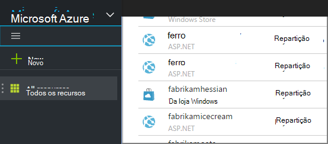

<properties 
    pageTitle="Utilizar a análise da cadeia para processar dados exportados de informações da aplicação | Microsoft Azure" 
    description="Análise da cadeia continuamente pode transformar, filtrar e encaminhar os dados que exporte as informações de aplicação." 
    services="application-insights" 
    documentationCenter=""
    authors="noamben" 
    manager="douge"/>

<tags 
    ms.service="application-insights" 
    ms.workload="tbd" 
    ms.tgt_pltfrm="ibiza" 
    ms.devlang="na" 
    ms.topic="article" 
    ms.date="10/18/2016" 
    ms.author="awills"/>

# <a name="use-stream-analytics-to-process-exported-data-from-application-insights"></a>Utilizar a análise da cadeia para processar dados exportados de informações de aplicação

[Análise do Azure da cadeia](https://azure.microsoft.com/services/stream-analytics/) é a ferramenta ideal para processamento de dados [exportados de informações da aplicação](app-insights-export-telemetry.md). Análise da cadeia pode extrair dados a partir de uma variedade de origens. Pode transformar e filtrar os dados e, em seguida, encaminhá-lo a uma variedade de pias.

Neste exemplo, vamos criar um adaptador que coloca dados a partir de informações da aplicação, muda o nome e processos de alguns dos campos e tubos-lo para o Power BI.

> [AZURE.WARNING] Existem muito melhor e mais fácil [recomendado formas de apresentar informações de aplicação de dados no Power BI](app-insights-export-power-bi.md). O caminho ilustrado aqui é apenas um exemplo para ilustrar como processar dados exportados.


## <a name="create-storage-in-azure"></a>Criar armazenamento no Azure

Exportar contínua sempre exporta dados para uma conta de armazenamento do Windows Azure, pelo que necessita de criar o armazenamento pela primeira vez.

1.  Crie uma conta de armazenamento "clássico" na sua subscrição no [portal do Azure](https://portal.azure.com).

    

2. Criar um contentor

    

3. Copiar a tecla de acesso de armazenamento

    Terá de-o mais cedo para configurar o teclado para o serviço de análise da cadeia.

    

## <a name="start-continuous-export-to-azure-storage"></a>Iniciar exportação contínua ao armazenamento Azure

[Exportar contínua](app-insights-export-telemetry.md) move o cursor dados a partir de informações de aplicação para o armazenamento Azure.

1. No portal do Azure, navegue para o recurso de informações da aplicação que criou para a sua aplicação.

    

2. Crie uma exportação contínua.

    


    Selecione a conta de armazenamento que criou anteriormente:

    
    
    Defina os tipos de evento que pretende ver:

    

3. Permitir que alguns dados de acumular. Sentar novamente e permitir que as pessoas que utilizam a sua aplicação para o tempo. Telemetria seja reencaminhado e verá gráficos estatísticos no [Explorador do métrica](app-insights-metrics-explorer.md) e eventos individuais na [pesquisa de diagnóstico](app-insights-diagnostic-search.md). 

    E para além disso, os dados serão exportar para o seu armazenamento. 

4. Inspecionar os dados exportados. No Visual Studio, selecione **Ver / na nuvem Explorer**e abra o Azure / armazenamento. (Se não tiver esta opção de menu, tem de instalar o SDK do Azure: Abra a caixa de diálogo novo projeto e abra Visual c# / na nuvem / obter Microsoft Azure SDK para .NET.)

    

    Anote a parte do nome do caminho, que deriva da tecla de nome e instrumentação de aplicação comuns. 

Os eventos são escritos blob ficheiros no formato JSON. Cada ficheiro pode conter um ou mais eventos. Por isso, podemos gostaria de ler os dados do evento e filtra os campos que queremos. Existem todos os tipos de coisas que podemos podem fazer com os dados, mas o nosso plano de hoje é utilizar a análise da cadeia encaminhamento os dados ao Power BI.

## <a name="create-an-azure-stream-analytics-instance"></a>Criar uma instância do Azure da cadeia Analytics

A partir do [Portal do Azure clássico](https://manage.windowsazure.com/), selecione o serviço de análise da cadeia de Azure e criar uma nova tarefa de análise de sequência:


Quando a nova tarefa é criada, expanda os detalhes:


### <a name="set-blob-location"></a>Definir a localização de BLOBs

Defini-lo para tirar a entrada a partir do seu blob contínua exportar:


Agora tem a chave primária do Access a partir da sua conta de armazenamento, que indicados anteriormente. Defina como a chave de conta de armazenamento.


### <a name="set-path-prefix-pattern"></a>Conjunto de caminho prefixo padrão 


**Certifique-se de que definir o formato de data para AAAA-MM-DD (com traços).**

O caminho do prefixo padrão Especifica onde a análise da cadeia localiza ficheiros de entrada no armazenamento. Tem de defini-lo para corresponder ao como exportar contínua armazena os dados. Defini-lo da seguinte forma:

    webapplication27_12345678123412341234123456789abcdef0/PageViews/{date}/{time}

Neste exemplo:

* `webapplication27`é o nome do recurso **minúsculas todas as**informações de aplicação.
* `1234...`é a chave de instrumentação do recurso informações de aplicação, **omissão traços**. 
* `PageViews`é o tipo de dados que pretende analisar. Os tipos de disponíveis dependem o filtro que definir no exportar contínuo. Examine os dados exportados para ver os outros tipos de disponíveis e, consulte o artigo [Exportar modelo de dados](app-insights-export-data-model.md).
* `/{date}/{time}`um padrão é escrito literalmente.

> [AZURE.NOTE] Inspecionar armazenamento para se certificar de que obter o caminho à direita.

### <a name="finish-initial-setup"></a>Concluir a configuração inicial

Confirme o formato de serialização:


Fechar o assistente e aguarde que a configuração concluir.

> [AZURE.TIP] Utilize o comando de exemplo para transferir alguns dados. Mantenha-a como uma amostra de teste para depurar a sua consulta.

## <a name="set-the-output"></a>Definir a saída

Agora, selecione a tarefa e definir o resultado.


Fornece de **escolares ou profissionais conta** autorizar da cadeia Analytics para aceder ao seu recurso de Power BI. Em seguida, Invente um nome para a saída e para o conjunto de dados do destino do Power BI e a tabela.


## <a name="set-the-query"></a>Definir a consulta

A consulta controla a tradução de entrada para exportar.


Utilize a função de teste para verificar que obter o resultado da direita. Dar-lhe os dados de exemplo que tenha apontado a partir da página de entradas do tipo. 

### <a name="query-to-display-counts-of-events"></a>Consulta para apresentar as contagens de eventos

Cole esta consulta:

```SQL

    SELECT
      flat.ArrayValue.name,
      count(*)
    INTO
      [pbi-output]
    FROM
      [export-input] A
    OUTER APPLY GetElements(A.[event]) as flat
    GROUP BY TumblingWindow(minute, 1), flat.ArrayValue.name
```

* entrada de exportação é o alias, recomendamos que concedeu as suas a sequência de entrada
* pbi saída é o alias de saída definido
* Utilizamos [Externa GetElements aplicar](https://msdn.microsoft.com/library/azure/dn706229.aspx) porque o nome do evento está a ser um arrray JSON aninhada. Em seguida, selecione escolhe o nome do evento, juntamente com uma contagem do número de instâncias com esse nome num período de tempo. Cláusula [Group By](https://msdn.microsoft.com/library/azure/dn835023.aspx) agrupa os elementos períodos de tempo de 1 minuto.


### <a name="query-to-display-metric-values"></a>Consulta para apresentar valores métricas


```SQL

    SELECT
      A.context.data.eventtime,
      avg(CASE WHEN flat.arrayvalue.myMetric.value IS NULL THEN 0 ELSE  flat.arrayvalue.myMetric.value END) as myValue
    INTO
      [pbi-output]
    FROM
      [export-input] A
    OUTER APPLY GetElements(A.context.custom.metrics) as flat
    GROUP BY TumblingWindow(minute, 1), A.context.data.eventtime

``` 

* Esta consulta treinos para de telemetria de métricas para obter o tempo de evento e o valor de métrica. Os valores métricos estão dentro de uma matriz, por isso utilizamos o padrão de externa GetElements aplicam-se para extrair as linhas. "myMetric" é o nome da métrica neste caso. 

### <a name="query-to-include-values-of-dimension-properties"></a>Consulta para incluir os valores de propriedades de dimensão

```SQL

    WITH flat AS (
    SELECT
      MySource.context.data.eventTime as eventTime,
      InstanceId = MyDimension.ArrayValue.InstanceId.value,
      BusinessUnitId = MyDimension.ArrayValue.BusinessUnitId.value
    FROM MySource
    OUTER APPLY GetArrayElements(MySource.context.custom.dimensions) MyDimension
    )
    SELECT
     eventTime,
     InstanceId,
     BusinessUnitId
    INTO AIOutput
    FROM flat

```

* Esta consulta inclui valores de propriedades da dimensão sem dependendo uma dimensão específico que está a ser um índice fixo na matriz dimensão.

## <a name="run-the-job"></a>Executar a tarefa

Pode selecionar uma data no passado para iniciar a tarefa a partir de. 


Aguarde até que a tarefa está em execução.

## <a name="see-results-in-power-bi"></a>Ver resultados no Power BI

> [AZURE.WARNING] Existem muito melhor e mais fácil [recomendado formas de apresentar informações de aplicação de dados no Power BI](app-insights-export-power-bi.md). O caminho ilustrado aqui é apenas um exemplo para ilustrar como processar dados exportados.

Abra o Power BI com o seu trabalho ou conta escolar e selecione o conjunto de dados e a tabela que definiu como o resultado da tarefa a análise da cadeia.


Agora pode utilizar este conjunto de dados em relatórios e dashboards no [Power BI](https://powerbi.microsoft.com).


## <a name="no-data"></a>Sem dados?

* Verifique que pode [definir o formato de data](#set-path-prefix-pattern) corretamente para AAAA-MM-DD (com traços).


## <a name="video"></a>Vídeo

Noam Carlos Zeev mostra como os dados exportados utilizando a análise da cadeia do processo.

> [AZURE.VIDEO export-to-power-bi-from-application-insights]

## <a name="next-steps"></a>Próximos passos

* [Exportar contínuo](app-insights-export-telemetry.md)
* [Referência para os valores e tipos de propriedades do modelo de dados detalhados.](app-insights-export-data-model.md)
* [Informações de aplicação](app-insights-overview.md)
* [Obter mais exemplos e tutoriais](app-insights-code-samples.md)
 
