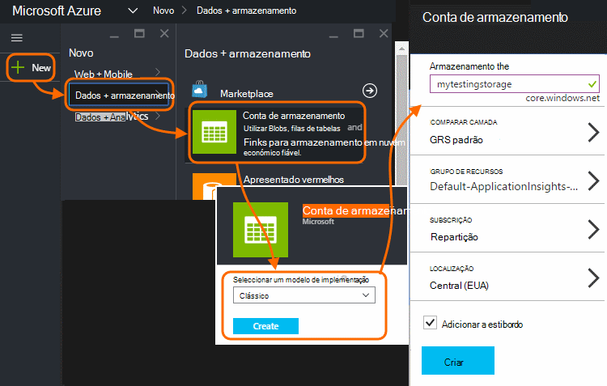

<properties 
    pageTitle="Exportar contínua de telemetria de informações da aplicação | Microsoft Azure" 
    description="Exportar dados e a utilização de diagnóstico para o armazenamento no Microsoft Azure e transfira-o partir daí." 
    services="application-insights" 
    documentationCenter=""
    authors="alancameronwills" 
    manager="douge"/>

<tags 
    ms.service="application-insights" 
    ms.workload="tbd" 
    ms.tgt_pltfrm="ibiza" 
    ms.devlang="na" 
    ms.topic="article" 
    ms.date="10/18/2016" 
    ms.author="awills"/>
 
# Exportar telemetria de informações de aplicação

Pretende manter o seu telemetria durante mais o período de retenção padrão? Ou processá-lo de algum modo especializado? Exportar contínua é ideal para esta. Os eventos que verá no portal do aplicação informações podem ser exportados para o armazenamento no Microsoft Azure no formato JSON. A partir desse local pode transferir os seus dados e escrever o código precisa de processá-la.  

Exportar contínua está disponível no período de avaliação gratuito e sobre o [padrão e Premium preços planos](https://azure.microsoft.com/pricing/details/application-insights/).

Antes de configurar exportar contínuo, existem algumas alternativas que poderá querer ter em consideração:

* [Botão Exportar o](app-insights-metrics-explorer.md#export-to-excel) na parte superior de um pá métricas ou procurar permite-lhe transferir tabelas e gráficos numa folha de cálculo do Excel. 
* Fornece um idioma de consulta avançada para telemetria e de [análise](app-insights-analytics.md) também pode exportar resultados.
* Se estiver à procura para [explorar os seus dados no Power BI](http://blogs.msdn.com/b/powerbi/archive/2015/11/04/explore-your-application-insights-data-with-power-bi.aspx), pode fazê-lo sem utilizar exportar contínuo.

## Criar uma conta de armazenamento

Se ainda não tiver uma conta de armazenamento "clássico", agora o criar.

1. Crie uma conta de armazenamento na sua subscrição no [portal do Azure](https://portal.azure.com).

    

2. Crie um contentor.

    

## Configurar o exportar contínuo

No pá de descrição geral da sua aplicação no portal do informações de aplicação, abra a exportar contínua: 

Adicionar uma exportação contínua e escolha os tipos de evento que pretende exportar:

Selecione ou criar a [conta de armazenamento Azure](../storage/storage-introduction.md) onde pretende armazenar os dados:

Depois de criar a exportação, desde o início aceder. (Só obtiver dados que chega depois de criar a exportação.) 

Pode ser um atraso de cerca uma hora antes dos dados aparecem no blob.

Se quiser alterar os tipos de eventos mais tarde, basta edite a exportar:

Para parar a sequência de, clique em Desativar. Quando clica em ativar novamente, irá reiniciar a sequência com os novos dados. Não obtém os dados que chegaram no portal do enquanto exportar sido desativado.

Para parar a sequência de forma permanente, elimine a exportação. Fazê-lo, não elimina os dados a partir do armazenamento.

#### Não pode adicionar ou alterar uma exportação?

* Para adicionar ou alterar as exportações, precisa de direitos de acesso do proprietário, contribuinte ou contribuinte de informações da aplicação. [Saiba mais sobre funções][roles].

## Que eventos obter?

Os dados exportados são de telemetria não processada que recebemos a partir da sua aplicação, exceto que recomendamos adicionar dados de localização podemos calcular a partir do endereço IP do cliente. 

Dados que foi eliminados por [amostragem](app-insights-sampling.md) não estão incluídos nos dados exportados.

Outras métricas calculadas não são incluídas. Por exemplo, vamos não exportar média utilização da CPU, mas de exportação de telemetria não processada a partir do qual a média é calculada.

Os dados também incluem os resultados de qualquer [testes de web disponibilidade](app-insights-monitor-web-app-availability.md) que configurou. 

> [AZURE.NOTE] **Amostragem.** Se a sua aplicação envia muitos dados e estiver a utilizar o SDK de informações de aplicação para o ASP.NET versão 2.0.0-beta3 ou posterior, a funcionalidade de amostragem ajustável pode funcionar e enviar apenas uma percentagem do seu telemetria. [Saiba mais sobre amostragem.](app-insights-sampling.md)

## Inspecionar os dados

Pode inspecionar armazenamento diretamente no portal. Clique em **Procurar**, selecione a sua conta de armazenamento e, em seguida, abra **contentores**.

Para inspecionar Azure armazenamento no Visual Studio, abra a **vista**, **Explorer na nuvem**. (Se não tiver esse comando de menu, tem de instalar o SDK do Azure: abrir a caixa de diálogo **Novo projeto** , expanda Visual c# / na nuvem e selecione **Obter Microsoft Azure SDK para .NET**.)

Quando abre o arquivo de BLOBs, verá um contentor com um conjunto de ficheiros de Blobs. URI de cada ficheiro derivado do seu nome de recurso de informações da aplicação, sua chave de instrumentação, telemetria-tipo/data/hora. (O nome do recurso é todas as letras minúsculo e a chave de instrumentação omite traços.)

A data e hora são UTC e quando foi depósito de telemetria na loja - não a hora que foi gerado. Por isso, se escrever código para transferir os dados,-pode percorrer linear os dados.

Eis a forma do caminho:

    $"{applicationName}_{instrumentationKey}/{type}/{blobDeliveryTimeUtc:yyyy-MM-dd}/{ blobDeliveryTimeUtc:HH}/{blobId}_{blobCreationTimeUtc:yyyyMMdd_HHmmss}.blob"
  
Onde 

-   `blobCreationTimeUtc`Quando blob foi criada no interna é de transição armazenamento
-   `blobDeliveryTimeUtc`é o tempo quando blob é copiada para o armazenamento de destino de exportação

## Formato de dados

* Cada blob é um ficheiro de texto que contém vários ' \n'-separated linhas. Contém telemetria processada durante um período de tempo de aproximadamente metade um minuto.
* Cada linha representa um ponto de dados de telemetria como um pedido de ou vista de página.
* Cada linha é um documento JSON não formatado. Se pretende sentar e mal-la, abra-o no Visual Studio e selecione edite, avançadas, ficheiro de formato:

São durações de tempo na escala, onde 10 000 marcas de escala = 1ms. Por exemplo, estes valores mostram um tempo de 1ms para enviar um pedido a partir do browser, 3ms recebê-las e 1.8s para processar a página no browser:

    "sendRequest": {"value": 10000.0},
    "receiveRequest": {"value": 30000.0},
    "clientProcess": {"value": 17970000.0}

[Referência para os valores e tipos de propriedades do modelo de dados detalhados.](app-insights-export-data-model.md)

## Processamento dos dados

Numa escala mais pequena, pode escrever algum código para separar pelos seus dados, lê-la numa folha de cálculo e assim sucessivamente. Por exemplo:

    private IEnumerable<T> DeserializeMany<T>(string folderName)
    {
      var files = Directory.EnumerateFiles(folderName, "*.blob", SearchOption.AllDirectories);
      foreach (var file in files)
      {
         using (var fileReader = File.OpenText(file))
         {
            string fileContent = fileReader.ReadToEnd();
            IEnumerable<string> entities = fileContent.Split('\n').Where(s => !string.IsNullOrWhiteSpace(s));
            foreach (var entity in entities)
            {
                yield return JsonConvert.DeserializeObject<T>(entity);
            }
         }
      }
    }

Para uma amostra de código maior, consulte o artigo [utilizar uma função de trabalho][exportasa].

## Eliminar os seus dados antigos
Tenha em atenção que é responsável para gerir a sua capacidade de armazenamento e eliminar os dados antigos, se necessário. 

## Se a sua chave de armazenamento gerar...

Se alterar a chave ao seu armazenamento, exportar contínua deixarão de funcionar. Irá ver uma notificação na sua conta Azure. 

Abra o pá exportar contínua e edite a exportação. Edite o destino de exportação, mas apenas deixe o mesmo armazenamento seleccionado. Clique em OK para confirmar.

Irá reiniciar a exportação contínua.

## Exemplos de exportação

* [Exportar para o SQL utilizando uma função de trabalho][exportcode]
* [Exportar para utilizar a análise da cadeia SQL][exportasa]
* [Exemplo de análise da cadeia 2](app-insights-export-stream-analytics.md)

No maiores escalas, considere [HDInsight](https://azure.microsoft.com/services/hdinsight/) - Hadoop clusters na nuvem. HDInsight fornece uma variedade de tecnologias para gerir e analisar dados grandes.

## As perguntas e respostas

* *Mas só quero de transferência de uma única de um gráfico.*  
 
    Sim, pode fazê-lo. Na parte superior da pá, clique em [Exportar dados](app-insights-metrics-explorer.md#export-to-excel).

* *Configurei uma exportação, mas não haja dados no meu arquivo.*

    Informações de aplicação receberam qualquer telemetria da sua aplicação uma vez que configurou a exportação? Receberá apenas novos dados.

* *Tentou configurar uma exportação, mas acesso negado*

    Se a conta é propriedade pela sua organização, tem de ser um membro dos grupos proprietários ou contribuintes.

* *Pode exportar diretamente para o meu próprio arquivo no local?* 

    Não, Pedimos desculpa. Os nossos motor de exportação atualmente apenas funciona com armazenamento Azure neste momento.  

* *Existe algum limite para a quantidade de colocar no meu arquivo de dados?* 

    Não. Vamos irá manter conduza dados até que elimine a exportação. Vamos irá parar se podemos visitas os limites exteriores do armazenamento de Blobs do, mas que for enorme muito. Cabe-lhe para controlar a quantidade de armazenamento que utiliza.  

* *Quantos blobs deverá ver no armazenamento?*

 * Para cada tipo de dados selecionada para exportar, um novo blob é criado minuto (se os dados estão disponíveis). 
 * Além disso, para as aplicações com o tráfego alta, são atribuídas a unidades partição adicionais. Neste caso cada unidade cria um blob minuto.

* *Posso geradas novamente a chave para o meu armazenamento ou alteradas no nome do contentor e agora não funciona a exportação.*

    Editar a exportação e abra o pá de destino de exportação. Deixe o mesmo armazenamento selecionado como antes e clique em OK para confirmar. Exportar irá reiniciar. Se a alteração tiver sido nos últimos alguns dias, não perder dados.

* *Pode interromper a exportação?*

    Sim. Clique em Desativar.

## Exemplos de código

* [Analisar JSON exportado utilizando uma função de trabalho][exportcode]
* [Exemplo de análise da cadeia](app-insights-export-stream-analytics.md)
* [Exportar para utilizar a análise da cadeia SQL][exportasa]

* [Referência para os valores e tipos de propriedades do modelo de dados detalhados.](app-insights-export-data-model.md)

<!--Link references-->

[exportcode]: app-insights-code-sample-export-telemetry-sql-database.md
[exportasa]: app-insights-code-sample-export-sql-stream-analytics.md
[roles]: app-insights-resources-roles-access-control.md

 
