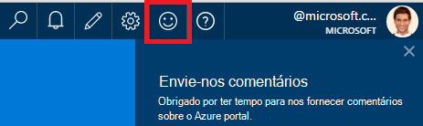
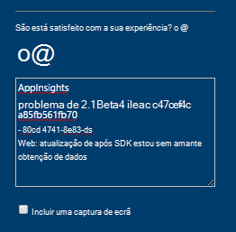
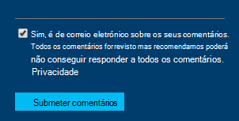

<properties 
    pageTitle="Como obter suporte técnico da equipa de desenvolvimento de informações da aplicação | Microsoft Azure" 
    description="Quando tiver um caso de que necessita de suporte especial da equipa de desenvolvimento de informações da aplicação, esta é como pode submeter os detalhes para obter suporte." 
    services="application-insights" 
    documentationCenter=""
    authors="alexbulankou" 
    manager="douge"/>
 
<tags 
    ms.service="application-insights" 
    ms.workload="tbd" 
    ms.tgt_pltfrm="ibiza" 
    ms.devlang="na" 
    ms.topic="article" 
    ms.date="06/01/2016" 
    ms.author="albulank"/>
    
# <a name="how-to-get-technical-support-from-application-insights-development-team"></a>Como obter suporte técnico da equipa de desenvolvimento de informações de aplicação
    
Quando tiver um problema técnico com [Informações de aplicação do Visual Studio](app-insights-overview.md), aqui estão as opções para obter ajuda:

## <a name="1-check-the-documents"></a>1. Verifique os documentos

* Dados em falta? Verificação: [amostragem](app-insights-sampling.md), [quotas e limitação](app-insights-pricing.md).
* Resolução de problemas: [ASP.NET](app-insights-troubleshoot-faq.md) | [Java](app-insights-java-troubleshoot.md)

## <a name="2-search-the-forums"></a>2. Procure nos fóruns

* [Fórum MSDN](https://social.msdn.microsoft.com/Forums/vstudio/home?forum=ApplicationInsights)
* [StackOverflow](http://stackoverflow.com/questions/tagged/ms-application-insights)

## <a name="3-azure-support-plan"></a>3. plano de suporte azure?

Existem situações onde pretende que os programadores para investigar o seu caso específico. 

Se tiver um [plano do Microsoft Azure de suporte](https://azure.microsoft.com/support/plans/) , pode [Abrir um bilhetes de suporte](https://portal.azure.com/?#blade/Microsoft_Azure_Support/HelpAndSupportBlade).

## <a name="4-contact-the-application-insights-team"></a>4. Contacte a equipa de informações de aplicação

Se não tiver um plano de suporte, a nossa equipa de desenvolvimento está satisfeita oferecer melhor esforço suporte aos clientes de informações da aplicação, tal como o podemos preparar-se para o marco disponibilidade geral. Vamos são apresentamos **uma nova opção de suporte**: pode descrever o seu caso-ao submeter um formulário de comentários no portal do Azure e têm um programador no contacto da equipa de informações da aplicação trás para ajudar a resolver o problema.


1. No [portal de informações da aplicação](https://portal.azure.com), clique em sorriso no canto superior direito:  

       

2. Na caixa de comentário Certifique-se especificar **AppInsights** como a primeira linha e, em seguida, incluem as seguintes informações:   

    ```

    AppInsights   
    ikey: <instrumentation key>   
    sdk: <SDK that you are using, including name and version>  
    issue: <please describe the problem you are having>

    ```   

       

3. Selecione "Sim, é ok para enviar por correio eletrónico". 

      

Uma engenharia da equipa de informações da aplicação irá contactá-lo mais rapidamente. À medida que estamos a fornecer este serviço melhor trimestralmente de esforço, sem SLA formal pode ser fornecida neste momento.


