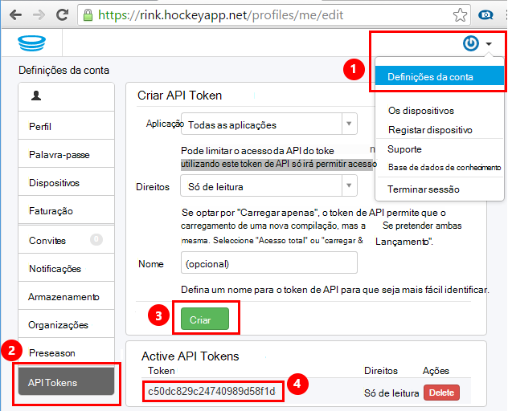
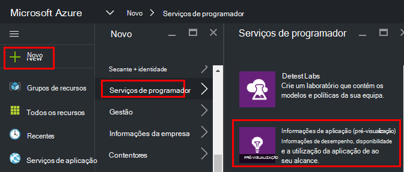
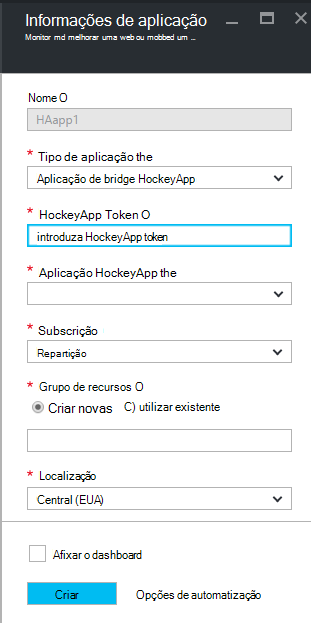
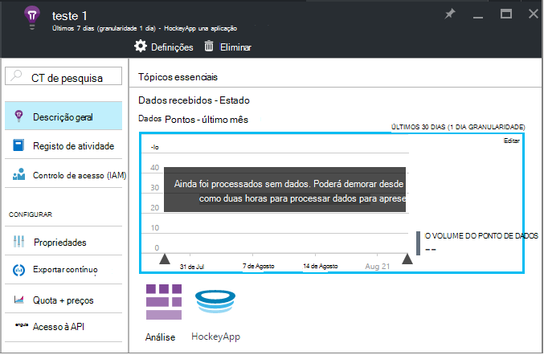
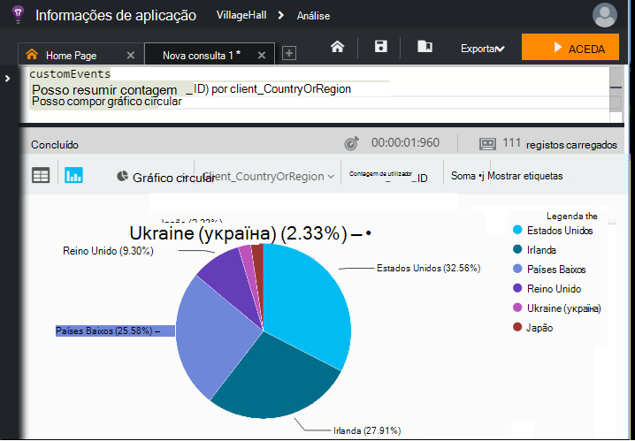

<properties 
    pageTitle="Explorar dados HockeyApp na aplicação informações | Microsoft Azure" 
    description="Analise a utilização e o desempenho da sua aplicação Azure com informações de aplicação." 
    services="application-insights" 
    documentationCenter="windows"
    authors="alancameronwills" 
    manager="douge"/>

<tags 
    ms.service="application-insights" 
    ms.workload="tbd" 
    ms.tgt_pltfrm="ibiza" 
    ms.devlang="na" 
    ms.topic="article" 
    ms.date="08/25/2016" 
    ms.author="awills"/>

#  Explorar dados HockeyApp informações de aplicação

[HockeyApp](https://azure.microsoft.com/services/hockeyapp/) é a plataforma recomendada para monitorizar aplicações de ambiente de trabalho e móveis direto. A partir do HockeyApp, pode enviar personalizado e analisar telemetria para monitorizar a utilização e dar assistência em diagnóstico (para além de obtenção de dados de falha de sistema). Este fluxo de telemetria pode ser consultado utilizando a funcionalidade de [análise](app-insights-analytics.md) poderosa do [Visual Studio aplicação informações](app-insights-overview.md). Além disso, pode [Exportar personalizadas e analisar telemetria](app-insights-export-telemetry.md). Para permitir que estas funcionalidades, configurar uma bridge que reencaminha os dados de HockeyApp para informações de aplicação.

## A aplicação HockeyApp Bridge

A aplicação de Bridge HockeyApp é a funcionalidade de core que permite-lhe aceder aos dados de HockeyApp na aplicação informações através das análises e funcionalidades exportar contínuo. Quaisquer dados recolhidos pela HockeyApp após a criação da aplicação Bridge HockeyApp serão acessíveis a partir destas funcionalidades. Vamos ver como configurar um destas aplicações Bridge.

No HockeyApp, abra definições da conta, de [API Tokens](https://rink.hockeyapp.net/manage/auth_tokens). Criar um novo token ou reutilizar uma existente. Os direitos mínimos necessários são "só de leitura". Tomar uma cópia da API do token.

Abra o portal do Microsoft Azure e, em seguida, [crie um recurso de informações da aplicação](app-insights-create-new-resource.md). Definir o tipo de aplicação para "Aplicação de bridge HockeyApp":

Não tem de definir um nome - esta será automaticamente definido de nomes de HockeyApp.

Os campos de bridge HockeyApp aparecem. 

Introduza o token de HockeyApp indicados anteriormente. Esta ação preenche o menu pendente "HockeyApp aplicação" com todas as suas aplicações de HockeyApp. Selecione aquele que pretende utilizar e preencha o resto dos campos. 

Abra o novo recurso. 

Tenha em atenção que os dados leva-o até tempo a começar a fluir.

Já está! Quaisquer dados recolhidos na sua aplicação implementada HockeyApp a partir deste momento reencaminhar também estão agora disponíveis para si nas funcionalidades de exportar contínua e de análise do informações de aplicação.

Brevemente Analisemos cada uma destas funcionalidades agora disponíveis para si.

## Análise

Análise é uma poderosa ferramenta para consultar ad-hoc dos seus dados, permitindo-lhe diagnosticar e analisar os seus telemetria e descobrir rapidamente causas raiz e padrões.

* [Saiba mais sobre Analytics](app-insights-analytics-tour.md)
* [Vídeo de introdução](https://channel9.msdn.com/events/Build/2016/T666)
* [Vídeos de conceitos avançados](https://channel9.msdn.com/Events/Build/2016/P591)

## Exportar contínuo

Exportar contínua permite-lhe exporte os seus dados para um contentor de armazenamento de Blobs do Azure. Este é muito útil se precisar de manter os seus dados durante mais o período de retenção atualmente disponibilizado pelos informações de aplicação. Pode manter os dados do armazenamento de BLOBs, processá-la para uma base de dados do SQL ou a sua solução de armazenamento de dados preferidos.

[Saiba mais sobre exportar contínuo](app-insights-export-telemetry.md)

## Próximos passos

* [Aplicar Analytics para os seus dados](app-insights-analytics-tour.md)

