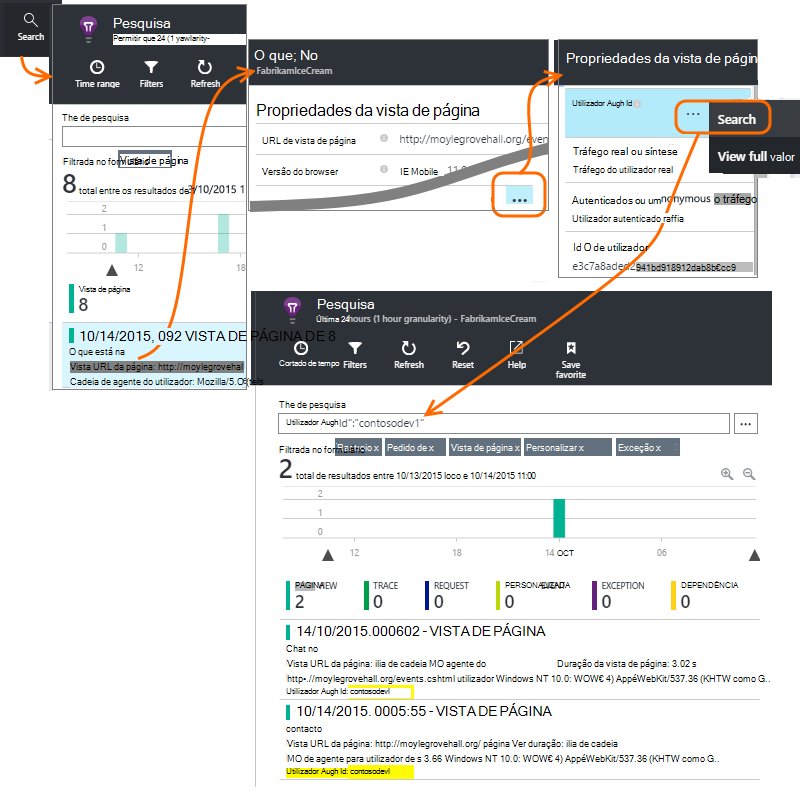

<properties 
    pageTitle="Como é que … na aplicação informações | Microsoft Azure" 
    description="Perguntas mais frequentes no informações de aplicação." 
    services="application-insights" 
    documentationCenter=""
    authors="alancameronwills" 
    manager="douge"/>

<tags 
    ms.service="application-insights" 
    ms.workload="tbd" 
    ms.tgt_pltfrm="ibiza" 
    ms.devlang="na" 
    ms.topic="article" 
    ms.date="02/05/2016" 
    ms.author="awills"/>

# <a name="how-do-i--in-application-insights"></a>Como é que … na aplicação informações?

## <a name="get-an-email-when-"></a>Obter uma mensagem de e-mail quando...

### <a name="email-if-my-site-goes-down"></a>Se o meu site vai para baixo de correio eletrónico

Configure um [web disponibilidade testar](app-insights-monitor-web-app-availability.md).

### <a name="email-if-my-site-is-overloaded"></a>Se o meu site está sobrecarregado de correio eletrónico

Defina um [alerta](app-insights-alerts.md) na **hora de resposta do servidor**. Um determinado limiar entre 1 e 2 segundos deverá funcionar.


A aplicação poderá também apresentam sinais de ocular, devolvendo códigos de falha. Defina um alerta sobre os **pedidos de falhou**.

Se pretender definir um alerta no **exceções de servidor**, poderá ter de fazer [algumas configuração adicionais](app-insights-asp-net-exceptions.md) para poder ver os dados.

### <a name="email-on-exceptions"></a>Exceções de e-mail

1. [Configurar a monitorização de exceção](app-insights-asp-net-exceptions.md)
2. [Definir um alerta](app-insights-alerts.md) no métrica de contagem de exceção


### <a name="email-on-an-event-in-my-app"></a>Um evento na minha aplicação de e-mail

Vamos supor que gostaria de obter uma mensagem de e-mail quando ocorre um evento específico. Informações da aplicação não fornece diretamente esta funcionalidade, mas pode [Enviar um alerta quando uma métrica este se cruza um determinado limiar](app-insights-alerts.md). 

Alertas podem ser definidos no [métricas personalizadas](app-insights-api-custom-events-metrics.md#track-metric), embora eventos não personalizados. Escreva algum código para aumentar uma métrica quando ocorre o evento:

    telemetry.TrackMetric("Alarm", 10);

ou:

    var measurements = new Dictionary<string,double>();
    measurements ["Alarm"] = 10;
    telemetry.TrackEvent("status", null, measurements);

Uma vez que alertas têm dois Estados, tem de enviar um valor mínimo quando a ter em consideração o alerta para ter terminado:

    telemetry.TrackMetric("Alarm", 0.5);

Crie um gráfico no [Explorador métrica](app-insights-metrics-explorer.md) para ver o seu alarme:


Agora para definir um alerta quando a métrica do vai acima um valor seg. texto por um período curto:


Defina o período de média ao mínimo. 

Irá obter mensagens de correio eletrónico quando acede a métrica do acima e abaixo do limiar.

Alguns pontos a considerar:

* Um alerta tem dois Estados ("alerta de" e "saudáveis"). O estado é avaliado apenas quando for recebida uma métrica.
* Uma mensagem de e-mail é enviada apenas quando o estado é alterado. Esta é porque tem de enviar ambos alta e métricas de valor mínimo. 
* Para avaliar o alerta, a média é disponibilizada dos valores recebidos durante o período anterior. Isto ocorre sempre que for recebida uma métrica, para que os e-mails podem ser enviados mais frequentemente do que o período definido.
* Uma vez que os e-mails são enviados no "alerta de" e "Saudável", poderá pretender ter em consideração pensar novamente o seu evento one-shot como uma condição de dois Estados. Por exemplo, em vez de um evento "tarefa concluída", tem uma condição "trabalho em curso", onde obter e-mails no início e no fim de uma tarefa.

### <a name="set-up-alerts-automatically"></a>Configurar alertas automaticamente

[Utilizar o PowerShell para criar novos alertas](app-insights-alerts.md#set-alerts-by-using-powershell)

## <a name="use-powershell-to-manage-application-insights"></a>Utilizar o PowerShell para gerir informações de aplicação

* [Criar novos recursos](app-insights-powershell-script-create-resource.md)
* [Criar novos alertas](app-insights-alerts.md#set-alerts-by-using-powershell)

## <a name="application-versions-and-stamps"></a>Versões de aplicações e carimbos de data /

### <a name="separate-the-results-from-dev-test-and-prod"></a>Separar os resultados do Dev Center, teste e ordem de produção

* Para environmnents diferentes, configurar ikeys diferente
* Para carimbos diferentes (Dev Center, teste, prod) marcar telemetria com valores de propriedade diferentes

[Saiba mais](app-insights-separate-resources.md)
 

### <a name="filter-on-build-number"></a>Filtrar por número de compilação

Durante a publicação de uma nova versão da sua aplicação, irá pretenda que administre separar a telemetria do compilações diferentes.

Pode definir a propriedade da versão da aplicação para que pode filtrar resultados de [pesquisa](app-insights-diagnostic-search.md) e [métrica explorer](app-insights-metrics-explorer.md) . 


Existem vários métodos diferentes de definição da propriedade de versão da aplicação.

* Defina diretamente:

    `telemetryClient.Context.Component.Version = typeof(MyProject.MyClass).Assembly.GetName().Version;`

* Molde nessa linha um [inicializador de telemetria](app-insights-api-custom-events-metrics.md#telemetry-initializers) para se certificar de que todas as instâncias de TelemetryClient estão definidas de forma consistente.

* [ASP.NET] Definir a versão `BuildInfo.config`. A versão do nó BuildLabel vai selecionar o módulo web. Incluir este ficheiro no seu projeto e lembre-se definir a propriedade cópia sempre no Explorador de soluções.

    ```XML

    <?xml version="1.0" encoding="utf-8"?>
    <DeploymentEvent xmlns:xsi="http://www.w3.org/2001/XMLSchema-instance" xmlns:xsd="http://www.w3.org/2001/XMLSchema" xmlns="http://schemas.microsoft.com/VisualStudio/DeploymentEvent/2013/06">
      <ProjectName>AppVersionExpt</ProjectName>
      <Build type="MSBuild">
        <MSBuild>
          <BuildLabel kind="label">1.0.0.2</BuildLabel>
        </MSBuild>
      </Build>
    </DeploymentEvent>

    ```
* [ASP.NET] Gera automaticamente BuildInfo.config em MSBuild. Para fazer isto, adicione alguns linhas para o seu ficheiro csproj:

    ```XML

    <PropertyGroup>
      <GenerateBuildInfoConfigFile>true</GenerateBuildInfoConfigFile>    <IncludeServerNameInBuildInfo>true</IncludeServerNameInBuildInfo>
    </PropertyGroup> 
    ```

    Este procedimento gera um ficheiro denominado *yourProjectName*. BuildInfo.config. O processo de publicar muda o nome-lo para BuildInfo.config.

    A etiqueta de compilação contém um marcador de posição (AutoGen_...) quando constrói com o Visual Studio. Mas quando criadas com MSBuild, é povoada com o número da versão correto.

    Para permitir que MSBuild gerar versão números, definir a versão como `1.0.*` no AssemblyReference.cs

## <a name="monitor-backend-servers-and-desktop-apps"></a>Monitorizar os servidores de back-end e aplicações de ambiente de trabalho

[Utilizar o módulo Windows Server SDK](app-insights-windows-desktop.md).


## <a name="visualize-data"></a>Visualizar dados

#### <a name="dashboard-with-metrics-from-multiple-apps"></a>Dashboard com métricas a partir de várias aplicações

* No [Explorador de métrica](app-insights-metrics-explorer.md), personalizar o gráfico e guardá-lo como um favorito. Afixe o dashboard Azure.


#### <a name="dashboard-with-data-from-other-sources-and-application-insights"></a>Dashboard com dados a partir de outras origens e informações de aplicação

* [Exportar telemetria ao Power BI](app-insights-export-power-bi.md). 

Ou

* Utilize o SharePoint como o seu dashboard, apresentar dados peças web do SharePoint. [Utilizar exportar contínua e análises de sequência para exportar para o SQL](app-insights-code-sample-export-sql-stream-analytics.md).  Utilize o PowerView examinar a base de dados e criar uma peça web do SharePoint para o PowerView.


<a name="search-specific-users"></a>
### <a name="filter-out-anonymous-or-authenticated-users"></a>Filtrar os utilizadores anónimos ou autenticados

Se os seus utilizadores iniciar sessão, pode definir [autenticados id de utilizador](app-insights-api-custom-events-metrics.md#authenticated-users). (Que não acontecer automaticamente.) 

Em seguida, pode:

* Procurar no ids de utilizador específico



* Métricas de filtro para utilizadores anónimos ou autenticados


## <a name="modify-property-names-or-values"></a>Modificar a valores ou nomes de propriedades

Crie um [filtro](app-insights-api-filtering-sampling.md#filtering). Permite-lhe modificar ou filtrar telemetria antes de ter sido enviada da sua aplicação para informações de aplicação.

## <a name="list-specific-users-and-their-usage"></a>Lista de utilizadores específicos e a respectiva utilização

Se apenas quiser [Procurar utilizadores específicos](#search-specific-users), pode definir [autenticados id de utilizador](app-insights-api-custom-events-metrics.md#authenticated-users).

Se pretender que uma lista de utilizadores com dados como as páginas que eles observe ou com que frequência iniciarem, tem duas opções:

* [Conjunto autenticados id de utilizador](app-insights-api-custom-events-metrics.md#authenticated-users), [Exportar para uma base de dados](app-insights-code-sample-export-sql-stream-analytics.md) e utilizar ferramentas adequadas para analisar os seus dados de utilizador aí.
* Se tiver um pequeno número de utilizadores, envie eventos personalizados ou métricas, utilizando os dados de interesse como o nome do valor ou evento métrico e definir o id de utilizador como uma propriedade. Para analisar as vistas de página, substitua a chamada de trackPageView JavaScript padrão. Para analisar telemetria do lado do servidor, utilize um inicializador de telemetria para adicionar o id de utilizador para todos os telemetria de servidor. Pode ver, em seguida, filtrar e segmento métricas e as pesquisas no id de utilizador.


## <a name="reduce-traffic-from-my-app-to-application-insights"></a>Reduzir o tráfego da minha aplicação para informações de aplicação

* Em [ApplicationInsights.config](app-insights-configuration-with-applicationinsights-config.md), desative quaisquer módulos que já não precisa, como o recolector contador de desempenho.
* Utilize [amostragem e filtragem](app-insights-api-filtering-sampling.md) no SDK.
* Nas suas páginas web, limite o número de chamadas de Ajax comunicados para cada vista de página. No fragmento de script após `instrumentationKey:...` , inserir: `,maxAjaxCallsPerView:3` (ou um número adequado).
* Se estiver a utilizar [TrackMetric](app-insights-api-custom-events-metrics.md#track-metric), calcule o agregado de lotes de valores métricas antes de enviar o resultado. Não há uma sobrecarga de TrackMetric() que fornece que.


Saiba mais sobre [preços e as quotas de](app-insights-pricing.md).

## <a name="disable-telemetry"></a>Desativar telemetria

Para **Parar de dinamicamente e começar** a coleção de e transmissão de telemetria do servidor:

```

    using  Microsoft.ApplicationInsights.Extensibility;

    TelemetryConfiguration.Active.DisableTelemetry = true;
```


Para **desativar selecionada colecção padrão** - por exemplo, contadores de desempenho, pedidos de HTTP ou dependências - eliminar ou comentar linhas relevantes no [ApplicationInsights.config](app-insights-api-custom-events-metrics.md). Pode efetuar esta ação, por exemplo, se pretender enviar os seus próprios dados TrackRequest.


## <a name="view-system-performance-counters"></a>Contadores de desempenho do sistema de vista

Entre as métricas que pode mostrar no Explorador de métricas é um conjunto de sistema contadores de desempenho. Existe uma pá predefinido intitulado **servidores** que apresenta várias dos mesmos.


### <a name="if-you-see-no-performance-counter-data"></a>Se vir sem dados contador de desempenho

* **Servidor do IIS** no seu próprio computador ou numa VM. [Instalar o Monitor de estado](app-insights-monitor-performance-live-website-now.md). 
* **Web site da azure** - podemos não suportam contadores de desempenho. Existem várias métricas que pode obter como uma parte padrão do painel de controlo do Azure web site.
* **Servidor de UNIX** - [instalar collectd](app-insights-java-collectd.md)

### <a name="to-display-more-performance-counters"></a>Para apresentar mais contadores de desempenho

* Em primeiro lugar, [Adicionar um novo gráfico](app-insights-metrics-explorer.md) e verifique se o contador é no basic definido que oferecemos.
* Caso contrário, [Adicionar o contador para o conjunto de recolhidos pelo módulo contador de desempenho](app-insights-performance-counters.md).


