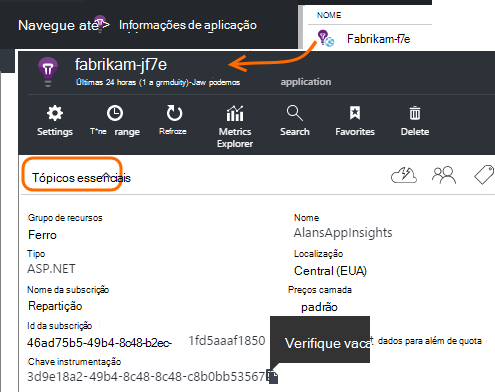
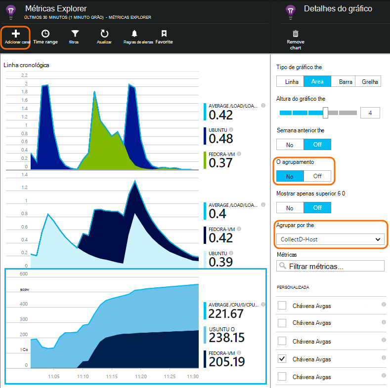

<properties 
    pageTitle="collectd: estatísticas de desempenho para Java em Unix na aplicação de informações" 
    description="Expandido a monitorização do seu Web site Java com o CollectD Plug-in para informações de aplicação" 
    services="application-insights" 
    documentationCenter="java"
    authors="alancameronwills" 
    manager="douge"/>

<tags 
    ms.service="application-insights" 
    ms.workload="tbd" 
    ms.tgt_pltfrm="ibiza" 
    ms.devlang="na" 
    ms.topic="article" 
    ms.date="08/24/2016" 
    ms.author="awills"/>
 
# <a name="collectd-unix-performance-metrics-in-application-insights"></a>collectd: métricas de desempenho de Unix na aplicação de informações

*Informações de aplicação está na pré-visualização.*

Para explorar métrica de desempenho do sistema de Unix em [Informações de aplicação](app-insights-overview.md), instale [collectd](http://collectd.org/), juntamente com as suas informações de aplicação de plug-in. Esta solução abrir origem reúne várias estatísticas de sistema e de rede.

Normalmente, que irá utilizar collectd se já tiver [instalado o serviço de web Java com informações de aplicação][java]. Dá-lhe mais dados para o ajudar a melhorar o desempenho da sua aplicação ou a diagnosticar os problemas. 


## <a name="get-your-instrumentation-key"></a>Obter a sua chave de instrumentação

No [portal do Microsoft Azure](https://portal.azure.com), abra o recurso de [Informações da aplicação](app-insights-overview.md) onde pretende que os dados sejam apresentados. (Ou [criar um novo recurso](app-insights-create-new-resource.md).)

Tomar uma cópia da chave de instrumentação, identifica o recurso.




## <a name="install-collectd-and-the-plug-in"></a>Instalar o plug-in e o collectd

Nos computadores de servidor Unix:

1. Instalar [collectd](http://collectd.org/) versão 5.4.0 ou posterior.
2. Transfira a [aplicação informações collectd sénior Plug-in](https://aka.ms/aijavasdk). Anote o número de versão.
3. Copiar o plug-in JAR para `/usr/share/collectd/java`.
3. Editar `/etc/collectd/collectd.conf`:
 * Certifique-se de que [o plug-in Java](https://collectd.org/wiki/index.php/Plugin:Java) está ativado.
 * Atualize o JVMArg para o java.class.path para incluir a seguinte para caixa. Atualize o número da versão para corresponder àquele que transferiu:
  * `/usr/share/collectd/java/applicationinsights-collectd-1.0.5.jar`
 * Adicione este fragmento, utilizar a chave de instrumentação a partir do seu recurso:

```

     LoadPlugin "com.microsoft.applicationinsights.collectd.ApplicationInsightsWriter"
     <Plugin ApplicationInsightsWriter>
        InstrumentationKey "Your key"
     </Plugin>
```

Aqui faz parte de um ficheiro de configuração de exemplo:

    ...
    # collectd plugins
    LoadPlugin cpu
    LoadPlugin disk
    LoadPlugin load
    ...

    # Enable Java Plugin
    LoadPlugin "java"

    # Configure Java Plugin
    <Plugin "java">
      JVMArg "-verbose:jni"
      JVMArg "-Djava.class.path=/usr/share/collectd/java/applicationinsights-collectd-1.0.5.jar:/usr/share/collectd/java/collectd-api.jar"

      # Enabling Application Insights plugin
      LoadPlugin "com.microsoft.applicationinsights.collectd.ApplicationInsightsWriter"
                
      # Configuring Application Insights plugin
      <Plugin ApplicationInsightsWriter>
        InstrumentationKey "12345678-1234-1234-1234-123456781234"
      </Plugin>

      # Other plugin configurations ...
      ...
    </Plugin>
.   ...

Configure outras [Plug-ins do collectd](https://collectd.org/wiki/index.php/Table_of_Plugins), que pode recolher dados de várias origens diferentes.

Reinicie o collectd de acordo com a sua [manual](https://collectd.org/wiki/index.php/First_steps).

## <a name="view-the-data-in-application-insights"></a>Ver os dados na aplicação de informações

No seu recurso de informações da aplicação, abra [métricas Explorer e adicione gráficos][metrics], selecionar métricas que pretende ver a partir da categoria personalizada.



Por predefinição, as métricas são agregadas ao longo de todos os computadores de anfitrião a partir do qual as métricas foram recolhidas. Para ver as métricas por anfitrião, o pá de detalhes do gráfico, ativar o agrupamento e, em seguida, selecione Agrupar por CollectD anfitrião.


## <a name="to-exclude-upload-of-specific-statistics"></a>Para excluir carregamento de estatísticas específicas

Por predefinição, o plug-in da aplicação informações envia todos os dados recolhidos pela collectd de activados 'ler' Plug-ins. 

Para excluir dados a partir de origens de dados ou de plug-ins específicas:

* Edite o ficheiro de configuração. 
* No `<Plugin ApplicationInsightsWriter>`, adicionar linhas directiva da seguinte forma:

Directiva | Efeito
---|---
`Exclude disk` | Excluir todos os dados recolhidos pela `disk` Plug-in
`Exclude disk:read,write` | Excluir origens denominadas `read` e `write` a partir do `disk` Plug-in.

Diretivas do separada com uma nova linha.


## <a name="problems"></a>Problemas?

*Não consigo ver dados no portal*

* Abrir a [pesquisa] [ diagnostic] para ver se os eventos observou comunica que recebeu. Por vezes, eles demorar mais tempo para aparecem no Explorador de métricas.
* Poderá ter de [Definir exceções de firewall para dados de saída](app-insights-ip-addresses.md)
* Active o rastreio no plug-in da aplicação informações. Adicione esta linha dentro de `<Plugin ApplicationInsightsWriter>`:
 *  `SDKLogger true`
* Abra um terminal e iniciar collectd no modo verboso, para ver quaisquer problemas que está a comunicar:
 * `sudo collectd -f`


<!--Link references-->

[api]: app-insights-api-custom-events-metrics.md
[apiexceptions]: app-insights-api-custom-events-metrics.md#track-exception
[availability]: app-insights-monitor-web-app-availability.md
[diagnostic]: app-insights-diagnostic-search.md
[eclipse]: app-insights-java-eclipse.md
[java]: app-insights-java-get-started.md
[javalogs]: app-insights-java-trace-logs.md
[metrics]: app-insights-metrics-explorer.md
[usage]: app-insights-web-track-usage.md

 
