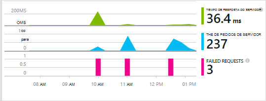
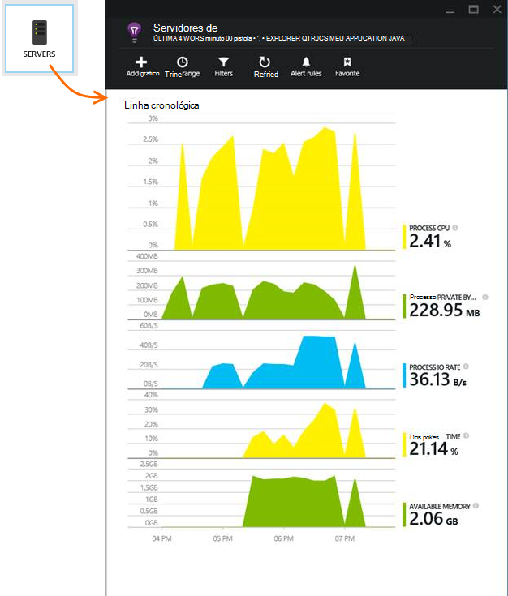

<properties 
    pageTitle="Começar a trabalhar com informações de aplicação com Java no Eclipse" 
    description="Utilizar o Eclipse Plug-in para adicionar o desempenho e a utilização de monitorização ao seu Web site Java com informações de aplicação" 
    services="application-insights" 
    documentationCenter="java"
    authors="alancameronwills" 
    manager="douge"/>

<tags 
    ms.service="application-insights" 
    ms.workload="tbd" 
    ms.tgt_pltfrm="ibiza" 
    ms.devlang="na" 
    ms.topic="article" 
    ms.date="03/02/2016" 
    ms.author="awills"/>
 
# Começar a trabalhar com informações de aplicação com Java no Eclipse

O SDK de informações da aplicação envia telemetria da sua aplicação web do Java para que pode analisar a utilização e o desempenho. O plug-in para informações de aplicação Eclipse instala automaticamente o SDK no seu projeto para que sair de telemetria de caixa, assim como uma API que pode utilizar para escrever telemetria personalizada.   

## Pré-requisitos

Atualmente Plug-in works para Maven projectos e dinâmicos Web no Eclipse. ([Adicionar informações de aplicação a outros tipos de projeto Java][java].)

Vai precisar de:

* Oracle JRE 1.6 ou posterior
* Uma subscrição do [Microsoft Azure](https://azure.microsoft.com/). (Poderia começar com a [versão de avaliação gratuita](https://azure.microsoft.com/pricing/free-trial/).)
* [Eclipse IDE para programadores de EE Java](http://www.eclipse.org/downloads/), Indigo ou posterior.
* Windows 7 ou posterior, ou Windows Server 2008 ou posterior

## Instalar o SDK no Eclipse (uma vez)

Só tem de fazer esta uma vez por máquina. Este passo instala um toolkit que, em seguida, pode adicionar o SDK para cada projeto Web dinâmicos.

1. No Eclipse, clique em Ajuda, instalar Software de novo.

    

2. O SDK está no http://dl.windowsazure.com/eclipse, em Azure Toolkit. 
3. Desmarque **todos os sites de atualização de contacto...**

    

Siga os restantes passos para cada projeto Java.

## Criar um recurso de informações de aplicação no Azure

1. Inicie sessão no [portal do Azure](https://portal.azure.com).
2. Crie um novo recurso de informações da aplicação.  

      
3. Defina o tipo de aplicação para a aplicação web do Java.  

      
4. Localize a chave de instrumentação do novo recurso. Terá de colá isto o projeto de código em breve.  

      

## Adicionar informações da aplicação ao seu projeto

1. Adicione informações de aplicação no menu de contexto do projeto Java web.

    

2. Cole a chave de instrumentação que recebeu do portal do Azure.

    

A tecla é enviada juntamente com todos os itens de telemetria e indica informações de aplicação para apresentá-lo no seu recurso.

## Execute a aplicação e Consulte métricas

Execute a sua aplicação.

Regressar ao seu recurso de informações de aplicação no Microsoft Azure.

Dados de pedidos HTTP irão aparecer em pá a descrição geral. (Se não existir, aguarde alguns segundos e, em seguida, clique em Atualizar).

 

Clique para ver mais detalhadas métricas. 

[Saiba mais sobre métricas.][metrics]

 

E quando ver as propriedades de um pedido, pode ver os eventos de telemetria associados como pedidos e exceções.
 

## Telemetria do lado do cliente

Pá guia de introdução, clique em obter código para monitorizar a minha páginas web: 

Inserir o fragmento de código na cabeça dos seus ficheiros HTML.

#### Dados de visualização do lado do cliente

Abra as suas páginas web actualizado e utilizá-los. Aguarde um minuto ou dois, em seguida, volte para informações de aplicação e abra o pá a utilização. (Pá descrição geral, desloque-se para baixo e clique em utilização.)

Métricas de vista, o utilizador e sessão página serão apresentados na pá de utilização:

[Saiba mais sobre a configuração de telemetria do lado do cliente.][usage]

## Publicar a sua aplicação

Agora publica a sua aplicação para o servidor, utilização de permitir que as pessoas e monitorização de telemetria que aparecem no portal do.

* Certifique-se da firewall do permite que a aplicação enviar telemetria para estas portas:

 * DC.Services.visualstudio.com:443
 * DC.Services.visualstudio.com:80
 * F5.Services.visualstudio.com:443
 * F5.Services.visualstudio.com:80

* Nos servidores do Windows, instale:

 * [Microsoft Visual C++ Redistributable](http://www.microsoft.com/download/details.aspx?id=40784)

    (Isto permite contadores de desempenho.)

## Exceções e falhas do pedido

Exceções não processadas são recolhidas automaticamente:

Para recolher dados outras exceções, tem duas opções:

* [Insira chamadas para TrackException no seu código](app-insights-api-custom-events-metrics.md#track-exception). 
* [Instalar o agente de Java no servidor](app-insights-java-agent.md). Especifique os métodos que pretende ver.

## Monitorizar chamadas método e dependências externas

[Instalar o agente de Java](app-insights-java-agent.md) para iniciar sessão especificados métodos internos e chamadas efetuadas através de JDBC, com dados de temporização.

## Contadores de desempenho

No seu pá de descrição geral, desloque-se para baixo e clique no mosaico de **servidores** . Irá ver um intervalo de contadores de desempenho.

### Personalizar a recolha contador de desempenho

Para desativar a coleção de um conjunto padrão de contadores de desempenho, adicione o seguinte código sob o nó de raiz do ficheiro ApplicationInsights.xml:

    <PerformanceCounters>
       <UseBuiltIn>False</UseBuiltIn>
    </PerformanceCounters>

### Recolher contadores de desempenho adicionais

Pode especificar contadores de desempenho adicionais a serem recolhidos.

#### Contadores JMX (expostos pela Java Virtual Machine)

    <PerformanceCounters>
      <Jmx>
        <Add objectName="java.lang:type=ClassLoading" attribute="TotalLoadedClassCount" displayName="Loaded Class Count"/>
        <Add objectName="java.lang:type=Memory" attribute="HeapMemoryUsage.used" displayName="Heap Memory Usage-used" type="composite"/>
      </Jmx>
    </PerformanceCounters>

*   `displayName`– O nome apresentado no portal do informações de aplicação.
*   `objectName`– Nome do objeto o JMX.
*   `attribute`– O atributo do nome do objeto do JMX para obter
*   `type`(opcional) - o tipo de atributo do objeto JMX:
 *  Predefinição: um tipo simples como int ou longa.
 *  `composite`: os dados de contador de desempenho estão no formato de 'Attribute.Data'
 *  `tabular`: os dados de contador de desempenho estão no formato de uma linha de tabela

#### Contadores de desempenho do Windows

Cada [contador de desempenho do Windows](https://msdn.microsoft.com/library/windows/desktop/aa373083.aspx) é um membro de uma categoria (da mesma forma que um campo é um membro de uma classe). Categorias podem ser globais, ou podem ter numerada ou com o nome instâncias.

    <PerformanceCounters>
      <Windows>
        <Add displayName="Process User Time" categoryName="Process" counterName="%User Time" instanceName="__SELF__" />
        <Add displayName="Bytes Printed per Second" categoryName="Print Queue" counterName="Bytes Printed/sec" instanceName="Fax" />
      </Windows>
    </PerformanceCounters>

*   displayName – o nome apresentado no portal do informações de aplicação.
*   NomeDaCategoria – a categoria de contador de desempenho (objecto de desempenho) à qual este contador de desempenho está associado.
*   counterName – o nome do contador de desempenho.
*   instanceName – o nome da instância do desempenho contador categoria ou uma cadeia vazia (""), se a categoria contém uma única ocorrência. Se o NomeDaCategoria é processo e o contador de desempenho que gostaria de recolher do processo de JVM atual no qual está a executar a aplicação, especificar `"__SELF__"`.

Contadores de desempenho são identificáveis com métricas personalizadas no [Explorador de métricas][metrics].

### Contadores de desempenho de UNIX

* [Instalar collectd com o plug-in da aplicação de informações](app-insights-java-collectd.md) para obter uma grande variedade de dados de sistema e de rede.

## Testes de web de disponibilidade

Informações de aplicação podem testar o seu Web site em intervalos regulares para verificar que é para cima e a responder bem. [Para configurar o][availability], desloque-se para baixo para clique em disponibilidade.

Obterá gráficos da tempos de resposta, juntamente com as notificações de correio eletrónico se o seu site vai para baixo.

[Saiba mais sobre a disponibilidade testes de web.][availability] 

## Registos de diagnóstico

Se estiver a utilizar o Logback ou Log4J (v 1.2 ou 2.0) para rastreio, pode ter os registos de rastreio enviados automaticamente para informações de aplicação, onde pode explorar e procurar nos mesmos.

[Obter mais informações sobre registos de diagnóstico][javalogs]

## Telemetria personalizada 

Inserir algumas linhas de código na aplicação web Java para saber o que os utilizadores estão a fazer com o mesmo ou para o ajudar a diagnosticar os problemas. 

Pode inserir código na página web JavaScript e em Java o lado do servidor.

[Saiba mais sobre telemetria personalizada][track]

## Próximos passos

#### Detetar e diagnosticar problemas

* [Adicionar telemetria de cliente web] [ usage] para obter telemetria do desempenho do cliente a web.
* [Configurar o testes web] [ availability] para garantir a aplicação permanece direto e responder.
* [Procurar registos de eventos e] [ diagnostic] para o ajudar a diagnosticar os problemas.
* [Capturar Log4J ou Logback rastreios][javalogs]

#### Controlar a utilização

* [Adicionar telemetria de cliente web] [ usage] para vistas de página monitor e métricas de utilizador básica.
* [Controlar eventos personalizados e métricas] [ track] para saber mais sobre como a aplicação é utilizada, tanto no cliente e no servidor.

<!--Link references-->

[availability]: app-insights-monitor-web-app-availability.md
[diagnostic]: app-insights-diagnostic-search.md
[java]: app-insights-java-get-started.md
[javalogs]: app-insights-java-trace-logs.md
[metrics]: app-insights-metrics-explorer.md
[track]: app-insights-api-custom-events-metrics.md
[usage]: app-insights-web-track-usage.md

 