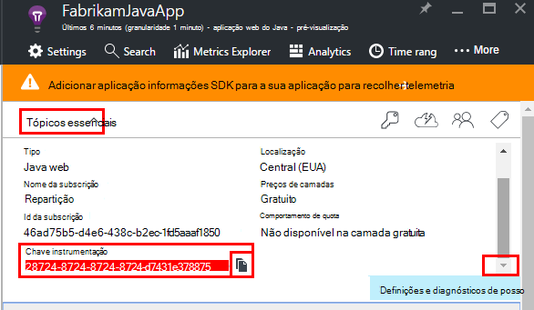

<properties
    pageTitle="Análise de aplicação web Java com informações de aplicação | Microsoft Azure"
    description="Monitorizar o desempenho e a utilização do seu Web site Java com informações de aplicação. "
    services="application-insights"
    documentationCenter="java"
    authors="alancameronwills"
    manager="douge"/>

<tags
    ms.service="application-insights"
    ms.workload="tbd"
    ms.tgt_pltfrm="ibiza"
    ms.devlang="na"
    ms.topic="get-started-article"
    ms.date="08/17/2016"
    ms.author="awills"/>

# Começar a trabalhar com informações de aplicação num projeto de web Java

*Informações de aplicação está na pré-visualização.*

[AZURE.INCLUDE [app-insights-selector-get-started](../../includes/app-insights-selector-get-started.md)]

[Informações de aplicação](https://azure.microsoft.com/services/application-insights/) é um serviço de análise extensible que o ajuda a compreender o desempenho e a utilização da sua aplicação direto. Utilizá-la para [detetar e diagnosticar problemas de desempenho e exceções](app-insights-detect-triage-diagnose.md)e [escrever código] [ api] para controlar o que os utilizadores fazer com a sua aplicação.

Informações de aplicação suporta Java aplicações em execução no Windows, Unix ou Linux.

Precisa de:

* Oracle JRE 1.6 ou posterior, ou JRE Zulu 1.6 ou posterior
* Uma subscrição do [Microsoft Azure](https://azure.microsoft.com/). (Poderia começar com a [versão de avaliação gratuita](https://azure.microsoft.com/pricing/free-trial/).)

*Se tiver uma aplicação web que já se encontra direto, poderia siga o procedimento alternativo para [Adicionar o SDK do tempo de execução no servidor web](app-insights-java-live.md). Essa alternativa evita o código de a reconstruir, mas não receberá a opção para escrever código para monitorizar a atividade de utilizador.*

## 1. a obter uma chave de instrumentação informações de aplicação

1. Inicie sessão no [portal do Microsoft Azure](https://portal.azure.com).
2. Crie um recurso de informações da aplicação. Defina o tipo de aplicação para a aplicação web do Java.

    
4. Localize a chave de instrumentação do novo recurso. Terá de colá esta tecla o projeto de código em breve.

    

## 2. adicionar o SDK de informações de aplicação para Java ao seu projeto

*Selecione a forma adequada para o seu projeto.*

#### Se estiver a utilizar Eclipse para criar um projeto Maven ou Web dinâmicos...

Utilizar o [SDK de informações de aplicação para o plug-in Java][eclipse].

#### Se estiver a utilizar o Maven...

Se o projeto já está configurado para utilizar Maven para construir, intercale o código seguinte para o seu ficheiro pom.xml.

Em seguida, Atualize as dependências de projecto para obter os binários transferidos.

    <repositories>
       <repository>
          <id>central</id>
          <name>Central</name>
          <url>http://repo1.maven.org/maven2</url>
       </repository>
    </repositories>

    <dependencies>
      <dependency>
        <groupId>com.microsoft.azure</groupId>
        <artifactId>applicationinsights-web</artifactId>
        <!-- or applicationinsights-core for bare API -->
        <version>[1.0,)</version>
      </dependency>
    </dependencies>

* *Soma de verificação ou compilar os erros de validação?* Experimente utilizar uma versão específica, tais como: `<version>1.0.n</version>`. Encontrará a versão mais recente no [notas de lançamento SDK](https://github.com/Microsoft/ApplicationInsights-Java#release-notes) ou no nosso [artefactos Maven](http://search.maven.org/#search%7Cga%7C1%7Capplicationinsights).
* *Necessita de atualizar para um novo SDK?* Actualize dependências do seu projeto.

#### Se estiver a utilizar o Gradle...

Se o projeto já está configurado para utilizar Gradle para construir, intercale o código seguinte para o seu ficheiro build.gradle.

Em seguida, Atualize as dependências de projecto para obter os binários transferidos.

    repositories {
      mavenCentral()
    }

    dependencies {
      compile group: 'com.microsoft.azure', name: 'applicationinsights-web', version: '1.+'
      // or applicationinsights-core for bare API
    }

* Erros de validação soma de verificação ou de compilação de *? Experimente utilizar uma versão específica, tais como:* `version:'1.0.n'`. *Encontrará a versão mais recente no [SDK notas de lançamento](https://github.com/Microsoft/ApplicationInsights-Java#release-notes).*
* *Que Atualize para um novo SDK*
 * Actualize dependências do seu projeto.

#### Caso contrário,...

Adicione manualmente o SDK:

1. Transfira a [aplicação informações SDK para Java](https://aka.ms/aijavasdk).
2. Extrair os binários do ficheiro zip e adicioná-los ao seu projeto.

### Perguntas...

* *O que é a relação entre o `-core` e `-web` componentes no zip?*

 * `applicationinsights-core`dá-lhe a API simples. Tem sempre este componente.
 * `applicationinsights-web`dá-lhe métricas controlam contagens de pedido HTTP e tempos de resposta. Pode omitir este componente se não quiser que este telemetria recolhida automaticamente. Por exemplo, se pretender escrever sua própria.

* *Para atualizar o SDK quando podemos publicar as alterações*
 * Transferir o mais recente [SDK de informações de aplicação para Java](https://aka.ms/qqkaq6) e substitua os ficheiros mais antigos.
 * As alterações são descritas nas [notas de lançamento SDK](https://github.com/Microsoft/ApplicationInsights-Java#release-notes).

## 3. Adicionar um ficheiro. XML de informações de aplicação

Adicione ApplicationInsights.xml para a pasta de recursos no projeto ou certifique-se de que é adicionado à caminho de classe de implementação do seu projeto. Copie o XML seguinte na mesma.

Substitua a chave de instrumentação que recebeu do portal do Azure.

    <?xml version="1.0" encoding="utf-8"?>
    <ApplicationInsights xmlns="http://schemas.microsoft.com/ApplicationInsights/2013/Settings" schemaVersion="2014-05-30">

      <!-- The key from the portal: -->

      <InstrumentationKey>** Your instrumentation key **</InstrumentationKey>

      <!-- HTTP request component (not required for bare API) -->

      <TelemetryModules>
        <Add type="com.microsoft.applicationinsights.web.extensibility.modules.WebRequestTrackingTelemetryModule"/>
        <Add type="com.microsoft.applicationinsights.web.extensibility.modules.WebSessionTrackingTelemetryModule"/>
        <Add type="com.microsoft.applicationinsights.web.extensibility.modules.WebUserTrackingTelemetryModule"/>
      </TelemetryModules>

      <!-- Events correlation (not required for bare API) -->
      <!-- These initializers add context data to each event -->

      <TelemetryInitializers>
        <Add   type="com.microsoft.applicationinsights.web.extensibility.initializers.WebOperationIdTelemetryInitializer"/>
        <Add type="com.microsoft.applicationinsights.web.extensibility.initializers.WebOperationNameTelemetryInitializer"/>
        <Add type="com.microsoft.applicationinsights.web.extensibility.initializers.WebSessionTelemetryInitializer"/>
        <Add type="com.microsoft.applicationinsights.web.extensibility.initializers.WebUserTelemetryInitializer"/>
        <Add type="com.microsoft.applicationinsights.web.extensibility.initializers.WebUserAgentTelemetryInitializer"/>

      </TelemetryInitializers>
    </ApplicationInsights>

* A tecla instrumentação é enviada juntamente com todos os itens de telemetria e indica informações de aplicação para apresentá-lo no seu recurso.
* O componente de pedido de HTTP é opcional. Envia automaticamente telemetria sobre os pedidos e tempos de resposta ao portal.
* Correlação eventos é um suplemento para o componente de pedido HTTP. Atribui um identificador a cada pedido recebido pelo servidor e adiciona este identificador como uma propriedade para cada item de telemetria como a propriedade 'Operation.Id'. Permite-lhe relacionar telemetria associada com cada pedido por definir um filtro na [pesquisa de diagnóstico][diagnostic].
* A tecla de aplicação informações pode ser passada dinamicamente a partir do portal do Azure como uma propriedade do sistema (-DAPPLICATION_INSIGHTS_IKEY = your_ikey). Se não existirem nenhuma propriedade definida, verifica a existência de variável de ambiente (APPLICATION_INSIGHTS_IKEY) nas definições de aplicação do Azure. Se ambas as propriedades estão indefinidas, é utilizada a predefinição InstrumentationKey a partir do ApplicationInsights.xml. Esta sequência ajuda-o para gerir dinamicamente InstrumentationKeys diferentes para diferentes ambientes.

### Formas alternativas para definir a chave de instrumentação

Aplicação informações SDK procura a tecla pela seguinte ordem:

1. Propriedade do sistema:-DAPPLICATION_INSIGHTS_IKEY = your_ikey
2. Variável de ambiente: APPLICATION_INSIGHTS_IKEY
3. Ficheiro de configuração: ApplicationInsights.xml

Também pode [configurá-lo no código](app-insights-api-custom-events-metrics.md#ikey):

    telemetryClient.InstrumentationKey = "...";

## 4. a adicionar um filtro HTTP

O último passo de configuração permite que o componente de pedido HTTP iniciar sessão cada pedido da web. (Não necessárias se apenas pretende que a API partes).

Localize e abra o ficheiro web.xml no seu projeto e intercalar o código seguinte em nó da aplicação web, onde os filtros de aplicação estão configurados.

Para obter os resultados mais precisos, o filtro deve ser mapeado antes de todos os outros filtros.

    <filter>
      <filter-name>ApplicationInsightsWebFilter</filter-name>
      <filter-class>
        com.microsoft.applicationinsights.web.internal.WebRequestTrackingFilter
      </filter-class>
    </filter>
    <filter-mapping>
       <filter-name>ApplicationInsightsWebFilter</filter-name>
       <url-pattern>/*</url-pattern>
    </filter-mapping>

#### Se estiver a utilizar o Web Primavera MVC 3.1 ou posterior

Edite estes elementos para incluir o pacote de aplicação informações:

    <context:component-scan base-package=" com.springapp.mvc, com.microsoft.applicationinsights.web.spring"/>

    <mvc:interceptors>
        <mvc:interceptor>
            <mvc:mapping path="/**"/>
            <bean class="com.microsoft.applicationinsights.web.spring.RequestNameHandlerInterceptorAdapter" />
        </mvc:interceptor>
    </mvc:interceptors>

#### Se estiver a utilizar o Struts 2

Adicione este item para o ficheiro de configuração de traves (geralmente denominado struts.xml ou traves default.xml):

     <interceptors>
       <interceptor name="ApplicationInsightsRequestNameInterceptor" class="com.microsoft.applicationinsights.web.struts.RequestNameInterceptor" />
     </interceptors>
     <default-interceptor-ref name="ApplicationInsightsRequestNameInterceptor" />

(Se tiver interceptors definidas na pilha de predefinido, o interceptor da pode simplesmente ser adicionados nessa pilha.)

## 5. executar a sua aplicação

Quer executá-la no modo de depuração no seu computador de desenvolvimento ou publicar ao seu servidor.

## 6. ver o seu telemetria no informações de aplicação

Regressar ao seu recurso de informações de aplicação no [portal do Microsoft Azure](https://portal.azure.com).

Dados de pedidos HTTP aparecem na pá a descrição geral. (Se não existir, aguarde alguns segundos e, em seguida, clique em Atualizar).

[Saiba mais sobre métricas.][metrics]

Clique para ver mais detalhadas métricas agregadas.

> Informações de aplicação assume o formato de pedidos de HTTP para aplicações MVC é: `VERB controller/action`. Por exemplo, `GET Home/Product/f9anuh81`, `GET Home/Product/2dffwrf5` e `GET Home/Product/sdf96vws` estão agrupadas em `GET Home/Product`. Este agrupamento permite significativas agregações de pedidos, como o número de pedidos e tempo de execução médio para pedidos de.

### Dados da instância 

Clique em através de um tipo de pedido específico para ver ocorrências individuais. 

Dois tipos de dados são apresentados na aplicação de informações: dados agregados, armazenados e apresentadas como médias, contagens e somas; e instância dados - relatórios individuais de HTTP pedidos, exceções, vistas de página ou eventos personalizados.

Quando visualizar as propriedades de um pedido, pode ver os eventos de telemetria associados como pedidos e exceções.

### Análise: Idioma de consulta poderosa

Como acumular mais dados, pode executar consultas tanto para agregar dados e encontrar ocorrências individuais. [Análise]() é uma poderosa ferramenta para ambas para Noções sobre o desempenho e a utilização e para fins de diagnóstico.

## 7. instalar a aplicação no servidor

Agora publica a sua aplicação para o servidor, utilização de permitir que as pessoas e monitorização de telemetria que aparecem no portal do.

* Certifique-se da firewall do permite que a aplicação enviar telemetria para estas portas:

 * DC.Services.visualstudio.com:443
 * F5.Services.visualstudio.com:443

* Nos servidores do Windows, instale:

 * [Microsoft Visual C++ Redistributable](http://www.microsoft.com/download/details.aspx?id=40784)

    (Este componente permite contadores de desempenho).

## Exceções e falhas do pedido

Exceções não processadas são recolhidas automaticamente:

Para recolher dados outras exceções, tem duas opções:

* [Insira chamadas para trackException() no seu código][apiexceptions]. 
* [Instalar o agente de Java no servidor](app-insights-java-agent.md). Especifique os métodos que pretende ver.

## Monitorizar chamadas método e dependências externas

[Instalar o agente de Java](app-insights-java-agent.md) para iniciar sessão especificados métodos internos e chamadas efetuadas através de JDBC, com dados de temporização.

## Contadores de desempenho

Abra **as definições de** **servidores**, para ver um intervalo de contadores de desempenho.

### Personalizar a recolha contador de desempenho

Para desativar a coleção de um conjunto padrão de contadores de desempenho, adicione o seguinte código sob o nó de raiz do ficheiro ApplicationInsights.xml:

    <PerformanceCounters>
       <UseBuiltIn>False</UseBuiltIn>
    </PerformanceCounters>

### Recolher contadores de desempenho adicionais

Pode especificar contadores de desempenho adicionais a serem recolhidos.

#### Contadores JMX (expostos pela Java Virtual Machine)

    <PerformanceCounters>
      <Jmx>
        <Add objectName="java.lang:type=ClassLoading" attribute="TotalLoadedClassCount" displayName="Loaded Class Count"/>
        <Add objectName="java.lang:type=Memory" attribute="HeapMemoryUsage.used" displayName="Heap Memory Usage-used" type="composite"/>
      </Jmx>
    </PerformanceCounters>

*   `displayName`– O nome apresentado no portal do informações de aplicação.
*   `objectName`– Nome do objeto o JMX.
*   `attribute`– O atributo do nome do objeto do JMX para obter
*   `type`(opcional) - o tipo de atributo do objeto JMX:
 *  Predefinição: um tipo simples como int ou longa.
 *  `composite`: os dados de contador de desempenho estão no formato de 'Attribute.Data'
 *  `tabular`: os dados de contador de desempenho estão no formato de uma linha de tabela

#### Contadores de desempenho do Windows

Cada [contador de desempenho do Windows](https://msdn.microsoft.com/library/windows/desktop/aa373083.aspx) é um membro de uma categoria (da mesma forma que um campo é um membro de uma classe). Categorias podem ser globais, ou podem ter numerada ou com o nome instâncias.

    <PerformanceCounters>
      <Windows>
        <Add displayName="Process User Time" categoryName="Process" counterName="%User Time" instanceName="__SELF__" />
        <Add displayName="Bytes Printed per Second" categoryName="Print Queue" counterName="Bytes Printed/sec" instanceName="Fax" />
      </Windows>
    </PerformanceCounters>

*   displayName – o nome apresentado no portal do informações de aplicação.
*   NomeDaCategoria – a categoria de contador de desempenho (objecto de desempenho) à qual este contador de desempenho está associado.
*   counterName – o nome do contador de desempenho.
*   instanceName – o nome da instância do desempenho contador categoria ou uma cadeia vazia (""), se a categoria contém uma única ocorrência. Se o NomeDaCategoria é processo e o contador de desempenho que gostaria de recolher do processo de JVM atual no qual está a executar a aplicação, especificar `"__SELF__"`.

Contadores de desempenho são identificáveis com métricas personalizadas no [Explorador de métricas][metrics].

### Contadores de desempenho de UNIX

* [Instalar collectd com o plug-in da aplicação de informações](app-insights-java-collectd.md) para obter uma grande variedade de dados de sistema e de rede.

## Obter dados de sessão e de utilizador

OK, estiver a enviar telemetria a partir do seu servidor web. Agora para obter a vista de 360 graus da sua aplicação, pode adicionar monitorização mais:

* [Adicionar telemetria às suas páginas web] [ usage] para vistas de página monitor e métricas de utilizador.
* [Configurar o testes web] [ availability] para garantir a aplicação permanece direto e responder.

## Capturar rastreios de registo

Pode utilizar as informações de aplicação para registos setor e dados Log4J, Logback ou outros quadros de registo. Pode correlacionar os registos com pedidos de HTTP e outros telemetria. [Saiba como][javalogs].

## Enviar o seu próprio telemetria

Agora que tiver instalado o SDK, pode utilizar a API para enviar o seu próprio telemetria.

* [Controlar eventos personalizados e métricas] [ api] para saber o que os utilizadores estão a fazer com a aplicação.
* [Procurar registos de eventos e] [ diagnostic] para o ajudar a diagnosticar os problemas.

## Testes de web de disponibilidade

Informações de aplicação podem testar o seu Web site em intervalos regulares para verificar que é para cima e a responder bem. [Para configurar o][availability], clique em testes Web.

Obterá gráficos da tempos de resposta, juntamente com as notificações de correio eletrónico se o seu site vai para baixo.

[Saiba mais sobre a disponibilidade testes de web.][availability] 

## Perguntas? Problemas?

[Resolução de problemas Java](app-insights-java-troubleshoot.md)

## Próximos passos

Para mais informações, consulte o [Centro de programadores do Java](/develop/java/).

<!--Link references-->

[api]: app-insights-api-custom-events-metrics.md
[apiexceptions]: app-insights-api-custom-events-metrics.md#track-exception
[availability]: app-insights-monitor-web-app-availability.md
[diagnostic]: app-insights-diagnostic-search.md
[eclipse]: app-insights-java-eclipse.md
[javalogs]: app-insights-java-trace-logs.md
[metrics]: app-insights-metrics-explorer.md
[usage]: app-insights-web-track-usage.md
