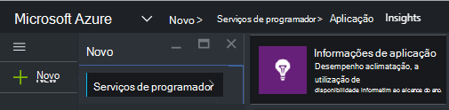
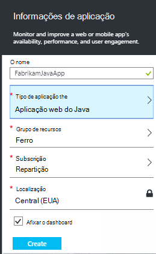
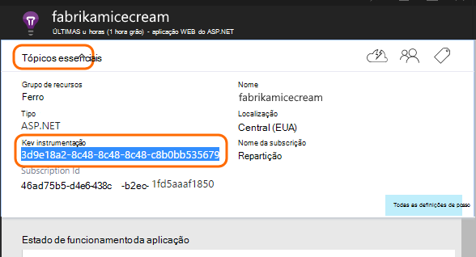
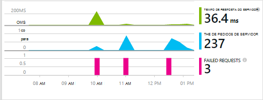
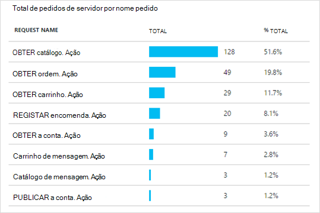
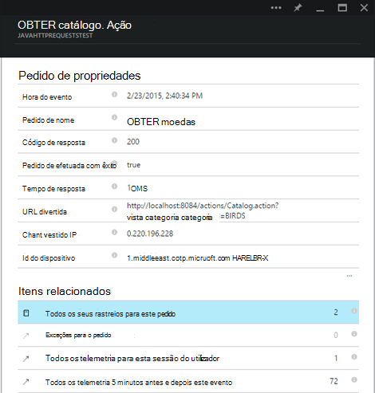

<properties 
    pageTitle="Informações de aplicação para Java web apps que já sejam encontram live" 
    description="Iniciar a monitorização de uma aplicação web que já está em execução no servidor" 
    services="application-insights" 
    documentationCenter="java"
    authors="alancameronwills" 
    manager="douge"/>

<tags 
    ms.service="application-insights" 
    ms.workload="tbd" 
    ms.tgt_pltfrm="ibiza" 
    ms.devlang="na" 
    ms.topic="article" 
    ms.date="08/24/2016" 
    ms.author="awills"/>
 
# Informações de aplicação para Java web apps que já sejam encontram live

*Informações de aplicação está na pré-visualização.*

Se tiver uma aplicação web que já está em execução no servidor J2EE, pode começar a monitorizá-lo com [Informações de aplicação](app-insights-overview.md) sem precisar de efetuar alterações de código ou recompilar o seu projeto. Com esta opção, obtenha informações sobre os pedidos de HTTP enviadas para o seu servidor, não processadas exceções e contadores de desempenho.

Terá de uma subscrição do [Microsoft Azure](https://azure.com).

> [AZURE.NOTE] O procedimento nesta página adiciona o SDK para a sua aplicação web o tempo de execução. Este instrumentação runtime é útil se não quiser atualizar ou reconstruir o código fonte. Mas, se possível, recomendamos [adicione o SDK para o código de origem](app-insights-java-get-started.md) em vez disso. Que dá-lhe mais opções, tais como escrever código para monitorizar a atividade de utilizador.

## 1. a obter uma chave de instrumentação informações de aplicação

1. Inicie sessão no [portal do Microsoft Azure](https://portal.azure.com)
2. Criar um novo recurso de informações de aplicação

    
3. Defina o tipo de aplicação para a aplicação web do Java.

    
4. Localize a chave de instrumentação do novo recurso. Terá de colá esta tecla o projeto de código em breve.

    

## 2. a transferir o SDK

1. Transfira a [aplicação informações SDK para Java](https://aka.ms/aijavasdk). 
2. No servidor, extraia o conteúdo SDK ao diretório a partir do qual são carregados binários do seu projeto. Se estiver a utilizar Tomcat, este diretório normalmente seria em`webapps\<your_app_name>\WEB-INF\lib`

## 3. Adicionar um ficheiro xml de informações de aplicação

Crie ApplicationInsights.xml na pasta na qual adicionou o SDK. Coloque na mesma o XML seguinte.

Substitua a chave de instrumentação que recebeu do portal do Azure.

    <?xml version="1.0" encoding="utf-8"?>
    <ApplicationInsights xmlns="http://schemas.microsoft.com/ApplicationInsights/2013/Settings" schemaVersion="2014-05-30">

      <!-- The key from the portal: -->

      <InstrumentationKey>** Your instrumentation key **</InstrumentationKey>

      <!-- HTTP request component (not required for bare API) -->

      <TelemetryModules>
        <Add type="com.microsoft.applicationinsights.web.extensibility.modules.WebRequestTrackingTelemetryModule"/>
        <Add type="com.microsoft.applicationinsights.web.extensibility.modules.WebSessionTrackingTelemetryModule"/>
        <Add type="com.microsoft.applicationinsights.web.extensibility.modules.WebUserTrackingTelemetryModule"/>
      </TelemetryModules>

      <!-- Events correlation (not required for bare API) -->
      <!-- These initializers add context data to each event -->

      <TelemetryInitializers>
        <Add   type="com.microsoft.applicationinsights.web.extensibility.initializers.WebOperationIdTelemetryInitializer"/>
        <Add type="com.microsoft.applicationinsights.web.extensibility.initializers.WebOperationNameTelemetryInitializer"/>
        <Add type="com.microsoft.applicationinsights.web.extensibility.initializers.WebSessionTelemetryInitializer"/>
        <Add type="com.microsoft.applicationinsights.web.extensibility.initializers.WebUserTelemetryInitializer"/>
        <Add type="com.microsoft.applicationinsights.web.extensibility.initializers.WebUserAgentTelemetryInitializer"/>

      </TelemetryInitializers>
    </ApplicationInsights>

* A tecla instrumentação é enviada juntamente com todos os itens de telemetria e indica informações de aplicação para apresentá-lo no seu recurso.
* O componente de pedido de HTTP é opcional. Envia automaticamente telemetria sobre os pedidos e tempos de resposta ao portal.
* Correlação eventos é um suplemento para o componente de pedido HTTP. Atribui um identificador a cada pedido recebido pelo servidor e adiciona este identificador como uma propriedade para cada item de telemetria como a propriedade 'Operation.Id'. Permite-lhe relacionar telemetria associada com cada pedido por definir um filtro na [pesquisa diagnóstico](app-insights-diagnostic-search.md).

## 4. a adicionar um filtro HTTP

Localize e abra o ficheiro web.xml no seu projeto e intercalar seguinte fragmento de código em nó da aplicação web, onde os filtros de aplicação estão configurados.

Para obter os resultados mais precisos, o filtro deve ser mapeado antes de todos os outros filtros.

    <filter>
      <filter-name>ApplicationInsightsWebFilter</filter-name>
      <filter-class>
        com.microsoft.applicationinsights.web.internal.WebRequestTrackingFilter
      </filter-class>
    </filter>
    <filter-mapping>
       <filter-name>ApplicationInsightsWebFilter</filter-name>
       <url-pattern>/*</url-pattern>
    </filter-mapping>

## 5. exceções da firewall de verificação

Poderá ter de [Definir exceções para enviar dados de saída](app-insights-ip-addresses.md).

## 6. Reinicie a aplicação web

## 7. ver o seu telemetria no informações de aplicação

Regressar ao seu recurso de informações de aplicação no [portal do Microsoft Azure](https://portal.azure.com).

Telemetria acerca dos pedidos de HTTP aparece na pá a descrição geral. (Se não existir, aguarde alguns segundos e, em seguida, clique em Atualizar).

 

Clique para ver mais detalhadas métricas. 

 

E quando ver as propriedades de um pedido, pode ver os eventos de telemetria associados como pedidos e exceções.
 

[Saiba mais sobre métricas.](app-insights-metrics-explorer.md)

## Próximos passos

* [Adicionar telemetria às suas páginas web](app-insights-web-track-usage.md) a vistas de página do monitor e métricas de utilizador.
* [Configurar o testes web](app-insights-monitor-web-app-availability.md) para garantir que a aplicação permanece direto e responder.
* [Capturar rastreios de registo](app-insights-java-trace-logs.md)
* [Eventos de pesquisa e registos](app-insights-diagnostic-search.md) para o ajudar a diagnosticar os problemas.

 
