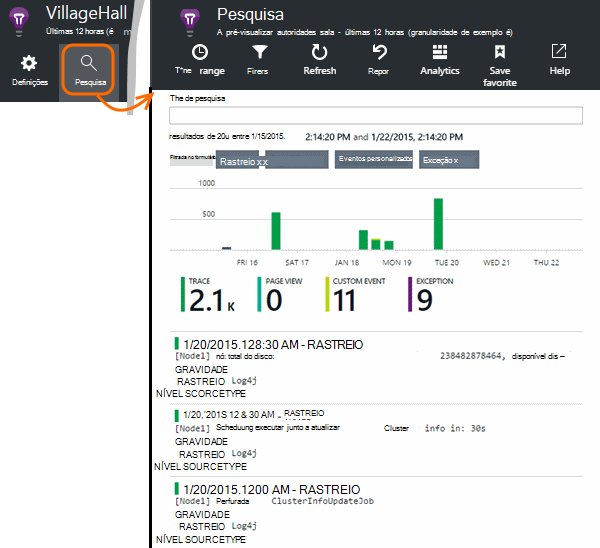

<properties 
    pageTitle="Explorar Java rastreio registos na aplicação de informações" 
    description="Pesquisa Log4J ou Logback rastreios na aplicação de informações" 
    services="application-insights" 
    documentationCenter="java"
    authors="alancameronwills" 
    manager="douge"/>

<tags 
    ms.service="application-insights" 
    ms.workload="tbd" 
    ms.tgt_pltfrm="ibiza" 
    ms.devlang="na" 
    ms.topic="article" 
    ms.date="07/12/2016" 
    ms.author="awills"/>

# Explorar Java rastreio registos na aplicação de informações

Se estiver a utilizar o Logback ou Log4J (v 1.2 ou 2.0) para rastreio, pode ter os registos de rastreio enviados automaticamente para informações de aplicação, onde pode explorar e procurar nos mesmos.

Instalar a [Aplicação informações SDK para Java][java], se ainda não o tiver feito que.

## Adicionar bibliotecas de registo ao seu projeto

*Selecione a forma adequada para o seu projeto.*

#### Se estiver a utilizar o Maven...

Se o seu projeto já está configurado para utilizar Maven para construir, intercale um de fragmentos seguintes do código o ficheiro pom.xml.

Em seguida, Atualize as dependências de projeto, para obter os binários transferidos.

*Logback*

    <dependencies>
       <dependency>
          <groupId>com.microsoft.azure</groupId>
          <artifactId>applicationinsights-logging-logback</artifactId>
          <version>[1.0,)</version>
       </dependency>
    </dependencies>

*Log4J 2.0*

    <dependencies>
       <dependency>
          <groupId>com.microsoft.azure</groupId>
          <artifactId>applicationinsights-logging-log4j2</artifactId>
          <version>[1.0,)</version>
       </dependency>
    </dependencies>

*V Log4J 1.2*

    <dependencies>
       <dependency>
          <groupId>com.microsoft.azure</groupId>
          <artifactId>applicationinsights-logging-log4j1_2</artifactId>
          <version>[1.0,)</version>
       </dependency>
    </dependencies>

#### Se estiver a utilizar o Gradle...

Se o projeto já está configurado para utilizar Gradle para construir, adicione uma das linhas seguintes para a `dependencies` grupo no seu ficheiro build.gradle:

Em seguida, Atualize as dependências de projeto, para obter os binários transferidos.

**Logback**

    compile group: 'com.microsoft.azure', name: 'applicationinsights-logging-logback', version: '1.0.+'

**Log4J 2.0**

    compile group: 'com.microsoft.azure', name: 'applicationinsights-logging-log4j2', version: '1.0.+'

**V Log4J 1.2**

    compile group: 'com.microsoft.azure', name: 'applicationinsights-logging-log4j1_2', version: '1.0.+'

#### Caso contrário,...

Transferir e extrair a appender adequado e, em seguida, adicionar a biblioteca adequada ao seu projeto:

Registo | Transferir | Biblioteca
----|----|----
Logback|[SDK com Logback appender](https://aka.ms/xt62a4)|registo de applicationinsights-logback
Log4J 2.0|[SDK com Log4J v2 appender](https://aka.ms/qypznq)|registo de applicationinsights-log4j2 
V Log4j 1.2|[SDK com Log4J v 1.2 appender](https://aka.ms/ky9cbo)|registo de applicationinsights-log4j1_2 

## Adicionar o appender a sua arquitetura de registo

Para começar a receber rastreios, intercale o fragmento de código para o ficheiro de configuração Log4J ou Logback relevante: 

*Logback*

    <appender name="aiAppender" 
      class="com.microsoft.applicationinsights.logback.ApplicationInsightsAppender">
    </appender>
    <root level="trace">
      <appender-ref ref="aiAppender" />
    </root>

*Log4J 2.0*

    <Configuration packages="com.microsoft.applicationinsights.Log4j">
      <Appenders>
        <ApplicationInsightsAppender name="aiAppender" />
      </Appenders>
      <Loggers>
        <Root level="trace">
          <AppenderRef ref="aiAppender"/>
        </Root>
      </Loggers>
    </Configuration>

*V Log4J 1.2*

    <appender name="aiAppender" 
         class="com.microsoft.applicationinsights.log4j.v1_2.ApplicationInsightsAppender">
    </appender>
    <root>
      <priority value ="trace" />
      <appender-ref ref="aiAppender" />
    </root>

Appenders a aplicação informações podem ser referenciados por qualquer registo configurado e não necessariamente pelo registo de raiz (como mostrado nos exemplos de código acima).

## Explorar os seus rastreios no portal do informações de aplicação

Agora que configurou o seu projeto para enviar rastreios para informações de aplicação, pode ver e procurar estas rastreios no portal de informações da aplicação, na [pesquisa] [ diagnostic] pá.

## Próximos passos

[Pesquisa de diagnóstico][diagnostic]

<!--Link references-->

[diagnostic]: app-insights-diagnostic-search.md
[java]: app-insights-java-get-started.md

 
