<properties
    pageTitle="Informações de aplicação para JavaScript web apps | Microsoft Azure"
    description="Obtenha página vista e sessão contagens, dados de cliente da web e controlar os padrões de utilização. Deteta problemas de desempenho e exceções nas páginas de web JavaScript."
    services="application-insights"
    documentationCenter=""
    authors="alancameronwills"
    manager="douge"/>

<tags
    ms.service="application-insights"
    ms.workload="tbd"
    ms.tgt_pltfrm="ibiza"
    ms.devlang="na"
    ms.topic="get-started-article"
    ms.date="08/15/2016"
    ms.author="awills"/>

# Informações de aplicação para páginas web

[AZURE.INCLUDE [app-insights-selector-get-started-dotnet](../../includes/app-insights-selector-get-started-dotnet.md)]

Saiba mais sobre o desempenho e a utilização da sua página web ou a aplicação. Se adicionar informações de aplicação do Visual Studio para o script de página, obtém temporizações de carregamentos de página e chamadas da AJAX, contagens e detalhes de exceções do browser e falhas de AJAX, bem como os utilizadores e as contagens de sessão. Todos estes podem ser segmentados por página, SO cliente e versão do browser, geo localização e outras dimensões. Também pode definir alertas em falha contagens ou diminuir o carregamento de página.

Pode utilizar a aplicação informações com todas as páginas web - basta adicionar uma curta JavaScript. Se o serviço web [Java](app-insights-java-get-started.md) ou [ASP.NET](app-insights-asp-net.md), pode integrar o telemetria a partir do servidor e clientes.

Precisa de uma subscrição do [Microsoft Azure](https://azure.com). Se a sua equipa tiver uma subscrição organizacional, peça ao proprietário para adicionar a sua Account Microsoft à mesma. Existe uma camada comparar livre, para que não custa desenvolvimento e a utilização de pequena nada.

## Configurar a aplicação de informações para a página web

Em primeiro lugar, é necessário para adicionar informações de aplicação às suas páginas web? Poderá já o tiver feito. Se optar por adicionar informações de aplicação para a sua aplicação web na caixa de diálogo novo projeto no Visual Studio, o script foi adicionado, em seguida. Nesse caso, não precisa de fazer qualquer mais.

Caso contrário, tem de adicionar um fragmento de código as suas páginas web, da seguinte forma.

### Abrir um recurso de informações de aplicação

O recurso de informações da aplicação é onde os dados de desempenho e a utilização da sua página são apresentados. 

Inicie sessão no [portal do Azure](https://portal.azure.com).

Se já configurou monitorização para o lado do servidor da sua aplicação, que já tem um recurso:

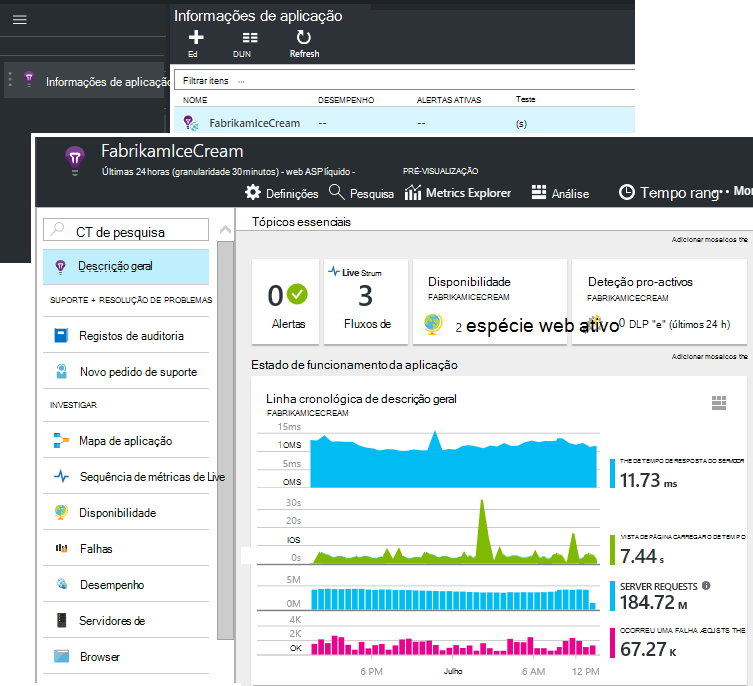

Se não tiver uma, criá-lo:

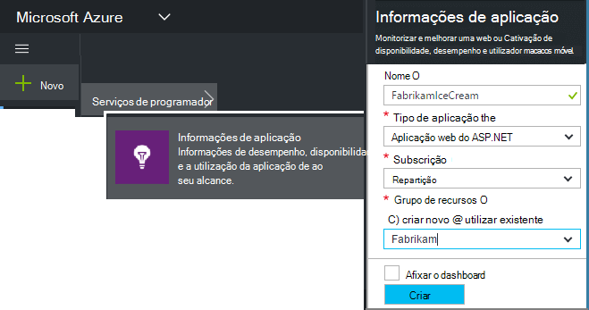

*Ainda tem dúvidas?* [Mais informações sobre a criação de um recurso](app-insights-create-new-resource.md).

### Adicione o script SDK a sua aplicação ou páginas web

Na Iniciação rápida, obter o script para páginas web:

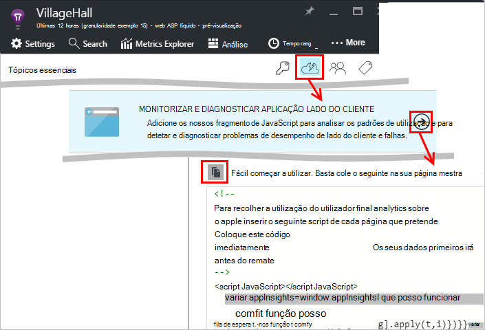

Inserir o script apenas antes de `</head>` etiqueta de cada página que quer controlar. Se o seu Web site tiver uma página mestra, pode colocar o script aí. Por exemplo:

* Num projecto do ASP.NET MVC, teria colocá-la num`View\Shared\_Layout.cshtml`
* No site do SharePoint, no painel de controlo, abra [definições do Site / página mestra](app-insights-sharepoint.md).

O script contém a chave de instrumentação que o direciona os dados para o seu recurso de informações da aplicação. 

([Explicação mais aprofundada do script](http://apmtips.com/blog/2015/03/18/javascript-snippet-explained/))

*(Se estiver a utilizar um quadro famoso página web, procure em torno adaptadores de informações da aplicação. Por exemplo, não existe [um módulo de AngularJS](http://ngmodules.org/modules/angular-appinsights).)*

## Configuração detalhado

Existem vários [parâmetros](https://github.com/Microsoft/ApplicationInsights-JS/blob/master/API-reference.md#config) que pode definir, apesar da maioria dos casos, não deva necessário. Por exemplo, pode desativar ou limitar o número de chamadas de Ajax comunicado por vista de página (para reduzir o tráfego). Ou pode definir o modo de depuração de ter telemetria mover rapidamente através do pipeline de sem a ser enviadas em batches.

Para definir estas parâmetros, procure esta linha o fragmento de código e adicione mais itens separados por vírgulas após-lo:

    })({
      instrumentationKey: "..."
      // Insert here
    });

Os [parâmetros disponíveis](https://github.com/Microsoft/ApplicationInsights-JS/blob/master/API-reference.md#config) incluem:

    // Send telemetry immediately without batching.
    // Remember to remove this when no longer required, as it
    // can affect browser performance.
    enableDebug: boolean,

    // Don't log browser exceptions.
    disableExceptionTracking: boolean,

    // Don't log ajax calls.
    disableAjaxTracking: boolean,

    // Limit number of Ajax calls logged, to reduce traffic.
    maxAjaxCallsPerView: 10, // default is 500

    // Time page load up to execution of first trackPageView().
    overridePageViewDuration: boolean,

    // Set these dynamically for an authenticated user.
    appUserId: string,
    accountId: string,

## Executar a sua aplicação

Executar a aplicação web, utilizá-la tempo a gerar telemetria e aguarde alguns segundos. Pode executá-la com a tecla **F5** no seu computador de desenvolvimento, ou publique-o e permitir que os utilizadores reproduzir com o mesmo.

Se pretender verificar a telemetria que está a enviar uma aplicação web para informações de aplicação, utilize as ferramentas de depuração do seu browser (**F12** em muitos browsers). Dados são enviados para dc.services.visualstudio.com.

## Explorar os seus dados de desempenho do browser

Abra o pá Browsers para mostrar dados de desempenho agregado de browsers dos seus utilizadores.

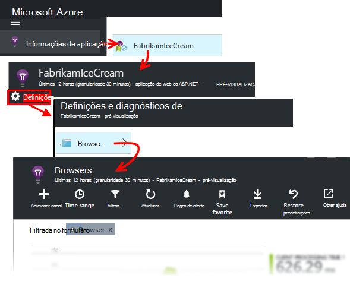

*Ainda sem dados? Clique em * *Atualizar* * na parte superior da página. Ainda nada? Consulte o artigo [resolução de problemas](app-insights-troubleshoot-faq.md).*

O pá Browsers é uma [métricas Explorer pá](app-insights-metrics-explorer.md) com os filtros predefinidos e seleções de gráfico. Pode editar o intervalo de tempo, filtros e configuração do gráfico, se pretender e guardar o resultado como favorito. Clique em **Restaurar predefinições** para voltar para a configuração de pá original.

## Desempenho de carregamento da página

Na parte superior é um gráfico segmentado dos tempos de carregamento da página. A altura total do gráfico representa o tempo médio para carregar e apresentar páginas da sua aplicação nos browsers dos seus utilizadores. O tempo é medido a partir de quando o browser envia o pedido HTTP inicial até carga síncrona todos os eventos têm foi processados, incluindo o esquema e executar scripts. -Não inclui tarefas assíncronas como o carregamento de peças web a partir AJAX chamadas.

O gráfico segmentos o tempo de carregamento do total de páginas para as [temporizações padrão definidas pelo W3C](http://www.w3.org/TR/navigation-timing/#processing-model). 

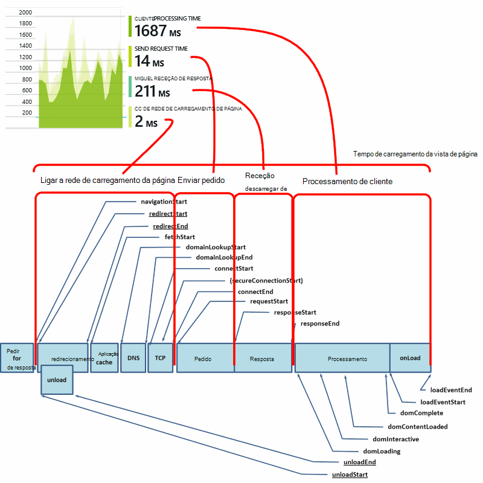

Note que o tempo de *ligação de rede* com frequência é inferior a seria de esperar, porque é uma média sobre todos os pedidos a partir do browser para o servidor. Muitos pedidos individuais de ter um tempo de ligação de 0 porque já existe uma ligação ativa no servidor.

### Diminuir o carregamento?

Carregamentos de página lenta são uma fonte principal de insatisfação para os seus utilizadores. Se o gráfico indica carregamentos de página lenta, é fácil fazer alguma pesquisa diagnóstico.

O gráfico mostra a média de todas as cargas de página na sua aplicação. Para ver se o problema se limita a páginas específicas, procure mais para baixo pá, onde não existe uma grelha segmentada ao URL da página:

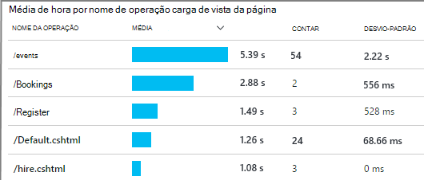

Repare a contagem de vista de página e o desvio-padrão. Se a contagem de páginas for muito baixa, em seguida, o problema não for que afetam os utilizadores muito. Um elevado desvio-padrão (comparável a média propriamente dito) indica muitas variação entre medições individuais.

**Amplie um URL e vista de uma página.** Clique em qualquer nome de página para ver uma pá de gráficos de browser filtrado apenas para essa URL; e, em seguida, numa instância de uma vista de página.

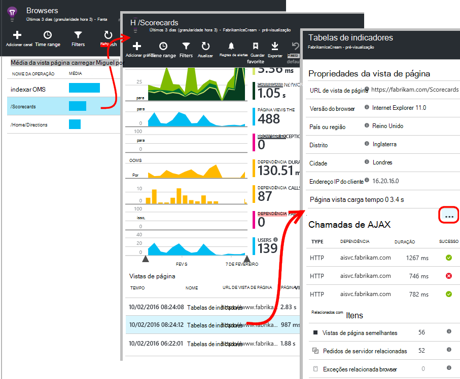

Clique em `...` para obter uma lista completa das propriedades para esse evento ou inspecionar as chamadas de Ajax e os eventos relacionados. Chamadas de Ajax lentas afetam o tempo de carregamento de página geral se estiverem síncronos. Os eventos relacionados incluem pedidos de servidor para o mesmo URL (se configurou informações de aplicação no servidor web).

**Desempenho de página ao longo do tempo.** Novamente na pá Browsers, altere a grelha de tempo de carregamento de vista de página para um gráfico de linhas para ver se havia picos em momentos específicos:

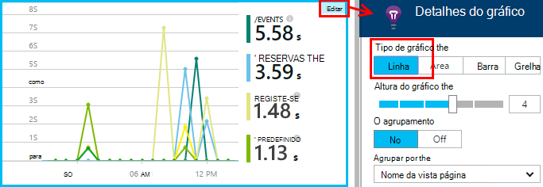

**Segmento por outras dimensões.** Talvez as páginas são mais lentas carregar num determinado browser, SO cliente ou localidade de utilizador? Adicionar um novo gráfico e experimentar a dimensão **Agrupar por** .

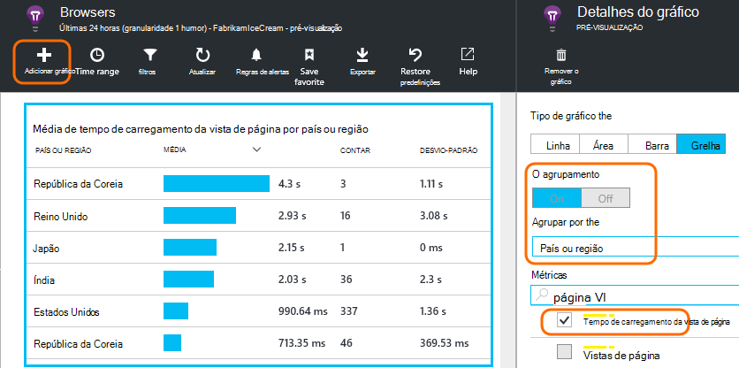

## Desempenho de AJAX

Certifique-se de quaisquer chamadas AJAX nas suas páginas web estão a funcionar bem. Muitas vezes são utilizados para preencher forma assíncrona peças da sua página. Apesar da página geral poderá carregar mais rapidamente possível, os seus utilizadores poderiam frustrados por precursores em peças web em branco, a aguardar dados sejam apresentados nos mesmos.

Chamadas de AJAX feitas a partir da sua página web são apresentadas no pá Browsers como dependências.

Existem gráficos de resumo na parte superior da pá:

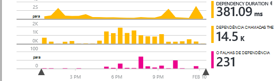

e grelhas detalhadas inferiores para baixo:

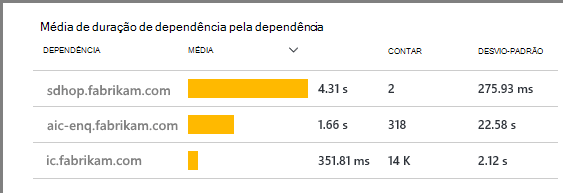

Clique em qualquer linha para obter detalhes específicos.

> [AZURE.NOTE] Se eliminar o filtro de Browsers na pá, servidor e as dependências de AJAX estão incluídas destes gráficos. Clique em Restaurar predefinições para reconfigurar o filtro.

**Para explorar falhadas chamadas de Ajax** desloque para baixo para a grelha de falhas de dependência e, em seguida, clique numa linha para ver instâncias específicas.

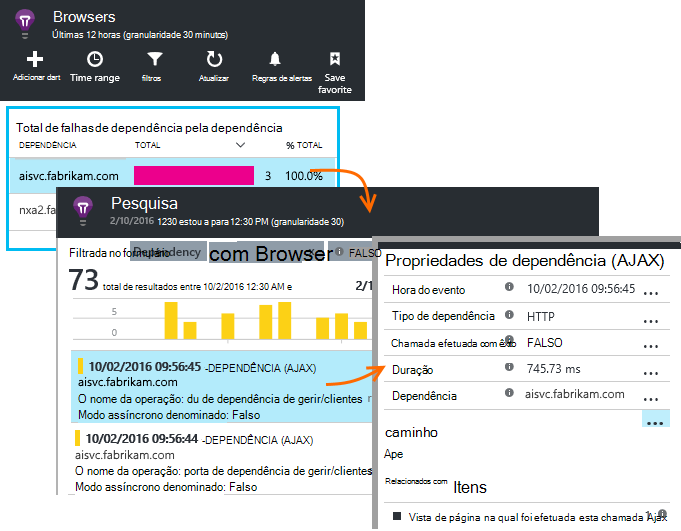

Clique em `...` para de telemetria para uma chamada de Ajax completa.

### Sem chamadas Ajax comunicadas?

Chamadas de AJAX incluem qualquer chamadas HTTP criadas a partir do script da sua página web. Se não VI-los comunicado, verifique se o fragmento de código não definidas a `disableAjaxTracking` ou `maxAjaxCallsPerView` [parâmetros](https://github.com/Microsoft/ApplicationInsights-JS/blob/master/API-reference.md#config).

## Exceções de browser

No pá Browsers, existe um gráfico do resumo exceções e uma grelha de tipos de exceção ainda mais para baixo a pá.

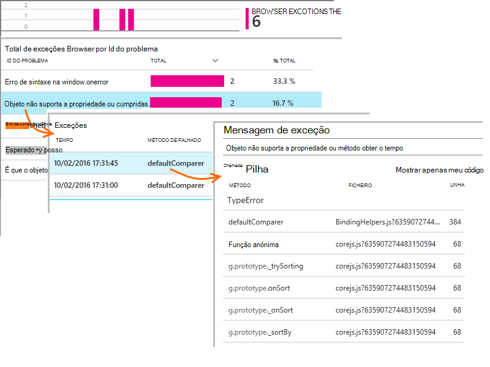

Se não vir exceções browser comunicadas, verifique se o fragmento de código não definidas a `disableExceptionTracking` [parâmetro](https://github.com/Microsoft/ApplicationInsights-JS/blob/master/API-reference.md#config).

## Inspecionar eventos de vista de página individual

Normalmente, é analisada telemetria de vista de página por aplicação informações e ver apenas cumulativos relatórios, médios de todos os seus utilizadores. Mas, para fins de depuração, pode também observar eventos de vista de página individual.

Na pesquisa diagnóstico pá, definir filtros para vista de página.

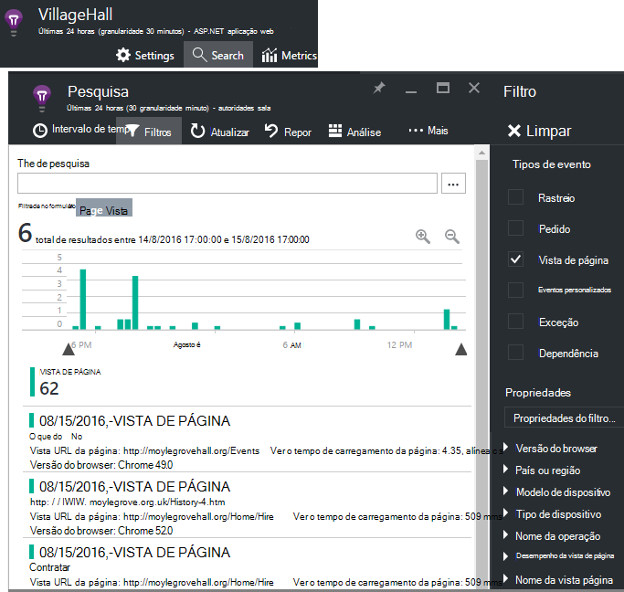

Selecione um evento para ver mais detalhes. Na página Detalhes, clique em "…" para ver detalhes ainda mais.

> [AZURE.NOTE] Se utilizar a [pesquisa](app-insights-diagnostic-search.md), repare que tem de palavras inteiras: "Acerca de" e "cerca de" não corresponderem às "Sobre".

Também pode utilizar a poderosa [análise de idioma de consulta](app-insights-analytics-tour.md) para procurar vistas de página.

### Ver propriedades da página

* **Duração da vista de página** 

 * Por predefinição, o tempo que demora a carregar a página, a partir do cliente pedir para carregamento completo (incluindo ficheiros auxiliares mas excluindo tarefas assíncronas, tais como chamadas de Ajax). 
 * Se definir `overridePageViewDuration` na [configuração de página](#detailed-configuration), o intervalo entre o cliente pedir a execução do primeiro `trackPageView`. Se tiver movido trackPageView da sua posição habitual após a inicialização do script, vão refletir as um valor diferente.
 * Se `overridePageViewDuration` está definida e uma duração for fornecido nenhum argumento na `trackPageView()` ligar, em seguida, é utilizado o valor do argumento. 

## Contagens de página personalizado

Por predefinição, uma contagem de páginas ocorre sempre que uma nova página for carregada no browser do cliente.  Mas, poderá pretender contar o número de vistas de página adicional. Por exemplo, uma página podem ser apresentadas respectivo conteúdo de separadores e pretender contar uma página quando o utilizador alterna entre separadores. Ou código JavaScript na página pode carregar novo conteúdo sem alterar URL do browser.

Inserir uma chamada de JavaScript assim no ponto de adequado no seu código do cliente:

    appInsights.trackPageView(myPageName);

O nome da página pode conter os mesmos caracteres como um URL, mas qualquer após "#" ou "?" é ignorado.

## Utilização de controlo

Quer saber o que os utilizadores fazer com a sua aplicação?

* [Saiba mais sobre a utilização de controlo](app-insights-web-track-usage.md)
* [Obter informações sobre eventos personalizados e métricas API](app-insights-api-custom-events-metrics.md).

#### Vídeo: A utilização de controlo

> [AZURE.VIDEO tracking-usage-with-application-insights]

## Próximos passos

* [Controlar a utilização](app-insights-web-track-usage.md)
* [Eventos personalizados e métricas](app-insights-api-custom-events-metrics.md)
* [Saiba de medida de compilação](app-insights-overview-usage.md)

