<properties 
    pageTitle="Explorar métricas na aplicação informações | Microsoft Azure" 
    description="Como interpretar os gráficos em explorer métrico e como personalizar pás explorer métrica." 
    services="application-insights" 
    documentationCenter=""
    authors="alancameronwills" 
    manager="douge"/>

<tags 
    ms.service="application-insights" 
    ms.workload="tbd" 
    ms.tgt_pltfrm="ibiza" 
    ms.devlang="na" 
    ms.topic="article" 
    ms.date="10/15/2016" 
    ms.author="awills"/>
 
# Explorar métricas de informações de aplicação

Métricas na [Aplicação informações] [ start] são medidos valores e as contagens das eventos que são enviadas em telemetria a partir da sua aplicação. Estes ajudá-lo detetar problemas de desempenho e ver tendências de como a aplicação está a ser utilizada. Existe uma vasta gama de métricas padrão e também pode criar a sua própria métricas personalizadas e eventos.

Contagens de métricas e eventos são apresentadas em gráficos de valores agregados como somas, médias ou contagens.

Eis um exemplo do gráfico:

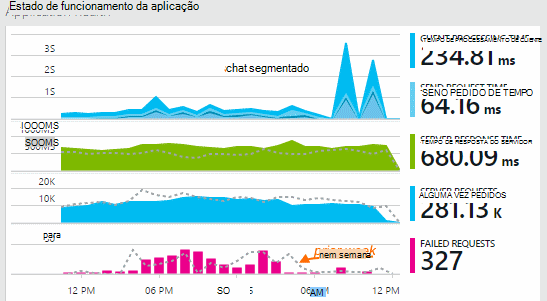

Alguns gráficos são segmentados: a altura total do gráfico em qualquer ponto é a soma de métricas apresentadas. A legenda por predefinição mostra as quantidades maior.

Linhas ponteadas mostram o valor da métrica de uma semana anteriormente.

## Intervalo de tempo

Pode alterar o intervalo de tempo abrangido pela ou gráficos analíticos no qualquer pá.

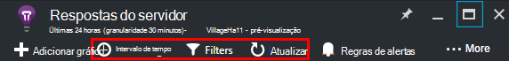

Se estiver a esperar alguns dados que não apareciam ainda, clique em Atualizar. Gráficos de atualizar os próprios em intervalos, mas os intervalos são mais longo para intervalos de tempo maiores. No modo de edição, pode demorar algum tempo para os dados breve através do pipeline de análise para um gráfico.

Para ampliar parte de um gráfico, arraste sobre a mesma:

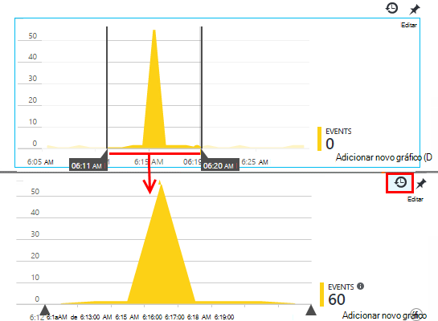

Clique no botão Anular Zoom restaurá-lo.

## Valores granularidade e ponto

Paire com o rato sobre o gráfico para apresentar os valores de métricas nesse momento.

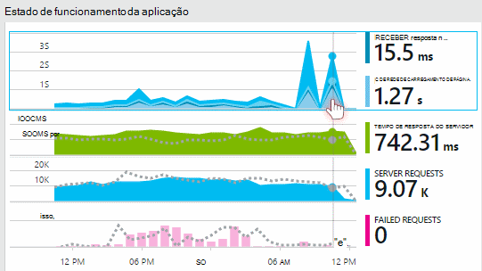

O valor de métrica num momento específico é agregado ao longo do intervalo de amostragem anterior. 

O intervalo de amostragem ou "granularidade" é apresentada no topo da pá. 

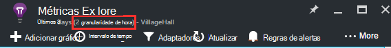

Pode ajustar a granularidade a pá do intervalo de tempo:

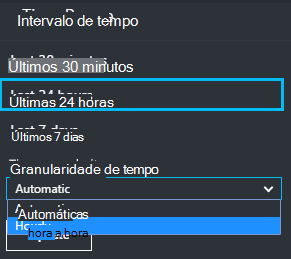

Granularidades devem ser disponíveis depende o intervalo de tempo que selecionar. O granularidades devem ser explícitas é alternativas à granularidade "automática" para o intervalo de tempo. 

## Métricas Explorer

Clique nas qualquer gráfico num pá a descrição geral para ver um conjunto de gráficos e relacionadas grelhas mais detalhado. Pode editar estes gráficos e grelhas focar-se nos detalhes que lhe interessa.

Ou, basta clicar no botão de métricas Explorador no cabeçalho da pá a descrição geral.

Por exemplo, clique em através do gráfico de pedidos de falha do web app:

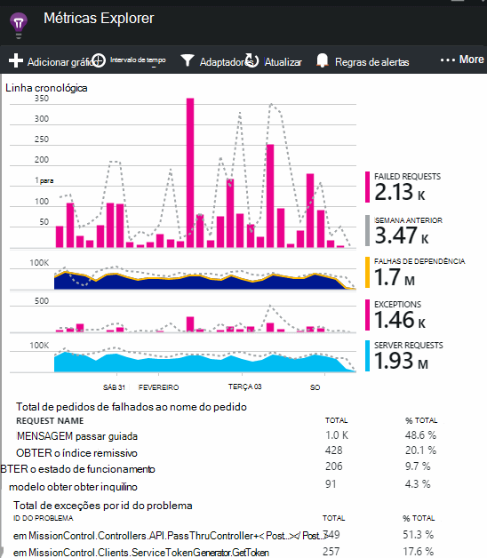

## O que significam os números?

A legenda na parte lateral por predefinição, normalmente, mostra o valor agregado durante o período do gráfico. Se passar o rato sobre o gráfico, mostra o valor nesse momento.

Cada ponto de dados no gráfico é um agregado dos valores de dados recebidos no intervalo de amostragem anterior ou "granularidade". A granularidade é apresentada no topo da pá e varia de acordo com a escala temporal geral do gráfico.

Métricas podem ser agregadas de diferentes formas: 

 * **Soma** adiciona os valores de todos os pontos de dados recebidos sobre o intervalo de amostragem ou o período do gráfico.
 * **Média** divide a soma pelo número de pontos de dados recebido ao longo do intervalo.
 * Contagens **exclusivo** são utilizadas para contagens de utilizadores e contas. Ao longo do intervalo de amostras, ou durante o período do gráfico, na figura apresenta a contagem de utilizadores diferentes vistos nesse período de tempo.

Pode alterar o método de agregação:

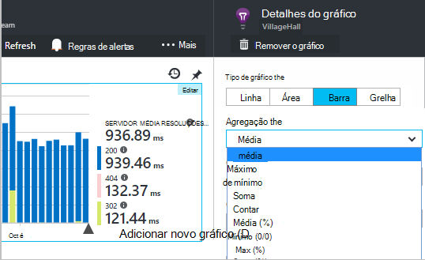

O método predefinido para cada métrica é apresentado quando cria um novo gráfico ou quando todas as métricas são desseleccionar:

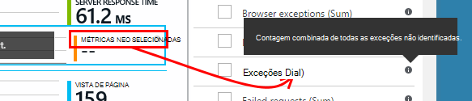

## Editar gráficos e grelhas

Para adicionar um novo gráfico para o pá:

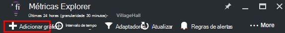

Selecione **Editar** num gráfico novo ou existente para editar o que é apresentado:

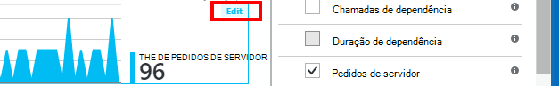

Pode apresentar mais do que uma métrica num gráfico, apesar de não existem restrições sobre as combinações que podem ser apresentadas em conjunto. Assim que escolher uma métrica, alguns dos outros estão desactivados. 

Se for codificada o [métricas personalizadas] [ track] para a sua aplicação (chamadas para TrackMetric e TrackEvent) serão apresentados aqui.

## Segmentar os seus dados

Pode dividir uma métrica por propriedade - por exemplo, para comparar as vistas de página clientes com sistemas operativos diferentes. 

Selecione um gráfico ou grelha, alternar agrupar e escolha uma propriedade para agrupar por:

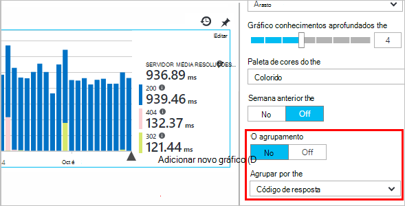

> [AZURE.NOTE] Quando utiliza o agrupamento, os tipos de área e gráfico de barras fornecem uma visualização empilhada. Este é adequado onde o método de agregação é a soma. Mas onde o tipo de agregação é a média, escolha os tipos de visualização grelha ou linha. 

Se for codificada o [métricas personalizadas] [ track] para a sua aplicação e incluem valores de propriedade, poderá selecionar a propriedade na lista.

O gráfico é demasiado pequeno para dados segmentados? Ajuste a sua altura:

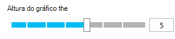

## Filtrar os seus dados

Para ver apenas as métricas para um conjunto de valores de propriedade selecionada:

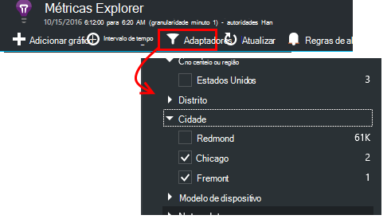

Se não selecionar todos os valores de uma determinada propriedade, é igual a selecionando-os: não existe nenhuma filtro essa propriedade.

Tenha em atenção as contagens de eventos ao lado de cada valor da propriedade. Quando selecionar valores de propriedade, as contagens juntamente com outros valores de propriedade são ajustadas.

Aplicarem filtros a todos os gráficos numa pá. Se pretender diferentes filtros aplicados a gráficos diferentes, crie e guarde pás métricas diferentes. Se pretender, pode afixar gráficos a partir de diferentes pás para o dashboard, para que possam ver-as juntamente com os outros.

### Remover o tráfego de teste bot e web

Utilizar o filtro de **tráfego Real ou síntese** e marque **Real**.

Também pode filtrar pela **origem de tráfego síntese**.

### Para adicionar propriedades a lista de filtros

Gostaria telemetria numa categoria da sua preferência de filtro? Por exemplo, talvez dividir o utilizadores em categorias diferentes e optar por segmentar os seus dados por estas categorias.

[Criar o seu próprio propriedade](app-insights-api-custom-events-metrics.md#properties). Configure um [Inicializador de telemetria](app-insights-api-custom-events-metrics.md#telemetry-initializers) para que seja apresentado em todas as telemetria - incluindo de telemetria padrão que foi enviada por módulos SDK diferentes.

## Editar o tipo de gráfico

Repare que pode alternar entre grelhas e gráficos:

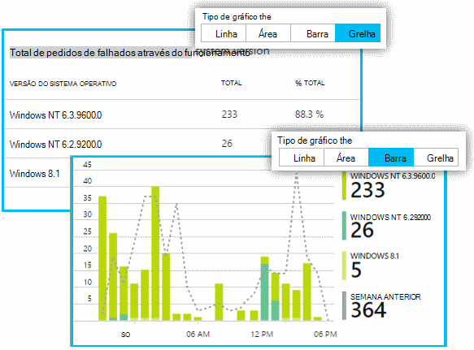

## Guardar a sua pá métricas

Quando tiver criado alguns gráficos, guardá-los como favorito. Pode escolher se pretende partilhá-lo com outros membros de equipa, se utilizar uma conta institucional.

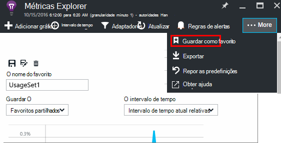

Para ver o pá novamente, **Vá para o separador descrição geral** e abrir favoritos:

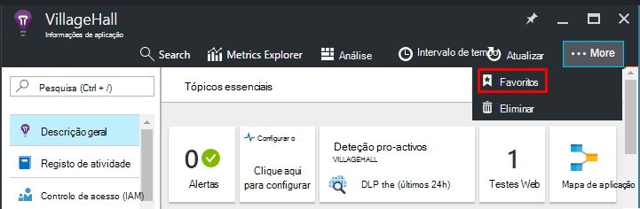

Se optar por intervalo de tempo relativa quando guardado, o pá será atualizado com as mais recentes métricas. Se tiver optado por intervalo de tempo absoluta, mostrará os mesmos dados sempre.

## Repor o pá

Se editar uma pá, mas, em seguida, que gostaria de voltar para o original guardado conjunto, basta clicar em Repor.

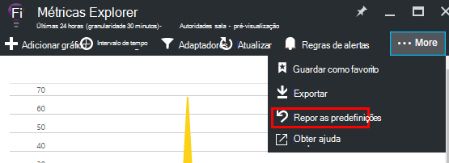

## Fluxo direto de métricas: métricas de instantâneas para monitorizar a fechar

Sequência de métricas directo mostra-lhe as métricas de aplicação para a direita neste momento muito, com uma latência de em tempo real próximo de 1 segundo. Isto é muito útil quando está a libertar uma nova compilação e quiser para se certificar de que tudo está funcionar como esperado, ou um incidente em tempo real a investigar.

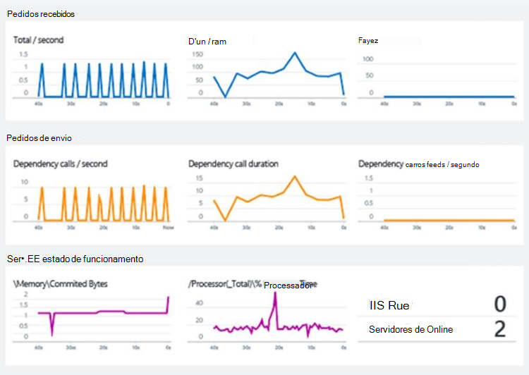

Ao contrário métricas Explorer, o fluxo direto de métricas apresenta um conjunto de métricas fixos. Os dados persiste apenas para desde que é no gráfico e, em seguida, é eliminada. 

Sequência de métricas directo está disponível com o SDK de informações de aplicação para o ASP.NET, versão 2.1.0 ou posterior.

## Definir alertas

Para ser notificado por correio eletrónico dos valores invulgares de qualquer métrica, adicione um alerta. Pode escolher qualquer para enviar o e-mail para os administradores de conta ou para endereços de correio eletrónico específico.

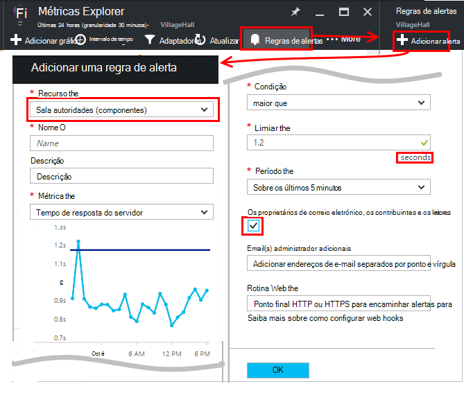

[Saiba mais acerca de alertas de][alerts].

## Exportar para o Excel

Pode exportar dados métricos que são apresentados no Explorador de métrica para um ficheiro do Excel. Os dados exportados incluem dados de todos os gráficos e tabelas conforme visto no portal. 

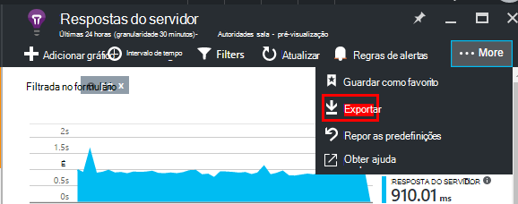

Os dados para cada tabela ou gráfico são exportados a uma folha separada no ficheiro do Excel.

O que vê é o que é exportado. Altere o intervalo de tempo ou filtros se pretende alterar o intervalo de dados exportados. Para tabelas, se o comando **carregar mais** estiver visível, pode clicar em-lo antes de clicar em exportar, ter mais dados exportados.

*Exporte funciona apenas para o Internet Explorer e no Chrome momento. Estamos a trabalhar no adicionar suporte para outros browsers.*

## Exportar contínuo

Se pretender que os dados exportados continuamente para que possa processar externamente, considere utilizar [contínua exportar](app-insights-export-telemetry.md).

### Power BI

Se pretender que o mesmo mais ricas vistas de dados, pode [Exportar para o Power BI](http://blogs.msdn.com/b/powerbi/archive/2015/11/04/explore-your-application-insights-data-with-power-bi.aspx).

## Análise

[Análise](app-insights-analytics.md) é uma forma mais versátil para analisar os seus telemetria a utilizar um idioma de consulta avançada. Utilizá-lo se pretender combinar ou calcular os resultados de métricas ou efetuar uma informações detalhadas no deph do desempenho recentes da sua aplicação. Utilize outro lado, métricas Explorer se pretender que a atualização automática, gráficos do dashboard e alertas.

## Resolução de problemas

*Não vejo todos os dados no meu gráfico.*

* Aplicarem filtros a todos os gráficos na pá. Certifique-se de que, enquanto estiver a focar num gráfico, o utilizador não defina um filtro que exclua todos os dados noutro. 

    Se pretender definir os filtros diferentes nos gráficos diferentes, criá-los no pás diferentes, guardá-los favoritos como separados. Se pretender, pode afixá-las ao dashboard para que possam ver-as juntamente com os outros.

* Se um gráfico Agrupar por uma propriedade que não esteja definida na métrica, em seguida, haverá nada no gráfico. Experimente limpar 'Agrupar por' ou selecione uma propriedade de agrupamento diferente.
* Dados de desempenho (CPU, taxa IO e assim sucessivamente) está disponível para Java serviços web, Windows aplicações de ambiente de trabalho, [IIS web aplicações e serviços se instalar o monitor de estado](app-insights-monitor-performance-live-website-now.md)e [Serviços em nuvem Azure](app-insights-azure.md). Não está disponível para sites públicos do Azure.

## Próximos passos

* [Monitorizar a utilização de informações de aplicação](app-insights-overview-usage.md)
* [Utilizando a pesquisa de diagnóstico](app-insights-diagnostic-search.md)

<!--Link references-->

[alerts]: app-insights-alerts.md
[start]: app-insights-overview.md
[track]: app-insights-api-custom-events-metrics.md

 