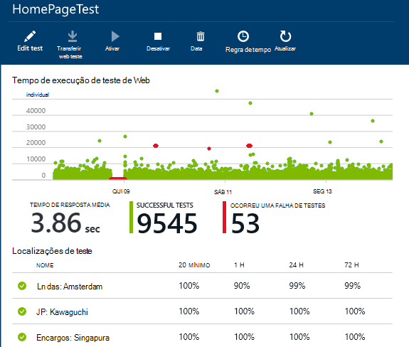
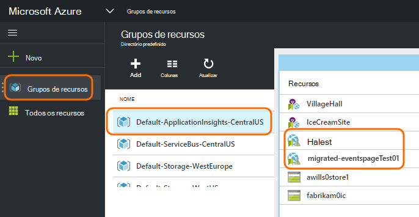
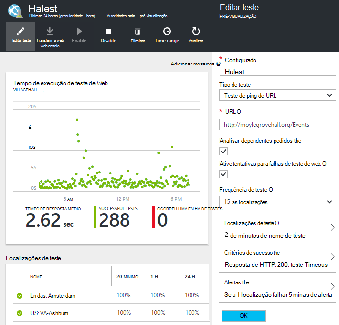

<properties 
    pageTitle="Migrar Azure ponto final para testes de disponibilidade de informações de aplicação" 
    description="Migrar clássicos testes de monitorização do Azure ponto final para informações de aplicação disponibilidade testa ao 31 de Outubro de 2016."
    services="application-insights" 
    documentationCenter=""
    authors="soubhagyadash" 
    manager="douge"/>

<tags 
    ms.service="application-insights" 
    ms.workload="tbd" 
    ms.tgt_pltfrm="ibiza" 
    ms.devlang="na" 
    ms.topic="article" 
    ms.date="07/25/2016" 
    ms.author="awills"/>
 
# Mover a partir do Azure ponto final de monitorização para testes de disponibilidade de informações de aplicação

Utilizar [a monitorização de ponto final](https://blogs.msdn.microsoft.com/mast/2013/03/03/windows-azure-portal-update-configure-web-endpoint-status-monitoring-preview/) para as aplicações do Azure? Por *31 de Outubro de 2016*, vamos irá substitua-os com os novos e mais eficazes [testes de disponibilidade](app-insights-monitor-web-app-availability.md). Já criámos alguns dos novos testes, apesar de que está a ser desactivados até 31 de Outubro de 2016. 

Pode editar os testes novos e fazer a transição si mesmo se pretender. Irá encontrá-las [Azure portal](https://portal.azure.com) no grupo de recursos predefinido-ApplicationInsights-CentralUS.

## Quais são os testes de disponibilidade?

Testes de disponibilidade são uma funcionalidade do Azure continuamente verifica se qualquer web site ou serviço está para cima e executar pedidos de HTTP-la ao enviar (testes ping única ou testes de web do Visual Studio) a partir de localizações até 16 em todo o mundo. 

No [portal do Azure clássico](https://manage.windowsazure.com), estes testes foram denominados monitorização de ponto final. Que mais foram limitados no âmbito. Novos testes de disponibilidade são uma melhoria substancial:

* Testes de web do Visual Studio até 10 ou testes de ping por recurso de informações da aplicação. 
* Até 16 localizações em todo o mundo para enviar pedidos de teste para a sua aplicação web. Maior controlo dos critérios de sucesso de teste. 
* Teste a qualquer web site ou serviço - aplicações web não apenas Azure.
* Testar o número de tentativas: reduzir falso positivo alertas devido a problemas de rede breves. 
* Webhooks pode receber notificações de HTTP POST para que os alertas.

Leia mais sobre [testes de disponibilidade aqui](app-insights-monitor-web-app-availability.md).

Testes de disponibilidade fazem parte de [Informações de aplicação do Visual Studio](app-insights-overview.md), que é um serviço de análise extensible para qualquer aplicação web.

## Por isso, o que está a acontecer ao meu ponto final testa?

* Vamos copiou o ponto final de testes para novos testes de disponibilidade de informações da aplicação de monitorização.
* Atualmente são desativados novos testes de disponibilidade e ainda estiver a executar o os testes de ponto final antigos.
* O alerta regras *não* foram migradas. Novos testes inicialmente tenham sido configurados com uma regra de predefinido:
 * Accionadores quando mais do que 1 localização comunica falhas em 5 minutos.
 * Envia correio eletrónico para os administradores de subscrição.

No [portal do Azure](https://portal.azure.com), pode encontrar os testes migrados no grupo de recursos "Predefinido-ApplicationInsights CentralUS". Os nomes de teste são o prefixo "Migrated-". 

## O que preciso de fazer?

* Caso podemos ficou perdido migrar o seu testes, novos testes de disponibilidade são [fáceis de configurar](app-insights-monitor-web-app-availability.md).

### A opção r: efetue nada. Deixe-para-nos.

**Em 31 de Outubro de 2016,** iremos:

* Desative os testes de ponto final antigo.
* Ative os testes de disponibilidade migrados.

### Opção b: pode gerir e/ou ativar os testes de novos.

* Reveja e edite os testes de disponibilidade de novos no novo [Azure portal](https://portal.azure.com). 
 * Reveja os critérios de accionador
 * Rever os destinatários de correio eletrónico
* Ativar os testes novos
* Desativaremos o ponto final de legado monitorização testes no 31 de Outubro de 2016 

### Opção c: optar saída

Se não quiser utilizar testes de disponibilidade, pode eliminá-las no [Azure portal](https://portal.azure.com). Também existe uma ligação de anular a subscrição no final dos e-mails de notificação.

Ainda estamos irá eliminar os testes de ponto final antigo no 31 de Outubro de 2016. 

## Como posso editar novos testes?

Inicie sessão no [portal do Azure](https://portal.azure.com) e encontrar os testes de web 'Migrated-': 

Editar e/ou ativar o teste:

## Por que motivo é que isto acontece?

Um melhor serviço. O serviço de ponto final antigo era muito mais estreito. Pode fornecer apenas dois URLs para testes de ping simples a partir de 3 geo localizações uma aplicação do Azure VM ou na web. Novos testes podem executar testes de passo com várias web a partir do até 16 localizações e, pode especificar até 10 testes para uma aplicação. Pode testar o qualquer URL - -não tem de ser um site do Azure.

Novos testes estão configurados separadamente a partir da aplicação web ou VM que estiver a testar. 

Vamos esteja a migrar os testes para se certificar de que continuar a ter controlo sobre os mesmos ao utilizar o novo portal. 

## O que é a aplicação informações?

Os testes de disponibilidade novo fazem parte de [Informações de aplicação do Visual Studio](app-insights-overview.md). Eis um [vídeo de 2 minutos](http://go.microsoft.com/fwlink/?LinkID=733921).

## Estou a pagar para novos testes?

Os testes migrados estão configurados um recurso de informações de aplicação no plano de gratuito de predefinido. Esta opção permite-coleção até 5 milhões de pontos de dados. Que abrange facilmente o volume de dados que testes irão utilizar neste momento. 

Obviamente, se, como informações de aplicação e criar mais de disponibilidade de testes ou adotar mais dos seus monitorização de desempenho e funcionalidades de diagnóstico, em seguida, irá gerar mais pontos de dados.  No entanto, o resultado apenas seria que poderá clicar em quota para o plano gratuito. Não receberá um título, a menos que optar ativamente por participar para os planos de padrão ou Premium. 

[Saiba mais sobre a monitorização de quota e preços de informações da aplicação](app-insights-pricing.md). 

## O que é e não é migrado?

Preservados a partir do seu antigo testes de ponto final:

* URL de ponto final para ensaiar.
* Localizações geo a partir do qual os pedidos de são enviados.
* Frequência de ensaio permanece 5 minutos.
* Tempo limite de teste permanece 30 segundos. 

Não migrado:

* Regra de accionador do alerta. A regra podemos ter configurado accionadores quando 1 localização comunica falhas em 5 minutos.
* Alerta de destinatários. Notificação e-mails serão enviados para os proprietários de subscrição e proprietários cocriação. 

## Como posso encontrar os testes novos?

Pode editar qualquer um dos novos testes agora se pretender. Inicie sessão no [portal do Azure](https://portal.azure.com), abra a **Grupos de recursos** e selecione **Predefinido-ApplicationInsights-CentralUS**. Nesse grupo, encontrará os testes de web novo. [Saiba mais sobre os testes de disponibilidade novo](app-insights-monitor-web-app-availability.md).

Tenha em atenção que os e-mails de alertas novos serão enviados a partir deste endereço: alertas de informações da aplicação(ai-noreply@microsoft.com)

## O que acontece se não fizer nada?

Opção A será aplicada. Iremos ativar os testes migrados e configurar as regras de alerta predefinidas, tal como mencionado acima. Terá de adicionar qualquer regras alertas personalizadas, os destinatários, tal como mencionado acima. Desativaremos o ponto final de legado testes de monitorização. 

## Onde pode fornecer comentários sobre esta? 

Agradecemos-lhe os seus comentários. Contacte [-nos de correio eletrónico](mailto:vsai@microsoft.com). 

