<properties
    pageTitle="Diagnosticar problemas de desempenho num Web site IIS em execução | Microsoft Azure"
    description="Monitorize o desempenho de um Web site sem implementá-lo novamente. Utilizar o programa autónomo ou com informações de aplicação SDK para obter telemetria dependência."
    services="application-insights"
    documentationCenter=".net"
    authors="alancameronwills"
    manager="douge"/>

<tags
    ms.service="application-insights"
    ms.workload="tbd"
    ms.tgt_pltfrm="ibiza"
    ms.devlang="na"
    ms.topic="get-started-article"
    ms.date="10/24/2016"
    ms.author="awills"/>

# Aplicações de web Instrument tempo de execução com informações de aplicação

*Informações de aplicação está na pré-visualização.*

Pode instrumento uma aplicação web ao vivo com informações de aplicação do Visual Studio, sem ter de modificar ou implementar novamente o seu código. Nas suas aplicações são alojados por um servidor IIS no local, instalar o Monitor de estado ou, se estiver a aplicações Azure web ou executar numa VM Azure, pode instalar a extensão de informações da aplicação. (Também existem separados artigos sobre instrumentalizar [live J2EE web aplicações](app-insights-java-live.md) e [Serviços em nuvem Azure](app-insights-cloudservices.md).)

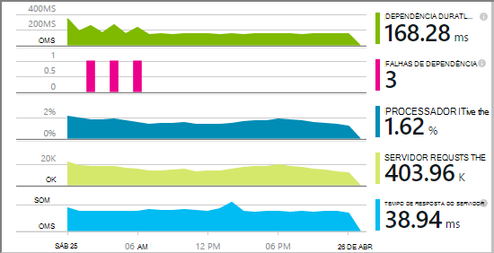

Tem uma opção de três rotas para aplicar as informações de aplicação às aplicações web .NET:

* **Construir tempo:** [Adicionar informações a aplicação SDK] [greenbrown] para o seu código de aplicação web. 
* **Tempo de execução:** Instrumento a aplicação web no servidor, conforme descrito abaixo, sem a reformulação repetida e Reimplementar o código.
* **Ambos:** Criar o SDK para o seu código de aplicação web e também se aplicam as extensões de tempo de execução. Obter o melhor da ambas as opções. 

Eis um resumo dos obter por cada rota:

||Construir a hora|Tempo de execução|
|---|---|---|
|Os pedidos e exceções|Sim|Sim|
|[Exceções mais detalhadas](app-insights-asp-net-exceptions.md)||Sim|
|[Diagnósticos de dependência](app-insights-asp-net-dependencies.md)|No .NET 4.6 +|Sim|
|[Contadores de desempenho do sistema](app-insights-performance-counters.md)||Serviço de nuvem IIS ou Azure, aplicação web não Azure|
|[API para telemetria personalizada][api]|Sim||
|[Integração de registo de rastreio](app-insights-asp-net-trace-logs.md)|Sim||
|[Dados de utilizador & vista da página](app-insights-javascript.md)|Sim||
|Sem necessidade de a reconstruir código|N||

## Instrumento a sua aplicação web em tempo de execução

Precisa de uma subscrição [Do Microsoft Azure](http://azure.com) .

### Se a sua aplicação é uma aplicação Azure web ou serviço na nuvem

* Selecione as informações de aplicação no painel de controlo a aplicação no Azure. 

    [Saiba mais](app-insights-azure.md).

### Se a sua aplicação está alojada no servidor IIS

1. No servidor web IIS, inicie sessão com as credenciais de administrador.
2. Transfira e execute o [installer Monitor de estado](http://go.microsoft.com/fwlink/?LinkId=506648).
4. No Assistente de instalação, inicie sessão no Microsoft Azure.

    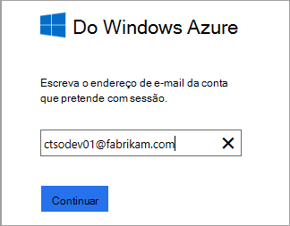

    *Erros de ligação? Consulte o artigo [resolução de problemas](#troubleshooting).*

5. Selecione a aplicação web instalados ou Web site ao qual pretende monitorizar e, em seguida, configure o recurso na qual pretende ver os resultados no portal do informações de aplicação.

    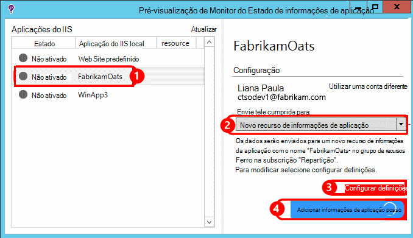

    Normalmente, optar por configurar um novo recurso e o [grupo de recursos][roles].

    Caso contrário, utilize um recurso existente se já configurou o [testa web] [ availability] para o seu site ou [cliente web monitorização][client].

6. Reinicie o IIS.

    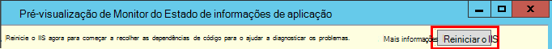

    O serviço web será interrompido para tempo breve.

6. Repare que ApplicationInsights.config foi inserido aplicações web à qual pretende monitorizar.

    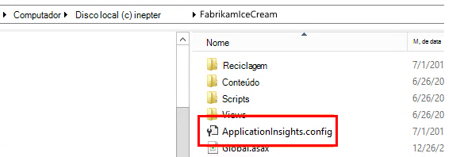

   Também existem algumas alterações para a Web. config.

#### Pretende (re) configurar mais tarde?

Depois de concluir o assistente, pode voltar a configurar o agente sempre que quiser. Também pode utilizar esta, se tiver instalado o agente mas havido alguns problemas com a configuração inicial.

## Vista desempenho telemetria

Inicie sessão no [portal do Azure](https://portal.azure.com), procure informações de aplicação e abra o recurso que criou.

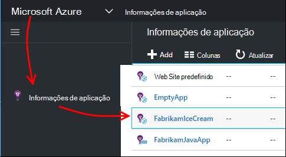

Abra o pá de desempenho para ver o pedido, tempo de resposta, dependência e outros dados.

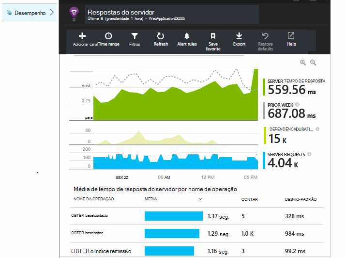

Clique em qualquer gráfico para abrir uma vista mais detalhada.

Pode [Editar, reordenar, guardar](app-insights-metrics-explorer.md), e afixar o pá toda a um [dashboard](app-insights-dashboards.md)ou gráficos.

## Dependências

O gráfico de dependência duração mostra o tempo despendido por chamadas a partir da sua aplicação para componentes externos como bases de dados, REST APIs ou armazenamento de Blobs do Azure.

Para o segmento, o gráfico por chamadas para dependências diferentes: editar o gráfico, ativar o agrupamento e, em seguida, agrupar por dependência, tipo de dependência ou dependência de desempenho.

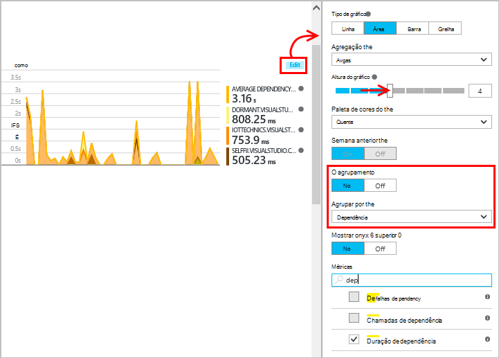

## Contadores de desempenho 

(Não para aplicações Azure web.) Clique em servidores pá a descrição geral para ver gráficos de contadores de desempenho do servidor como a utilização de memória e forma de exploração de CPU.

Se tiver várias instâncias do servidor, poderá querer editar os gráficos para agrupar por instância de função.

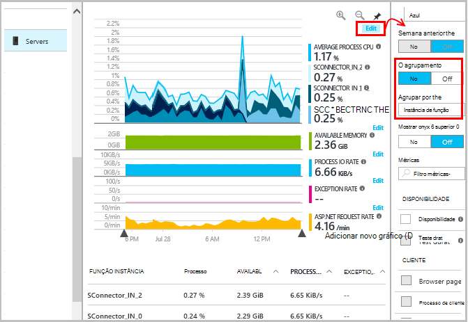

Também pode [alterar o conjunto de contadores de desempenho que são reportados pelo SDK](app-insights-configuration-with-applicationinsights-config.md#nuget-package-3). 

## Exceções

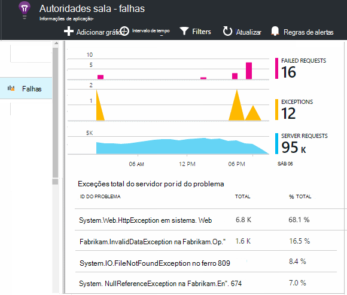

Pode desagregar em exceções específicas (a partir do últimos sete dias) e obter rastreios e dados de contexto.

## Amostragem

Se a sua aplicação envia muitos dados e estiver a utilizar o SDK de informações de aplicação para o ASP.NET versão 2.0.0-beta3 ou posterior, a funcionalidade de amostragem ajustável pode funcionar e enviar apenas uma percentagem do seu telemetria. [Saiba mais sobre amostragem.](app-insights-sampling.md)

## Resolução de problemas

### Erros de ligação

Tem de abrir [algumas enviadas portas](app-insights-ip-addresses.md#outgoing-ports) na firewall do seu servidor para permitir que o Monitor de estado trabalhar.

### Sem telemetria?

  * Utilize o seu site, para gerar a alguns dados.
  * Aguarde alguns minutos para permitir que os dados chegam, em seguida, clique em **Atualizar**.
  * Abrir pesquisa de diagnóstico (o mosaico de pesquisa) para ver os eventos individuais. Eventos frequentemente estão visíveis na pesquisa diagnóstico até que seja apresentada agregar dados nos gráficos.
  * Abra o Monitor de estado e selecione a aplicação no painel esquerdo. Verificar se existem todas as mensagens de diagnóstico para esta aplicação na secção "Configuração notificações":

  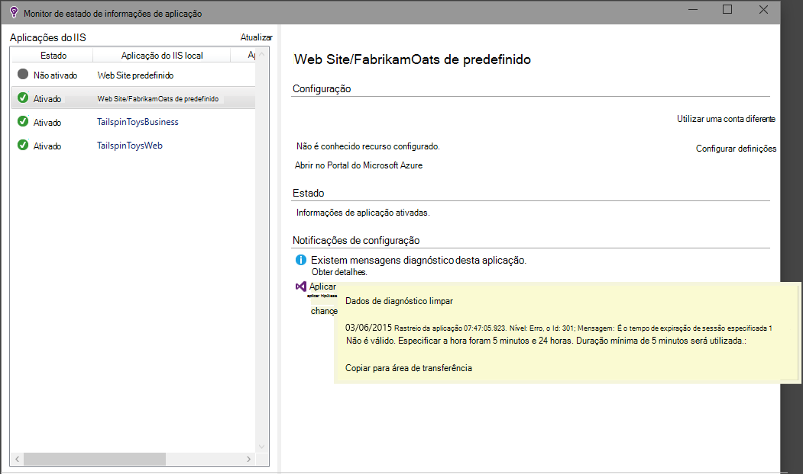

  * Certifique-se que a firewall do servidor permite tráfego de saída as portas listado em cima.
  * No servidor, se vir uma mensagem sobre "permissões suficientes", experimente o seguinte:
    * No Gestor de IIS, selecione o conjunto de aplicações, abra **Definições avançadas**e **Process Modeling** anote a identidade.
    * No painel de controlo de gestão do computador, adicione esta identidade ao grupo de utilizadores do Monitor de desempenho.
  * Se tiver instalado no seu servidor MMA/SCOM, algumas versões podem entrar em conflito. Desinstale o SCOM e Monitor de estado e voltar a instalar as versões mais recentes.
  * Consulte o artigo [resolução de problemas][qna].

## Requisitos de sistema

Suporte de SO para o Monitor de estado de informações de aplicação no servidor:

- Windows Server 2008
- Windows Server 2008 R2
- Windows Server 2012
- Servidor do Windows 2012 R2

com mais recente SP e .NET Framework 4.0 e 4,5

Do lado do cliente Windows 7, 8 e 8.1, novamente com o .NET Framework 4.0 e 4,5

O suporte do IIS estão: IIS 7, 7.5, 8, 8.5 (IIS é necessário)

## Automatização com PowerShell

Pode iniciar e parar a monitorização utilizando o PowerShell no servidor IIS.

Importe primeiro o módulo de informações da aplicação:

`Import-Module 'C:\Program Files\Microsoft Application Insights\Status Monitor\PowerShell\Microsoft.Diagnostics.Agent.StatusMonitor.PowerShell.dll'`

Descobrir que aplicações estão a ser monitorizadas:

`Get-ApplicationInsightsMonitoringStatus [-Name appName]`

* `-Name`(Opcional) O nome de uma aplicação web.
* Apresenta as informações de aplicação monitorizar o estado para cada aplicação web (ou a aplicação com nome) este servidor IIS.

* Devolve `ApplicationInsightsApplication` para cada aplicação:
 * `SdkState==EnabledAfterDeployment`: Aplicação está a ser monitorizada e foi implementada em tempo de execução, através da ferramenta de Monitor de estado ou da `Start-ApplicationInsightsMonitoring`.
 * `SdkState==Disabled`: A aplicação não é implementada para informações de aplicação. Nunca foi a ser implementada, tanto tempo de execução de monitorização foi desativado com a ferramenta de Monitor de estado ou com `Stop-ApplicationInsightsMonitoring`.
 * `SdkState==EnabledByCodeInstrumentation`: A aplicação foi implementada adicionando o SDK ao código fonte. O SDK não pode ser atualizado ou parado.
 * `SdkVersion`Mostra a versão em utilização para monitorizar esta aplicação.
 * `LatestAvailableSdkVersion`Mostra a versão atualmente disponível na galeria do NuGet. Para atualizar a aplicação para esta versão, utilize `Update-ApplicationInsightsMonitoring`.

`Start-ApplicationInsightsMonitoring -Name appName -InstrumentationKey 00000000-000-000-000-0000000`

* `-Name`O nome da aplicação no IIS
* `-InstrumentationKey`Ikey do recurso informações de aplicação onde pretende que os resultados para que seja apresentado.

* Este cmdlet afeta apenas as aplicações que já não estão implementadas - ou seja, SdkState = = NotInstrumented.

    O cmdlet não afeta a uma aplicação que já é implementada, ao tempo de compilação adicionando o SDK ao código ou em tempo de execução por uma utilização anterior deste cmdlet.

    A versão SDK utilizada para instrumento a aplicação é a versão que foi transferida mais recentemente para este servidor.

    Para transferir a versão mais recente, utilize ApplicationInsightsVersion de atualização.

* Devolve `ApplicationInsightsApplication` no sucesso. Se a falhar, registará um rastreio para stderr.

    
          Name                      : Default Web Site/WebApp1
          InstrumentationKey        : 00000000-0000-0000-0000-000000000000
          ProfilerState             : ApplicationInsights
          SdkState                  : EnabledAfterDeployment
          SdkVersion                : 1.2.1
          LatestAvailableSdkVersion : 1.2.3

`Stop-ApplicationInsightsMonitoring [-Name appName | -All]`

* `-Name`O nome de uma aplicação no IIS
* `-All`Deixa de monitorizar todas as aplicações neste servidor IIS para o qual`SdkState==EnabledAfterDeployment`

* Deixa de monitorizar as aplicações especificadas e remove instrumentação. Apenas funciona para as aplicações que tenham sido implementadas em tempo de execução utilizando a ferramenta de monitorização de estado ou ApplicationInsightsApplication iniciar. (`SdkState==EnabledAfterDeployment`)

* Devolve ApplicationInsightsApplication.

`Update-ApplicationInsightsMonitoring -Name appName [-InstrumentationKey "0000000-0000-000-000-0000"`]

* `-Name`: O nome de uma aplicação web no IIS.
* `-InstrumentationKey`(Opcional). Utilize esta opção para alterar o recurso para o qual telemetria a aplicação é enviada.
* Este cmdlet:
 * Atualiza os a aplicação com nome para a versão do SDK mais recentemente transferidos para nesta máquina. (Só funciona se `SdkState==EnabledAfterDeployment`)
 * Se fornecer uma tecla instrumentação, a aplicação com nome é reconfigurar para enviar telemetria para o recurso com essa tecla. (Funciona se `SdkState != Disabled`)

`Update-ApplicationInsightsVersion`

* Transferências SDK de informações de aplicação mais recente no servidor.

## Próximos passos

* [Criar testes web] [ availability] para se certificar de que o seu site permanece direto.
* [Procurar registos de eventos e] [ diagnostic] para o ajudar a diagnosticar os problemas.
* [Adicionar telemetria de cliente web] [ usage] para ver exceções a partir do código de página web e permitem-lhe inserir rastreio chamadas.
* [Adicionar aplicação informações SDK ao seu código do serviço web] [ greenbrown] para que pode inserir rastreio e registo de chamadas no código de servidor.

<!--Link references-->

[api]: app-insights-api-custom-events-metrics.md
[availability]: app-insights-monitor-web-app-availability.md
[client]: app-insights-javascript.md
[diagnostic]: app-insights-diagnostic-search.md
[greenbrown]: app-insights-asp-net.md
[qna]: app-insights-troubleshoot-faq.md
[roles]: app-insights-resources-roles-access-control.md
[usage]: app-insights-web-track-usage.md
