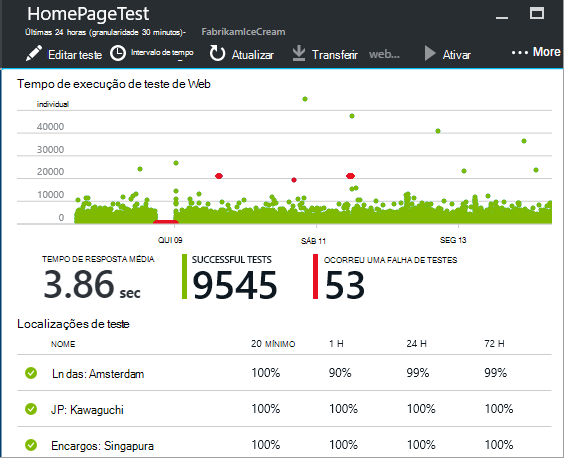

<properties
    pageTitle="Monitorizar a disponibilidade e a capacidade de resposta de qualquer site web | Microsoft Azure"
    description="Configure o testes web na aplicação de informações. Receber alertas se um Web site caso fique indisponível ou responde lentamente."
    services="application-insights"
    documentationCenter=""
    authors="alancameronwills"
    manager="douge"/>

<tags
    ms.service="application-insights"
    ms.workload="tbd"
    ms.tgt_pltfrm="ibiza"
    ms.devlang="na"
    ms.topic="get-started-article"
    ms.date="09/07/2016"
    ms.author="awills"/>

# Monitorizar a disponibilidade e a capacidade dos web sites de resposta

Depois de ter implementado do web app ou web site para qualquer servidor, pode configurar testes web para monitorizar a sua disponibilidade e a capacidade de resposta. [Informações de aplicação do Visual Studio](app-insights-overview.md) envia pedidos web para a sua aplicação regulares a partir de pontos em todo o mundo. Apresenta um alerta se a aplicação não responde ou responde lentamente.

Pode configurar testes web para qualquer ponto final HTTP ou HTTPS que está acessível a partir da internet público.

Existem dois tipos de teste web:

* [Testar o URL ping](#create): um teste simples que pode criar no portal do Azure.
* [Testar a web com várias passo](#multi-step-web-tests): que criar no Visual Studio Ultimate ou Visual Studio Enterprise e carregar para o portal.

Pode criar até 10 testes web por recurso de aplicação.

## 1. Crie um recurso para os relatórios de teste

Ignorar este passo se já tiver [configurar um recurso de informações da aplicação] [ start] para esta aplicação e pretende ver os relatórios de disponibilidade no mesmo local.

Inscrever-se para a [Microsoft Azure](http://azure.com), aceda ao [portal do Azure](https://portal.azure.com)e crie um recurso de informações da aplicação.

Clique em **todos os recursos** para abrir o separador descrição geral para o novo recurso.

## 2. Crie um teste do URL ping

No seu recurso de informações da aplicação, procure o mosaico de disponibilidade. Clique na mesma para abrir o pá de testes Web para a sua aplicação e adicione um teste web.

- **O URL** tem de ser visível na Internet público. Pode incluir uma cadeia de consulta e #151; por isso, por exemplo, pode exercer a base de dados um pouco. Se o URL for resolvido para um redirecionamento, podemos segui-lo até 10 redirecionamentos.
- **Analisar dependentes pedidos**: imagens, scripts, ficheiros de estilo e outros recursos da página forem pedidos como parte do teste e o tempo de resposta gravada inclui estas horas. O teste falhar se todos estes recursos não não possível transferir com êxito dentro do tempo limite para a todo o ensaio.
- **Ativar o número de tentativas**: quando o teste falha, é repetida após um breve intervalo. Uma falha de é comunicada apenas se três tentativas sucessivas falharem. Testes subsequentes são executados, em seguida, a frequência de ensaio habitual. Repetir temporariamente será suspensa até o sucesso seguinte. Esta regra é aplicada de forma independente em cada localização de teste. (Recomendamos que esta definição. Em média, cerca de 80% de insucessos desaparecer no repetir.)
- **Testar a frequência**: define o número de vezes que o teste é executado a partir de cada localização de teste. Com uma frequência de cinco minutos e localizações de teste de cinco, o site é testado em média minuto.
- **Localizações de teste** são os locais a partir de onde nossos servidores enviam pedidos web para o URL. Selecione mais do que uma para que é possível distinguir problemas no seu Web site a partir de problemas de rede. Pode selecionar até 16 localizações.

- **Critérios de sucesso**:

    **Tempo limite de teste**: diminuir este valor para ser alertado acerca de respostas lentas. O teste é contado como uma falha se as respostas a partir do seu site não foram recebidas durante este período. Se tiver selecionado a **Analisar dependentes pedidos**, em seguida, todas as imagens, ficheiros de estilo, scripts e outros recursos dependentes devem ter sido recebidas durante este período.

    **Resposta de HTTP**: O código de estado devolvida é contabilizado como um sucesso. 200 é o código que indica que tenha sido devolvida uma página web normal.

    **Conteúdo corresponde**: uma cadeia, tal como "Bem-vindo!" Vamos teste que este ocorra na cada resposta. Tem de ser uma cadeia simples, sem carateres universais. Não se esqueça de que se as alterações de conteúdo da página pode ter de atualizar.

- **Alertas** estão, por predefinição, enviada para si, se existirem falhas em três localizações mais de cinco minutos. Uma falha de uma localização é provável que seja um problema de rede e não é um problema com o seu site. Mas pode alterar o limiar de ser mais ou menos sensível e também pode alterar quem os e-mails devem ser enviados para.

    Pode configurar [webhook](../monitoring-and-diagnostics/insights-webhooks-alerts.md) denominado quando um alerta é elevado. (Mas não são transmitidos tenha em atenção que, a apresentar, parâmetros de consulta através de como propriedades).

### Teste URLs mais

Adicione mais testes. Para o exemplo, bem como testar a sua home page, pode certificar-se da que base de dados está a ser executado testando o URL de uma pesquisa.

## 3. consulte o artigo da web testar resultados

1-2 minutos depois, os resultados são apresentados no pá teste Web.

Clique em qualquer barra no gráfico de resumo para uma vista mais detalhada desse período de tempo.

Estes gráficos combinam os resultados para todos os testes de web desta aplicação.

## Se vir falhas

Clique num ponto vermelho.

Ou, desloque-se para baixo e clique num teste onde ver menor que 100% sucesso.

Os resultados das que abrir o teste.

É executado o teste a partir de várias localizações & #151; escolha uma onde os resultados são menos de 100%.

Desloque para baixo até **falhou testes** e escolha um resultado.

Clique no resultado para avaliá-la no portal do e ver a razão pela qual falhou.

Em alternativa, pode transferir o ficheiro de resultado e inspecioná-lo no Visual Studio.

*Parece OK mas comunicado como uma falha de?* Verifique todas as imagens, scripts, folhas de estilo e quaisquer outros ficheiros carregados por página. Se qualquer uma delas falhar, o teste é comunicado como falhou, mesmo se a página principal html carrega OK.

## Testes passo com várias web

Pode monitorizar cenário que envolve uma sequência de URLs. Por exemplo, se estiver a monitorizar um Web site vendas, pode testar adicionar itens à compras carrinho funciona corretamente.

Para criar um ensaio com várias passo, gravar o cenário utilizando o Visual Studio e, em seguida, carregue a gravação para informações de aplicação. Informações de aplicação repete o cenário em intervalos e verifica as respostas.

Tenha em atenção que não é possível utilizar codificada funções no seu testes: os passos de cenário tem de estar contidos como um script no ficheiro .webtest.

#### 1. registo um cenário de

Utilize o Visual Studio Enterprise ou Ultimate para gravar uma sessão web.

1. Crie um projeto de teste de desempenho web.

    

2. Abra o ficheiro .webtest e iniciar a gravação.

    

3. Efetue as ações de utilizador que pretende simular no seu teste: abrir o seu Web site, adicionar um produto ao carrinho e assim sucessivamente. Em seguida, pare o teste.

    

    Não efetue um cenário por extenso. Existe um limite de 100 passos e 2 minutos.

4. Edite o teste para:
 - Adicione validações para verificar os códigos de texto e a resposta recebidos.
 - Remova qualquer interações supérfluas. Também poderá remover dependentes pedidos para imagens ou para ad ou sites de controlo.

    Lembre-se de que apenas pode editar o script de teste - não pode adicionar código personalizado ou outros testes web de chamadas. Não inserir ciclos durante o ensaio. Pode utilizar o teste plug-ins do web padrão.

5. Execute o teste no Visual Studio para se certificar de que funciona.

    O corredor de teste web é aberta num browser e repete as ações que sejam gravadas. Certifique-se de que funciona como esperado.

    

#### 2. carregar o teste de web para informações de aplicação

1. No portal de informações da aplicação, crie um novo ensaio web.

    

2. Selecione passo com várias teste e carregue o ficheiro .webtest.

    

    Defina o teste localizações, frequência e parâmetros alertas da mesma forma que para testes ping.

Ver os resultados dos testes e quaisquer falhas da mesma forma que para testes de url único.

Um motivo comuns falha é que o teste é executada demasiado tempo. Não execute mais de dois minutos.

Não se esqueça de que todos os recursos de uma página tem de carregar corretamente para o teste ser concluída com êxito, incluindo scripts, folhas de estilo, imagens e assim sucessivamente.

Tenha em atenção que o teste de web tem de estar totalmente contido no ficheiro .webtest: não é possível utilizar funções codificadas o teste.

### Ligar a hora e números aleatórios ao seu teste com várias passo

Imaginemos que estiver a testar uma ferramenta que obtém os dados de tempo dependentes como unidades populacionais a partir de um feed externo. Quando grava o teste de web, tem de utilizar intervalos de tempo específicos, mas defini-las como parâmetros de teste, hora de início e hora de fim.

Quando executa o teste, optar por hora de fim sempre para ser o tempo a apresentar e hora de início deve ser 15 minutos há.

Plug-ins do Web teste fornecer a forma de parametrizar vezes.

1. Adicione um teste de web Plug-in para cada valor do parâmetro variável que pretende. Na barra de ferramentas de teste de web, selecione **Adicionar testar o plug-in Web**.

    

    Neste exemplo, utilizamos duas instâncias do plug-in da data de tempo. Uma instância destina-se "15 minutos há" e outro por "agora".

2. Abra as propriedades de cada plug-in. Atribua um nome e defini-lo para utilizar a hora atual. Para um dos minutos-las, defina adicionar = -15.

    

3. No web testar parâmetros, utilizar {{nome do plug-in}} para fazer referência a um nome de plug-in.

    

Agora, carregue o teste para o portal. Utiliza os valores dinâmicos na cada execução do teste.

## Trabalhar com o início de sessão

Se os seus utilizadores iniciar sessão na sua aplicação, tem várias opções para simulação de início de sessão no modo a que pode testar o páginas atrás a iniciar sessão. A abordagem que utiliza depende do tipo de segurança fornecida pela aplicação do.

Em todos os casos, deverá criar uma conta na sua aplicação apenas para testar. Se possível, restringir as permissões desta conta de teste para que não existe possibilidade dos testes web que afetam os utilizadores reais.

### Nome de utilizador Simple e palavra-passe

Grave um teste web no como habitualmente. Elimine os cookies pela primeira vez.

### Autenticação do SAML

Utilize o plug-in SAML que está disponível para testes web.

### Secreta de cliente

Se a sua aplicação tiver uma rota de início de sessão no envolve uma palavra-passe cliente, utilize nessa rota. Azure Active Directory (AAD) é um exemplo de um serviço que fornece um cliente secreta iniciar sessão. No AAD, o segredo de cliente é a tecla de aplicação.

Eis um teste de web do exemplo de uma aplicação Azure web utilizando uma tecla de aplicação:

1. Obtenha token do AAD utilizando o segredo de cliente (AppKey).
2. Extrai de ligação OAuth de resposta.
3. API através de ligação OAuth no cabeçalho da autorização de chamadas.

Certifique-se de que o teste de web é um cliente real - ou seja, tem própria aplicação no AAD - e utilize o clientId + appkey. O serviço de teste também tenha própria aplicação no AAD: o appID URI desta aplicação é refletido no teste de web no campo "recurso".

### Autenticação aberta

Um exemplo de autenticação abrir está a iniciar sessão com a sua conta Microsoft ou Google. Muitas aplicações que utilizam OAuth fornecem ao cliente secreta alternativa, para que a sua primeira táctica deverá ser investigar essa possibilidade.

Se o teste tem de iniciar sessão utilizando OAuth, é a abordagem geral:

 * Utilize uma ferramenta como Fiddler examinar o tráfego entre o seu browser, o site de autenticação e a aplicação.
 * Executar duas ou mais inícios de sessão utilizando máquinas diferentes ou browsers, ou em intervalos de tempo (para permitir tokens a expirar).
 * Ao comparar diferentes sessões, identifique o token transmitido novamente a partir do site de autenticação, que é transmitido, em seguida, ao seu servidor de aplicação após iniciar sessão.
 * Grave um teste web utilizando o Visual Studio.
 * Parametrizar tokens, definição do parâmetro quando o token é devolvido a partir do autenticador e utilizá-lo na consulta para o site.
 (Visual Studio tenta parametrizar o teste, mas não parametrizar corretamente os tokens.)

## Editar ou desativar um teste

Abra um teste individual para editar ou desativá-lo.

Poderá pretender desativar testes web enquanto estiver a executar manutenção no seu serviço.

## Testes de desempenho

Pode executar um teste de carga no seu Web site. Como o teste de disponibilidade, pode enviar pedidos simples ou múltiplos passos pedidos a partir do nossos pontos em todo o mundo. Ao contrário de um teste de disponibilidade, sendo enviados pedidos de muitos, simulação de vários utilizadores em simultâneo.

A partir de pá descrição geral, abra **Definições**, **Testes de desempenho**. Quando cria um teste, está convidado para ligar a ou criar uma conta de serviços de equipa do Visual Studio.

Quando o teste estiver concluído, são apresentadas tempos de resposta e taxas de êxito.

## Automatização

* [Scripts de utilizar o PowerShell para configurar um teste web](https://azure.microsoft.com/blog/creating-a-web-test-alert-programmatically-with-application-insights/) automaticamente.
* Configure o [webhook](../monitoring-and-diagnostics/insights-webhooks-alerts.md) denominado quando um alerta é elevado.

## Perguntas? Problemas?

* *Pode ligar código a partir do meu teste web?*

    Não. Os passos do teste tem de ser no ficheiro .webtest. E não consegue ligar outros testes web ou utilizar ciclos. Mas existem vários plug-ins que pode achar útil.

* *HTTPS é suportado?*

    Suportamos TLS 1.1 e TLS 1.2.

* *Existe uma diferença entre "testes web" e "testes de disponibilidade"?*

    Utilizamos os termos de duas alternadamente.

* *Gostaria de utilizar testes de disponibilidade no nosso servidor interno, que é executada protegido por uma firewall.*

    Configure a sua firewall para permitir os pedidos de [endereços IP do web testar agentes](app-insights-ip-addresses.md#availability).

* *Carregamento de um teste com várias passo web falhar*

    Existe um limite de tamanho de k 300.

    Ciclos não são suportados.

    Referências a outros testes web não são suportadas.

    Origens de dados não são suportadas.

* *Não concluir a minha teste com várias passo*

    Existe um limite de pedidos de 100 por teste.

    O teste está parado se for executado mais de dois minutos.

* *Como executar um teste com certificados de cliente?*

    Não suportamos que, Pedimos desculpa.

## Vídeo

> [AZURE.VIDEO monitoring-availability-with-application-insights]

## Próximos passos

[Registos de diagnóstico de pesquisa][diagnostic]

[Resolução de problemas][qna]

[Agentes de teste de endereços IP da web](app-insights-ip-addresses.md)

<!--Link references-->

[azure-availability]: ../insights-create-web-tests.md
[diagnostic]: app-insights-diagnostic-search.md
[qna]: app-insights-troubleshoot-faq.md
[start]: app-insights-overview.md
