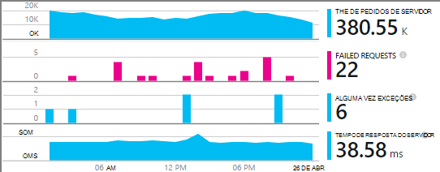
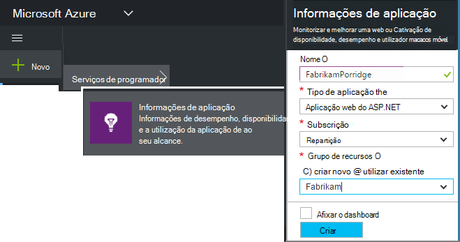
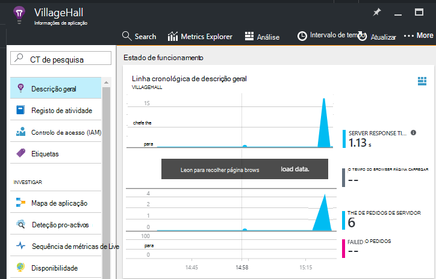

<properties
    pageTitle="Adicionar aplicação SDK de informações para monitorizar a sua aplicação Node.js | Microsoft Azure"
    description="Analise a utilização, disponibilidade e o desempenho da aplicação web do Microsoft Azure com informações de aplicação ou no local."
    services="application-insights"
    documentationCenter=""
    authors="alancameronwills"
    manager="douge"/>

<tags
    ms.service="application-insights"
    ms.workload="tbd"
    ms.tgt_pltfrm="ibiza"
    ms.devlang="na"
    ms.topic="get-started-article"
    ms.date="08/30/2016"
    ms.author="awills"/>


# <a name="add-application-insights-sdk-to-monitor-your-nodejs-app"></a>Adicionar aplicação SDK de informações para monitorizar a sua aplicação Node.js

*Informações de aplicação está na pré-visualização.*

[Informações de aplicação do Visual Studio](app-insights-overview.md) monitoriza a sua aplicação direto para o ajudar a [detetar e diagnosticar problemas de desempenho e exceções](app-insights-detect-triage-diagnose.md)e [Descubra como a sua aplicação é utilizada](app-insights-overview-usage.md). Funciona para as aplicações que são alojadas no seus próprio servidores do IIS no local ou no Azure VMs, bem como aplicações Azure web.


O SDK fornece automática colecção de taxas de pedido HTTP recebidas e respostas, contadores de desempenho (CPU, memória, RPS) e não processadas exceções. Além disso, pode adicionar personalizadas chamadas para controlar dependências, métricas ou outros eventos.




#### <a name="before-you-start"></a>Antes de começar

Precisa de:

* Visual Studio 2013 ou posterior. Mais tarde, é melhor.
* Uma subscrição do [Microsoft Azure](http://azure.com). Se a sua equipa ou a organização tiver uma subscrição do Azure, o proprietário pode adicionar ao-lo, com a sua [conta Microsoft](http://live.com).

## <a name="add"></a>Criar um recurso de informações de aplicação

Inicie sessão no [portal do Azure][portal]e criar um novo recurso de informações da aplicação. Um [recurso] [ roles] no Azure é uma instância de um serviço. Este recurso é onde telemetria da sua aplicação será analisada e lhe apresentada.



Selecione outro como o tipo de aplicação. Escolha do tipo de aplicação define o conteúdo predefinido de pás o recurso e as propriedades visível no [Explorador de métricas][metrics].

#### <a name="copy-the-instrumentation-key"></a>Copiar a chave de instrumentação

A tecla identifica o recurso e, que irá instalá-la mais cedo no SDK para direcionar dados para o recurso.


## <a name="sdk"></a>Instalar o SDK na sua aplicação

```
npm install applicationinsights --save
```

## <a name="usage"></a>Utilização

Isto permitirá pedido monitorização, rastreio de exceção não processada e desempenho do sistema monitorização (memória/CPU/RPS).

```javascript

var appInsights = require("applicationinsights");
appInsights.setup("<instrumentation_key>").start();
```

A chave de instrumentação também pode ser definida na variável de ambiente APPINSIGHTS_INSTRUMENTATIONKEY. Se este estiver concluída, nenhum argumento não for necessário ao chamar `appInsights.setup()` ou `appInsights.getClient()`.

Que pode experimentar o SDK sem o enviar telemetria: definir a chave de instrumentação para uma cadeia não vazia.


## <a name="run"></a>Executar o seu projeto

Executar a sua aplicação e experimentar: abrir páginas diferentes para gerar algumas telemetria.


## <a name="monitor"></a>Ver o seu telemetria

Regresse ao [portal do Azure](https://portal.azure.com) e navegue até ao seu recurso de informações da aplicação.


Procure dados na página Descrição geral. Na primeira, verá apenas um ou dois pontos. Por exemplo:



Clique para ver mais detalhadas métricas. [Saiba mais sobre métricas.][perf]

#### <a name="no-data"></a>Sem dados?

* Utilize a aplicação, abrir páginas diferentes para que gera algumas telemetria.
* Abra o mosaico de [pesquisa](app-insights-diagnostic-search.md) , para ver os eventos individuais. Por vezes, bastam eventos um pouco enquanto mais tempo a obter através do pipeline de métricas.
* Aguarde alguns segundos e clique em **Atualizar**. Atualizar de gráficos próprios periodicamente, mas que pode atualizar manualmente se estiver a aguardar alguns dados que pode ser apresentada.
* Consulte o artigo [resolução de problemas][qna].

## <a name="publish-your-app"></a>Publicar a sua aplicação

Agora, implementar a aplicação para IIS ou para Azure e ver os dados de acumular.


#### <a name="no-data-after-you-publish-to-your-server"></a>Sem dados depois de a publicar ao seu servidor?

Abra estas portas para o tráfego de saída na firewall do seu servidor:

+ `dc.services.visualstudio.com:443`
+ `f5.services.visualstudio.com:443`


#### <a name="trouble-on-your-build-server"></a>Problemas no seu servidor de compilação?

Consulte o artigo [este item de resolução de problemas](app-insights-asp-net-troubleshoot-no-data.md#NuGetBuild).


## <a name="customized-usage"></a>Utilização personalizada 

### <a name="disabling-auto-collection"></a>Desativar a coleção de automática

```javascript
import appInsights = require("applicationinsights");
appInsights.setup("<instrumentation_key>")
    .setAutoCollectRequests(false)
    .setAutoCollectPerformance(false)
    .setAutoCollectExceptions(false)
    // no telemetry will be sent until .start() is called
    .start();
```

### <a name="custom-monitoring"></a>Monitorização personalizada

```javascript
import appInsights = require("applicationinsights");
var client = appInsights.getClient();

client.trackEvent("custom event", {customProperty: "custom property value"});
client.trackException(new Error("handled exceptions can be logged with this method"));
client.trackMetric("custom metric", 3);
client.trackTrace("trace message");
```

[Saber mais sobre a API de telemetria](app-insights-api-custom-events-metrics.md).

### <a name="using-multiple-instrumentation-keys"></a>Utilização de várias chaves instrumentação

```javascript
import appInsights = require("applicationinsights");

// configure auto-collection with one instrumentation key
appInsights.setup("<instrumentation_key>").start();

// get a client for another instrumentation key
var otherClient = appInsights.getClient("<other_instrumentation_key>");
otherClient.trackEvent("custom event");
```

## <a name="examples"></a>Exemplos

### <a name="tracking-dependency"></a>Dependência de controlo

```javascript
import appInsights = require("applicationinsights");
var client = appInsights.getClient();

var startTime = Date.now();
// execute dependency call
var endTime = Date.now();

var elapsedTime = endTime - startTime;
var success = true;
client.trackDependency("dependency name", "command name", elapsedTime, success);
```


### <a name="manual-request-tracking-of-all-get-requests"></a>Controlo de pedido manual de todos os pedidos de "Obter"

```javascript
var http = require("http");
var appInsights = require("applicationinsights");
appInsights.setup("<instrumentation_key>")
    .setAutoCollectRequests(false) // disable auto-collection of requests for this example
    .start();

// assign common properties to all telemetry sent from the default client
appInsights.client.commonProperties = {
    environment: process.env.SOME_ENV_VARIABLE
};

// track a system startup event
appInsights.client.trackEvent("server start");

// create server
var port = process.env.port || 1337
var server = http.createServer(function (req, res) {
    // track all "GET" requests
    if(req.method === "GET") {
        appInsights.client.trackRequest(req, res);
    }

    res.writeHead(200, { "Content-Type": "text/plain" });
    res.end("Hello World\n");
}).listen(port);

// track startup time of the server as a custom metric
var start = +new Date;
server.on("listening", () => {
    var end = +new Date;
    var duration = end - start;
    appInsights.client.trackMetric("StartupTime", duration);
});
```

## <a name="next-steps"></a>Próximos passos

* [Monitorizar o seu telemetria no portal](app-insights-dashboards.md)
* [Escrever a análise de consultas ao longo do seu telemetria](app-insights-analytics-tour.md)


<!--Link references-->

[knowUsers]: app-insights-overview-usage.md
[metrics]: app-insights-metrics-explorer.md
[perf]: app-insights-web-monitor-performance.md
[portal]: http://portal.azure.com/
[qna]: app-insights-troubleshoot-faq.md
[roles]: app-insights-resources-roles-access-control.md
