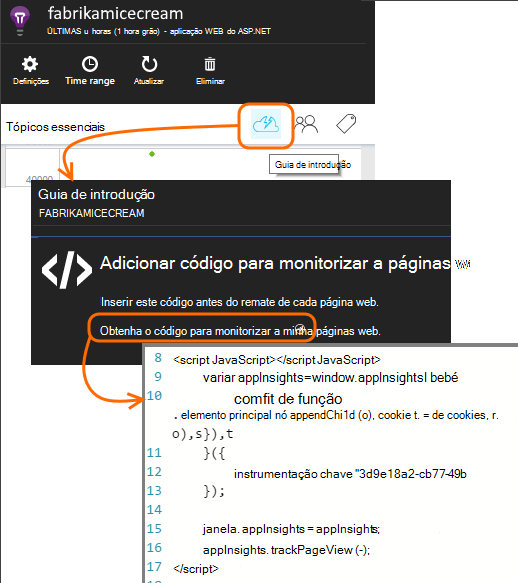

<properties
    pageTitle="Análise de utilização com informações de aplicação"
    description="Descrição geral da análise de utilização de informações de aplicação"
    services="application-insights"
    documentationCenter=""
    authors="alancameronwills"
    manager="douge"/>

<tags
    ms.service="application-insights"
    ms.workload="tbd"
    ms.tgt_pltfrm="ibiza"
    ms.devlang="multiple"
    ms.topic="article" 
    ms.date="04/08/2016"
    ms.author="awills"/>

# Análise de utilização com informações de aplicação

Saber como as pessoas utilizam a sua aplicação permite-lhe concentrar-se o trabalho de desenvolvimento nos cenários que são mais importantes aos mesmos e obter informações para os objetivos que eles localizar mais fácil ou difícil alcançar.

Informações de aplicação podem fornecer uma vista limpar de utilização da sua aplicação para o ajudar a melhorar a experiência dos seus utilizadores e cumprir os seus objetivos empresas.

Informações de aplicação funciona para ambas as aplicações autónomas (no iOS, Android e Windows) e para as aplicações web (alojadas no .NET ou J2EE). 

## Adicionar informações da aplicação ao seu projeto

Para começar, obtenha uma conta gratuita [Do Microsoft Azure](https://azure.com). (Depois do período de avaliação, pode continuar com a camada gratuita do serviço.)

No [portal do Azure](https://portal.azure.com), crie um recurso de informações da aplicação. É onde irá ver a utilização e dados de desempenho sobre a sua aplicação.

**Se a sua aplicação for uma aplicação de dispositivo,** adicione o SDK de informações da aplicação ao seu projeto. O procedimento exato varia dependendo do seu [IDE e a plataforma](app-insights-platforms.md). Para as aplicações do Windows, apenas com o botão direito do projecto no Visual Studio e escolha "Adicionar aplicação informações."

**Se se trata de uma aplicação web,** abra o pá guia e obter o fragmento de código para adicionar às suas páginas web. Publicá-los com este fragmento.

Também pode adicionar informações de aplicação para o seu código de servidor do [ASP.NET](app-insights-asp-net.md) ou [J2EE](app-insights-java-get-started.md) publicados para combinar telemetria a partir do cliente e servidor.

### Executar o seu projeto e ver resultados primeiros

Executar o seu projeto no modo de depuração para alguns minutos e, em seguida, aceda ao [portal do Azure](https://portal.azure.com) e navegue até ao seu recurso de projeto na aplicação de informações.

Publica a sua aplicação para obter mais telemetria e descubra o que os utilizadores estão a fazer com a sua aplicação.

## Análise de caixa

Clique no mosaico de vistas de página para ver detalhes de utilização.

Coloque o cursor na parte em branco acima de um gráfico para ver as contagens num momento específico. Caso contrário, os números mostram o valor agregado durante o período, como uma média, um total ou uma contagem distinta utilizadores durante o período.

Nas aplicações web, os utilizadores são contados utilizando cookies. Uma pessoa que utiliza vários browsers, limpa cookies ou utiliza a funcionalidade de privacidade vai ser contada várias vezes.

Uma sessão web é contabilizada após 30 minutos de inatividade. Uma sessão de um telemóvel ou outro dispositivo é contabilizada quando a aplicação é suspensa por mais do que de aguardar alguns segundos.

Clique para ver mais detalhadamente. Por exemplo:

(Este exemplo é de um Web site, mas os gráficos têm um aspeto semelhantes para as aplicações que são executadas em dispositivos.)

Compare com da semana anterior para ver se coisas estão a alterar:

Compare duas métricas, por exemplo, os utilizadores e novos utilizadores:

Dados de grupo (segmento) por uma propriedade como Browser, o sistema operativo ou localidade:

## Utilização de página

Clique em mosaico as vistas de página para obter uma uma explicação detalhada das suas páginas mais populares:

O exemplo acima é de um Web site jogos. A partir dos mesmos podemos instantaneamente ver:

* A utilização não melhorado na semana passada. Talvez podemos deverá consideração motor de busca?
* Muitas pessoas menos consulte as páginas de jogos que a Home page. Por que motivo não Home page do nosso apelar para reprodução jogos?
* 'Problemas' são o jogo mais popular. Vamos deverá dar prioridade aos novas ideias e melhorias aí.

## Controlo personalizado

Vamos supor que em vez de execução cada jogo numa página web em separado, decidir reestruturá-los a todos os sessão na aplicação de página única mesmo, com a maior parte das funcionalidades do codificado como Javascript na página web. Isto permite ao utilizador alternar rapidamente entre um jogo e outro ou se ainda tiver vários jogos numa página.

Mas ainda, optar por informações da aplicação para iniciar sessão o número de vezes que cada jogo é aberto, no exatamente da mesma forma que ao terem sido em páginas web em separado. Que é fácil: inserir apenas uma chamada para o módulo de telemetria no seu JavaScript para o registo que foi aberto numa nova 'página' onde pretende:

    telemetryClient.trackPageView(game.Name);

## Eventos personalizados

Pode utilizar telemetria de diversas formas para compreender como a aplicação está a ser utilizada. Mas não pretender sempre misturar as mensagens com vistas de página. Em alternativa, utilize eventos personalizados. Pode enviar-lhes a partir do dispositivo aplicações, páginas web ou um servidor web:

(JavaScript)

    telemetryClient.trackEvent("GameEnd");

(C#)

    var tc = new Microsoft.ApplicationInsights.TelemetryClient();
    tc.TrackEvent("GameEnd");

(VB)

    Dim tc = New Microsoft.ApplicationInsights.TelemetryClient()
    tc.TrackEvent("GameEnd")

Os eventos personalizados mais frequentes estão listados na pá a descrição geral.

Clique na parte superior da tabela para ver o número total de eventos. Pode segmentar o gráfico por vários atributos tal como o nome do evento:

A funcionalidade particularmente útil de linhas cronológicas é que que pode se ligam alterações às outras métricas e eventos. Por exemplo, por vezes quando são reproduzidos mais jogos, seria esperado ver um aumento nos jogos abandonados também. Mas revelar nos jogos abandonados é desproporcionada, pretendido saber se está a causar problemas que os utilizadores localizar aceitável o caso de carga elevado.

## Explorar os eventos específicos

Para obter uma melhor compreensão das como acede uma sessão típica, poderá querer focar-se numa sessão de utilizador específico que contém um tipo específico de evento.

Neste exemplo, vamos codificadas um evento personalizado "NoGame" que chama-se o utilizador inicia sem iniciar realmente um jogo. Por que motivo é que um utilizador que pretende fazer? Talvez se vamos explorar os algumas ocorrências específicas, podemos irá obter uma pista.

Eventos personalizados recebidos a partir da aplicação estão listados por nome no pá a descrição geral:

Clique no evento de interesse e selecione uma recente ocorrência específica:

Vamos ver todos os de telemetria para sessão em que ocorreu esse evento NoGame em particular.

Não foram sem exceções, para que o utilizador não foi impedido de reprodução por alguns falha.

Vamos pode filtrar todos os tipos de telemetria exceto vistas de página para esta sessão:

E agora pode Vemos que este utilizador com sessão iniciada simplesmente para verificar as pontuações mais recentes. Talvez podemos deverá tomar em consideração desenvolver uma história de utilizador que o torna mais fácil para o fazer. (E podemos deve implementar um evento personalizado ao relatório quando ocorre este bloco específico.)

## Filtrar, procurar e segmentar os seus dados com propriedades
Pode anexar arbitrários etiquetas e valores numéricos a eventos.

JavaScript lado do cliente

    appInsights.trackEvent("WinGame",
        // String properties:
        {Game: currentGame.name, Difficulty: currentGame.difficulty},
        // Numeric measurements:
        {Score: currentGame.score, Opponents: currentGame.opponentCount}
    );

C# no servidor

    // Set up some properties:
    var properties = new Dictionary <string, string>
        {{"game", currentGame.Name}, {"difficulty", currentGame.Difficulty}};
    var measurements = new Dictionary <string, double>
        {{"Score", currentGame.Score}, {"Opponents", currentGame.OpponentCount}};

    // Send the event:
    telemetry.TrackEvent("WinGame", properties, measurements);

VB no servidor

    ' Set up some properties:
    Dim properties = New Dictionary (Of String, String)
    properties.Add("game", currentGame.Name)
    properties.Add("difficulty", currentGame.Difficulty)

    Dim measurements = New Dictionary (Of String, Double)
    measurements.Add("Score", currentGame.Score)
    measurements.Add("Opponents", currentGame.OpponentCount)

    ' Send the event:
    telemetry.TrackEvent("WinGame", properties, measurements)

Anexe propriedades para vistas de página da mesma forma:

JavaScript lado do cliente

    appInsights.trackPageView("Win",
        {Game: currentGame.Name},
        {Score: currentGame.Score});

Na pesquisa de diagnóstico, ver as propriedades ao clicar em através de uma ocorrência individual de um evento.

Utilize o campo de pesquisa para ver as ocorrências de evento com um valor de propriedade em particular.

## A | Testes de B

Se não souber qual a variante de uma funcionalidade de será mais bem sucedida, liberte ambos-los, certificando cada acessível a diferentes que os utilizadores. Medir o êxito de cada e, em seguida, mover para uma versão unificada.

Para esta técnica, anexar distintas etiquetas para todos os telemetria que é enviada por cada versão da sua aplicação. Pode fazê-lo ao definir propriedades na TelemetryContext ativo. Estas propriedades predefinidas são adicionadas a todas as mensagens de telemetria que a aplicação de envia - não apenas as mensagens personalizadas, mas também de telemetria padrão.

No portal do informações de aplicação, em seguida, poderá para filtrar e agrupar (segmento) os dados de etiquetas, publicados para comparar as diferentes versões.

C# no servidor

    using Microsoft.ApplicationInsights.DataContracts;

    var context = new TelemetryContext();
    context.Properties["Game"] = currentGame.Name;
    var telemetry = new TelemetryClient(context);
    // Now all telemetry will automatically be sent with the context property:
    telemetry.TrackEvent("WinGame");

VB no servidor

    Dim context = New TelemetryContext
    context.Properties("Game") = currentGame.Name
    Dim telemetry = New TelemetryClient(context)
    ' Now all telemetry will automatically be sent with the context property:
    telemetry.TrackEvent("WinGame")

Telemetria individual pode substituir os valores predefinidos.

Pode configurar um inicializador universal para que todos os TelemetryClients novos utilizar automaticamente o contexto.

    // Telemetry initializer class
    public class MyTelemetryInitializer : ITelemetryInitializer
    {
        public void Initialize (ITelemetry telemetry)
        {
            telemetry.Properties["AppVersion"] = "v2.1";
        }
    }

No inicializador a aplicação, tal como Global.asax.cs:

    protected void Application_Start()
    {
        // ...
        TelemetryConfiguration.Active.TelemetryInitializers
        .Add(new MyTelemetryInitializer());
    }

## Compilar - medida - Saiba mais

Quando utilizar a análise, que se torne uma peça integrada do ciclo de desenvolvimento - não apenas algo que pensa que prestes a ajudar a resolver problemas. Eis algumas sugestões:

* Determine a métrica chave da sua aplicação. Pretende tantos utilizadores possível ou prefere um pequeno conjunto de utilizadores Feliz? Pretende maximizar visitas ou vendas?
* Plano para medir a cada bloco. Quando um novo bloco de utilizador esboçar ou funcionalidade ou o plano para actualizar um já existente, sempre pense como irá medir o sucesso da alteração. Antes de codificação é iniciado, solicitar "que efeito esta terá no nossas métricas, se funciona? Deverá podemos registar quaisquer novos eventos?"
E obviamente, quando a funcionalidade estiver direto, certifique-se de que observe as análises e agir nos resultados.
* Se relacionam com outras métricas da métrica do chave. Por exemplo, se adicionar uma funcionalidade de 'Favoritos', gostaria de saber com que frequência os utilizadores adicionam Favoritos. No entanto, talvez, é mais interessantes para saber o número de vezes que eles regresse aos seus favoritos. E, sobretudo, os clientes que utilizam Favoritos finalmente comprar mais do seu produto?
* Canárias testes. Configure um parâmetro de funcionalidade que permite-lhe tornar uma nova funcionalidade visível apenas para alguns utilizadores. Utilize as informações de aplicação para ver se está a ser utilizada a nova funcionalidade da forma que previstas. Efectuar ajustes, em seguida, solte-lo a uma audiência maior.
* Falar com os seus utilizadores! Análise não é suficiente na sua própria, mas complementar para manter uma relação de cliente boa.

## Saiba mais

* [Detetar, fazer uma triagem e diagnosticar falhas e problemas de desempenho na sua aplicação](app-insights-detect-triage-diagnose.md)
* [Começar a trabalhar com informações de aplicação plataformas muitos](app-insights-detect-triage-diagnose.md)

## Vídeo

> [AZURE.VIDEO usage-monitoring-application-insights]

 
