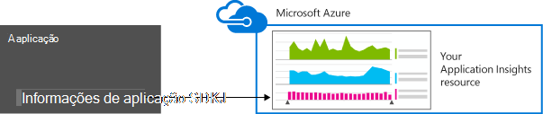
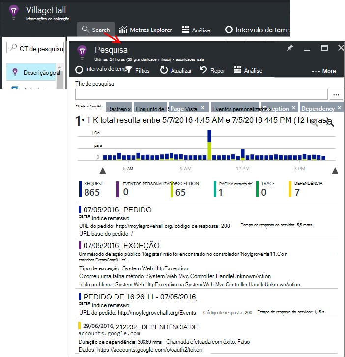

<properties 
    pageTitle="Tutorial de informações da aplicação | Microsoft Azure" 
    description="Controle a utilização e o desempenho da sua aplicação web ao vivo.  Detetar, fazer uma triagem e diagnosticar problemas. Continuamente monitorizar e melhorar o sucesso com os seus utilizadores." 
    services="application-insights" 
    documentationCenter=""
    authors="alancameronwills" 
    manager="douge"/>

<tags 
    ms.service="application-insights" 
    ms.workload="tbd" 
    ms.tgt_pltfrm="ibiza" 
    ms.devlang="na" 
    ms.topic="article" 
    ms.date="10/15/2016" 
    ms.author="awills"/>
 
# Informações de aplicação - introdução

Informações de aplicação do Visual Studio é um serviço de análise extensible que monitoriza a aplicação web direto. Com o mesmo pode detetar e diagnosticar problemas de desempenho e compreender o que os utilizadores realmente fazer com a sua aplicação. Destina-se para os programadores, para ajudá-lo continuamente a melhorar o desempenho e capacidade de utilização. Funciona para as aplicações numa grande variedade de plataformas incluindo .NET, Node.js e J2EE, alojado no local ou na nuvem. 

[Veja a animação aqui](https://www.youtube.com/watch?v=fX2NtGrh-Y0).

## Como funciona?

Instalar um pacote de instrumentação pequenas na sua aplicação e configurar um recurso de informações de aplicação no portal do Microsoft Azure. A instrumentação monitoriza a sua aplicação e envia dados de telemetria para o portal. O portal mostra-lhe gráficos estatísticos e fornece ferramentas de pesquisa avançada para o ajudar a diagnosticar os problemas.

Informações de aplicação tem várias [módulos instrumentação padrão](app-insights-configuration-with-applicationinsights-config.md) recolher diferentes tipos de telemetria como tempos de resposta do pedido, exceções e chamadas de dependência. Também pode [escrever código para enviar telemetria personalizada](app-insights-api-custom-events-metrics.md) para o portal.

### O que é o overhead?

O impacto no desempenho da sua aplicação for muito pequeno. Controlo de chamadas são não bloquear e são enviadas em batches e enviou um tópico em separado. 

## O que faz?

Informações de aplicação destina-se a equipa de desenvolvimento, para o ajudar a compreender como está a executar a aplicação e como está a ser utilizado. Fornece-lhe:

Tipos de telemetria:

* Taxas de pedido HTTP, tempos de resposta, taxas de sucesso.
* Dependência (HTTP & SQL) chamar taxas, os tempos de resposta, taxas de sucesso.
* Rastreios de exceção a partir do servidor e o cliente.
* Rastreios de registo de diagnóstico.
* Vista de página de conta, conta de utilizador e de sessão, tempos de carregamento do browser, exceções.
* Taxas de chamada de AJAX, tempos de resposta e taxas de sucesso.
* Contadores de desempenho do servidor.
* Telemetria cliente e servidor personalizada.
* Segmentação pela localização de cliente, versão do browser, versão do SO, instância de servidor, dimensões personalizadas e mais.
* Testes de disponibilidade

Ferramentas de diagnóstico e analíticas:

* Inteligentes e manuais alertas de taxas de falha e outras métricas e da disponibilidade.
* Gráficos ao longo do tempo de métricas agregados.
* Pesquisa de diagnóstico em instâncias de pedidos de exceções, eventos personalizados, rastreios de registo, vistas de página, dependência e AJAX chamadas. 
* Análise - um idioma de consulta poderosas ao longo do seu telemetria
* Dashboards - compor os gráficos que precisa para monitorizar a todos os componentes de aplicação.

## Como posso utilizá-lo?

### Monitor

Instalar a aplicação informações no web app, configurar testes de web de disponibilidade, e:

* Configure um dashboard para a sua sala de equipa controlar no caso de carga, consequência e o desempenho do seu dependências, carregamentos de página e chamadas de AJAX. 
* Descubra a maior parte dos pedidos de falha e quais são os mais lenta.
* Veja o fluxo direto quando implementar uma nova versão, a saber qualquer degradação imediatamente.

### Diagnosticar

Quando receber um alerta ou descobrir um problema:

* Se ligam falhas às exceções, chamadas de dependência e rastreios.
* Examine informações de estado da pilha e registos de rastreio.

### Avaliar

Meça a eficácia da cada nova funcionalidade implementar.

* Plano para medir como clientes utilizam UX novo ou funcionalidades de business.
* Escreva telemetria personalizada para o seu código para iniciar sessão a utilização.
* Basear a cada ciclo de desenvolvimento no disco rígida provas de telemetria.

## Introdução

Informações de aplicação é um dos muitos serviços alojados no Microsoft Azure e telemetria é enviada aí para análise e apresentação. Por isso, antes de fazer mais alguma coisa, terá de uma subscrição do [Microsoft Azure](http://azure.com). É gratuito para se inscrever e pode escolher o gratuito [preços camada](https://azure.microsoft.com/pricing/details/application-insights/) de aplicação de informações. Se a sua organização já tiver uma subscrição, estes podem adicionar a sua conta Microsoft para o mesmo. 

Existem várias formas para começar a utilizar. Começar com consoante o que funciona melhor por si. Pode adicionar as outras mais tarde.

* **Tempo de execução de AT: instrumento a aplicação web no servidor.** Evita qualquer atualização para o código. Tem de ter acesso de administrador ao seu servidor.
 * [**IIS no local ou numa VM**](app-insights-monitor-performance-live-website-now.md)
 * [**Azure web app ou VM**](app-insights-monitor-performance-live-website-now.md#if-your-app-runs-as-an-azure-web-app)
 * [**J2EE**](app-insights-java-live.md)
* **Ao tempo de desenvolvimento: adicionar informações de aplicação para o seu código.** Permite-lhe escrever telemetria personalizada e para instrument back-end e aplicações de ambiente de trabalho.
 * Atualização de 2013 do [Visual Studio](app-insights-asp-net.md) 2 ou posterior.
 * Java em [Eclipse](app-insights-java-eclipse.md) ou [outras ferramentas](app-insights-java-get-started.md)
 * [NODE.js](app-insights-nodejs.md)
 * [Noutras plataformas](app-insights-platforms.md)
* **[Instrumento as suas páginas web](app-insights-javascript.md)** para a vista de página, AJAX e outras telemetria do lado do cliente.
* **[Testes de disponibilidade](app-insights-monitor-web-app-availability.md)** - ping o seu Web site regularmente dos nossos servidores.

> [AZURE.NOTE]  Neste momento, talvez apenas pretende obter no e experimentar. Mas se pretender para ver o que pode fazer informações de aplicação, continue a ler...

## Explorar métricas

Executar a sua aplicação - quer no modo de depuração no seu computador de desenvolvimento, ou ao implementá-lo para um servidor - e utilizá-lo no tempo. Em seguida, inicie sessão no [Azure portal](https://portal.azure.com).

Navegue até à pá de descrição geral de informações de aplicação a aplicação:

A descrição geral do permite-lhe ver imediatamente como está a executar a aplicação. Pode comparar carga (em termos de taxa de pedidos de) com a hora a aplicação demasiado para responder aos pedidos. Se existir um aumento desproporcionado tempo de resposta quando o carregamento vai para cima, poderá pretender atribuir mais recursos para a sua aplicação. Se for apresentada à direita de falha de respostas mais depois de implementado uma nova compilação, em seguida, poderá pretender recuperar.

#### Obter mais detalhes

Clique nas qualquer gráfico para obter um conjunto de gráficos mais detalhado. Por exemplo, o gráfico de tempo de resposta do servidor oportunidades potenciais gráficos que mostram o pedido taxas, tempos de resposta e tempos de resposta de dependências (ou seja, os serviços que a aplicação chama).  

O gráfico dependências é útil porque ajuda-o a ver se a bases de dados e os REST APIs que utiliza a sua aplicação estão bem a responder ou estão a causar atrasos.

#### Personalizar um gráfico

Experimente um destes gráficos de edição. Por exemplo, se a sua aplicação web é executado numa coleção de instâncias do servidor, pode comparar os tempos de resposta nas instâncias de servidor diferente:

1. Paire sobre o gráfico e clique em Editar.
2. Selecione uma métrica. Várias métricas podem ser apresentadas num gráfico, mas apenas determinadas combinações: pode ter de desmarcar uma métrica antes de selecionar o nível pretendido.
3. Utilize Agrupar por para segmentar uma métrica por uma propriedade. Neste exemplo, podemos apresentar linhas separadas para diferentes tempos de resposta. 

    Tenha em atenção que tem de selecionar uma propriedade válida para a métrica ou o gráfico não apresentará quaisquer dados.
4. Selecione um tipo de gráfico. Área e gráficos de barras mostram uma visualização empilhada adequado quando o tipo de agregação é 'Soma'.

[Mais informações sobre a explorar métricas](app-insights-metrics-explorer.md).

## Dados de instância da pesquisa

Para investigar um problema, é útil para inspecionar instâncias do evento específico.

Clique em através de um gráfico métrico para pesquisar através de dados da instância com os filtros relevantes e intervalo de tempo. Por exemplo, clique nas contagens de pedido de servidor para ver relatórios de pedido individual. 

Ou pode aceder diretamente à dados da instância da pesquisa na página Descrição geral:

Utilize filtros para focar certos tipos de evento e nos valores de propriedade que selecionou:

Clique em "…" para ver uma lista completa das propriedades ou abrir outros eventos associados ao mesmo pedido. Neste exemplo, o pedido de falhado tem um relatório de exceção associado:

Abrir um evento - neste exemplo, a exceção relacionada - e pode criar um item de trabalho (se utilizar serviços de equipa do Visual Studio para controlar tarefas). 
 

## Análise

[Análise](app-insights-analytics.md) é uma funcionalidade pesquisa e análise ainda mais eficientes, na qual pode escrever consultas SQL gosto sobre os seus dados de telemetria, quer para procurar problemas específicos ou compilação informação estatística.

Abrir a janela de iniciação para ver e executar exemplos de consultas sobre os seus dados ou ler o mais longa [nestas instruções passo a passo](app-insights-analytics-tour.md). IntelliSense pede-lhe as consultas que pode utilizar e existir uma [referência da linguagem completo](app-insights-analytics-reference.md). 

Consultas normalmente começam com o nome de uma sequência de telemetria como pedidos, exceções ou dependências. POP abrir a barra de esquema no lado esquerdo para ver uma lista das sequências de telemetria disponíveis. A consulta é uma tubagem de [operações de consulta](app-insights-analytics-reference.md#queries-and-operators) , tais como `where` - um filtro booleano - ou `project` -que calcula novas propriedades. `summarize`[instâncias de agregados](app-insights-analytics-tour.md#aggregate-groups-of-rows), agrupando-as pelas funções que define e, em seguida, aplicar funções de agregação ao longo dos dados agrupados.

Resultados podem ser [compostos num tabelas ou vários tipos de gráfico](app-insights-analytics-tour.md#charting-the-results).

## Telemetria personalizada

A telemetria incorporada que obtém instalando informações de aplicação permite-lhe analisar contagens de taxas de sucesso, e resposta vezes ambas para pedidos de web às suas chamadas de aplicação e dependências - ou seja, da sua aplicação para SQL, REST APIs. Também obtém rastreios de exceção e (com o Monitor de estado no servidor) contadores de desempenho do sistema. Se adicionar o fragmento de cliente às suas páginas web, obtenha contagens de vista de página e tempos de carregamento, exceções de cliente e AJAX chamar taxas de sucesso e a resposta. 

Analisar todos os este telemetria pode indicar-lhe muitas informações sobre o desempenho e a utilização da sua aplicação. Mas, por vezes, que não está suficientemente. Poderá pretender monitorizar o comprimento de uma fila de modo a que pode ajustar o desempenho do; ou contar o número de vendas e segmentá-los por localização; em alternativa, do lado do cliente, saiba como muitas vezes os utilizadores clicam num determinado botão para que pode otimizar a experiência do utilizador.

A [Aplicação informações API](app-insights-api-custom-events-metrics.md) fornece chamadas `TrackEvent(name)` e `TrackMetric(name, value)` para que possam enviar o seu próprio eventos personalizados e métricas. Existem chamadas equivalentes para o lado do cliente.

Por exemplo, se a sua página web é uma aplicação de jogo única página, poderá inserir linhas de nos locais adequados para iniciar sessão quando o utilizador wins ou perde um jogo:

    
    appInsights.trackEvent("WinGame");
    ...
    appInsights.trackEvent("LoseGame");

Em seguida, podemos pode colocar no gráfico contagens de evento personalizado, segmentá-los ao nome do evento:

### Registo rastreios

Para fins de diagnóstico, é um evento personalizado `TrackTrace(message)` que pode utilizar para rastreios de execução. As funcionalidades de pesquisa e análises, pode procurar no conteúdo da mensagem, que pode ser mais de um nome para o evento. 

Se já estiver a utilizar um quadro de registo como Log4Net, NLog, Log4J ou System.Diagnostic.Trace, em seguida, essas chamadas de rastreio podem ser capturadas por aplicação informações e serão apresentados junto a outros telemetria. As ferramentas do Visual Studio adicionar automaticamente o módulo SDK adequado.

## Dashboards

Muitas aplicações de consistir em vários componentes como um serviço web e um ou mais processadores novamente terminam. Cada componente será monitorizada por um recurso de informações da aplicação em separado. Se o seu sistema é executada no Azure, também pode estar a utilizar - e monitorização - serviços como o também de aprendizagem automática e concentradores do evento. 

Para monitorizar a todo o seu sistema, pode selecionar os gráficos mais interessantes a partir de diferentes aplicações e afixá-los um [dashboard](app-insights-dashboards.md)de Azure, permitindo-lhe controlar todo o sistema continuamente. 

Na verdade, pode criar vários dashboards - por exemplo, um dashboard de sala de equipa para monitorizar o estado de funcionamento do sistema geral; um dashboard de estrutura que foca-se na utilização de diferentes funcionalidades; um dashboard separado para componentes em teste; e assim sucessivamente.  

Dashboards, como recursos, podem ser partilhados entre os membros da equipa.

## Desenvolvimento no Visual Studio

Se estiver a utilizar o Visual Studio para desenvolver a sua aplicação, vai encontrar várias ferramentas de aplicação informações incorporadas. 

### Pesquisa de diagnóstico

A janela de pesquisa mostra eventos que tenham sido iniciados. (Se tiver sessão iniciada num Azure ao configurar as informações de aplicação, poderá procurar os eventos mesmo no portal.)

A pesquisa de texto livre funciona em todos os campos nos eventos. Por exemplo, procure uma parte do URL de uma página; ou o valor de uma propriedade tal como localidade de cliente; ou palavras específicas num registo de rastreio.

Clicar num evento para ver as respetivas propriedades detalhadas.

Também pode abrir o separador de itens relacionados para ajudar a diagnosticar os pedidos de falhados ou exceções.

### Concentrador de diagnóstico

O concentrador de diagnóstico (no Visual Studio 2015 ou posterior) mostra a telemetria do servidor de informações da aplicação, tal como é gerado. Isto funciona, mesmo se optado por participar apenas para instalar o SDK, sem ligá-lo a um recurso no portal do Azure.

### Exceções

Se tiver a [Configurar a monitorização de exceção](app-insights-asp-net-exceptions.md), relatórios de exceção mostrará na janela de pesquisa. 

Clique numa exceção para obter um rastreio de pilha. Se o código da aplicação for aberto no Visual Studio, pode clicar em através de no rastreio de pilha de para a linha relevante do código.

Além disso, na linha de código Lens acima cada método, verá uma contagem das exceções tem sessão iniciada por informações de aplicação antiga 24h.

### Monitorização local

(A partir de atualização de 2015 do Visual Studio 2) Se ainda não o tiver configurado o SDK para enviar telemetria para o portal de informações de aplicação (para que não existe nenhuma chave instrumentação ApplicationInsights.config), em seguida, a janela de diagnóstico irá apresentar telemetria a partir da sua sessão depuração mais recentes. 

Este é conveniente se já tiver publicado uma versão anterior da sua aplicação. Não queira de telemetria a partir do seu sessões depuração para misturadas com telemetria no portal de informações de aplicação a partir da aplicação publicado.

Também é útil se tiver alguns [telemetria personalizada](app-insights-api-custom-events-metrics.md) ao qual pretende depurar antes de enviar telemetria para o portal.

* *Na primeira, posso totalmente configurado informações de aplicação para enviar telemetria para o portal. Mas agora gostaria Consulte telemetria apenas no Visual Studio.*

 * Nas definições da janela de pesquisa, existe uma opção de pesquisa locais diagnósticos mesmo se a sua aplicação envia telemetria para o portal.
 * Para parar a ser enviada para o portal de telemetria, comentar a linha `<instrumentationkey>...` a partir do ApplicationInsights.config. Quando estiver pronto para enviar telemetria para o portal novamente, remova-os comentários.

## Tendências

Tendências é uma ferramenta no Visual Studio para visualizar a forma como a sua aplicação comporta-se ao longo do tempo. 

Selecione **Tendências de telemetria explorar** o botão da barra de ferramentas de informações da aplicação ou a janela de pesquisa de informações da aplicação. Selecione uma das consultas comuns cinco para começar a utilizar. Pode analisar diferentes conjuntos de dados com base em tipos de telemetria, intervalos de tempo e outras propriedades. 

Para localizar anomalias nos seus dados, selecione uma das opções anomalia no menu pendente "Tipo de vista". As opções de filtragem na parte inferior da janela do tornam mais fácil reduza no subconjuntos específicos da sua telemetria.

## Libertar uma nova compilação

### Sequência de métricas de Live

Sequência de métricas directo mostra-lhe as métricas de aplicação para a direita neste momento muito, com uma latência de em tempo real próximo de 1 segundo. Isto é muito útil quando está a libertar uma nova compilação e quiser para se certificar de que tudo está funcionar como esperado, ou um incidente em tempo real a investigar.

Ao contrário métricas Explorer, o fluxo direto de métricas apresenta um conjunto de métricas fixos. Os dados persiste apenas para desde que é no gráfico e, em seguida, é eliminada. 

### Anotações

[Anotações do lançamento](app-insights-annotations.md) nos gráficos de métricas mostrar onde implementado uma nova compilação. Facilitam ver se as suas alterações tinham qualquer efeito no desempenho da sua aplicação. Podem ser criados automaticamente pelo [dos serviços de equipa do Visual Studio construir sistema](https://www.visualstudio.com/en-us/get-started/build/build-your-app-vs)e também pode [criá-los a partir do PowerShell](#create-annotations-from-powershell).

Lançamento anotações são uma funcionalidade da compilação baseada na nuvem e solte o serviço do Visual Studio Team Services. 

## Alertas

Se algum problema com a sua aplicação, irá querer saber acerca do mesmo imediatamente. 

Informações de aplicação oferece três tipos de alerta, são entregues por correio eletrónico.

### Diagnósticos pro-activos 

[Diagnósticos pro-activos](app-insights-proactive-failure-diagnostics.md) é configurar automaticamente o - não tem de configurá-lo. Desde que o site tem suficiente tráfego, irá obter uma mensagem de e-mail, se existir um aumento nos pedidos de falhados que é invulgar para a hora do dia ou pedido de taxa. O alerta contém informações de diagnóstico. 

Eis um alerta de exemplo. 

Um segundo tipo de detecção pro-activos Deteta correlação entre falhas e fatores como localização, SO cliente ou tipo de browser.

### Métricas alertas

Pode configurar [alertas métricas](app-insights-alerts.md) para indicar-lhe quando qualquer métrica cruza um valor limite para alguns período - como contagens de falha, memória ou vistas de página.

### Disponibilidade

[Testes de web disponibilidade](app-insights-monitor-web-app-availability.md) enviar pedidos para o seu site dos nossos servidores em várias localizações em todo o mundo. Estes indicam-lhe quando o site não está disponível na internet, ou está a responder lentamente. 

## Exportar

Existem várias formas, pode obter os dados de telemetria fora do portal de informações da aplicação:

* [Exportar contínua](app-insights-export-telemetry.md) é ideal se pretender manter grandes partes dos seus telemetria durante mais o período de retenção padrão.
* [Métricas de](app-insights-metrics-explorer.md#export-to-excel) tabelas, os resultados da pesquisa e [a análise de](app-insights-analytics.md) resultados podem todas ser exportados para uma folha de cálculo do Excel. 
* O Access dados REST API pode ser utilizado para procurar e extrair dados, incluindo a executar a análise de consultas. API atualmente está na pré-visualização privada. [Saiba mais sobre como participar a pré-visualização](https://visualstudio.uservoice.com/forums/357324-application-insights/suggestions/4999529-make-data-accessible-via-apis-for-custom-processin).
* Pode exportar dashboards de [análise de consultas ao Power BI](app-insights-export-power-bi.md) e ver os resultados em visualizações do Power BI, que podem ser atualizadas automaticamente.

 
## Gestão de dados

Existem limites sobre a utilização do informações de aplicação, que dependem até certo ponto o esquema de preços que escolher. Sejam os limites principais no:

* Taxa de telemetria por minuto
* Contagem de ponto de dados por mês
* Período de retenção de dados

[Amostragem](app-insights-sampling.md) é um espaço reduzir o custo e evitar limitação. Rejeita uma proporção do seu telemetria, manter um representante de exemplo. Itens associados (como exceções e os pedidos de que causado-los) são mantidos ou eliminados em conjunto. Para aplicações do ASP.NET, amostragem é automática e é aplicada na aplicação; caso contrário, pode defini-lo para ser aplicada no ingestão ao portal.

## Próximos passos

Introdução ao tempo de execução com:

* [Servidor do IIS](app-insights-monitor-performance-live-website-now.md)
* [Servidor de J2EE](app-insights-java-live.md)

Introdução ao tempo de desenvolvimento com:

* [ASP.NET](app-insights-asp-net.md)
* [Java](app-insights-java-get-started.md)
* [NODE.js](app-insights-nodejs.md)

## Suporte e comentários

* Perguntas e problemas:
 * [Resolução de problemas][qna]
 * [Fórum MSDN](https://social.msdn.microsoft.com/Forums/vstudio/home?forum=ApplicationInsights)
 * [StackOverflow](http://stackoverflow.com/questions/tagged/ms-application-insights)
 * [Obter suporte para programadores](app-insights-get-dev-support.md)
* As sugestões:
 * [Uservoice do](https://visualstudio.uservoice.com/forums/357324)
* Blogue:
 * [Blogue de informações da aplicação](https://azure.microsoft.com/blog/tag/application-insights)

## Vídeos

> [AZURE.VIDEO 218]

> [AZURE.VIDEO usage-monitoring-application-insights]

> [AZURE.VIDEO performance-monitoring-application-insights]

> [Animação introdutória](https://www.youtube.com/watch?v=fX2NtGrh-Y0)

<!--Link references-->

[android]: https://github.com/Microsoft/ApplicationInsights-Android
[azure]: ../insights-perf-analytics.md
[client]: app-insights-javascript.md
[desktop]: app-insights-windows-desktop.md
[detect]: app-insights-detect-triage-diagnose.md
[greenbrown]: app-insights-asp-net.md
[ios]: https://github.com/Microsoft/ApplicationInsights-iOS
[java]: app-insights-java-get-started.md
[knowUsers]: app-insights-overview-usage.md
[platforms]: app-insights-platforms.md
[portal]: http://portal.azure.com/
[qna]: app-insights-troubleshoot-faq.md
[redfield]: app-insights-monitor-performance-live-website-now.md

 