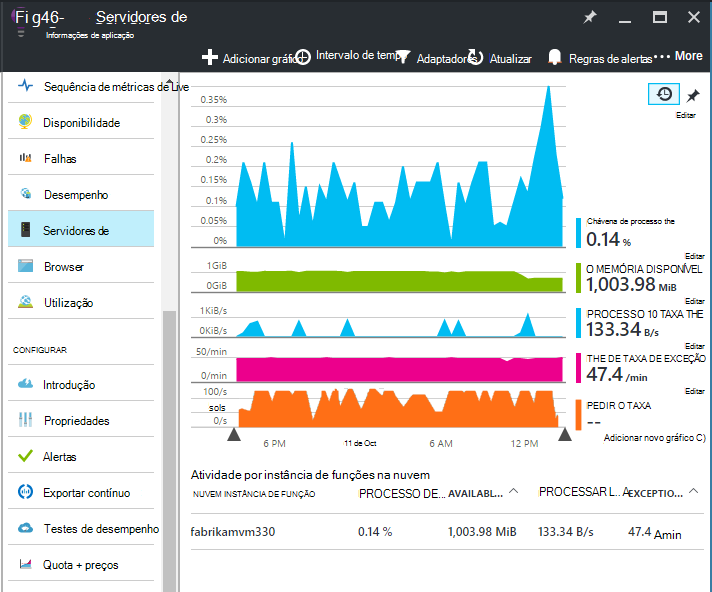
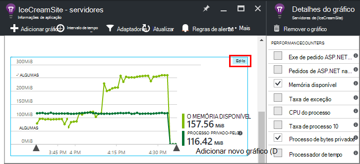
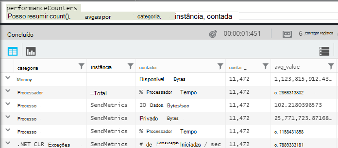
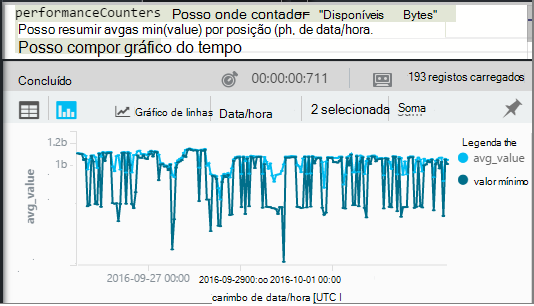
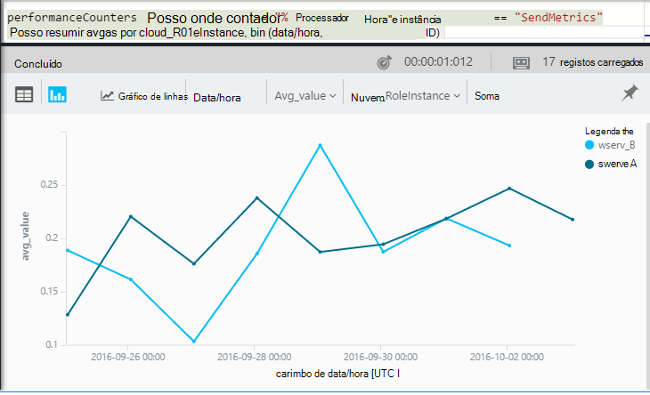

<properties 
    pageTitle="Contadores de desempenho no informações de aplicação | Microsoft Azure" 
    description="Monitorizar sistema e contadores de desempenho .NET personalizados na aplicação de informações." 
    services="application-insights" 
    documentationCenter=""
    authors="alancameronwills" 
    manager="douge"/>

<tags 
    ms.service="application-insights" 
    ms.workload="tbd" 
    ms.tgt_pltfrm="ibiza" 
    ms.devlang="na" 
    ms.topic="article" 
    ms.date="10/11/2016" 
    ms.author="awills"/>
 
# <a name="system-performance-counters-in-application-insights"></a>Contadores de desempenho do sistema no informações de aplicação


O Windows fornece uma grande variedade de [contadores de desempenho](http://www.codeproject.com/Articles/8590/An-Introduction-To-Performance-Counters) , tal como a forma de exploração CPU, memória, disco e a utilização de rede. Pode também definir sua própria. [Informações de aplicação](app-insights-overview.md) pode mostrar estes contadores de desempenho, se a aplicação é executada em IIS num anfitrião no local ou máquina virtual a que tem acesso administrativo. Os gráficos indicam os recursos disponíveis para a sua aplicação direto e podem ajudar a identificar a carga de colunas equilibrada entre instâncias do servidor.

Contadores de desempenho aparecem no pá servidores, que inclui uma tabela que segmentos por instância de servidor.



(Contadores de desempenho não estão disponíveis para Azure Web Apps. Mas pode [Enviar Azure diagnósticos para informações de aplicação](app-insights-azure-diagnostics.md).)

## <a name="configure"></a>Configurar

Se ainda não está instalado o Monitor de estado de informações de aplicação nos computadores de servidor, terá de instalá-lo para ver contadores de desempenho.

Transfira e execute o [installer de Monitor de estado](http://go.microsoft.com/fwlink/?LinkId=506648) em cada instância de servidor. Se já estiver instalado, não precisa de instalá-lo novamente.

* *Posso [instalar o SDK de informações da aplicação na minha aplicação](app-insights-asp-net.md) durante o desenvolvimento. Ainda é necessário Monitor de estado?*

    Sim, Monitor de estado é necessária para recolher contadores de desempenho para aplicações web do ASP.NET. Como poderá já sabe, Monitor de estado podem também ser utilizados para [aplicações web do monitor que já estão live](app-insights-monitor-performance-live-website-now.md), sem instalar o SDK durante o desenvolvimento.


## <a name="view-counters"></a>Vista contadores

O pá servidores mostra um conjunto predefinido de contadores de desempenho. 

Para ver outros contadores, edite os gráficos no pá servidores, ou abra um novo pá de [Métricas Explorer](app-insights-metrics-explorer.md) e adicionar novos gráficos. 

Os contadores disponíveis estão listados como métricas quando edita um gráfico.



Para ver todos os seus gráficos mais útil num único local, criar um [dashboard](app-insights-dashboards.md) e afixá-los à mesma.

## <a name="add-counters"></a>Adicionar contadores

Se não for apresentado o contador de desempenho que pretende na lista de métricas, é porque o SDK de informações da aplicação não é recolhê-lo no seu servidor web. Pode configurar fazê-lo.

1. Saiba quais são os contadores estão disponíveis no seu servidor utilizando este comando do PowerShell no servidor:

    `Get-Counter -ListSet *`

    (See [`Get-Counter`](https://technet.microsoft.com/library/hh849685.aspx).)

1. Abra ApplicationInsights.config.

 * Se tiver adicionado as informações de aplicação para a sua aplicação durante o desenvolvimento, edite ApplicationInsights.config no seu projeto e, em seguida, implementá-lo novamente para os seus servidores.
 * Se utilizou o Monitor de estado para instrumento uma aplicação web o tempo de execução, encontre ApplicationInsights.config o diretório de raiz da aplicação no IIS. Atualize-lo lá em cada instância de servidor.

2. Edite a diretiva de Recolectores desempenho:

 ```XML

    <Add Type="Microsoft.ApplicationInsights.Extensibility.PerfCounterCollector.PerformanceCollectorModule, Microsoft.AI.PerfCounterCollector">
      <Counters>
        <Add PerformanceCounter="\Objects\Processes"/>
        <Add PerformanceCounter="\Sales(photo)\# Items Sold" ReportAs="Photo sales"/>
      </Counters>
    </Add>

```

Pode capturar contadores padrão tanto aqueles que tenha implementado si próprio. `\Objects\Processes`é um exemplo de um contador padrão, disponível em todos os sistemas do Windows. `\Sales(photo)\# Items Sold`é um exemplo de um contador personalizado que poderá ser implementado um serviço web. 

O formato é `\Category(instance)\Counter"`, ou para as categorias que não têm instâncias, apenas `\Category\Counter`.

`ReportAs`é necessário para nomes de contador que não correspondam `[a-zA-Z()/-_ \.]+` -ou seja, que contêm carateres que não estão a ser os seguintes conjuntos: letras, arredondar parênteses, barra, hífen, sublinhado, espaço, de ponto.

Se especificar uma instância, serão recolhida como uma dimensão "CounterInstanceName" da métrica denunciada.

### <a name="collecting-performance-counters-in-code"></a>Recolher contadores de desempenho no código

Para recolher contadores de desempenho do sistema e enviá-las para informações de aplicação, pode adaptá o fragmento de abaixo:

    var perfCollectorModule = new PerformanceCollectorModule();
    perfCollectorModule.Counters.Add(new PerformanceCounterCollectionRequest(
      @"\.NET CLR Memory([replace-with-application-process-name])\# GC Handles", "GC Handles")));
    perfCollectorModule.Initialize(TelemetryConfiguration.Active);

Ou pode fazer a mesma coisa com métricas personalizadas que criou:

    var perfCollectorModule = new PerformanceCollectorModule();
    perfCollectorModule.Counters.Add(new PerformanceCounterCollectionRequest(
      @"\Sales(photo)\# Items Sold", "Photo sales"));
    perfCollectorModule.Initialize(TelemetryConfiguration.Active);

## <a name="performance-counters-in-analytics"></a>Contadores de desempenho no Analytics

Pode procurar e apresentar relatórios de desempenho de contador na [análise](app-insights-analytics.md).


Esquema de **performanceCounters** expõe o `category`, `counter` nome, e `instance` nome de cada contador de desempenho.  Telemetria para cada aplicação, verá apenas os contadores para essa aplicação. Por exemplo, para ver quais são os contadores estão disponíveis: 



(Aqui 'Instância' que se refere a instância do contador de desempenho, não a instância de máquina função ou servidor. O nome da instância do desempenho contador normalmente segmentos contadores como o tempo de processador pelo nome do processo ou da aplicação.)

Para obter um gráfico de memória disponível durante o período recente: 




Como outras telemetria, **performanceCounters** também tem uma coluna `cloud_RoleInstance` que indica a identidade da instância de servidor de anfitrião no qual a aplicação está a ser executado. Por exemplo, para comparar o desempenho da sua aplicação nos computadores diferentes: 




## <a name="aspnet-and-application-insights-counts"></a>ASP.NET e as contagens de informações de aplicação

*O que é a diferença entre a taxa de exceção e métricas de exceções?*

* *Taxa de exceção* é um contador de desempenho do sistema. O CLR conta todas as processada e não processadas exceções que são iniciadas e divide o total num intervalo de amostragem pelo comprimento do intervalo. O SDK de informações da aplicação recolhe este resultado e envia-o para o portal.
* *Exceções* é uma contagem dos relatórios TrackException recebida pelo portal no intervalo de amostragem do gráfico. Inclui apenas as exceções processadas onde tenham escrita TrackException chamadas no seu código e não inclui todas as [exceções não processadas](app-insights-asp-net-exceptions.md). 

## <a name="alerts"></a>Alertas

Como outras métricas, pode [definir um alerta](app-insights-alerts.md) para avisá-lo se um contador de desempenho acede fora de um limite que especificar. Abra o pá de alertas e clique em Adicionar alerta.


## <a name="next"></a>Próximos passos

* [Dependência de controlo](app-insights-asp-net-dependencies.md)
* [Controlo de exceção](app-insights-asp-net-exceptions.md)