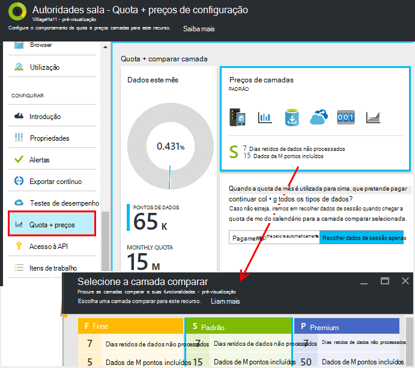

<properties 
    pageTitle="Gerir os preços e quota para informações de aplicação | Microsoft Azure" 
    description="Escolher o plano de preço que precisar, gerir volumes de telemetria" 
    services="application-insights" 
    documentationCenter=""
    authors="alancameronwills" 
    manager="douge"/>

<tags 
    ms.service="application-insights" 
    ms.workload="tbd" 
    ms.tgt_pltfrm="ibiza" 
    ms.devlang="na" 
    ms.topic="article" 
    ms.date="10/13/2016" 
    ms.author="awills"/>

# Gerir os preços e quota para informações de aplicação

*Informações de aplicação está na pré-visualização.*

[Preços] [ pricing] para [Informações de aplicação do Visual Studio] [ start] é baseado no volume de dados por aplicação. Existe uma camada gratuita substancial em que obtém a maioria das funcionalidades com algumas limitações.

Cada recurso de informações da aplicação é cobrado como um serviço em separado e contribui para o título para a sua subscrição para Azure.

[Ver o esquema dos preços][pricing].

## Quota de revisão e preço plano para o seu recurso de informações de aplicação

Pode abrir a Quota de + preços pá a partir das definições do seu recurso de aplicação.

Afeta a sua escolha de preços esquema:

* [Quota mensal](#monthly-quota) - a quantidade de telemetria que pode analisar cada mês.
* [Taxa de dados](#data-rate) - a velocidade máxima no qual podem ser processados dados da sua aplicação.
* [Exportar contínua](#continuous-export) - se pode exportar dados para outras ferramentas e serviços.

Estes limites são definidos separadamente para cada recurso de informações da aplicação.

### Versão de avaliação gratuita Premium

Quando cria um novo recurso de informações da aplicação pela primeira vez, inicia na camada gratuita.

Em qualquer altura, pode mudar para o dia 30 Premium versão de avaliação gratuita. Isto dá-lhe os benefícios da camada Premium. Após 30 dias, será automaticamente revertida para qualquer camada foram antes de - a menos que opte explicitamente outra camada. Selecionar a camada que pretende utilizar em qualquer altura durante o período de avaliação, mas ainda irá obter a versão de avaliação gratuita até ao final do período de 30 dias.

## Quota mensal

* Em cada mês do calendário, a aplicação pode enviar para uma determinada quantidade de telemetria para informações de aplicação. Atualmente, a quota de para a camada comparar gratuita é 5 milhões de pontos de dados por mês e substancialmente mais para os esquemas; Pode comprar mais se chegar a quota de.  Consulte o artigo [preços esquema] [ pricing] para os números reais. 
* A quota de depende da camada preços que escolheu.
* É contabilizada a quota de meia-noite UTC o primeiro dia de cada mês.
* O gráfico de pontos de dados mostra a quantidade da quota da sua foi utilizado para cima deste mês.
* A quota de é medida em *pontos de dados.* Um único ponto de dados é uma chamada para um dos métodos registar, quer denominada explicitamente no seu código ou por uma dos módulos de telemetria padrão. Pode ter vários anexadas propriedades e métricas.
* Pontos de dados são gerados por:
 * [Módulos SDK](app-insights-configuration-with-applicationinsights-config.md) que automaticamente recolher dados, por exemplo para comunicar um pedido de ou falha de sistema ou para medir o desempenho.
 * [API](app-insights-api-custom-events-metrics.md) `Track...` chamadas que tem a escrita, tais como `TrackEvent` ou `trackPageView`.
 * [Testes de web disponibilidade](app-insights-monitor-web-app-availability.md) que configurou.
* Enquanto está a depuração, pode ver os pontos de dados a ser enviados da sua aplicação na janela de saída do Visual Studio. Eventos do cliente podem ser vistos ao abrir que o separador rede no seu browser do depuração painel (normalmente F12).
* *Dados de sessão* não é contada na quota de. Isto inclui contagens de utilizadores, sessões, ambiente e dados do dispositivo.
* Se pretender para contar o número de cópias pontos de dados por inspeção, pode localizá-las em vários locais:
 * Cada item que vê na [pesquisa de diagnóstico](app-insights-diagnostic-search.md), que inclui HTTP pedidos, exceções, rastreios de registo, vistas de página, eventos de dependência e eventos personalizados.
 * Cada observou medidas de uma [métrica](app-insights-metrics-explorer.md) como um contador de desempenho. (Os pontos que vê nos gráficos são normalmente agregados de vários pontos de dados não processados).
 * Cada ponto num gráfico de disponibilidade web também é um agregado várias de pontos de dados.
* Também pode inspecionar pontos de dados individuais na origem de durante a depuração:
 * Se executar a aplicação no modo de depuração no Visual Studio, os pontos de dados são registados na janela de saída. 
 * Para ver os pontos de dados de cliente, abra o painel depuração do seu browser (normalmente F12) e abrir o separador de rede.
* A taxa de dados pode ser (por predefinição) reduzida por [amostragem ajustável](app-insights-sampling.md). Isto significa que, como a utilização da sua aplicação aumentos, a taxa de telemetria não aumenta, tanto quanto seria de esperar.

### Hiperdosagem em termos

Se a sua aplicação envia mais do que a quota de mensal, pode:

* Paga dados adicionais. Consulte o artigo [preços esquema] [ pricing] para obter detalhes. Pode escolher esta opção com antecedência. Esta opção não está disponível no Free preços de camadas.
* Atualize o seu comparar camada.
* Não faça nada. Dados da sessão irão continuar a ser gravado, mas outros dados não aparecerá na pesquisa diagnóstico ou no Explorador de métricas.

## Quantidade de dados que estou a enviar

O gráfico na parte inferior dos preços pá mostra o volume do ponto de dados da aplicação, agrupados por tipo de ponto de dados. (Pode também criar este gráfico no Explorador de métrica.)

Clique no gráfico para obter mais detalhes, ou arraste-la e clique em (+) para os detalhes de um intervalo de tempo.

O gráfico mostra o volume de dados que chega ao serviço de informações da aplicação, após a [amostragem](app-insights-sampling.md).

Se o volume de dados atingir a quota mensal, uma anotação é apresentada no gráfico.

## Taxa de dados

Para além da quota de mensal, existem limites optimização a taxa de dados. Para os gratuito [preços camada] [ pricing] o limite é 200 dados pontos/segundo médios superior 5 minutos e para o paga o camadas é 500/s média superior 1 minuto. 

Existem três registos que são contados separadamente:

* [Chamadas de TrackTrace](app-insights-api-custom-events-metrics.md#track-trace) e [capturado registos](app-insights-asp-net-trace-logs.md)
* [Exceções](app-insights-api-custom-events-metrics.md#track-exception), limitado a 50 pontos/s.
* Todos os outros telemetria (vistas de página, sessões, pedidos, dependências, métricas, eventos personalizados, os resultados web).

*O que acontece se a minha aplicação excede a taxa por segundo?*

* O volume de dados que envia da sua aplicação é avaliado minuto. Se excedê-lo a taxa de por segundo média os minutos, o servidor recusa alguns pedidos. O SDK serve de memória intermédia os dados e, em seguida, tenta reenviar, propagação um picos através de alguns minutos. Se a sua aplicação de forma consistente envia dados acima a taxa de limitação, alguns dados serão ignorados. (O ASP.NET, Java e JavaScript SDK tentarem Reenviar desta forma; outras SDK poderá simplesmente largar limitada dados).

Se limitação ocorrer, irá ver uma notificação de aviso que este tenha aconteceu.

*Como posso saber quantos pontos de dados a minha aplicação está a enviar?*

* Abra Definições/Quota e preços para ver o gráfico de Volume de dados.
* Ou no Explorador de métricas, adicionar um novo gráfico e selecione o **volume do ponto de dados** como respetiva métrica. Mudança de agrupamento e agrupar por **tipo de dados**.

## Para reduzir a velocidade de dados

Se se deparar com os limites de optimização, eis algumas coisas que pode fazer:

* Utilize [amostragem](app-insights-sampling.md). Esta tecnologia reduz taxa de dados sem torcer seu métricas e sem interromper a capacidade de navegar entre os itens relacionados na pesquisa.
* [Limitar o número de chamadas de Ajax que pode ser comunicado](app-insights-javascript.md#detailed-configuration) em cada vista de página ou mudar desativar Ajax elaboração de relatórios.
* Mude desativar módulos de coleções de sites que não precisa de editando [ApplicationInsights.config](app-insights-configuration-with-applicationinsights-config.md). Por exemplo, pode decidir o que são inessential contadores de desempenho ou dados de dependência.
* Agrega previamente métricas. Se tiver coloca as chamadas para TrackMetric na sua aplicação, pode reduzir o tráfego utilizando a sobrecarga que aceita o cálculo da média e o desvio-padrão de um lote de medidas. Ou pode utilizar um [pacote agrupamento previamente](https://www.myget.org/gallery/applicationinsights-sdk-labs). 

## Amostragem

[Amostragem](app-insights-sampling.md) é um método de como reduzir a taxa no qual telemetria é enviada para a sua aplicação, enquanto ainda reter a capacidade de localizar eventos relacionados durante as pesquisas de diagnóstico e ainda reter correta de conta do evento. 

Amostragem é uma forma eficaz para reduzir os encargos e permanecer dentro do seu quota mensal. O algoritmo de amostragem retém itens relacionados de telemetria, para que, por exemplo, quando utilizar a pesquisa, pode encontrar o pedido relacionados com uma exceção específica. O algoritmo retém também contagens corretas, para que veja os valores corretos no Explorador de métrica de taxas de pedido, taxas de exceção e outras contagens.

Existem várias formas de amostragem.

* [Amostragem ajustável](app-insights-sampling.md) é a predefinição para o SDK do ASP.NET, que é ajustado automaticamente para o volume de telemetria que envia da sua aplicação. Opera automaticamente no SDK no seu web app, para que o tráfego de telemetria na rede é reduzido. 
* *Ingestão amostragem* é uma alternativa que funciona no ponto onde telemetria da sua aplicação introduz o serviço de informações da aplicação. Não afeta o volume de telemetria enviado a partir da sua aplicação, mas reduz o volume retido pelo serviço. Pode utilizá-lo para reduzir a quota de utilizado para cima por telemetria de browsers e outros SDK.

Para definir amostragem ingestão, defina o controlo nas Quotas de + preços pá:

> [AZURE.WARNING] O valor mostrado no mosaico amostras retidos indica apenas o valor que definiu para amostragem ingestão. -Não é apresentado a taxa de amostragem que está a funcionar em SDK na sua aplicação. 
> 
> Se já tem foram recolhida de telemetria recebida no SDK, amostragem ingestão não é aplicada.
 
Para descobrir a taxa de amostragem real independentemente de onde foram aplicado, utilize uma [consulta de análise](app-insights-analytics.md) como estas:

    requests | where timestamp > ago(1d)
  	| summarize 100/avg(itemCount) by bin(timestamp, 1h) 
  	| render areachart 

Em cada retidos registo, `itemCount` indica o número de registos originais que representa, igual a 1 + o número de registos rejeitados anterior. 

## Rever o título para a sua subscrição do Azure

Taxas de informações da aplicação são adicionadas à sua fatura Azure. Pode ver os detalhes da sua Azure faturar na secção de faturação do Azure portal ou no [Portal de faturação do Azure](https://account.windowsazure.com/Subscriptions). 

## Limites de nome

1.  Máximo de 200 exclusivos métricos nomes e 200 propriedade exclusivo nomes para a sua aplicação. Métricas incluam dados enviados por TrackMetric, bem como as medidas sobre outros tipos de dados, tal como eventos.  [Nomes de métricas e de propriedade] [ api] são globais por chave instrumentação.
2.  [Propriedades] [ apiproperties] podem ser utilizados para filtrar e agrupar por apenas enquanto têm menos de 100 valores exclusivos para cada propriedade. Depois do número de valores exclusivos exceder 100, pode ainda procurar a propriedade, mas já não utilizá-lo para filtros ou agrupar por.
3.  Propriedades padrão, tais como Pedir nome e o URL da página estão limitadas a 1000 valores exclusivos por semana. Depois de 1000 valores exclusivos, valores adicionais são marcados como "Outros valores." Os valores originais ainda podem ser utilizados para pesquisa de texto completo e filtrar.

Se encontrar a aplicação é superior a estes limites, considere dividir os seus dados entre chaves instrumentação diferentes - ou seja, [criar novos recursos de informações da aplicação](app-insights-create-new-resource.md) e enviar alguns dos dados para as novas chaves instrumentação. Pode achar que o resultado está estruturado melhor. Pode utilizar [dashboards](app-insights-dashboards.md#dashboards) para trazer as métricas diferentes no mesmo ecrã, para que esta abordagem não restringir a sua capacidade para comparar métricas diferentes. 

## Resumo dos limites

[AZURE.INCLUDE [application-insights-limits](../../includes/application-insights-limits.md)]

<!--Link references-->

[api]: app-insights-api-custom-events-metrics.md
[apiproperties]: app-insights-api-custom-events-metrics.md#properties
[start]: app-insights-overview.md
[pricing]: http://azure.microsoft.com/pricing/details/application-insights/

 