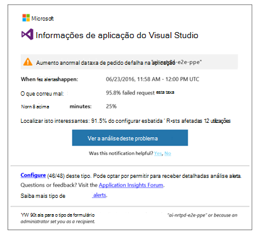
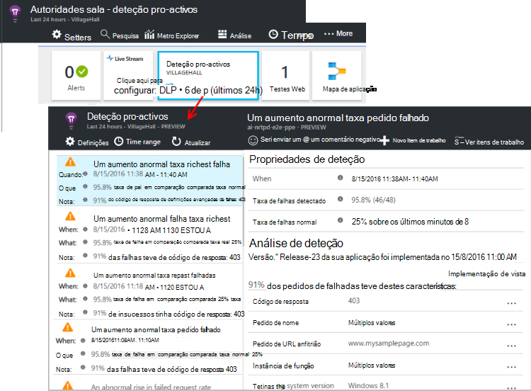

<properties 
    pageTitle="Diagnósticos pro-activos na aplicação informações | Microsoft Azure" 
    description="Informações de aplicação executa automática análise abrangente de telemetria sua aplicação e avisa-o de potenciais problemas." 
    services="application-insights" 
    documentationCenter="windows"
    authors="rakefetj" 
    manager="douge"/>

<tags 
    ms.service="application-insights" 
    ms.workload="tbd" 
    ms.tgt_pltfrm="ibiza" 
    ms.devlang="na" 
    ms.topic="article" 
    ms.date="08/15/2016" 
    ms.author="awills"/>

#  Diagnósticos pro-activos na aplicação informações

 Diagnóstico pro-activos automaticamente avisa-o de potenciais problemas de desempenho na sua aplicação web. Executa inteligente análise de telemetria que envia a aplicação para [Informações de aplicação do Visual Studio](app-insights-overview.md). Se existir um aumento repentina sobre taxas de falha ou padrões anormais no desempenho de cliente ou servidor, obtém um alerta. Esta funcionalidade não necessita de nenhuma configuração. Funciona se a sua aplicação envia suficiente telemetria.

Pode aceder a alertas de deteção pro-activos tanto os e-mails a que receber e a partir do pá detecção pro-activos.

## Rever a sua DLP pro-activos

Pode descobrir DLP de duas maneiras:

* **Recebe uma mensagem de e-mail** de informações da aplicação. Eis um exemplo típico:

    

    Clique no botão grande para abrir mais detalhadamente no portal.

* **A deteção pro-activos dispor em mosaico** no pá de descrição geral da sua aplicação mostra uma contagem das alertas recentes. Clique no mosaico para ver uma lista de alertas recentes.

Selecione um alerta para ver os seus detalhes.

## Que problemas são detetados?

Existem três tipos de detecção:

* [Diagnósticos do taxa pro-activos falha](app-insights-proactive-failure-diagnostics.md). Utilizamos definir a velocidade esperada de pedidos de falhadas da sua aplicação de aprendizagem automática correlacionar com carga e outros fatores. Se a taxa de falha ficar fora o envelope esperado, iremos enviar um alerta.
* [Diagnósticos de desempenho pro-activos](app-insights-proactive-performance-diagnostics.md). Vamos procurar padrões discordantes na tempos de resposta e taxas de falha diariamente. Vamos correlacionar estes problemas com propriedades, tais como localização, browser, SO cliente, a instância de servidor e a hora do dia.
* [Azure Cloud Services](https://azure.microsoft.com/blog/proactive-notifications-on-cloud-service-issues-with-azure-diagnostics-and-application-insights/). Receber alertas se a aplicação está alojada no Azure serviços em nuvem e tem de uma instância de função falhas no arranque, reciclagem frequente ou falhas de runtime.

(As ligações de ajuda na notificação de cada levá-lo para os artigos relevantes.)

## Próximos passos

Estas ferramentas de diagnóstico ajudá-lo inspecionar telemetria da sua aplicação:

* [Métrica explorer](app-insights-metrics-explorer.md)
* [Explorador de procura](app-insights-diagnostic-search.md)
* [Análise - linguagem de consulta avançada](app-insights-analytics-tour.md)

Diagnósticos pro-activos são completamente automáticos. Mas talvez que pretende configurar algumas alertas mais?

* [Alertas métricas configuradas manualmente](app-insights-alerts.md)
* [Testes de web de disponibilidade](app-insights-monitor-web-app-availability.md) 

