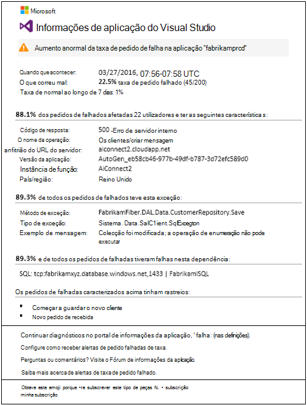
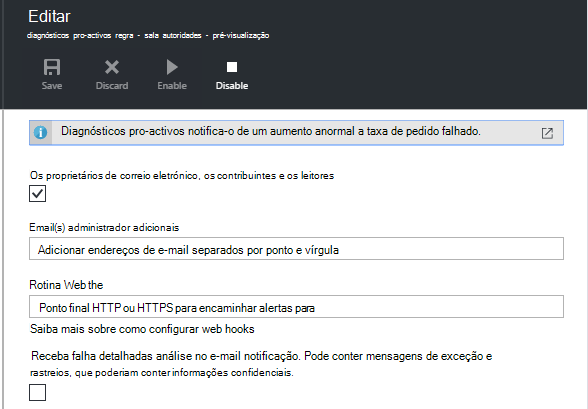

<properties 
    pageTitle="Diagnósticos do taxa pro-activos falha na aplicação informações | Microsoft Azure" 
    description="O alerta para a alterações invulgares na taxa de falhadas pedidos para a sua aplicação web e fornece uma análise de diagnóstico. Não é necessária nenhuma configuração." 
    services="application-insights" 
    documentationCenter=""
    authors="yorac" 
    manager="douge"/>

<tags 
    ms.service="application-insights" 
    ms.workload="tbd" 
    ms.tgt_pltfrm="ibiza" 
    ms.devlang="na" 
    ms.topic="article" 
    ms.date="10/12/2016" 
    ms.author="awills"/>
 
# Falha pro-activos taxa diagnósticos

[Informações de aplicação do Visual Studio](app-insights-overview.md) automaticamente notifica-o em tempo real próximo se a sua aplicação web experiências um aumento anormal a taxa de falhas. Detetar um aumento invulgar a taxa de pedidos de HTTP comunicado como falhou. Estes normalmente são aqueles com códigos de resposta no 400 - e 500-intervalos. Para ajudar a fazer uma triagem e diagnosticar o problema, uma análise das características de falha de pedidos e telemetria relacionada é fornecida na notificação. Também existem ligações para o portal de aplicação informações de diagnóstico ainda mais. A funcionalidade não necessita de nenhuma configuração da compilação ou configuração, tal como utiliza algoritmos de aprendizagem automática para prever a taxa de falha normal.

Esta funcionalidade funciona para Java e ASP.NET web apps, alojados na nuvem ou nos seus servidores. Também funciona para qualquer aplicação que gera pedido telemetria - por exemplo, se tiver uma função de trabalho que chamadas [TrackRequest()](app-insights-api-custom-events-metrics.md#track-request). 

Depois de configurar as [Informações de aplicação para o seu projeto](app-insights-overview.md)e desde a sua aplicação gera um determinado valor mínimo de telemetria, falha pro-activos diagnósticos demora 24 horas para obter informações sobre o comportamento normal da sua aplicação, antes de é ativada e pode enviar alertas.

Eis um alerta de exemplo. 

> [AZURE.NOTE] Por predefinição, receberá uma mensagem de correio do formato endereço mais curta que este exemplo. Mas pode [Mudar para este formato detalhado](#configure-alerts).

Repare que mostra-lhe:

* A taxa de falha comparadas com o comportamento de aplicação normal.
* Quantos utilizadores são afetados – para saber quanto se preocupar.
* Um padrão característico associado as falhas. Neste exemplo, existe um código de resposta específica, o nome de pedido (operação) e a versão de aplicação. Que imediatamente mostra-lhe onde pretende começar a procurar no seu código. Outras possibilidades poderão ser um browser ou um cliente de sistema operativo.
* A exceção, rastreios de registo e falha de dependência (bases de dados ou outros componentes externos) que são apresentadas de ser associadas a caracterizado Ocorreu uma falha pedidos.
* Ligações diretamente para as pesquisas relevantes no telemetria na aplicação de informações.

## Vantagens de alertas pro-activos

Normais [alertas métricas](app-insights-alerts.md) indicar-lhe poderá haver um problema. Mas falha pro-activos diagnósticos inicia o trabalho de diagnóstico para si, efetuar muitas a análise caso contrário, tem de fazer o seu próprio. Obter os resultados de uma forma ordenada empacotados, ajudando-o a obter rapidamente na raiz do problema.

## Como funciona

Junto à monitores diagnósticos pro-activos em Tempo Real de telemetria recebida da sua aplicação e, em particular a taxa de pedido falhado. Esta métrica conta o número de pedidos para o qual o `Successful request` propriedade for falsa. Por predefinição, `Successful request== (resultCode < 400)` (a menos que criaram código personalizado ao [filtro](app-insights-api-filtering-sampling.md#filtering) ou gerar o seus próprio chamadas [TrackRequest](app-insights-api-custom-events-metrics.md#track-request) ). 

Desempenho da sua aplicação tem um padrão típico comportamento. Alguns pedidos será mais passível de falha do que as outras; e a taxa de falha global poderá subir medida que aumenta de carregamento. Falha pro-activos diagnósticos utiliza localizar estes anomalias de aprendizagem automática. 

Como telemetria é informações de aplicação a partir da sua aplicação web, falha pro-activos diagnósticos compara o comportamento atual com os padrões de visto nos últimos alguns dias. Se um aumento anormal da taxa de falha se observar em comparação com o desempenho anterior, é acionada uma análise.

Quando uma análise é acionada, o serviço executa uma análise de cluster no pedido de falhado, para tentar identificar um padrão de valores que caracterizar as falhas. No exemplo acima, a análise descobriu que a maioria dos falhas estão sobre um código de resultado específico, nome do pedido, anfitrião de URL do servidor e instância de função. Por outro lado, a análise descobriu que a propriedade do sistema operativo de cliente é distribuída ao longo de múltiplos valores e, por isso, não estiver listado.

Quando o seu serviço é implementado com estes telemetria, o analisador de localiza uma exceção e uma falha de dependência que estão associadas a pedidos no cluster identificado juntamente com um exemplo de quaisquer registos de rastreio associadas esses pedidos.

A análise resultante é enviada para si como alerta, a menos que tenha configurado para não.

Como os [alertas de que definir manualmente](app-insights-alerts.md), pode verificar se o estado do alerta e configure-o no pá alertas do seu recurso de informações da aplicação. Mas, ao contrário de outros alertas, não precisa de configurar ou configurar diagnósticos pro-activos falha. Se pretender, pode desativá-lo ou alterar os endereços de e-mail de destino.

## Configurar alertas 

Pode desativar diagnósticos pro-activos, alterar os destinatários de correio eletrónico, crie uma webhook ou optar por mensagens de alerta mais detalhadas.

Abra a página de alertas. Diagnósticos pro-activos está incluído juntamente com todos os alertas que definiu manualmente, e pode ver se encontra atualmente no estado de alerta.

Clique no alerta configurá-lo.

Aviso de que pode desativar diagnósticos pro-activos, mas não é possível eliminar (ou criar outra).

#### Alertas detalhadas

Se selecionar "Receber detalhada análise" o e-mail contêm mais informações de diagnóstico. Por vezes, poderá diagnosticar o problema apenas a partir dos dados no e-mail. 

Existe um risco ligeiro que o alerta mais detalhado poderia conter informações confidenciais, porque inclui exceção e rastreio de mensagens. No entanto, isto apenas seria acontecer se o seu código poderia permitir que informações confidenciais para essas mensagens. 

## Triaging e diagnosticar um alerta

Um alerta indica que foi detectado um aumento anormal a taxa de pedido falhado. É provável que existe algum problema com a sua aplicação ou o seu ambiente.

A percentagem de pedidos e o número de utilizadores afectado, pode optar como urgentes o problema for. No exemplo acima, a taxa de falha de 22.5% se compara com uma taxa normal de 1%, indica que algo incorretas é o problema?. Por outro lado, foram afectados 11 apenas utilizadores. Se fosse a sua aplicação, seria capazes de avaliar como grave que é.

Em muitos casos, vai conseguir diagnosticar o problema rapidamente a partir do nome do pedido, exceção, dependência falha e analisar dados fornecidos. 

Existem algumas outras pistas. Por exemplo, a taxa de falha de dependência neste exemplo é igual a taxa de exceção (89.3%). Sugere a que a exceção surge diretamente a partir de falha de dependência - dando-lhe uma ideia limpar de onde pretende começar a procurar no seu código.

Para investigar melhor, as ligações em cada secção serão direcionado diretamente a uma [página de pesquisa](app-insights-diagnostic-search.md) filtrada para os pedidos de relevantes, exceção, dependência ou traços. Ou pode abrir o [Azure portal](https://portal.azure.com), navegue para o recurso de informações de aplicação para a sua aplicação e abra o pá falhas.

Neste exemplo, clicar na ligação 'Ver detalhes de falhas de dependência' abre pá de pesquisa de aplicação informações sobre a instrução de SQL com a causa de raiz: valores nulos onde fornecidos na campos obrigatórios e não foi validada durante guardar operação.

## Rever alertas recentes

Para rever alertas no portal do, abra **definições, registos de auditoria**.

Clique em qualquer alerta para ver os detalhes completo.

Ou clique em **deteção pro-activos** para obter reta ao alerta mais recente:

## Qual é a diferença...

Falha pro-activos taxa diagnósticos completa outras semelhantes, mas distintas funcionalidades de informações da aplicação. 

* [Métrica alertas](app-insights-alerts.md) estão definidas por si e pode monitorizar uma vasta gama de métricas como forma de exploração CPU, pedido taxas, os tempos de carregamento de página e assim sucessivamente. Pode utilizá-los para avisá-lo, por exemplo, se tem de adicionar mais recursos. Por outro lado, falha pro-activos diagnósticos abrangem um intervalo pequenas de métricas críticas (atualmente apenas pedido falhado taxa), concebido para notificar em que se encontra junto ao modo em tempo real assim que a sua aplicação web falhou pede taxa aumenta significativamente comparadas com o comportamento normal do web app.

    Falha pro-activos taxa diagnósticos é ajustado automaticamente respectivo limiar em resposta ao condições predominantes.

    Falha pro-activos taxa diagnósticos iniciar o trabalho de diagnóstico para si. 
* [Diagnósticos de desempenho pro-activos](app-insights-proactive-performance-diagnostics.md) também utiliza intelligence máquina para descobrir padrões invulgares no seu métricas e não é necessária nenhuma configuração por si. Mas ao contrário dos diagnósticos do taxa pro-activos falha, é a finalidade de diagnósticos de desempenho pro-activos encontrar segmentos do seu colector a utilização que pode ser fornecido mal de; por exemplo, por páginas específicas num tipo específico de browser. A análise é realizada diariamente e, se for encontrado qualquer resultado, é provável que seja muito menos urgentes que um alerta. Por outro lado, a análise para diagnósticos falha pro-activos é executada continuamente no telemetria recebida e será notificado dentro de minutos se taxas de falha do servidor maiores do que o esperado.

## Se receber um alerta de diagnósticos de taxa de falha pro-activos

*Porque é que receberam este alerta*

*   Detetámos um aumento anormal da taxa de pedidos de falha em comparação comparada o plano base normal do período anterior. Depois de análise da falhas e telemetria associada, podemos pensar que existe um problema que deverá ter o aspeto para. 

*A notificação de significa que altamente tenho um problema?*

*   Vamos tentar alertar no interrupção de aplicação ou degradação, apesar de apenas pode compreender totalmente a semântica e o impacto na aplicação ou utilizadores.

*Por isso, guys observar os meus dados?*

*   Não. O serviço está completamente automático. Apenas recebe as notificações. Os seus dados forem [privado](app-insights-data-retention-privacy.md).

*Tenho de ter que subscrever este alerta?* 

*   Não. Cada telemetria de pedido de envio de aplicação tem esta regra alerta.

*Pode anular a subscrição ou obter notificações enviadas aos meus colegas em vez disso?*

*   Sim, no alerta de regras, clique em regra de diagnóstico pro-activos configurá-lo. Pode desativar o alerta ou alterar os destinatários para o alerta. 

*Perdi a mensagem de correio electrónico. Onde encontrar as notificações no portal do?*

*   Nos registos de auditoria. Clique em definições, registos de auditoria, em seguida, qualquer um alerta para ver o respetiva ocorrência, mas com vista detalhada limitada.

*Alguns dos alertas estão dos problemas conhecidos e não quiser recebê-las.*

*   Temos alerta supressão no nosso registo de tarefas pendentes.

## Próximos passos

Estas ferramentas de diagnóstico ajudá-lo inspecionar telemetria da sua aplicação:

* [Métrica explorer](app-insights-metrics-explorer.md)
* [Explorador de procura](app-insights-diagnostic-search.md)
* [Análise - linguagem de consulta avançada](app-insights-analytics-tour.md)

DLP pro-activos é completamente automática. Mas talvez que pretende configurar algumas alertas mais?

* [Alertas métricas configuradas manualmente](app-insights-alerts.md)
* [Testes de web de disponibilidade](app-insights-monitor-web-app-availability.md) 

