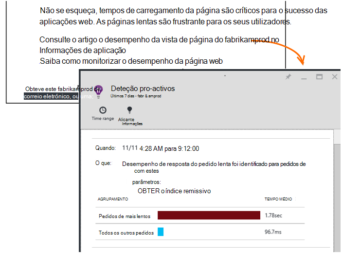

<properties 
    pageTitle="Informações da aplicação: Diagnósticos de desempenho pro-activos | Microsoft Azure" 
    description="Informações de aplicação executa análise abrangente de telemetria sua aplicação e avisa-o de potenciais problemas." 
    services="application-insights" 
    documentationCenter="windows"
    authors="antonfrMSFT" 
    manager="douge"/>

<tags 
    ms.service="application-insights" 
    ms.workload="tbd" 
    ms.tgt_pltfrm="ibiza" 
    ms.devlang="na" 
    ms.topic="article" 
    ms.date="08/31/2016" 
    ms.author="awills"/>

#  Diagnósticos de desempenho pro-activos

*Informações de aplicação está na pré-visualização.*

[Informações de aplicação do Visual Studio](app-insights-overview.md) executa análise abrangente de telemetria sua aplicação e pode avisá-lo sobre possíveis problemas de desempenho. Provavelmente está a ler isto, uma vez que recebeu um dos nossos pro-activos alertas por correio eletrónico. 

Esta funcionalidade não requer nenhuma configuração e está ativa automaticamente quando a sua aplicação gera suficiente telemetria.

## O que são diagnósticos de desempenho pro-activos?

Diagnósticos de desempenho pro-activos detetar invulgares padrões de desempenho na sua aplicação, através da análise de telemetria que envia a aplicação para informações de aplicação. 

Em particular, localiza problemas de desempenho que afetam apenas alguns dos seus utilizadores, ou apenas afetam os utilizadores em alguns casos.

Por exemplo,-pode notificá-lo se as suas páginas de aplicação muito mais lentamente carregar num tipo de browser do que as outras ou se os pedidos são processados mais lentamente a partir de um servidor em particular. Também pode descobrir problemas associados combinações de propriedades, tais como página lenta carrega numa área geográfica em particular alturas do dia.

Anomalias como estes são muito difíceis de detetar apenas através da inspeção os dados, mas são mais comuns que poderá pensar. Muitas vezes que apenas superfície quando os seus clientes reclamação. Até essa altura é demasiado tarde: os utilizadores afetados já estão a mudar para concorrentes!

Neste momento, os nossos algoritmos observe tempos de carregamento da página, tempos de resposta do pedido no servidor e as horas de resposta de dependência.  

Não tem de definir limiares de qualquer ou configurar regras. Formação de máquina e algoritmos de extração de dados são utilizados para detetar padrões anormais. 

Estamos muito ansioso por ter os seus comentários. Sabe diga-nos como ajuda-o, como o podemos melhorar deteção pro-activos e que funcionalidades adicionais pretende que configuremos automaticamente para adicionar. Pode fornecer comentários através de enviar um sorriso/comentário negativo no portal do ou enviar por correio eletrónico-nos para AppInsightsML@microsoft.com. 

## Sobre o alerta pro-activos

* *Porque é que receberam esta mensagem de correio electrónico*
 * Deteção pro-activos analisados telemetria a sua aplicação enviadas para informações de aplicação e detetado um problema de desempenho na sua aplicação. 
* *A notificação de significa que altamente tenho um problema?*
 * Não. É simplesmente uma sugestão sobre alguma coisa que poderá querer ver mais atentamente. 
* *O que devo fazer?*
 * [Veja os dados apresentados](#responding-to-an-alert). Utilize métricas Explorer para rever o desempenho ao longo do tempo e o nível de detalhe para métricas adicionais. Utilizar a pesquisa para filtrar eventos específicos que ajudá-lo a identificar a causa de raiz. 
* *Por isso, guys observar os meus dados?*
 * Não. O serviço está completamente automático. Apenas recebe as notificações. Os seus dados forem [privado](app-insights-data-retention-privacy.md).

## O processo de detecção

* *Que tipos de anomalias desempenho são detetados?*
 * Padrões de que a seria considera demorada verificar para si. Por exemplo, baixa desempenho numa combinação específica da localização, hora do dia e a plataforma.
* *Analisar todos os dados recolhidos pela aplicação informações?*
 * Não momento. Atualmente, vamos analisar o pedido de tempo de carregamento de tempo de resposta, tempo de resposta de dependência e página. Análise de métricas adicionais é brevemente. 
* *Posso criar meu próprios anomalia regras de deteção de?*
 * Ainda não. Mas pode:
 * [Configurar alertas](app-insights-alerts.md) que indicam ao quando uma métrica cruza um determinado limiar.)
 * [Exportar telemetria](app-insights-export-telemetry.md) para uma [base de dados](app-insights-code-sample-export-sql-stream-analytics.md) ou [para obter](app-insights-export-power-bi.md) [outras](app-insights-code-sample-export-telemetry-sql-database.md) ferramentas ou, onde pode analisar si mesmo.
* *Com que frequência é executada a análise?*
 * Vamos executar a análise diária no telemetria no dia anterior.
* * Por isso, é que isto substituir [alertas métricas](app-insights-alerts.md)?
 * Não.  Vamos não consolidar para detetar cada comportamento que pode considerar anormal.

## Como investigar problemas elevados

Abra o relatório de diagnóstico do e-mail ou a partir da lista de anomalias.

* **Quando** mostra o tempo que foi detetado o problema.
* **O que** descreve
 * O problema que foi detetado;
 * As características do conjunto de eventos que encontrámos apresentado o comportamento de problema.
* A tabela que compara o conjunto mal efetuar com o comportamento de média de todos os outros eventos.

Clique nas ligações para abrir a métrica do Explorer e pesquisa nos relatórios de relevantes, filtrados na hora e propriedades do conjunto de desempenho lento.

Modifique o intervalo de tempo e filtros para explorar a telemetria.

## Como posso melhorar o desempenho?

Respostas lentas e falhadas são um das frustrations maiores para utilizadores do web site, como sabe a partir do seu próprio experiência. Por isso, é importante resolver os problemas.

### Triagem

Em primeiro lugar, importa? Se uma página é sempre lento a carregar, mas apenas 1% de utilizadores do seu site nunca tiver consultá-lo, talvez tem coisas mais importantes a ter em conta sobre. Por outro lado, se apenas 1% de utilizadores abri-lo, mas inicia sempre de exceções, que poderá património investigar.

Utilizar a declaração de impacto no e-mail como um guia Geral, mas tenha em atenção que não está toda a história. Reunir outras provas para confirmar.

Considere os parâmetros do problema. Se estiver dependente de geografia, configurar [testes de disponibilidade](app-insights-monitor-web-app-availability.md) , incluindo dessa região: pode simplesmente haver problemas de rede nessa área. 

### Diagnosticar carregamentos de página lenta 

Onde está o problema? É o servidor lento a responder, está a página longa ou a browser tem de fazer muito trabalho para apresentá-lo?

Abra o pá métrica Browsers. Mostra o [segmentado visualização de tempo de carregamento do browser página](app-insights-javascript.md#explore-your-data) onde vai a hora. 

* Se **Enviar o tempo de pedido** for alto, o servidor está a responder lentamente ou o pedido é uma mensagem com muitos dados. Observe as [métricas de desempenho](app-insights-web-monitor-performance.md#metrics) para investigar tempos de resposta. 
* Configure o [controlo de dependência](app-insights-dependencies.md) para ver se a lentidão é devido a serviços externos ou a sua base de dados.
* Se **Receber resposta** for predominante, a sua página e as suas partes dependentes - JavaScript, CSS, imagens e assim sucessivamente (mas não modo assíncrono foi carregados para dados) são longas. Configurar um [teste de disponibilidade](app-insights-monitor-web-app-availability.md)e certifique-se de que defina a opção para carregar peças dependentes. Quando recebe alguns resultados, abra os detalhes de um resultado e expandi-lo para ver os tempos de carregamento de ficheiros diferentes.
* Alto **tempo de processamento de cliente** sugere scripts são lento. Se a razão não óbvia, pondere adicionar algum código de temporização e enviar as horas no trackMetric chamadas.

### Melhorar a páginas lentas

Existe uma web cheia de conselhos sobre a melhorar o seu respostas do servidor e tempos de carregamento da página, por isso Pedimos não tentar repeti-la tudo aqui. Eis algumas sugestões que provavelmente já sabe sobre, apenas para o ajudar a pensar:

* Carregar devido a ficheiros de grandes lenta: carregar os scripts e outras partes modo assíncrono. Utilize o script unir. Dividir página principal em widgets carregar os seus dados separadamente. Não envie HTML antigo simples para as tabelas longas: utilizar um script para pedir os dados como JSON ou outro formato compacto, em seguida, preencha a tabela no local. Existem excelentes quadros para o ajudar com tudo isto. (Que também criem scripts grandes, obviamente.)
* Diminuir o dependências de servidor: considerar as localizações geográficas dos seus componentes. Por exemplo, se estiver a utilizar o Azure, certifique-se de que o servidor web e a base de dados estão na mesma região. Consultas obter mais informações do que precisam? Seria colocação em cache ou lotes ajuda?
* Problemas de capacidade: Observe a métrica do servidor de tempos de resposta e pedido de conta. Se os tempos de resposta de pico desproporcionalmente com picos no pedido contagens, é provável que os seus servidores são esticados. 

## Notificação de e-mails

* *Tenho de ter que subscrever este serviço para receberem as notificações?*
 * Não. Os nossos bot periodicamente inquéritos os dados a partir de todos os utilizadores de informações da aplicação e envia notificações se detetar problemas.
* *Pode anular a subscrição ou obter notificações enviadas aos meus colegas em vez disso?*
 * Clique na ligação de anular a subscrição no alerta ou mensagem de correio electrónico. 
 
    Atualmente, estas são enviadas para aqueles que têm [acesso de escrita para o recurso de informações da aplicação](app-insights-resources-roles-access-control.md).

    Também pode editar a lista de destinatários definições no pá a deteção pro-activos.
* *Não quero ser inundada com estas mensagens.*
 * Estão limitados a um por dia, com o problema mais relevante que recomendamos ainda não comunicados sobre ainda. Não receberá repetições de todas as mensagens.
* *Se não fizer nada, posso obter um lembrete?*
 * Não, recebe uma mensagem sobre cada problema apenas uma vez. 
* *Perdi a mensagem de correio electrónico. Onde encontrar as notificações no portal do?*
 * Na aplicação informações descrição geral da sua aplicação, clique no mosaico de **Detecção pro-activos** . Não existem poderá localizar todas as notificações de cima para trás de 7 dias.

## Próximos passos

Estas ferramentas de diagnóstico ajudá-lo inspecionar telemetria da sua aplicação:

* [Métrica explorer](app-insights-metrics-explorer.md)
* [Explorador de procura](app-insights-diagnostic-search.md)
* [Análise - linguagem de consulta avançada](app-insights-analytics-tour.md)

DLP pro-activos é completamente automática. Mas talvez que pretende configurar algumas alertas mais?

* [Alertas métricas configuradas manualmente](app-insights-alerts.md)
* [Testes de web de disponibilidade](app-insights-monitor-web-app-availability.md) 

