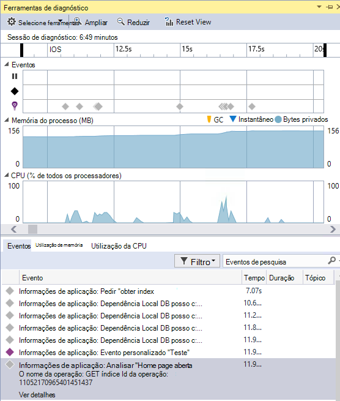

<properties
    pageTitle="Notas de lançamento do Visual Studio extensão para análise de programador"
    description="As atualizações mais recentes para ferramentas do Visual Studio para análise de programador."
    services="application-insights"
    documentationCenter=""
    authors="acearun"
    manager="douge"/>
<tags
    ms.service="application-insights"
    ms.workload="tbd"
    ms.tgt_pltfrm="ibiza"
    ms.devlang="na"
    ms.topic="article"
    ms.date="06/09/2016"
    ms.author="acearun"/>

# Notas de lançamento do ferramentas de análise de programador
Quais são as novidades: informações de aplicação e HockeyApp analytics no Visual Studio.
## Versão 7.0
### Tendências de informações de aplicação do Visual Studio
Informações de aplicação do Visual Studio é uma nova ferramenta no Visual Studio que pode utilizar para o ajudar a analisar a forma como a sua aplicação funciona ao longo do tempo. Para começar a utilizar, o botão da barra de **Informações da aplicação** ou na janela de pesquisa de informações da aplicação, selecione **Tendências de telemetria explorar**. Ou, no menu **Ver** , clique em **Other Windows**e, em seguida, clique em **Tendências de informações da aplicação**. Selecione uma das consultas comuns cinco para começar a utilizar. Pode analisar diferentes conjuntos de dados com base em tipos de telemetria, intervalos de tempo e outras propriedades. Para localizar anomalias nos seus dados, selecione uma das opções anomalia na lista pendente **Tipo de vista** . As opções de filtragem na parte inferior da janela do tornam mais fácil reduza no subconjuntos específicos da sua telemetria.

### Exceções CodeLens
Telemetria exceção agora é apresentada no CodeLens. Caso se tenha ligado o projeto para o serviço de informações da aplicação, verá o número de exceções que tenham ocorrido em cada método de produção das últimas 24 horas. A partir do CodeLens, pode ir para procurar ou tendências para investigar as exceções mais detalhadamente.

### Suporte do ASP.NET núcleo
Informações de aplicação suporta agora ASP.NET Core RC2 projetos no Visual Studio. Pode adicionar informações de aplicação a novos projectos ASP.NET Core RC2 caixa de diálogo **Novo projeto** , tal como a captura de ecrã seguinte. Ou, pode adicioná-lo a um projeto existente, com o botão direito do projecto no Explorador de soluções e, em seguida, clique em **Adicionar telemetria de informações de aplicação**.

ASP.NET 5 RC1 e projetos de ASP.NET Core RC2 também têm novo suporte na janela de ferramentas de diagnóstico. Verá eventos de informações da aplicação, como os pedidos e exceções da sua aplicação do ASP.NET enquanto que depura localmente no seu PC. Cada evento, clique em **Procurar** para desagregar para obter mais informações.

### HockeyApp para as aplicações do Universal Windows
Para além de comentários de utilizador e a distribuição beta, HockeyApp fornece symbolicated falha a relatar sobre as aplicações do Universal Windows. Efetuámos-lo ainda mais fácil adicionar o SDK HockeyApp: com o botão direito no projeto Universal Windows e, em seguida, clique em **Hóquei aplicação - ativar Analytics uma falha de sistema**. Isto instala o SDK, configura coleção de falha de sistema e disposições um recurso de HockeyApp na nuvem, tudo isto sem carregar a sua aplicação para o serviço de HockeyApp.

Outras funcionalidades novas:

* Efetuámos a experiência de pesquisa de informações da aplicação mais rápida e mais intuitiva. Agora, intervalos de tempo e filtros de detalhe são aplicados automaticamente à medida que seleciona-los.
* Também na pesquisa de informações da aplicação, agora existe uma opção para ir para o código diretamente a partir de telemetria o pedido.
* Efetuámos melhorias da experiência de início de sessão no HockeyApp.
* Em ferramentas de diagnóstico, informações de telemetria de produção para exceções são apresentadas.

## Versão 5.2
Estamos a satisfeito anunciar a introdução de cenários de HockeyApp no Visual Studio. A integração do primeira está distribuição beta de aplicações Universal Windows e de aplicações do Windows Forms a partir do Visual Studio.

Com a distribuição beta, carregue antecipadas versões das suas aplicações para HockeyApp para distribuição para um subconjunto selecionado dos clientes ou testes. Distribuição beta, combinada com HockeyApp falha recolha e utilizador comentários funcionalidades, pode fornecer-lhe informações importantes sobre a sua aplicação antes de fazer um lançamento abrangente. Pode utilizar estas informações para resolver problemas com a sua aplicação para que possa evitar ou minimizar futuros problemas, tais como classificações de aplicação baixa, comentários negativos e assim sucessivamente.

Dar saída como é simples carregar constrói relativamente a distribuição beta a partir do Visual Studio.
### Aplicações universal do Windows
Menu de contexto para um nó de projeto de aplicação do Universal Windows agora inclui uma opção para carregar a sua compilação para HockeyApp.

Selecione o item e HockeyApp é aberta a caixa de diálogo de carregamento. Terá uma conta de HockeyApp para carregar a sua compilação. Se for um novo utilizador, não se preocupe. Criar uma conta é um processo simples.

Quando estiver ligado, irá ver o formulário de carregamento na caixa de diálogo.

Selecione o conteúdo para carregar (um ficheiro .appxbundle ou .appx) e, em seguida, selecione opções de lançamento do assistente. Opcionalmente, pode adicionar notas de lançamento na página seguinte. Selecione **Concluir** para começar o carregamento.

Quando o carregamento estiver concluído, é apresentada uma notificação de HockeyApp com confirmação e uma ligação para a aplicação no portal do HockeyApp.

Já está! Tenha Acabei de carregar uma compilação relativamente a distribuição beta com apenas alguns cliques.

Pode gerir a sua aplicação de várias formas no portal do HockeyApp. Isto inclui convidar utilizadores, visualizar relatórios de falha de sistema e comentários, alterar detalhes e assim sucessivamente.

Consulte a [Base de dados de conhecimento HockeyApp](http://support.hockeyapp.net/kb/app-management-2) para obter mais detalhes sobre a gestão de aplicação.

### Aplicações de formulários do Windows
Menu de contexto para um nó de projeto de formulário do Windows agora inclui uma opção para carregar a sua compilação para HockeyApp.

Esta ação abre a HockeyApp carregamento caixa de diálogo, que é semelhante a um numa aplicação do Universal Windows.

Tenha em atenção novo campo este assistente, para especificar a versão da aplicação. Para as aplicações do Universal Windows, as informações são preenchidas a partir do manifesto. As aplicações do Windows Forms, Infelizmente, não tem um equivalente a esta funcionalidade. Terá de especificá-las manualmente.

O resto do fluxo da é semelhante às aplicações do Universal Windows: selecione compilação e solte opções, adicione lançamento notas, carregar e gerir no portal do HockeyApp.

É tão simple como que. Experimente e diga-na sua opinião.
## Versão 4.3
### Pesquisa de telemetria de sessões de depuração local
Com esta versão, pode procurar para gerado na sessão de depuração de Visual Studio de telemetria de informações da aplicação. Anteriormente, pode utilizar a pesquisa apenas se registou sua aplicação com informações de aplicação. Agora, a aplicação apenas a tem de ter o SDK de informações da aplicação instalado para procurar telemetria local.

Se tiver uma aplicação do ASP.NET com o SDK de informações da aplicação, efetue os seguintes passos para utilizar a pesquisa.

1. Depurar a sua aplicação.
2. Abrir pesquisa de informações da aplicação de uma das seguintes formas:
    - No menu **Ver** , clique em **Other Windows**e, em seguida, clique em **Pesquisa de informações da aplicação**.
    - Clique no botão da barra de ferramentas de **Informações da aplicação** .
    - No Explorador de solução, expanda **ApplicationInsights.config**e, em seguida, clique em **telemetria de sessão de depuração de pesquisa**.
3. Se ainda não iniciou com informações de aplicação, a janela de pesquisa será aberto no modo de telemetria depurar sessão.
4. Clique no ícone de **pesquisa** para ver o seu telemetria local.

## Versão 4.2
Neste lançamento, Adicionámos funcionalidades para tornar a pesquisa de dados mais fácil no contexto de eventos, com a capacidade para ir para o código do mais eventos de dados e uma experiência de simples para enviar os seus dados de registo para informações de aplicação. Esta extensão é atualizado mensalmente. Se tiver comentários pedidos de funcionalidade, envie-o para aidevtools@microsoft.com.
### Experiência de registo não clique
Se já estiver a utilizar NLog, log4net ou System.Diagnostics.Tracing, não terá de se preocupar com a mover todos os seus rastreios para informações de aplicação. Neste lançamento, podemos tenha integrado os adaptadores de registo de informações de aplicação a experiência de configuração normal.
Se já tiver um dos quadros registo configurados, a secção seguinte descreve como obtê-lo.
**Se já tiver adicionado as informações de aplicação:**
1. O nó do projeto, com o botão direito e, em seguida, clique em **Informações de aplicação**e, em seguida, clique em **Configurar informações de aplicação**. Certifique-se de que vir a opção para adicionar o adaptador correto na janela de configuração.
2. Em alternativa, quando constrói a solução, tenha em atenção a janela de pop-up que aparece no canto superior direito do ecrã e clique em **Configurar**.

Quando tiver placa registo instalado, executar a sua aplicação e certifique-se de que ver os dados no separador Ferramentas de diagnóstico, da seguinte forma:

### Saltar para ou localizar o código de onde é emitida a propriedade de evento de telemetria
Com a versão nova utilizador pode clicar em qualquer valor de evento detalhe e isto irá procurar uma cadeia correspondente da solução abrir atual. Resultados irão aparecer no Visual Studio "Encontrar resultados" listam conforme apresentado abaixo:

### Nova janela de pesquisa para quando não iniciou sessão
Vamos tenha melhorado o aspeto da janela da procura de informações de aplicação para o ajudar a procurar os seus dados ao mesmo tempo a sua aplicação está na produção.

### Ver todos os eventos de telemetria associados ao evento
Adicionámos num novo separador, com consultas predefinidos para todos os dados relacionados com o evento de telemetria que o utilizador está a visualizar, junto ao separador de detalhes do evento. Por exemplo, um pedido de tem um campo denominado **ID da operação**. Todos os eventos associados a este pedido tem o mesmo valor para o **ID da operação**. Se uma exceção ocorrer enquanto a operação está a processar o pedido, a exceção é dado o mesmo ID de operação que o pedido para que seja mais fácil de localizar. Se estiver à procura a um pedido, clique em **todos os telemetria para esta operação** para abrir um novo separador que apresenta os novos resultados de pesquisa.

### Avançar e retroceder histórico na pesquisa
Agora pode aceder e para trás entre os resultados da pesquisa.

## Versão 4.1
Nesta versão é fornecido com um número das novas funcionalidades e atualizações. Tem de ter instalado para instalar este lançamento de actualizações de 1.

### Ir a partir de uma exceção para método no código fonte
Agora, se exceções da sua aplicação de produção na janela de procura de informações da aplicação, pode ir para o método no seu código onde está a ocorrer a exceção. Só tem de ter o projeto correto carregados e leva-o até o cuidado de informações da aplicação do resto! (Para saber mais sobre a janela de pesquisa de informações da aplicação, consulte as notas de lançamento para a versão 4.0 nas secções seguintes.)

Como funciona? Pode utilizar a pesquisa de informações de aplicações mesmo quando uma solução não estiver aberta. A área de rastreio de pilha apresenta uma mensagem informativa e muitos dos itens o rastreio da pilha não estão disponíveis.

Se informações sobre o ficheiro estiver disponível, alguns itens podem ser ligações, mas o item de informações da solução continuarão visível.

Se clicar na hiperligação, irá saltar para a localização do método seleccionado no seu código. Poderá haver uma diferença no número de versão, mas a funcionalidade, para ir para a versão correta do código, seja reencaminhado em versões posteriores.

### Uma experiência de novo pontos de entrada para a pesquisa no Explorador de soluções
Agora pode aceder a pesquisa através do Explorador de soluções.

### Apresenta uma notificação quando publicar foi concluída
Uma caixa de diálogo de pop-up é apresentada quando o projeto é publicado online, para que possam ver os dados de informações da aplicação de produção.

## Versão 4.0

### Procurar dados de informações de aplicação a partir do Visual Studio
A função Procurar no portal de informações da aplicação, agora no Visual Studio pode filtrar e tipos de eventos, valores de propriedade e texto de pesquisa em seguida, em seguida, inspecionar eventos individuais.

### Consulte o artigo dados provenientes do seu computador local em ferramentas de diagnóstico

Pode ver o seu telemetria, para além de outros dados depuração, na página do Visual Studio ferramentas de diagnóstico. Apenas ASP.NET 4,5 é suportada.

### Adicionar o SDK ao seu projeto sem iniciar sessão no Azure

Já não tem de iniciar sessão no Azure para adicionar pacotes de informações da aplicação ao seu projeto, através da caixa de diálogo **Novo projeto** ou a partir do menu de contexto do projeto. Se iniciar sessão, o SDK será instalado e configurado para enviar telemetria para o portal como antes. Se não iniciar sessão, o SDK será adicionado ao seu projeto e irá gerar telemetria para o concentrador de diagnóstico. Pode configurá-la mais tarde se pretender.

### Suporte de dispositivos

Em *Connect ();* 2015, podemos [anunciada](https://azure.microsoft.com/blog/deep-diagnostics-for-web-apps-with-application-insights/) que o nossa experiência do programador móvel para dispositivos é HockeyApp. HockeyApp ajuda-o distribuir compilações beta para sua testes, recolher e analisar todos os causa uma falha da sua aplicação e recolher comentários diretamente dos seus clientes.
HockeyApp suporta a sua aplicação independentemente plataforma optar por criá-lo, se que ser iOS, Android, ou Windows ou uma solução em diferentes plataformas como Xamarin, Cordova ou unidade.

No futuro versões da extensão informações de aplicação, podemos irá apresentar uma experiência mais integrada entre HockeyApp e Visual Studio. Por agora, pode começar com HockeyApp adicionando simplesmente a referência NuGet. Consulte a [documentação](http://support.hockeyapp.net/kb/client-integration-windows-and-windows-phone) para obter mais informações.
