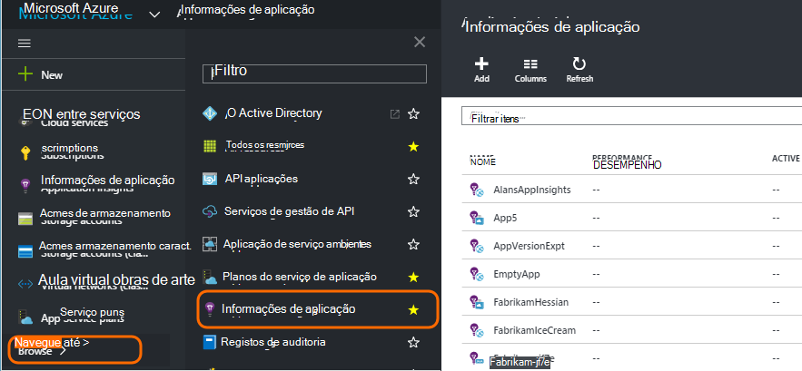
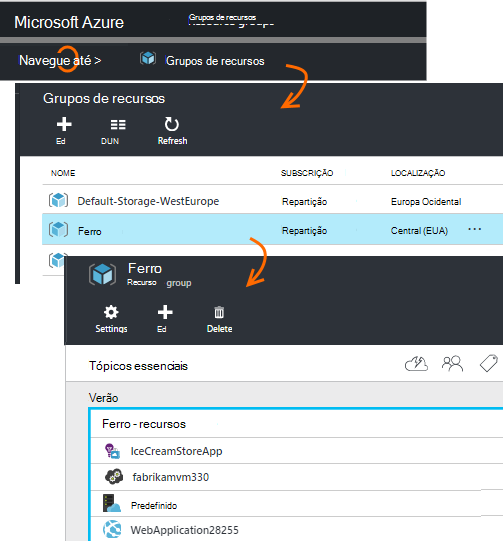
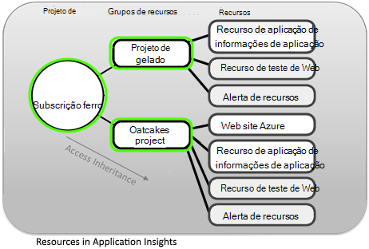
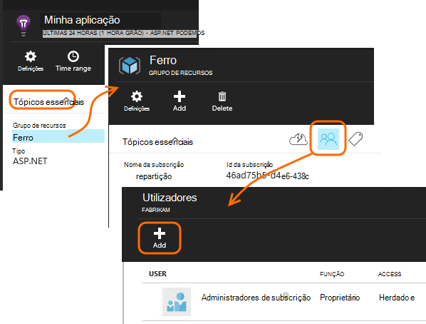
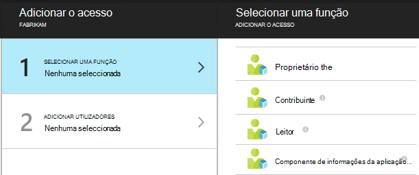
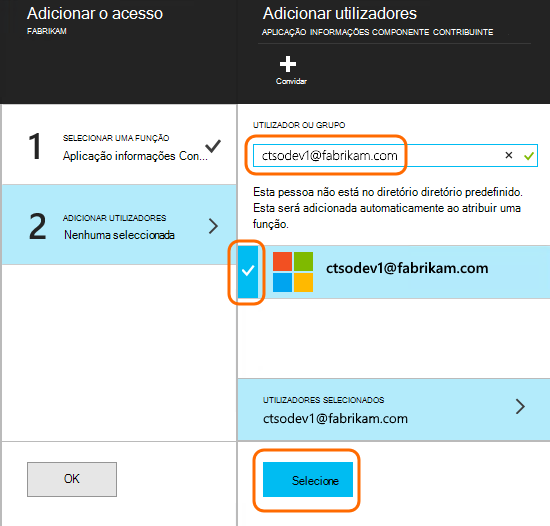

<properties
    pageTitle="Recursos, funções e controlo de acesso no informações de aplicação"
    description="Os proprietários, os contribuintes e os leitores de informações da sua organização."
    services="application-insights"
    documentationCenter=""
    authors="alancameronwills"
    manager="douge"/>

<tags
    ms.service="application-insights"
    ms.workload="tbd"
    ms.tgt_pltfrm="ibiza"
    ms.devlang="na"
    ms.topic="article"
    ms.date="05/07/2016"
    ms.author="awills"/>

# Recursos, funções e controlo de acesso no informações de aplicação

Pode controlar quem tem de leitura e actualizar o acesso a dados no Visual Studio [Informações de aplicação][start], utilizando o [controlo de acesso baseado em funções no Microsoft Azure](../active-directory/role-based-access-control-configure.md).

> [AZURE.IMPORTANT] Atribua acesso aos utilizadores no **grupo de recursos ou a subscrição** à qual pertence o seu recurso de aplicação - não no recurso própria. Atribua a função **Contribuinte componente de informações da aplicação** . Este procedimento garante uniforme controlo de acesso aos testes web e alertas, juntamente com o seu recurso de aplicação. [Saiba mais](#access).

## Subscrições, grupos e recursos

Em primeiro lugar, algumas definições:

* **Recurso** - uma instância de um serviço do Microsoft Azure. O seu recurso de informações da aplicação recolhe, analisa e apresenta os dados de telemetria enviados a partir da sua aplicação.  Outros tipos de recursos Azure incluem aplicações web, bases de dados e VMs.

    Para ver todos os recursos, aceda ao [Portal do Azure][portal], inicie sessão e clique em Procurar.

    

* [**Grupo de recursos** ] [ group] -cada recurso pertence a um grupo. Um grupo é uma forma conveniente para gerir recursos relacionados, especialmente para o controlo de acesso. Por exemplo, no grupo de um recurso pode incluir uma aplicação Web, um recurso de aplicação informações para monitorizar a aplicação e um recurso de armazenamento para manter os dados exportados.

    

* [**Subscrição**](https://manage.windowsazure.com) - utilizar as informações de aplicação ou outros recursos Azure, iniciar sessão numa subscrição do Azure. Cada grupo de recursos pertence a uma subscrição do Azure, onde escolher o seu pacote do preço e, se for uma subscrição de empresa, selecione os membros e as respetivas permissões de acesso.
* [**Conta Microsoft** ] [ account] -o nome de utilizador e palavra-passe que utiliza para iniciar sessão Microsoft Azure subscrições, XBox Live, Outlook.com e outros serviços da Microsoft.

## Controlar o acesso no grupo de recursos

É importante compreender que além do recurso que criou para a sua aplicação, também existem recursos ocultos em separado para alertas e testes web. Estão anexados ao mesmo [grupo de recursos](#resource-group) que a aplicação. Poderá também tiver sido adicionado outros serviços do Azure daí, tal como Web sites ou de armazenamento.

Para controlar o acesso a estes recursos, por isso, é aconselhável para:

* Controlar o acesso ao nível do **grupo de recursos ou subscrição** .
* Atribua a função **Contribuinte componente de informações da aplicação** aos utilizadores. Esta opção permite-lhes editar testes web, alertas e recursos de informações da aplicação, sem facultar o acesso a quaisquer outros serviços no grupo.

## Para fornecer acesso a outro utilizador

Tem de ter os direitos de proprietário para a subscrição ou grupo de recursos.

O utilizador tem de ter uma [Conta Microsoft][account], ou acesso à sua [Conta institucional do Microsoft](..\active-directory\sign-up-organization.md). Pode fornecer acesso aos indivíduos e também para grupos de utilizadores definidos no Azure Active Directory.

#### Navegue para o grupo de recursos

Adicione o utilizador aí.

Ou pode passar o outro nível e adicionar o utilizador para a subscrição.

#### Selecionar uma função

Função | No grupo de recursos
---|---
Proprietário | Pode alterar alguma coisa, incluindo o acesso de utilizador
Contribuinte | Pode editar alguma coisa, incluindo todos os recursos
Contribuinte componente de informações de aplicação | Pode editar as informações de aplicação recursos, testes web e alertas
Leitor | Pode ver mas não alterar nada

'Editar' inclui criar, eliminar e actualizar:

* Recursos
* Testes Web
* Alertas
* Exportar contínuo

#### Selecione o utilizador

Se o utilizador que pretende não estiver no diretório, pode convidar qualquer pessoa com uma conta Microsoft.
(Se utilizarem serviços como o Outlook.com, OneDrive, Windows Phone ou XBox Live, possuem uma conta Microsoft.)

## Utilizadores e funções

* [Controlo de acesso no Azure baseado em funções](../active-directory/role-based-access-control-configure.md)

<!--Link references-->

[account]: https://account.microsoft.com
[group]: ../resource-group-overview.md
[portal]: https://portal.azure.com/
[start]: app-insights-overview.md
