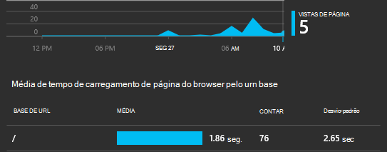
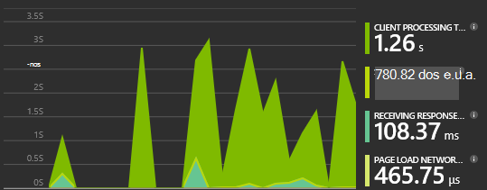
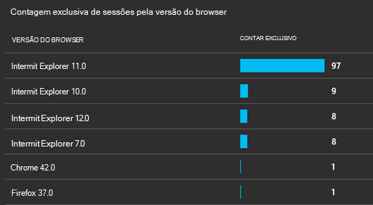
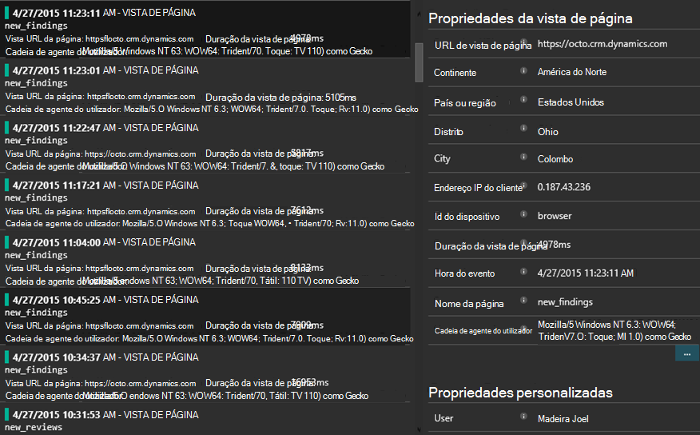

<properties 
    pageTitle="Tutorial: Monitorizar Microsoft Dynamics CRM com informações de aplicação" 
    description="Obtenha telemetria do Microsoft Dynamics CRM Online utilizando as informações de aplicação. Instruções passo a passo da configuração, a introdução de dados, visualização e exportar." 
    services="application-insights" 
    documentationCenter=""
    authors="mazharmicrosoft" 
    manager="douge"/>

<tags 
    ms.service="application-insights" 
    ms.workload="tbd" 
    ms.tgt_pltfrm="ibiza" 
    ms.devlang="na" 
    ms.topic="article" 
    ms.date="11/17/2015" 
    ms.author="awills"/>
 
# Tutorial: Ativar telemetria para utilizar informações de aplicação do Microsoft Dynamics CRM Online

Este artigo mostra-lhe como obter dados de telemetria do [Microsoft Dynamics CRM Online](https://www.dynamics.com/) utilizando o [Visual Studio aplicação informações](https://azure.microsoft.com/services/application-insights/). Explicaremos durante o processo de adição de script de informações de aplicação à aplicação, concluído capturar dados e a visualização de dados.

>[AZURE.NOTE] [Navegue até a solução da amostra](https://dynamicsandappinsights.codeplex.com/).

## Adicionar informações de aplicação a nova ou existente instância CRM Online 

Para monitorizar a sua aplicação, adicione uma SDK de informações de aplicação para a sua aplicação. O SDK envia telemetria no [portal de informações da aplicação](https://portal.azure.com), onde pode utilizar o nosso uma análise avançada e ferramentas de diagnóstico, ou exportar os dados para armazenamento.

### Criar um recurso de informações de aplicação no Azure

1. Obter [uma conta no Microsoft Azure](http://azure.com/pricing). 
2. Inicie sessão no [portal do Azure](https://portal.azure.com) e adicionar um novo recurso de informações da aplicação. Este é onde os seus dados serão processados e apresentados.

    

    Selecione ASP.NET como o tipo de aplicação.

3. Abra o separador Quick Start e abra o script de código.

    

**Mantenha a página de código aberta** enquanto efetua o próximo passo outra janela do browser. Terá do código mais rapidamente. 

### Criar um recurso de web JavaScript no Microsoft Dynamics CRM

1. Abra o seu instância CRM Online e inicie sessão com privilégios de administrador.
2. Abrir o Microsoft Dynamics CRM definições, personalizações, personalizar o sistema

    
    
    

    

3. Crie um recurso de JavaScript.

    

    Atribua um nome, selecione **Script (JScript)** e abra o editor de texto.

    
    
4. Copie o código da aplicação de informações. Ao copiar Certifique-se ignorar etiquetas de script. Referir-se por baixo de captura de ecrã:

    

    O código inclui a chave de instrumentação que identifica o seu recurso de informações da aplicação.

5. Guardar e publicar.

    

### Formulários de Instrument

1. No Microsoft CRM Online, abra o formulário de conta

    

2. Abra o formulário de propriedades

    

3. Adicionar o recurso de web JavaScript que criou

    

    

4. Guardar e publicar as personalizações de formulário.

## Métricas capturadas

Configurou captura telemetria para o formulário. Sempre que é utilizado, os dados serão enviados para o seu recurso de informações da aplicação.

Eis as amostras dos dados que irá ver.

#### Estado de funcionamento da aplicação

Exceções de browser:

Clique no gráfico para obter mais detalhes:

#### Utilização

#### Browsers

#### Geolocalização

#### Pedido de vista de página internos

## Código de exemplo

[Procure o código de exemplo](https://dynamicsandappinsights.codeplex.com/).

## Power BI

Pode efetuar uma análise ainda mais aprofundada se [exportar os dados para o Microsoft Power BI](app-insights-export-power-bi.md).

## Solução da amostra Microsoft Dynamics CRM

[Aqui está a solução da amostra implementada no Microsoft Dynamics CRM] (https://dynamicsandappinsights.codeplex.com/).

## Saiba mais

* [O que é a aplicação informações?](app-insights-overview.md)
* [Informações de aplicação para páginas web](app-insights-javascript.md)
* [Obter mais exemplos e tutoriais](app-insights-code-samples.md)

 
