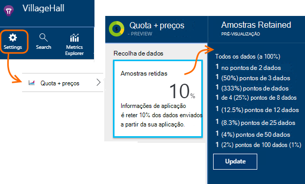

<properties 
    pageTitle="Recolha de telemetria na aplicação informações | Microsoft Azure" 
    description="Como impedir que o volume de telemetria em controlo." 
    services="application-insights" 
    documentationCenter="windows"
    authors="vgorbenko" 
    manager="douge"/>

<tags 
    ms.service="application-insights" 
    ms.workload="tbd" 
    ms.tgt_pltfrm="ibiza" 
    ms.devlang="na" 
    ms.topic="article" 
    ms.date="08/30/2016" 
    ms.author="awills"/>

#  <a name="sampling-in-application-insights"></a>Amostragem nas informações de aplicação

*Informações de aplicação está na pré-visualização.*


Amostragem é que uma funcionalidade no [Visual Studio aplicação informações](app-insights-overview.md) é o caminho recomendado para reduzir o tráfego de telemetria e armazenamento preservando uma análise estatística correcta dos dados da aplicação. O filtro seleciona os itens que estão relacionados para que pode navegar entre os itens quando estão a fazer investigações diagnóstico.
Quando as contagens métricas forem apresentadas para si no portal do, estes são renormalized para atender a amostragem, para minimizar qualquer efeito sobre as estatísticas.

Amostragem reduz o tráfego, ajuda a manter dentro mensal quotas de dados e ajuda-o a evitar a limitação.

## <a name="in-brief"></a>Em Resumo:

* Amostragem mantém 1 nos registos de *n* e rejeita o resto. Por exemplo,-poderá reter eventos de 1 / 5, uma taxa de recolha de 20%. 
* Amostragem acontece automaticamente se a sua aplicação envia muitas telemetria, nas aplicações de servidor web do ASP.NET.
* Também pode definir amostragem manualmente, quer no portal na página comparar; ou no SDK ASP.NET no ficheiro. config, também reduzir o tráfego de rede.
* Se iniciar sessão eventos personalizados e pretende certificar-se de que um conjunto de eventos é mantido ou eliminado em conjunto, certifique-se de que têm o mesmo valor IDOperação.
* O divisor amostragem *n* é comunicado em cada registo na propriedade `itemCount`, que na pesquisa aparece sob a contar nome amigável"pedido" ou "contagem de eventos". Quando amostragem não está em operação, `itemCount==1`.
* Se escrever a análise de consultas, deverá [tomar em consideração amostragem](app-insights-analytics-tour.md#counting-sampled-data). Em especial, em vez de simplesmente a contar registos, deve utilizar `summarize sum(itemCount)`.


## <a name="types-of-sampling"></a>Tipos de amostragem


Existem três métodos de amostragem alternativo:

* **Amostragem ajustável** é ajustado automaticamente o volume de telemetria enviado a partir do SDK na sua aplicação do ASP.NET. Predefinição de SDK v 2.0.0-beta3. Atualmente disponível para telemetria do lado do servidor ASP.NET apenas. 
* **Taxa de fixo amostragem** reduz o volume de telemetria enviado a partir do seu servidor de ASP.NET e dos browsers dos seus utilizadores. Definir a velocidade. O cliente e servidor irão sincronizar os respetivos amostragem, de modo que, em pesquisa, pode navegar entre os pedidos e vistas de página relacionadas.
* **Amostragem ingestão** reduz o volume de telemetria retido pelo serviço informações de aplicação, com uma taxa definida por si. Não reduzir o tráfego de telemetria, mas ajudam a manter na sua quota mensal. 

Se estiverem Adaptive ou fixo amostragem taxa em operação, amostragem ingestão é desativada.

## <a name="ingestion-sampling"></a>Amostragem ingestão

Este formulário de amostragem funciona no ponto onde telemetria a partir do seu servidor web, browsers e dispositivos atinge o ponto final de serviço de informações da aplicação. Apesar de não reduzir o o tráfego de telemetria enviado a partir da sua aplicação,-lo a reduzir a quantidade processadas e retidos (e cobrado por) por aplicação informações.

Utilize este tipo de amostragem se a sua aplicação abrange frequentemente a sua quota mensal e não tem a opção de utilização de um dos tipos de amostragem com base em SDK. 

Configurar a taxa de amostragem as Quotas e preços pá:



Como outros tipos de amostras, o algoritmo retém itens de telemetria relacionados. Por exemplo, quando estiver a da inspeção de telemetria na pesquisa, poderá encontrar o pedido relacionados com uma exceção específica. Métrica conta como velocidade do pedido e taxa de exceção são mantidas corretamente.

Pontos de dados que são eliminados por amostragem não estão disponíveis no funcionalidade qualquer aplicação informações como [Exportar contínuo](app-insights-export-telemetry.md).

Amostragem ingestão não funcionam enquanto está baseada em SDK ajustável ou a taxa de juro fixa amostragem numa operação. Se a velocidade de amostragem o SDK for menor que 100%, em seguida, é ignorada a taxa de amostragem ingestão definida por si.

> [AZURE.WARNING] O valor mostrado no mosaico indica o valor que definiu para amostragem ingestão. Este não representar a taxa de amostragem real se amostragem SDK estiver numa operação.


## <a name="adaptive-sampling-at-your-web-server"></a>Amostragem ajustável no seu servidor web

Amostragem ajustável está disponível para o SDK de informações da aplicação para ASP.NET v 2.0.0-beta3 e versões posteriores e está ativada por predefinição. 


Amostragem ajustável afeta o volume de telemetria enviada a partir da sua aplicação web do servidor para o serviço de informações da aplicação. O volume é ajustado automaticamente para manter dentro de uma taxa de tráfego máxima especificada.

-Não funciona a baixos volumes de telemetria, por isso, uma aplicação no depuração ou um Web site com baixa utilização não será afetado.

Para obter o volume de destino, algumas das telemetria gerada é eliminado. Mas como outros tipos de amostras, o algoritmo retém itens de telemetria relacionados. Por exemplo, quando estiver a da inspeção de telemetria na pesquisa, poderá encontrar o pedido relacionados com uma exceção específica. 

Métrica conta como velocidade do pedido e taxa de exceção são ajustados de forma para o Adquirente na íntegra para a taxa de amostras, para que estas apareçam aproximadamente os valores corretos no Explorador de métrica.

**Atualizar o NuGet seu projeto** pacotes para a versão mais recente de *pré-lançamento* da aplicação de informações: com o botão direito do projecto no Explorador de soluções, selecione gerir pacotes de NuGet, selecione **incluir a versão de pré-lançamento** e procurar Microsoft.ApplicationInsights.Web. 

Em [ApplicationInsights.config](app-insights-configuration-with-applicationinsights-config.md), pode ajustar o vários parâmetros na `AdaptiveSamplingTelemetryProcessor` nó. Os valores mostrados são os valores predefinidos:

* `<MaxTelemetryItemsPerSecond>5</MaxTelemetryItemsPerSecond>`

    A taxa de destino que o algoritmo ajustável destina-se para o **anfitrião do servidor de cada**. Se a sua aplicação web é executado em vários anfitriões, reduza este valor publicados para manter-se a sua velocidade de destino de tráfego no portal de informações da aplicação.

* `<EvaluationInterval>00:00:15</EvaluationInterval>` 

    O intervalo no qual a taxa atual de telemetria é avaliada novamente. Avaliação é executada como uma média móvel. Poderá pretender abreviar este intervalo, se o seu telemetria está sujeita a rajada repentina sobre.

* `<SamplingPercentageDecreaseTimeout>00:02:00</SamplingPercentageDecreaseTimeout>`

    Quando amostragem alterações de valor de percentagem, como mais cedo depois podemos permitidos para diminuir a percentagem de amostragem novamente para capturar menos dados.

* `<SamplingPercentageIncreaseTimeout>00:15:00</SamplingPercentageIncreaseTimeout>`

    Quando amostragem alterações de valor de percentagem, como mais cedo depois podemos permitidos para aumentar a percentagem de amostragem novamente para capturar mais dados.

* `<MinSamplingPercentage>0.1</MinSamplingPercentage>`

    Como percentagem da amostragem varia, o que é o valor mínimo que podemos está a permissão para definir.

* `<MaxSamplingPercentage>100.0</MaxSamplingPercentage>`

    Tal como a percentagem de amostragem varia, o que é o valor máximo, que recomendamos está a permissão para definir.

* `<MovingAverageRatio>0.25</MovingAverageRatio>` 

    O cálculo da média móvel, a espessura foi atribuída o valor mais recente. Utilize um valor igual ou inferior a 1. Valores mais pequenos altere o algoritmo de menos reactivar para repentina sobre.

* `<InitialSamplingPercentage>100</InitialSamplingPercentage>`

    O valor atribuído quando começou a aplicação. Não reduza este enquanto estiver a depurar. 

### <a name="alternative-configure-adaptive-sampling-in-code"></a>Alternativa: Configurar amostragem ajustável no código

Em vez de ajustar amostragem no ficheiro. config, pode utilizar o código. Esta opção permite-lhe especificar uma função de chamada de retorno é chamada sempre que a taxa de amostragem é avaliada novamente. Pode utilizar esta ação, por exemplo, para saber que taxa amostragem está a ser utilizada.

Remover o `AdaptiveSamplingTelemetryProcessor` nó do ficheiro. config.


*C#*

```C#

    using Microsoft.ApplicationInsights;
    using Microsoft.ApplicationInsights.Extensibility;
    using Microsoft.ApplicationInsights.WindowsServer.Channel.Implementation;
    using Microsoft.ApplicationInsights.WindowsServer.TelemetryChannel;
    ...

    var adaptiveSamplingSettings = new SamplingPercentageEstimatorSettings();

    // Optional: here you can adjust the settings from their defaults.

    var builder = TelemetryConfiguration.Active.TelemetryProcessorChainBuilder;
    
    builder.UseAdaptiveSampling(
         adaptiveSamplingSettings,

        // Callback on rate re-evaluation:
        (double afterSamplingTelemetryItemRatePerSecond,
         double currentSamplingPercentage,
         double newSamplingPercentage,
         bool isSamplingPercentageChanged,
         SamplingPercentageEstimatorSettings s
        ) =>
        {
          if (isSamplingPercentageChanged)
          {
             // Report the sampling rate.
             telemetryClient.TrackMetric("samplingPercentage", newSamplingPercentage);
          }
      });

    // If you have other telemetry processors:
    builder.Use((next) => new AnotherProcessor(next));

    builder.Build();

```

([Saiba mais sobre os processadores de telemetria](app-insights-api-filtering-sampling.md#filtering).)


<a name="other-web-pages"></a>
## <a name="sampling-for-web-pages-with-javascript"></a>Amostragem para páginas web com JavaScript

Pode configurar páginas web para a taxa de juro fixa amostragem a partir de qualquer servidor. 

Quando [configurar as páginas web para informações de aplicação](app-insights-javascript.md), modificar o fragmento de que obtém a partir do portal de informações da aplicação. (Em aplicações ASP.NET, o fragmento de normalmente são introduzidas nas _Layout.cshtml.)  Inserir uma linha, como `samplingPercentage: 10,` antes da tecla instrumentação:

    <script>
    var appInsights= ... 
    }({ 


    // Value must be 100/N where N is an integer.
    // Valid examples: 50, 25, 20, 10, 5, 1, 0.1, ...
    samplingPercentage: 10, 

    instrumentationKey:...
    }); 
    
    window.appInsights=appInsights; 
    appInsights.trackPageView(); 
    </script> 

Para a percentagem de amostras, escolha uma percentagem que se aproxime 100/N onde N é um número inteiro.  Atualmente amostragem não suporta a outros valores.

Se ativar também amostragem de taxa de juro fixa no servidor, clientes e servidor irão sincronizar para esse, em pesquisa, pode navegar entre os pedidos e vistas de página relacionadas.


## <a name="fixed-rate-sampling-for-aspnet-web-sites"></a>Taxa de juro fixa amostragem para sites de web do ASP.NET

Taxa fixa amostragem reduz o tráfego enviado a partir do seu servidor web e web browsers. Ao contrário amostragem ajustável, reduz telemetria com uma taxa fixa decidida por si. -Lo também sincroniza o cliente e amostragem server para que os itens relacionados são mantidos - por exemplo, para que se veja uma vista de página na pesquisa, pode encontrar o seu pedido relacionado.

O algoritmo de amostragem retém itens relacionados. Para cada pedido HTTP evento, -lo e os eventos relacionados são eliminados ou transmitidos. 

No Explorador de métricas, taxas por exemplo, contagem pedido e exceção são multiplicadas por um fator para o Adquirente na íntegra para a taxa de amostras, para que fiquem aproximadamente corretos.

1. **Actualizar pacotes de NuGet do seu projeto** para a versão mais recente de *pré-lançamento* da aplicação de informações. Com o botão direito do projecto no Explorador de soluções, selecione gerir pacotes de NuGet, selecione **incluir a versão de pré-lançamento** e procurar Microsoft.ApplicationInsights.Web. 

2. **Desativar amostragem ajustável**: no [ApplicationInsights.config](app-insights-configuration-with-applicationinsights-config.md), remover ou comentar a `AdaptiveSamplingTelemetryProcessor` nó.

    ```xml

    <TelemetryProcessors>
    <!-- Disabled adaptive sampling:
      <Add Type="Microsoft.ApplicationInsights.WindowsServer.TelemetryChannel.AdaptiveSamplingTelemetryProcessor, Microsoft.AI.ServerTelemetryChannel">
        <MaxTelemetryItemsPerSecond>5</MaxTelemetryItemsPerSecond>
      </Add>
    -->
    

    ```

2. **Ative o módulo amostragem de taxa de juro fixa.** Adicione este fragmento [ApplicationInsights.config](app-insights-configuration-with-applicationinsights-config.md):

    ```XML

    <TelemetryProcessors>
     <Add  Type="Microsoft.ApplicationInsights.WindowsServer.TelemetryChannel.SamplingTelemetryProcessor, Microsoft.AI.ServerTelemetryChannel">

      <!-- Set a percentage close to 100/N where N is an integer. -->
     <!-- E.g. 50 (=100/2), 33.33 (=100/3), 25 (=100/4), 20, 1 (=100/100), 0.1 (=100/1000) -->
      <SamplingPercentage>10</SamplingPercentage>
      </Add>
    </TelemetryProcessors>

    ```

> [AZURE.NOTE] Para a percentagem de amostras, escolha uma percentagem que se aproxime 100/N onde N é um número inteiro.  Atualmente amostragem não suporta a outros valores.


### <a name="alternative-enable-fixed-rate-sampling-in-your-server-code"></a>Alternativa: Ativar amostragem de taxa de juro fixa no seu código do servidor


Em vez de definição do parâmetro amostragem no ficheiro. config, pode utilizar o código. 

*C#*

```C#

    using Microsoft.ApplicationInsights.Extensibility;
    using Microsoft.ApplicationInsights.WindowsServer.TelemetryChannel;
    ...

    var builder = TelemetryConfiguration.Active.GetTelemetryProcessorChainBuilder();
    builder.UseSampling(10.0); // percentage

    // If you have other telemetry processors:
    builder.Use((next) => new AnotherProcessor(next));

    builder.Build();

```

([Saiba mais sobre os processadores de telemetria](app-insights-api-filtering-sampling.md#filtering).)


## <a name="when-to-use-sampling"></a>Quando utilizar amostragem?

Amostragem ajustável está ativada automaticamente se utilizar o 2.0.0-beta3 de versão do ASP.NET SDK ou posterior. Independentemente do que versão do SDK que utiliza, pode utilizar amostragem ingestão (no nosso servidor).

Não necessita de amostragem para a maioria das aplicações de tamanho de pequenas e médias. As informações de diagnóstico mais úteis e estatísticas mais precisas são obtidas por recolha de dados em todas as suas atividades de utilizador. 

 
Principais vantagens do amostragem são:

* Aplicação informações serviço gotas ("Limitações") pontos de dados quando a sua aplicação envia uma taxa muito alta de telemetria resumindo intervalo de tempo. 
* Para manter o dentro a [quota](app-insights-pricing.md) de pontos de dados para a camada comparar. 
* Para reduzir o tráfego de rede da coleção de telemetria. 

### <a name="which-type-of-sampling-should-i-use"></a>Qual o tipo de amostragem devo utilizar?


**Utilize ingestão amostragem se:**

* Muitas vezes, acede através do seu quota mensal de telemetria.
* Está a utilizar uma versão do SDK que não suporta amostragem - por exemplo, o Java SDK ou ASP.NET versões anteriores ao 2.
* Está a receber muitas telemetria de browsers dos seus utilizadores.

**Utilize a taxa de juro fixa amostragem se:**

* Estiver a utilizar o SDK de informações de aplicação para a versão de serviços web do ASP.NET 2.0.0 ou posterior, e
* Pretende amostragem sincronizados entre o cliente e servidor, de modo a que, quando estiver a investigar eventos na [pesquisa](app-insights-diagnostic-search.md), pode navegar entre os eventos relacionados no cliente e no servidor, tais como vistas de página e os pedidos de http.
* São dúvidas sobre a percentagem de amostragem adequada para a sua aplicação. Deve ser elevado para obter métricas precisas, mas abaixo a taxa que exceda a quota de preços e os limites de optimização. 


**Utilize amostragem ajustável:**

Caso contrário, recomendamos que amostragem ajustável. Isto está ativado por predefinição no servidor do ASP.NET SDK, versão 2.0.0-beta3 ou posterior. -Não reduzir o tráfego até uma determinada taxa mínima, para que não afeta a um site de pouca utilização.


## <a name="how-do-i-know-whether-sampling-is-in-operation"></a>Como sei se amostragem é numa operação de?

Para descobrir a taxa de amostragem real independentemente de onde foram aplicado, utilize uma [consulta de análise](app-insights-analytics.md) como estas:

    requests | where timestamp > ago(1d)
  	| summarize 100/avg(itemCount) by bin(timestamp, 1h) 
  	| render areachart 

Em cada retidos registo, `itemCount` indica o número de registos originais que representa, igual a 1 + o número de registos rejeitados anterior. 


## <a name="how-does-sampling-work"></a>Como funciona a amostragem?

Taxa de juro fixa e amostragem ajustável são uma funcionalidade do SDK em versões do ASP.NET a partir do 2.0.0 e posteriores. Ingestão amostragem é uma funcionalidade do serviço de informações da aplicação e pode ser numa operação de se o SDK não está a executar amostragem. 

O algoritmo de amostragem decide quais os itens que telemetria largar e quais pretende manter (quer seja no SDK ou no serviço de informações da aplicação). Decisão relativa à amostragem baseia-se a várias regras que visam preservar todos os pontos de dados interligadas intacto, mantendo uma experiência de diagnóstico nas informações de aplicação que é acionáveis e fiável mesmo com um conjunto de dados reduzido. Por exemplo, se para um pedido de falha na sua aplicação envia itens de telemetria adicionais (como exceção e rastreios iniciados a partir este pedido), amostragem não vai dividir este pedido e outros telemetria. -Mantém ou remove-los em todos os conjunto. Como resultado, quando observe os detalhes do pedido nas informações de aplicação, pode sempre ver o pedido juntamente com os seus itens de telemetria associado. 

Para as aplicações que definem "utilizador" (ou seja, as aplicações web mais típicas), a decisão amostragem baseia-se o hash do id de utilizador, o que significa que todos os telemetria para qualquer utilizador em particular é preservada ou ignorada. Para os tipos de aplicações que não definem utilizadores (tal como o serviços web) a decisão amostragem é baseada no id da operação do pedido. Por fim, para os itens de telemetria nem tem id de utilizador nem operação configurar (para itens de telemetria do exemplo comunicados de threads assíncronas com nenhum contexto de http) amostragem simplesmente para capturar a percentagem de itens de telemetria de cada tipo. 

Quando apresentar telemetria novamente para si, o serviço de informações da aplicação ajusta as métricas na mesma percentagem amostragem que foi utilizada no momento da coleção de, para o Adquirente na íntegra para os pontos de dados em falta. Por conseguinte, quando a opção de telemetria no informações de aplicação, os utilizadores veem aproximações estatística correctas que são muito perto os números de real.

A precisão da aproximação depende em grande medida a percentagem de amostragem configurado. Além disso, a precisão aumenta para as aplicações que processam um grande volume de pedidos geralmente semelhantes a partir de vários utilizadores. Por outro lado, para as aplicações que não funcionam com uma carga significativa, amostragem não é necessária como estas aplicações, normalmente, podem enviar todas as sua telemetria enquanto manter-se dentro de quota, sem a causar a perda de dados a partir de limitação. 

Note que informações da aplicação não de exemplo tipos de telemetria métricas e sessões, desde para estes tipos, redução a precisão pode ser muito indesejável. 

### <a name="adaptive-sampling"></a>Amostragem ajustável

Amostragem ajustável adiciona um componente que monitoriza a taxa atual de transmissão a partir do SDK e ajustará a percentagem de amostragem para tentar permanecer dentro da velocidade máxima de destino. O ajuste é recalculado regulares e é baseado numa média da taxa de transmissão de saída.

## <a name="sampling-and-the-javascript-sdk"></a>Recolha e o SDK JavaScript

O lado do cliente (JavaScript) SDK participa na amostragem de taxa de juro fixa em conjunto com o SDK do lado do servidor. As páginas instrumentadas apenas enviará telemetria do lado do cliente a partir dos mesmos utilizadores para o qual o lado do servidor efetuadas a sua decisão "amostra na." Esta lógica foi concebida para manter a integridade de sessão do utilizador nos lados cliente e servidor. Como resultado, a partir de qualquer item de telemetria específico de informações da aplicação pode encontrar todos os outros itens de telemetria para este utilizador ou sessão. 

*Meu cliente e do lado do servidor de telemetria não mostram amostras coordenadas à medida que descreve acima.*

* Certifique-se de que ativa amostragem de taxa de juro fixa no servidor e o cliente.
* Certifique-se de que a versão SDK é 2.0 ou acima.
* Verifique se definidas na mesma percentagem amostragem no cliente e no servidor.


## <a name="frequently-asked-questions"></a>Perguntas mais frequentes 

*Por que razão não está amostragem uma simples "recolher X percentagem de cada tipo de telemetria"?*

 *  Enquanto esta abordagem amostragem seria fornecer com uma precisão de muito alta no aproximações métricas, iria quebrar a capacidade de correlacionar diagnóstico dados por utilizador, a sessão e o pedido, que é fundamental para diagnósticos do. Por conseguinte, faça uma amostragem funciona melhor com "todos os telemetria itens para X percentagem de utilizadores da aplicação recolher" ou "recolher todos os telemetria para X por cento dos pedidos de aplicação" lógica. Para os itens de telemetria não associados a pedidos (por exemplo, o processamento de assíncrona em segundo plano), voltar a quebra é "recolher X percentagem de todos os itens para cada tipo de telemetria." 

*Pode alterar a percentagem de amostragem ao longo do tempo?*

 * Sim, amostragem ajustável gradualmente, a percentagem de amostras, com base no volume atualmente observado de telemetria.

 

*Se utiliza o amostragem de taxa de juro fixa, como posso saber qual amostragem percentagem irá funcionar adequado para a minha aplicação?*

* Uma forma é amostragem adaptada para começar, saiba o que classificar-liquida no (consulte a pergunta acima) e, em seguida, mude para a taxa de juro fixa amostragem utilizando essa taxa. 

    Caso contrário, tem de adivinhar. Analisar a sua utilização atual de telemetria no AI, observe a qualquer limitação que está a ocorrer e estimar o volume de telemetria recolhido. Estes três valores de entrada opcionais, juntamente com o seu camada comparar selecionada, sugerem quanto poderá pretender reduzir o volume de telemetria recolhido. No entanto, um aumento no número de utilizadores ou algumas outras shift no volume de telemetria poderá invalidar a estimativa.

*O que acontece se configurar a percentagem de amostragem demasiado baixa?*

* Percentagem de amostragem demasiado baixo (amostragem over-aggressive) reduz a precisão à aproximação, quando tenta obter informações de aplicação ao Adquirente na íntegra a visualização dos dados para a redução de volume de dados. Além disso, experiência de diagnóstico pode ser negativa afectada, como alguns dos pedidos com pouca frequência falhar ou lentos poderão colher saída.

*O que acontece se configurar a percentagem de amostragem demasiado elevada?*

* Configurar a percentagem de amostragem demasiado elevado (não agressiva suficiente) resulta no envio uma redução insuficiente o volume de telemetria recolhido. Ainda que se poderá deparar perda de dados de telemetria relacionados com a limitação e o custo de utilização de informações da aplicação poderá ser mais elevado que lhe planeado devido taxas ultrapassadas.

*Plataformas que posso utilizar o amostragem?*

* Amostragem ingestão pode ocorrer automaticamente por qualquer telemetria acima determinados volume, se o SDK não está a executar amostragem. Isto funcionar, por exemplo, se a sua aplicação utiliza um servidor de Java ou se estiver a utilizar uma versão mais antiga do ASP.NET SDK.

* Se estiver a utilizar versões do ASP.NET SDK 2.0.0 e acima (hospedados no Azure ou no seu próprio servidor), obtém ajustável amostragem por predefinição, mas pode mudar para a taxa de juro fixa, tal como descrito acima. Com a taxa de juro fixa amostragem, browser SDK sincroniza automaticamente para eventos relacionados de exemplo. 

*Existem determinados eventos raros que posso sempre pretende ver. Como posso obtê-las passado o módulo amostragem?*

 * Iniciar uma instância separada do TelemetryClient com um novo TelemetryConfiguration (não predefinido activo). Utilizá-la para enviar os seus eventos raros.


## <a name="next-steps"></a>Próximos passos

* [A filtragem](app-insights-api-filtering-sampling.md) pode fornecer mais controlo estrito do qual envia o SDK.
