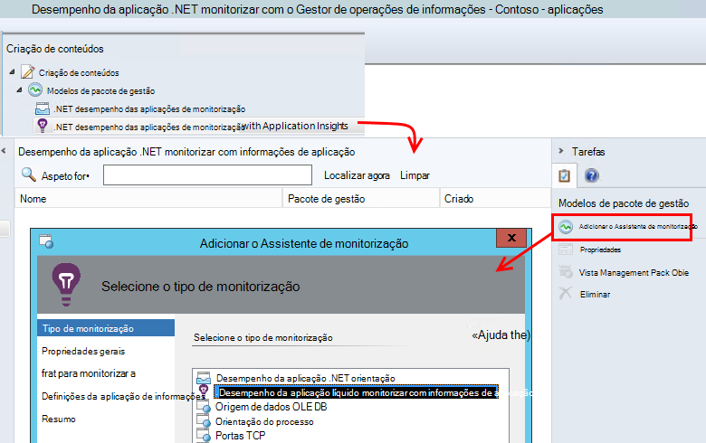

<properties 
    pageTitle="Integração de SCOM com informações de aplicação | Microsoft Azure" 
    description="Se for um utilizador SCOM, monitorizar o desempenho e diagnosticar problemas com a aplicação de informações. Dashboards abrangentes, alertas inteligentes, poderosas ferramentas de diagnóstico e consultas de análise." 
    services="application-insights" 
    documentationCenter=""
    authors="alancameronwills" 
    manager="douge"/>

<tags 
    ms.service="application-insights" 
    ms.workload="tbd" 
    ms.tgt_pltfrm="ibiza" 
    ms.devlang="na" 
    ms.topic="article" 
    ms.date="08/12/2016" 
    ms.author="awills"/>
 
# Monitorização de desempenho de aplicações com informações de aplicação para SCOM

Se utilizar o Gestor de operações de centro do sistema (SCOM) para gerir os seus servidores, pode monitorizar o desempenho e diagnosticar problemas de desempenho com a ajuda do [Visual Studio aplicação informações](app-insights-asp-net.md). Informações de aplicação monitoriza pedidos recebidos da sua aplicação web, resto e chamadas SQL, exceções e rastreios de registo de saída. Fornece os dashboards com gráficos métricos e alertas inteligentes, bem como poderosas de procura de diagnóstico e consultas analytical sobre esta telemetria. 

Pode alternar sobre como monitorizar informações de aplicação ao utilizar um pacote de gestão de SCOM.

## Antes de começar

Vamos assumir:

* Que conhece SCOM e que utilize SCOM 2012 R2 ou 2016 para gerir o seu IIS servidores web.
* Já tem instalado a nos seus servidores de uma aplicação web que pretende monitorizar com informações de aplicação.
* Versão do quadro App é .NET 4,5 ou posterior.
* Ter acesso a uma subscrição no [Microsoft Azure](https://azure.com) e iniciar sessão no [portal do Azure](https://portal.azure.com). Organização poderá ter uma subscrição e, pode adicionar a sua conta Microsoft ao mesmo.

(A equipa de desenvolvimento poderá a criar o [SDK de informações de aplicação](app-insights-asp-net.md) para a aplicação web. Este instrumentação de tempo de compilação dá-lhes uma maior flexibilidade por escrito telemetria personalizada. No entanto, é indiferente: pode seguir os passos descritos aqui com ou sem o SDK integrado.)

## (Uma vez) Instalar o pacote de gestão de informações de aplicação

No computador onde execute o Gestor de operações:

2. Desinstale qualquer versão antiga do pacote de gestão do:
 1. No Gestor de operações, abra a administração, gestão de pacotes. 
 2. Elimine a versão antiga.
1. Transfira e instale o pacote de gestão do catálogo.
2. Reinicie o Gestor de operações.

## Criar um pacote de gestão

1. No Gestor de operações, abra **criação**, **.NET … com informações de aplicação**, **Adicionar o Assistente de monitorização**e selecione novamente **.NET … com informações de aplicação**.

    

2. Nome a configuração após a sua aplicação. (Tem de instrumento uma aplicação de cada vez.)
    
    

3. Na mesma página do assistente, crie um novo pacote de gestão ou selecione um pacote que criou anteriormente para informações de aplicação.

     (O [pacote de gestão](https://technet.microsoft.com/library/cc974491.aspx) de informações da aplicação é um modelo, a partir do qual cria uma instância. Pode reutilizar na mesma instância mais tarde.)

    

4. Selecione uma aplicação que pretende monitorizar. A funcionalidade de pesquisa procura entre aplicações instaladas nos seus servidores.

    

    O campo de âmbito de monitorização opcional pode ser utilizado para especificar um subconjunto dos seus servidores, se não pretender monitorizar da aplicação de todos os servidores.

5. Na página seguinte do assistente, primeiro tem de fornecer as suas credenciais para iniciar sessão no Microsoft Azure.

    Nesta página, selecione o recurso de informações da aplicação onde pretende que os dados de telemetria ser analisadas e apresentados. 

 * Se a aplicação foi configurada para a aplicação de informações durante o desenvolvimento, selecione o seu recurso existente.
 * Caso contrário, crie um novo recurso, com o nome para a aplicação. Se existirem outras aplicações que são componentes do mesmo sistema, colocá-los no mesmo grupo de recursos, para tornar mais fácil de gerir de acesso para a telemetria.

    Pode alterar estas definições mais tarde.

    

6. Conclua o assistente.

    
    
Repita este procedimento para cada aplicação que pretende monitorizar.

Se precisar de alterar as definições mais tarde, as propriedades do monitor a partir da janela de criação de voltar a abrir.

## Certifique-se de monitorização

O monitor que instalou as pesquisas para a sua aplicação em todos os servidores. Os casos onde encontra a aplicação, configura Monitor de estado de informações de aplicação para monitorizar a aplicação. Se for necessário, primeiro instala Monitor de estado no servidor.

Pode verificar as instâncias da aplicação encontrá-lo tem:

## Vista de telemetria na aplicação de informações

No [portal do Azure](https://portal.azure.com), navegue para o recurso para a sua aplicação. [Consulte o artigo gráficos de telemetria](app-insights-dashboards.md) da sua aplicação. (Caso ainda não visível para cima na página principal ainda, clique em sequência de métricas directo.)

## Próximos passos

* [Configurar um dashboard](app-insights-dashboards.md) para reúnem os gráficos mais importantes esta e outras aplicações de monitorização.
* [Saiba mais sobre métricas](app-insights-metrics-explorer.md)
* [Configurar alertas](app-insights-alerts.md)
* [Diagnosticar problemas de desempenho](app-insights-detect-triage-diagnose.md)
* [Análise poderosas consultas](app-insights-analytics.md)
* [Testes de web de disponibilidade](app-insights-monitor-web-app-availability.md)
